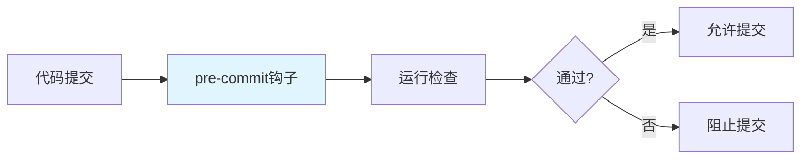

# pre-commit 代码规范：ruff + black + isort + trailing-whitespace 自动化校验

> **一句话**：pre-commit是一个Git钩子管理工具，可以在代码提交前自动运行代码检查、格式化等任务。结合ruff、black、isort等工具，可以自动化代码质量控制。

## 1. pre-commit 基础

### 1.1 什么是pre-commit？



**pre-commit**：Git钩子管理工具，可以在代码提交前自动运行检查任务。

### 1.2 安装和配置

```bash
# 安装
pip install pre-commit

# 初始化
pre-commit install
```

### 1.3 配置文件

```yaml
# .pre-commit-config.yaml
repos:
  - repo: https://github.com/psf/black
    rev: 23.3.0
    hooks:
      - id: black
        language_version: python3.11
  
  - repo: https://github.com/pycqa/isort
    rev: 5.12.0
    hooks:
      - id: isort
  
  - repo: https://github.com/charliermarsh/ruff
    rev: v0.0.261
    hooks:
      - id: ruff
        args: [--fix]
  
  - repo: https://github.com/pre-commit/pre-commit-hooks
    rev: v4.4.0
    hooks:
      - id: trailing-whitespace
      - id: end-of-file-fixer
      - id: check-yaml
      - id: check-added-large-files
```

## 2. 代码格式化工具

### 2.1 Black

```yaml
# Black配置
repos:
  - repo: https://github.com/psf/black
    rev: 23.3.0
    hooks:
      - id: black
        language_version: python3.11
        args: [--line-length=88]
```

**Black特点**：
- 自动格式化代码
- 统一代码风格
- 不可配置（只有少量选项）

### 2.2 isort

```yaml
# isort配置
repos:
  - repo: https://github.com/pycqa/isort
    rev: 5.12.0
    hooks:
      - id: isort
        args: [--profile=black]
```

**isort特点**：
- 自动排序import语句
- 按类型分组
- 与Black兼容

### 2.3 Ruff

```yaml
# Ruff配置
repos:
  - repo: https://github.com/charliermarsh/ruff
    rev: v0.0.261
    hooks:
      - id: ruff
        args: [--fix]
```

**Ruff特点**：
- 极快的Python linter
- 替代flake8、pylint等
- 支持自动修复

## 3. 配置示例

### 3.1 完整配置

```yaml
# .pre-commit-config.yaml
repos:
  # 代码格式化
  - repo: https://github.com/psf/black
    rev: 23.3.0
    hooks:
      - id: black
        language_version: python3.11
  
  - repo: https://github.com/pycqa/isort
    rev: 5.12.0
    hooks:
      - id: isort
        args: [--profile=black]
  
  # 代码检查
  - repo: https://github.com/charliermarsh/ruff
    rev: v0.0.261
    hooks:
      - id: ruff
        args: [--fix]
  
  # 通用检查
  - repo: https://github.com/pre-commit/pre-commit-hooks
    rev: v4.4.0
    hooks:
      - id: trailing-whitespace
      - id: end-of-file-fixer
      - id: check-yaml
      - id: check-added-large-files
      - id: check-merge-conflict
  
  # 类型检查
  - repo: https://github.com/pre-commit/mirrors-mypy
    rev: v1.3.0
    hooks:
      - id: mypy
        additional_dependencies: [types-requests]
```

### 3.2 项目特定配置

```yaml
# .pre-commit-config.yaml
repos:
  # Python代码质量
  - repo: https://github.com/psf/black
    rev: 23.3.0
    hooks:
      - id: black
        language_version: python3.11
  
  - repo: https://github.com/pycqa/isort
    rev: 5.12.0
    hooks:
      - id: isort
        args: [--profile=black]
  
  - repo: https://github.com/charliermarsh/ruff
    rev: v0.0.261
    hooks:
      - id: ruff
        args: [--fix]
  
  # 前端代码质量
  - repo: https://github.com/pre-commit/mirrors-eslint
    rev: v8.40.0
    hooks:
      - id: eslint
        files: \.(js|jsx|ts|tsx)$
        types: [file]
        additional_dependencies:
          - eslint@8.40.0
          - eslint-config-standard@17.0.0
  
  # 文档检查
  - repo: https://github.com/igorshubovych/markdownlint-cli
    rev: v0.33.0
    hooks:
      - id: markdownlint
        args: [--fix]
```

## 4. 使用技巧

### 4.1 手动运行

```bash
# 运行所有钩子
pre-commit run --all-files

# 运行特定钩子
pre-commit run black --all-files
pre-commit run isort --all-files
```

### 4.2 跳过钩子

```bash
# 跳过钩子提交
git commit -m "feat: 添加功能" --no-verify

# 临时跳过特定钩子
SKIP=ruff git commit -m "feat: 添加功能"
```

### 4.3 更新钩子

```bash
# 更新所有钩子
pre-commit autoupdate

# 更新特定钩子
pre-commit autoupdate --repo https://github.com/psf/black
```

## 5. 实际案例

### 5.1 FastAPI项目配置

```yaml
# .pre-commit-config.yaml
repos:
  # Python代码质量
  - repo: https://github.com/psf/black
    rev: 23.3.0
    hooks:
      - id: black
        language_version: python3.11
  
  - repo: https://github.com/pycqa/isort
    rev: 5.12.0
    hooks:
      - id: isort
        args: [--profile=black]
  
  - repo: https://github.com/charliermarsh/ruff
    rev: v0.0.261
    hooks:
      - id: ruff
        args: [--fix]
  
  - repo: https://github.com/pre-commit/mirrors-mypy
    rev: v1.3.0
    hooks:
      - id: mypy
        additional_dependencies: [types-requests]
  
  # 通用检查
  - repo: https://github.com/pre-commit/pre-commit-hooks
    rev: v4.4.0
    hooks:
      - id: trailing-whitespace
      - id: end-of-file-fixer
      - id: check-yaml
      - id: check-added-large-files
```

### 5.2 多语言项目配置

```yaml
# .pre-commit-config.yaml
repos:
  # Python
  - repo: https://github.com/psf/black
    rev: 23.3.0
    hooks:
      - id: black
  
  # JavaScript/TypeScript
  - repo: https://github.com/pre-commit/mirrors-eslint
    rev: v8.40.0
    hooks:
      - id: eslint
        files: \.(js|jsx|ts|tsx)$
  
  # Markdown
  - repo: https://github.com/igorshubovych/markdownlint-cli
    rev: v0.33.0
    hooks:
      - id: markdownlint
```

## 6. 常见坑点

### 1. 钩子执行缓慢
```yaml
# 问题：钩子执行太慢
# 解决：只检查修改的文件
repos:
  - repo: https://github.com/psf/black
    rev: 23.3.0
    hooks:
      - id: black
        files: \.py$
```

### 2. 钩子冲突
```yaml
# 问题：多个钩子修改同一文件
# 解决：调整钩子执行顺序
repos:
  - repo: https://github.com/pycqa/isort
    rev: 5.12.0
    hooks:
      - id: isort
  
  - repo: https://github.com/psf/black
    rev: 23.3.0
    hooks:
      - id: black
```

### 3. 配置错误
```yaml
# 问题：配置语法错误
# 解决：使用pre-commit验证配置
pre-commit validate-config .pre-commit-config.yaml
```

## 核心要点

```bash
# 安装
pip install pre-commit
pre-commit install

# 运行
pre-commit run --all-files

# 更新
pre-commit autoupdate

# 配置文件
.pre-commit-config.yaml
```

## 相关链接

- 📋 目录：[[00-工程化与部署]]
- 📚 学习清单：[[技术学习清单#工程化与部署]]
- 🔗 [[08-pytest异步测试基础设施|pytest异步测试]]
- 🔗 unittest.mock
- 项目实践：[[笔记/技术学习/项目开发笔记/ai-resume笔记/01_技术研读/01_架构概览|ai-resume: 架构概览]]
- 项目实践：[[笔记/技术学习/项目开发笔记/cr-agent笔记/01-技术研读/06-项目搭建与TDD实践|cr-agent: 项目搭建与TDD实践]]
