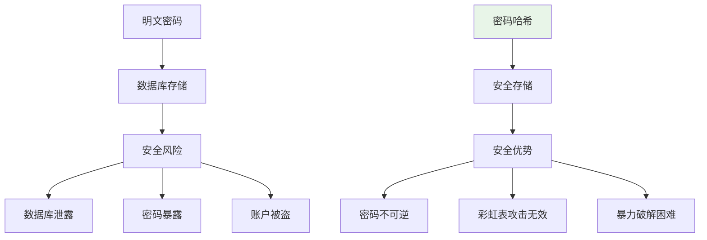
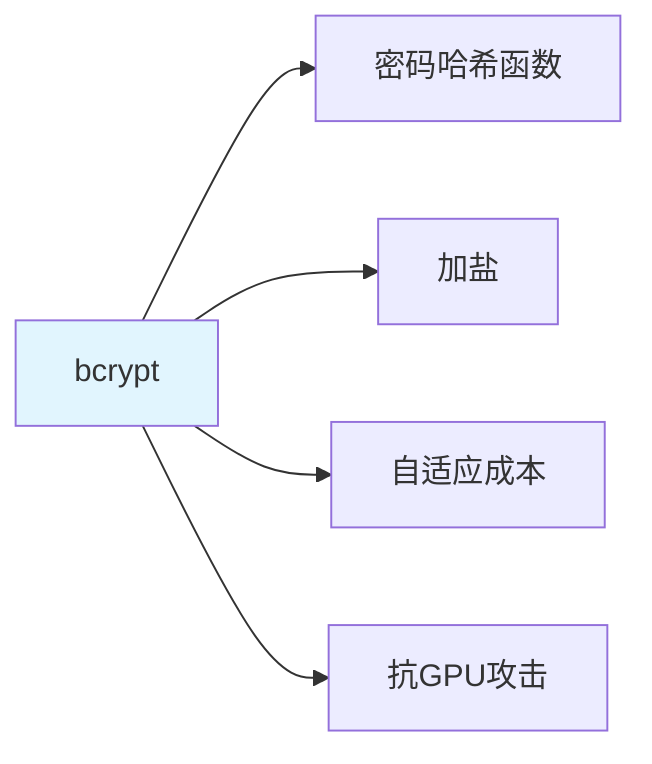

# bcrypt 密码哈希：加盐 + CPU 密集型防爆破 + hash_password / verify_password

> **一句话**：bcrypt是一种密码哈希函数，通过加盐和CPU密集型计算来防止密码被暴力破解。在Web应用中，常用于安全存储用户密码。

## 1. 密码哈希基础

### 1.1 为什么需要密码哈希？



**安全风险**：
- 数据库泄露：密码明文暴露
- 彩虹表攻击：预计算哈希表
- 暴力破解：尝试所有组合

### 1.2 哈希函数要求

| 要求 | 说明 |
|------|------|
| 单向性 | 无法从哈希值反推密码 |
| 确定性 | 相同密码产生相同哈希 |
| 抗碰撞性 | 不同密码产生不同哈希 |
| 雪崩效应 | 微小变化导致巨大差异 |

## 2. bcrypt 原理

### 2.1 什么是bcrypt？



**bcrypt**：基于Blowfish密码的哈希函数，专门设计用于密码存储。

### 2.2 工作流程

```python
import bcrypt

# 密码哈希
password = "my_password".encode('utf-8')
salt = bcrypt.gensalt()
hashed = bcrypt.hashpw(password, salt)

# 密码验证
if bcrypt.checkpw(password, hashed):
    print("密码正确")
else:
    print("密码错误")
```

### 2.3 加盐机制

```python
# 盐值：随机生成的字符串，用于防止彩虹表攻击
salt = bcrypt.gensalt()
# 输出：b'$2b$12$...'（12是成本因子）

# 相同密码+不同盐值=不同哈希
password = "my_password"
hash1 = bcrypt.hashpw(password.encode(), bcrypt.gensalt())
hash2 = bcrypt.hashpw(password.encode(), bcrypt.gensalt())
# hash1 != hash2
```

## 3. 成本因子

### 3.1 什么是成本因子？

```python
# 成本因子决定计算时间
# 默认成本因子为12
salt = bcrypt.gensalt(rounds=12)

# 更高的成本因子=更慢的计算=更安全
# 但也要考虑性能
```

### 3.2 性能权衡

```python
import time
import bcrypt

# 测试不同成本因子的性能
for rounds in [10, 12, 14]:
    start = time.time()
    salt = bcrypt.gensalt(rounds=rounds)
    hashed = bcrypt.hashpw(b"password", salt)
    end = time.time()
    
    print(f"成本因子 {rounds}: {end-start:.3f}秒")
# 输出：
# 成本因子 10: 0.100秒
# 成本因子 12: 0.300秒
# 成本因子 14: 1.200秒
```

## 4. 实际应用

### 4.1 FastAPI集成

```python
from fastapi import FastAPI, HTTPException
from pydantic import BaseModel
import bcrypt

app = FastAPI()

class UserCreate(BaseModel):
    username: str
    password: str

class User(BaseModel):
    id: int
    username: str
    hashed_password: str

# 密码哈希函数
def hash_password(password: str) -> str:
    """哈希密码"""
    password_bytes = password.encode('utf-8')
    salt = bcrypt.gensalt()
    hashed = bcrypt.hashpw(password_bytes, salt)
    return hashed.decode('utf-8')

def verify_password(password: str, hashed_password: str) -> bool:
    """验证密码"""
    password_bytes = password.encode('utf-8')
    hashed_bytes = hashed_password.encode('utf-8')
    return bcrypt.checkpw(password_bytes, hashed_bytes)

# 用户注册
@app.post("/users/")
async def create_user(user: UserCreate):
    # 检查用户名是否已存在
    if get_user_by_username(user.username):
        raise HTTPException(status_code=400, detail="用户名已存在")
    
    # 哈希密码
    hashed_password = hash_password(user.password)
    
    # 创建用户
    db_user = create_db_user(user.username, hashed_password)
    
    return {"id": db_user.id, "username": db_user.username}

# 用户登录
@app.post("/login/")
async def login(username: str, password: str):
    user = get_user_by_username(username)
    if not user:
        raise HTTPException(status_code=400, detail="用户不存在")
    
    if not verify_password(password, user.hashed_password):
        raise HTTPException(status_code=400, detail="密码错误")
    
    return {"token": "xxx"}
```

### 4.2 SQLAlchemy集成

```python
from sqlalchemy import Column, Integer, String
from sqlalchemy.orm import relationship
from app.database import Base
import bcrypt

class User(Base):
    __tablename__ = "users"
    
    id = Column(Integer, primary_key=True, index=True)
    username = Column(String(50), unique=True, index=True)
    hashed_password = Column(String(100))
    
    def set_password(self, password: str):
        """设置密码"""
        password_bytes = password.encode('utf-8')
        salt = bcrypt.gensalt()
        self.hashed_password = bcrypt.hashpw(password_bytes, salt).decode('utf-8')
    
    def check_password(self, password: str) -> bool:
        """检查密码"""
        password_bytes = password.encode('utf-8')
        hashed_bytes = self.hashed_password.encode('utf-8')
        return bcrypt.checkpw(password_bytes, hashed_bytes)
```

## 5. 高级用法

### 5.1 密码强度检查

```python
import re

def check_password_strength(password: str) -> dict:
    """检查密码强度"""
    strength = {
        "length": len(password) >= 8,
        "uppercase": bool(re.search(r'[A-Z]', password)),
        "lowercase": bool(re.search(r'[a-z]', password)),
        "digits": bool(re.search(r'\d', password)),
        "special": bool(re.search(r'[!@#$%^&*(),.?":{}|<>]', password))
    }
    
    score = sum(strength.values())
    
    if score <= 2:
        return {"strength": "弱", "score": score, "details": strength}
    elif score <= 4:
        return {"strength": "中", "score": score, "details": strength}
    else:
        return {"strength": "强", "score": score, "details": strength}
```

### 5.2 密码历史检查

```python
class PasswordHistory:
    def __init__(self):
        self.history = []
    
    def add_password(self, hashed_password: str):
        """添加密码到历史"""
        self.history.append(hashed_password)
    
    def check_password_reuse(self, new_password: str) -> bool:
        """检查密码是否重复使用"""
        for old_hashed in self.history:
            if verify_password(new_password, old_hashed):
                return True  # 密码已使用过
        return False
```

### 5.3 密码过期机制

```python
from datetime import datetime, timedelta

class PasswordExpiration:
    def __init__(self, days=90):
        self.expiration_days = days
    
    def check_expiration(self, last_changed: datetime) -> bool:
        """检查密码是否过期"""
        expiration_date = last_changed + timedelta(days=self.expiration_days)
        return datetime.now() > expiration_date
    
    def force_password_change(self, user: User) -> bool:
        """强制用户更改密码"""
        if self.check_expiration(user.password_changed_at):
            return True  # 需要更改密码
        return False
```

## 6. 安全最佳实践

### 6.1 盐值管理

```python
# 盐值应该：
# 1. 每个密码唯一
# 2. 随机生成
# 3. 安全存储（通常与哈希一起存储）

# bcrypt自动处理盐值
hashed = bcrypt.hashpw(password, bcrypt.gensalt())
# 哈希值包含盐值：b'$2b$12$...'
```

### 6.2 成本因子选择

```python
# 选择原则：
# 1. 计算时间在可接受范围内（100ms-1s）
# 2. 随着硬件发展调整
# 3. 平衡安全性和性能

# 推荐值：
# - 2024年：12-14
# - 2026年：14-16
```

### 6.3 错误处理

```python
# 不要透露密码错误的具体原因
# 不要显示"密码错误"还是"用户不存在"

# 错误做法
if not user:
    raise HTTPException("用户不存在")
if not verify_password(password, user.hashed_password):
    raise HTTPException("密码错误")

# 正确做法
if not user or not verify_password(password, user.hashed_password):
    raise HTTPException("用户名或密码错误")
```

## 7. 常见坑点

### 1. 明文存储密码
```python
# 错误：明文存储
user.password = "my_password"

# 正确：哈希存储
user.hashed_password = hash_password("my_password")
```

### 2. 使用弱哈希函数
```python
# 错误：使用MD5、SHA1等
import hashlib
hashed = hashlib.md5(password.encode()).hexdigest()

# 正确：使用bcrypt
hashed = bcrypt.hashpw(password.encode(), bcrypt.gensalt())
```

### 3. 盐值重用
```python
# 错误：所有用户使用相同盐值
salt = "固定盐值"
hashed = bcrypt.hashpw(password.encode(), salt.encode())

# 正确：每个密码使用唯一盐值
hashed = bcrypt.hashpw(password.encode(), bcrypt.gensalt())
```

## 核心要点

```python
import bcrypt

# 哈希密码
password = "my_password".encode('utf-8')
salt = bcrypt.gensalt()
hashed = bcrypt.hashpw(password, salt)

# 验证密码
if bcrypt.checkpw(password, hashed):
    print("密码正确")

# 成本因子
salt = bcrypt.gensalt(rounds=12)  # 默认12
```

## 相关链接

- 📋 目录：[[00-工程化与部署]]
- 📚 学习清单：[[技术学习清单#工程化与部署]]
- 🔗 [[11-308永久重定向|308永久重定向]]
- 🔗 [[04-FastAPI+JWT全链路实现|JWT鉴权]]
- 项目实践：[[笔记/技术学习/项目开发笔记/ai-resume笔记/01_技术研读/01_架构概览|ai-resume: 架构概览]]
- 项目实践：[[笔记/技术学习/项目开发笔记/cr-agent笔记/01-技术研读/10-安全加固四道防线|cr-agent: 安全加固四道防线]]
