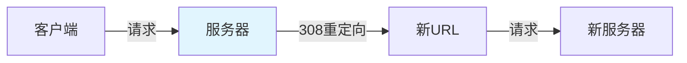
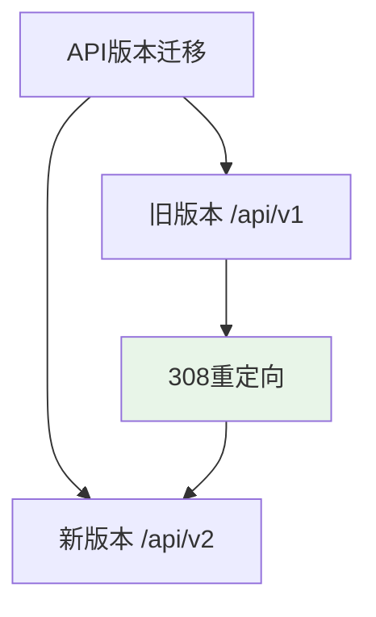

# 308 永久重定向：API 版本迁移（/api/v1）时防 POST 请求丢失

> **一句话**：308 Permanent Redirect是HTTP状态码，表示请求的资源已永久移动到新URL。与301/302不同，308会保持请求方法不变，防止POST请求丢失。

## 1. HTTP重定向基础

### 1.1 什么是重定向？



**重定向**：服务器告诉客户端请求的资源已移动到新URL。

### 1.2 重定向状态码对比

| 状态码 | 名称 | 方法保持 | 用途 |
|--------|------|----------|------|
| 301 | Moved Permanently | 可能改变 | 永久移动 |
| 302 | Found | 可能改变 | 临时移动 |
| 303 | See Other | 改为GET | 查看其他 |
| 307 | Temporary Redirect | 保持 | 临时移动 |
| 308 | Permanent Redirect | 保持 | 永久移动 |

## 2. 308 详解

### 2.1 什么是308？

```python
# 308 Permanent Redirect
# 请求的资源已永久移动到新URL
# 请求方法保持不变（POST还是POST）
# 客户端应更新书签

# 示例响应
HTTP/1.1 308 Permanent Redirect
Location: https://example.com/new-url
```

### 2.2 308 vs 301

```python
# 301：可能改变请求方法
# POST → GET（浏览器行为）

# 308：保持请求方法
# POST → POST（浏览器行为）
```

## 3. API版本迁移

### 3.1 为什么需要308？



**问题**：
- 旧版本API需要废弃
- 客户端可能还在使用旧版本
- 需要平滑迁移

### 3.2 FastAPI实现

```python
from fastapi import FastAPI, Request, Response
from fastapi.responses import RedirectResponse

app = FastAPI()

# 旧版本端点
@app.post("/api/v1/users/")
async def create_user_v1(user: UserCreate):
    """v1版本的创建用户"""
    return create_user(user)

# 新版本端点
@app.post("/api/v2/users/")
async def create_user_v2(user: UserCreateV2):
    """v2版本的创建用户"""
    return create_user_v2(user)

# 308重定向中间件
@app.middleware("http")
async def redirect_v1_to_v2(request: Request, call_next):
    """将v1请求重定向到v2"""
    if request.url.path.startswith("/api/v1/"):
        # 构建新URL
        new_path = request.url.path.replace("/api/v1/", "/api/v2/")
        new_url = f"{request.url.scheme}:// {request.url.netloc}{new_path}"
        
        # 308重定向
        return RedirectResponse(
            url=new_url,
            status_code=308,
            headers={"Location": new_url}
        )
    
    return await call_next(request)
```

### 3.3 路由器实现

```python
from fastapi import APIRouter, Request
from fastapi.responses import RedirectResponse

router = APIRouter()

# v1路由器
v1_router = APIRouter(prefix="/api/v1")
v2_router = APIRouter(prefix="/api/v2")

@v1_router.post("/users/")
async def create_user_v1(user: UserCreate):
    return create_user(user)

@v2_router.post("/users/")
async def create_user_v2(user: UserCreateV2):
    return create_user_v2(user)

# 308重定向
@v1_router.api_route("/{path:path}", methods=["GET", "POST", "PUT", "DELETE"])
async def redirect_v1(request: Request, path: str):
    """将所有v1请求重定向到v2"""
    new_url = f"/api/v2/{path}"
    return RedirectResponse(url=new_url, status_code=308)

# 注册路由器
app.include_router(v1_router)
app.include_router(v2_router)
```

## 4. 实际案例

### 4.1 电商平台API迁移

```python
# 旧版本：/api/v1/products/
# 新版本：/api/v2/products/

# 308重定向配置
REDIRECT_RULES = {
    "/api/v1/products/": "/api/v2/products/",
    "/api/v1/orders/": "/api/v2/orders/",
    "/api/v1/users/": "/api/v2/users/",
}

@app.middleware("http")
async def api_redirect_middleware(request: Request, call_next):
    """API版本重定向"""
    path = request.url.path
    
    for old_path, new_path in REDIRECT_RULES.items():
        if path.startswith(old_path):
            # 保持查询参数
            query = str(request.url.query)
            new_url = f"{new_path}?{query}" if query else new_path
            
            return RedirectResponse(
                url=new_url,
                status_code=308,
                headers={"Location": new_url}
            )
    
    return await call_next(request)
```

### 4.2 文档重定向

```python
# 旧文档：/docs/v1/
# 新文档：/docs/v2/

@app.get("/docs/v1/{path:path}")
async def redirect_docs_v1(path: str):
    """重定向旧文档到新文档"""
    return RedirectResponse(
        url=f"/docs/v2/{path}",
        status_code=308
    )
```

## 5. 客户端处理

### 5.1 Python requests

```python
import requests

# 默认情况下，requests会自动处理重定向
response = requests.post("https://api.example.com/api/v1/users/", json={})
# 如果返回308，requests会自动重定向到新URL

# 禁用自动重定向
response = requests.post(
    "https://api.example.com/api/v1/users/",
    json={},
    allow_redirects=False
)
print(response.status_code)  # 308
print(response.headers['Location'])  # 新URL
```

### 5.2 JavaScript fetch

```javascript
// fetch默认会跟随重定向
const response = await fetch('https://api.example.com/api/v1/users/', {
    method: 'POST',
    body: JSON.stringify({})
});

// 禁用自动重定向
const response = await fetch('https://api.example.com/api/v1/users/', {
    method: 'POST',
    body: JSON.stringify({}),
    redirect: 'manual'
});

if (response.status === 308) {
    const newUrl = response.headers.get('Location');
    // 手动重定向
}
```

## 6. 最佳实践

### 6.1 渐进式迁移

```python
# 阶段1：添加新版本，保持旧版本
@app.post("/api/v1/users/")
@app.post("/api/v2/users/")
async def create_user(user: UserCreate):
    return create_user(user)

# 阶段2：旧版本返回308
@app.post("/api/v1/users/")
async def create_user_v1_redirect():
    return RedirectResponse(url="/api/v2/users/", status_code=308)

# 阶段3：移除旧版本
# 删除/v1端点
```

### 6.2 日志记录

```python
@app.middleware("http")
async def redirect_with_logging(request: Request, call_next):
    """带日志的重定向"""
    if request.url.path.startswith("/api/v1/"):
        logger.info(f"API v1 redirect: {request.url.path}")
        
        # 记录重定向统计
        increment_redirect_counter(request.url.path)
    
    return await call_next(request)
```

### 6.3 监控告警

```python
# 监控重定向数量
@app.get("/metrics")
async def get_metrics():
    """获取监控指标"""
    return {
        "redirect_count": get_redirect_count(),
        "redirect_by_path": get_redirect_by_path()
    }
```

## 7. 常见坑点

### 1. 使用302代替308
```python
# 错误：使用302
return RedirectResponse(url=new_url, status_code=302)

# 正确：使用308
return RedirectResponse(url=new_url, status_code=308)
```

### 2. 忘记保持请求方法
```python
# 问题：308没有保持请求方法
# 解决：确保使用308而不是301/302
```

### 3. 查询参数丢失
```python
# 问题：重定向时丢失查询参数
new_url = "/api/v2/users/"

# 正确：保持查询参数
query = str(request.url.query)
new_url = f"/api/v2/users/?{query}" if query else "/api/v2/users/"
```

## 核心要点

```python
# 308永久重定向
# 保持请求方法（POST还是POST）
# 用于API版本迁移

from fastapi.responses import RedirectResponse

return RedirectResponse(
    url="/api/v2/users/",
    status_code=308,
    headers={"Location": "/api/v2/users/"}
)

# 保持查询参数
query = str(request.url.query)
new_url = f"/api/v2/users/?{query}" if query else "/api/v2/users/"
```

## 相关链接

- 📋 目录：[[00-工程化与部署]]
- 📚 学习清单：[[技术学习清单#工程化与部署]]
- 🔗 [[10-bcrypt密码哈希|bcrypt密码哈希]]
- 🔗 [[07-中间件|中间件机制]]
- 项目实践：[[笔记/技术学习/项目开发笔记/ai-resume笔记/01_技术研读/01_架构概览|ai-resume: 架构概览]]
- 项目实践：[[笔记/技术学习/项目开发笔记/cr-agent笔记/01-技术研读/05-API与CLI接口契约|cr-agent: API与CLI接口契约]]
