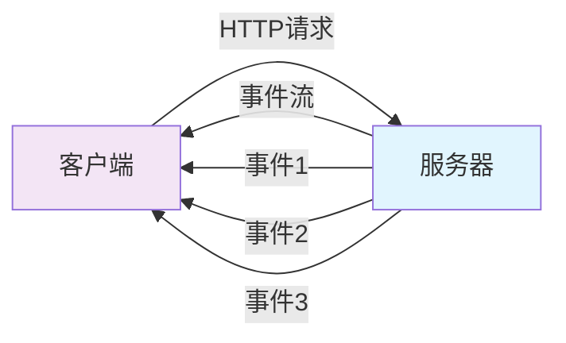
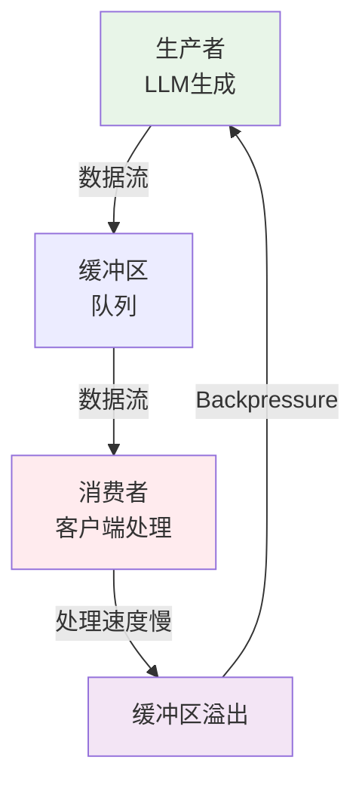

# SSE流式响应与Backpressure控制

> **一句话**：SSE（Server-Sent Events）是服务器向客户端单向推送事件的机制，Backpressure（背压）是控制数据流速、防止消费者过载的策略。在AI应用中，SSE用于流式返回LLM生成结果，Backpressure防止客户端处理不过来。

## 1. SSE 基础

### 1.1 什么是SSE？



SSE是HTML5服务器推送事件技术，允许服务器向客户端推送数据，而不需要客户端轮询。

**特点**：
- 基于HTTP协议，简单可靠
- 单向通信（服务器→客户端）
- 自动重连机制
- 支持事件ID和最后事件ID

### 1.2 SSE vs WebSocket

| 特性 | SSE | WebSocket |
|------|-----|-----------|
| 方向 | 单向（服务器→客户端） | 双向 |
| 协议 | HTTP | WS/WSS |
| 数据格式 | 文本（UTF-8） | 文本/二进制 |
| 自动重连 | ✅ 内置 | ❌ 需手动实现 |
| 浏览器支持 | 所有现代浏览器 | 所有现代浏览器 |
| 适用场景 | 服务器推送、流式响应 | 实时聊天、游戏 |

## 2. Python实现SSE

### 2.1 FastAPI实现

```python
from fastapi import FastAPI
from fastapi.responses import StreamingResponse
import asyncio
import json

app = FastAPI()

async def event_generator():
    """SSE事件生成器"""
    for i in range(10):
        # 模拟AI生成过程
        await asyncio.sleep(1)
        data = {"step": i, "content": f"生成内容 {i}"}
        yield f"data: {json.dumps(data)}\n\n"
    
    # 发送结束事件
    yield "data: [DONE]\n\n"

@app.get("/stream")
async def stream_endpoint():
    """SSE流式端点"""
    return StreamingResponse(
        event_generator(),
        media_type="text/event-stream",
        headers={
            "Cache-Control": "no-cache",
            "Connection": "keep-alive",
            "X-Accel-Buffering": "no"  # 禁用Nginx缓冲
        }
    )
```

### 2.2 客户端JavaScript

```javascript
// EventSource API
const eventSource = new EventSource('/stream');

eventSource.onmessage = function(event) {
    if (event.data === '[DONE]') {
        console.log('流结束');
        eventSource.close();
        return;
    }
    
    const data = JSON.parse(event.data);
    console.log('收到数据:', data);
};

eventSource.onerror = function(error) {
    console.error('SSE错误:', error);
};
```

## 3. Backpressure 控制

### 3.1 什么是Backpressure？



**Backpressure**：当消费者处理速度跟不上生产者时，生产者需要减速或暂停的机制。

**问题场景**：
- LLM生成速度快，但客户端网络慢
- 客户端处理慢（如UI渲染）
- 导致内存溢出、连接超时

### 3.2 Backpressure策略

```python
import asyncio
from collections import deque

class SSEProducer:
    def __init__(self, max_queue_size=10):
        self.queue = deque(maxlen=max_queue_size)
        self.backpressure = False
    
    async def produce(self, data):
        """生产数据"""
        if len(self.queue) >= self.queue.maxlen:
            # Backpressure：队列满，等待
            self.backpressure = True
            await asyncio.sleep(0.1)  # 等待消费者消费
            self.backpressure = False
        
        self.queue.append(data)
    
    async def consume(self):
        """消费数据"""
        while True:
            if self.queue:
                data = self.queue.popleft()
                yield data
            else:
                await asyncio.sleep(0.01)
```

### 3.3 FastAPI中的Backpressure

```python
from fastapi import FastAPI
from fastapi.responses import StreamingResponse
import asyncio
from collections import deque

app = FastAPI()

class SSEManager:
    def __init__(self):
        self.queues = {}
    
    async def add_client(self, client_id: str):
        """添加客户端队列"""
        self.queues[client_id] = deque(maxlen=100)  # 限制队列大小
    
    async def send_to_client(self, client_id: str, data: str):
        """发送数据到客户端，带Backpressure"""
        if client_id not in self.queues:
            return
        
        queue = self.queues[client_id]
        
        # Backpressure：队列满时丢弃旧数据
        if len(queue) >= queue.maxlen:
            queue.popleft()  # 丢弃最旧的数据
        
        queue.append(data)
    
    async def event_generator(self, client_id: str):
        """SSE事件生成器"""
        while True:
            if client_id in self.queues and self.queues[client_id]:
                data = self.queues[client_id].popleft()
                yield f"data: {data}\n\n"
            else:
                await asyncio.sleep(0.01)

manager = SSEManager()

@app.post("/send/{client_id}")
async def send_data(client_id: str, data: str):
    """向客户端发送数据"""
    await manager.send_to_client(client_id, data)
    return {"status": "sent"}

@app.get("/stream/{client_id}")
async def stream(client_id: str):
    """SSE流式端点"""
    await manager.add_client(client_id)
    return StreamingResponse(
        manager.event_generator(client_id),
        media_type="text/event-stream"
    )
```

## 4. AI应用中的SSE

### 4.1 LLM流式响应

```python
from fastapi import FastAPI
from fastapi.responses import StreamingResponse
import openai

app = FastAPI()

async def llm_stream(prompt: str):
    """LLM流式响应"""
    response = await openai.ChatCompletion.acreate(
        model="gpt-3.5-turbo",
        messages=[{"role": "user", "content": prompt}],
        stream=True
    )
    
    for chunk in response:
        if chunk.choices[0].delta.content:
            content = chunk.choices[0].delta.content
            yield f"data: {json.dumps({'content': content})}\n\n"
    
    yield "data: [DONE]\n\n"

@app.post("/chat/stream")
async def chat_stream(prompt: str):
    """聊天流式端点"""
    return StreamingResponse(
        llm_stream(prompt),
        media_type="text/event-stream"
    )
```

### 4.2 RAG流式检索

```python
async def rag_stream(query: str):
    """RAG流式检索"""
    # 1. 检索相关文档
    yield f"data: {json.dumps({'step': '检索中...'})}\n\n"
    docs = await retrieve_documents(query)
    
    # 2. 流式生成回答
    yield f"data: {json.dumps({'step': '生成中...'})}\n\n"
    async for chunk in generate_stream(query, docs):
        yield f"data: {json.dumps({'content': chunk})}\n\n"
    
    yield "data: [DONE]\n\n"
```

## 5. 常见坑点

### 1. 缓冲问题
```python
# 错误：默认响应会缓冲
@app.get("/stream")
async def stream():
    return StreamingResponse(generator())

# 正确：禁用缓冲
@app.get("/stream")
async def stream():
    return StreamingResponse(
        generator(),
        headers={
            "X-Accel-Buffering": "no",  # Nginx
            "Cache-Control": "no-cache"
        }
    )
```

### 2. 连接超时
```python
# 问题：长时间无数据导致连接断开
# 解决：定期发送心跳
async def generator():
    while True:
        try:
            data = await asyncio.wait_for(get_data(), timeout=30)
            yield f"data: {data}\n\n"
        except asyncio.TimeoutError:
            # 发送心跳
            yield f": heartbeat\n\n"
```

### 3. 内存泄漏
```python
# 问题：客户端断开后，生产者继续生成数据
async def generator():
    while True:
        data = await produce_data()
        yield f"data: {data}\n\n"
        # 检查客户端是否断开
        if await request.is_disconnected():
            break
```

### 4. Backpressure不当
```python
# 问题：无限制缓冲导致内存溢出
queue = deque()  # 无限制

# 解决：限制队列大小
queue = deque(maxlen=100)  # 限制100条
```

## 核心要点

```python
# SSE端点
@app.get("/stream")
async def stream():
    return StreamingResponse(
        generator(),
        media_type="text/event-stream",
        headers={"X-Accel-Buffering": "no"}
    )

# 事件格式
"data: {json}\n\n"  # 数据事件
": comment\n\n"     # 心跳/注释
"event: custom\n"   # 自定义事件
"data: payload\n\n"

# Backpressure
queue = deque(maxlen=100)  # 限制队列
if len(queue) >= maxlen:
    queue.popleft()  # 丢弃旧数据
```

## 相关链接

- 📋 目录：[[00-异步与鉴权]]
- 📚 学习清单：[[技术学习清单#异步与鉴权]]
- 🔗 [[01-asyncio核心API与Task并发|asyncio核心API]]
- 🔗 [[02-aiohttp异步HTTP客户端|aiohttp异步HTTP客户端]]
- 🔗 [[04-FastAPI+JWT全链路实现|FastAPI+JWT全链路]]
- 项目实践：[[笔记/技术学习/项目开发笔记/ai-resume笔记/01_技术研读/01_架构概览|ai-resume: 架构概览]]
- 项目实践：[[笔记/技术学习/项目开发笔记/cr-agent笔记/01-技术研读/04-三层容错与并发bug|cr-agent: 三层容错与并发bug]]
