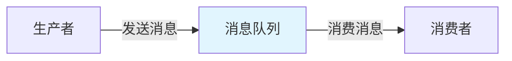
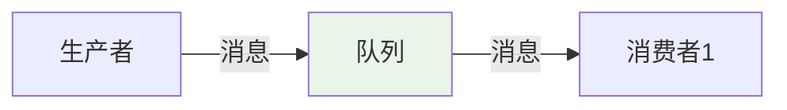
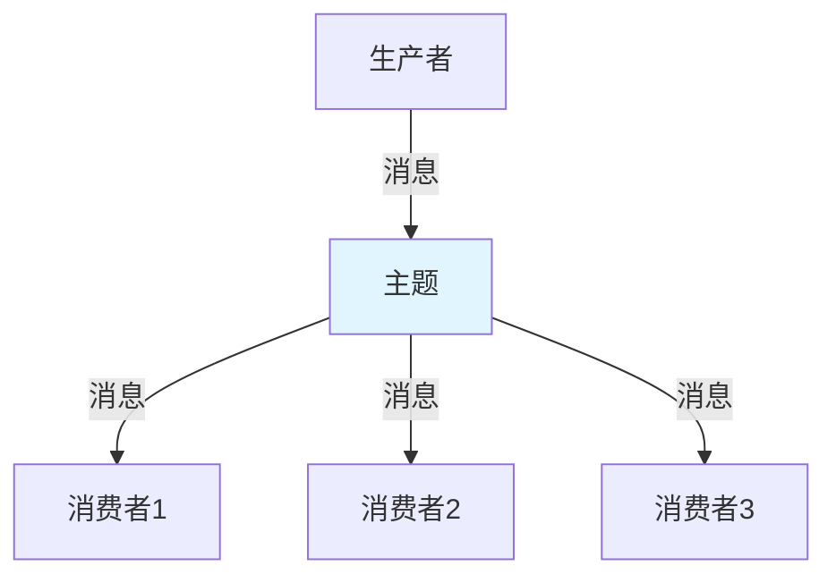
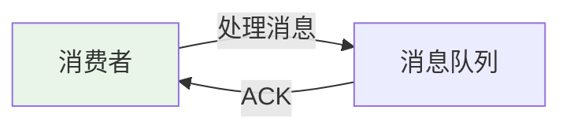

# MQ 核心概念：生产-消费模型 + 主题/队列 + ACK 机制

> **一句话**：消息队列（MQ）是异步通信的中间件，通过生产-消费模型实现系统解耦。核心概念包括生产者、消费者、主题/队列、ACK机制等。

## 1. MQ基础

### 1.1 什么是消息队列？



**消息队列**：异步通信的中间件，允许生产者发送消息到队列，消费者从队列接收消息。

### 1.2 核心概念

| 概念 | 说明 |
|------|------|
| Producer | 生产者，发送消息 |
| Consumer | 消费者，接收消息 |
| Queue | 队列，存储消息 |
| Topic | 主题，消息分类 |
| ACK | 确认机制，确认消息已处理 |
| Broker | 消息代理，管理消息存储和转发 |

## 2. 生产-消费模型

### 2.1 点对点模型



**点对点**：一个消息只被一个消费者处理。

### 2.2 发布-订阅模型



**发布-订阅**：一个消息被多个消费者处理。

## 3. 主题/队列

### 3.1 主题（Topic）

```python
# 主题示例
# 生产者发送消息到主题
producer.send("user-events", message)

# 多个消费者订阅同一主题
consumer1.subscribe("user-events")
consumer2.subscribe("user-events")
```

### 3.2 队列（Queue）

```python
# 队列示例
# 生产者发送消息到队列
producer.send("task-queue", message)

# 只有一个消费者处理消息
consumer.receive("task-queue")
```

## 4. ACK机制

### 4.1 什么是ACK？



**ACK**：确认机制，消费者处理完消息后发送确认，告诉消息队列可以删除消息。

### 4.2 自动ACK vs 手动ACK

```python
# 自动ACK：收到消息自动确认
consumer.receive("queue", auto_ack=True)

# 手动ACK：处理完手动确认
message = consumer.receive("queue", auto_ack=False)
# 处理消息
process_message(message)
# 手动确认
message.ack()
```

## 5. 实际案例

### 5.1 Kafka示例

```python
from kafka import KafkaProducer, KafkaConsumer
import json

# 生产者
producer = KafkaProducer(
    bootstrap_servers=['localhost:9092'],
    value_serializer=lambda v: json.dumps(v).encode('utf-8')
)

# 发送消息
producer.send('user-events', {'user_id': 123, 'action': 'login'})

# 消费者
consumer = KafkaConsumer(
    'user-events',
    bootstrap_servers=['localhost:9092'],
    value_deserializer=lambda m: json.loads(m.decode('utf-8')),
    auto_offset_reset='earliest',
    enable_auto_commit=True
)

# 消费消息
for message in consumer:
    print(message.value)
```

### 5.2 RabbitMQ示例

```python
import pika
import json

# 连接
connection = pika.BlockingConnection(pika.ConnectionParameters('localhost'))
channel = connection.channel()

# 声明队列
channel.queue_declare(queue='task_queue', durable=True)

# 生产者
channel.basic_publish(
    exchange='',
    routing_key='task_queue',
    body=json.dumps({'task': 'process_data'}),
    properties=pika.BasicProperties(
        delivery_mode=2,  # 消息持久化
    )
)

# 消费者
def callback(ch, method, properties, body):
    print(f"收到消息: {body}")
    # 处理消息
    ch.basic_ack(delivery_tag=method.delivery_tag)

channel.basic_consume(queue='task_queue', on_message_callback=callback)
channel.start_consuming()
```

## 6. 常见坑点

### 1. 消息丢失
```python
# 问题：消息在传输过程中丢失
# 解决：使用持久化消息和ACK机制
properties = pika.BasicProperties(delivery_mode=2)  # 持久化
```

### 2. 重复消费
```python
# 问题：消费者重复处理同一消息
# 解决：实现幂等性处理
def process_message(message):
    if is_processed(message['id']):
        return  # 已处理，跳过
    # 处理消息
    mark_as_processed(message['id'])
```

### 3. 消息积压
```python
# 问题：消费者处理速度跟不上生产速度
# 解决：增加消费者数量或提高处理能力
# 或者使用消息分片
```

## 核心要点

```python
# Kafka
producer = KafkaProducer(bootstrap_servers=['localhost:9092'])
producer.send('topic', {'key': 'value'})

consumer = KafkaConsumer('topic', bootstrap_servers=['localhost:9092'])
for message in consumer:
    process(message.value)

# RabbitMQ
channel.queue_declare(queue='queue', durable=True)
channel.basic_publish(exchange='', routing_key='queue', body='message')
channel.basic_consume(queue='queue', on_message_callback=callback)
```

## 相关链接

- 📋 目录：[[00-消息队列实战]]
- 📚 学习清单：[[技术学习清单#消息队列实战]]
- 🔗 [[02-Kafka或RabbitMQ实战|Kafka/RabbitMQ实战]]
- 🔗 [[03-MQ在Agent系统中的应用|MQ在Agent系统中的应用]]
- 项目实践：[[笔记/技术学习/项目开发笔记/ai-resume笔记/01_技术研读/01_架构概览|ai-resume: 架构概览]]
