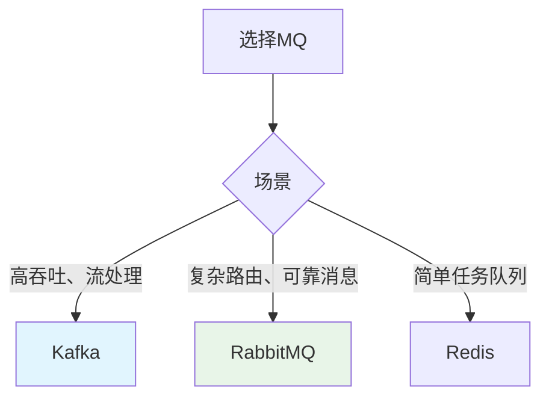

# Kafka / RabbitMQ 选一，本地跑通生产-消费流程

> **一句话**：Kafka和RabbitMQ是流行的消息队列系统。Kafka适合高吞吐、流处理场景；RabbitMQ适合复杂路由、可靠消息场景。本地跑通生产-消费流程是学习MQ的第一步。

## 1. Kafka vs RabbitMQ

### 1.1 对比

| 特性 | Kafka | RabbitMQ |
|------|-------|----------|
| 架构 | 分布式日志 | 消息代理 |
| 吞吐量 | 极高 | 中等 |
| 消息顺序 | 保证 | 不保证 |
| 消息持久化 | 支持 | 支持 |
| 消息回溯 | 支持 | 不支持 |
| 适用场景 | 流处理、日志 | 任务队列、复杂路由 |

### 1.2 选择建议



## 2. Kafka本地部署

### 2.1 Docker部署

```yaml
# docker-compose.yml
version: '3'
services:
  zookeeper:
    image: confluentinc/cp-zookeeper:latest
    environment:
      ZOOKEEPER_CLIENT_PORT: 2181
      ZOOKEEPER_TICK_TIME: 2000
    ports:
      - "2181:2181"
  
  kafka:
    image: confluentinc/cp-kafka:latest
    depends_on:
      - zookeeper
    ports:
      - "9092:9092"
    environment:
      KAFKA_BROKER_ID: 1
      KAFKA_ZOOKEEPER_CONNECT: zookeeper:2181
      KAFKA_ADVERTISED_LISTENERS: PLAINTEXT://localhost:9092
      KAFKA_OFFSETS_TOPIC_REPLICATION_FACTOR: 1
```

### 2.2 Python客户端

```python
from kafka import KafkaProducer, KafkaConsumer
import json

# 生产者
producer = KafkaProducer(
    bootstrap_servers=['localhost:9092'],
    value_serializer=lambda v: json.dumps(v).encode('utf-8')
)

# 发送消息
producer.send('test-topic', {'message': 'hello'})
producer.flush()

# 消费者
consumer = KafkaConsumer(
    'test-topic',
    bootstrap_servers=['localhost:9092'],
    value_deserializer=lambda m: json.loads(m.decode('utf-8')),
    auto_offset_reset='earliest'
)

for message in consumer:
    print(message.value)
```

## 3. RabbitMQ本地部署

### 3.1 Docker部署

```yaml
# docker-compose.yml
version: '3'
services:
  rabbitmq:
    image: rabbitmq:3-management
    ports:
      - "5672:5672"
      - "15672:15672"
    environment:
      RABBITMQ_DEFAULT_USER: guest
      RABBITMQ_DEFAULT_PASS: guest
```

### 3.2 Python客户端

```python
import pika
import json

# 连接
connection = pika.BlockingConnection(pika.ConnectionParameters('localhost'))
channel = connection.channel()

# 声明队列
channel.queue_declare(queue='test_queue', durable=True)

# 生产者
channel.basic_publish(
    exchange='',
    routing_key='test_queue',
    body=json.dumps({'message': 'hello'}),
    properties=pika.BasicProperties(delivery_mode=2)
)

# 消费者
def callback(ch, method, properties, body):
    print(f"收到: {json.loads(body)}")
    ch.basic_ack(delivery_tag=method.delivery_tag)

channel.basic_consume(queue='test_queue', on_message_callback=callback)
channel.start_consuming()
```

## 4. 实际案例

### 4.1 Kafka日志收集

```python
# 日志生产者
import logging
from kafka import KafkaProducer
import json

class KafkaHandler(logging.Handler):
    def __init__(self, topic, bootstrap_servers):
        super().__init__()
        self.producer = KafkaProducer(
            bootstrap_servers=bootstrap_servers,
            value_serializer=lambda v: json.dumps(v).encode('utf-8')
        )
        self.topic = topic
    
    def emit(self, record):
        log_entry = {
            'timestamp': record.created,
            'level': record.levelname,
            'message': record.getMessage(),
            'module': record.module
        }
        self.producer.send(self.topic, log_entry)

# 使用
handler = KafkaHandler('app-logs', ['localhost:9092'])
logger = logging.getLogger()
logger.addHandler(handler)
```

### 4.2 RabbitMQ任务队列

```python
import pika
import json
from celery import Celery

# Celery配置
app = Celery('tasks', broker='pyamqp://guest@localhost//')

@app.task
def process_task(data):
    # 处理任务
    return f"处理完成: {data}"

# 发送任务
process_task.delay({'user_id': 123, 'action': 'send_email'})
```

## 5. 常见坑点

### 1. Kafka分区策略
```python
# 问题：消息顺序混乱
# 解决：使用相同的key发送消息
producer.send('topic', key=b'user_123', value=message)
```

### 2. RabbitMQ消息确认
```python
# 问题：消息丢失
# 解决：使用手动ACK
channel.basic_consume(queue='queue', on_message_callback=callback, auto_ack=False)

def callback(ch, method, properties, body):
    # 处理消息
    process(body)
    # 手动确认
    ch.basic_ack(delivery_tag=method.delivery_tag)
```

### 3. 连接池管理
```python
# 问题：频繁创建连接
# 解决：使用连接池
from kafka import KafkaProducer
producer = KafkaProducer(bootstrap_servers=['localhost:9092'])
# 复用producer实例
```

## 核心要点

```python
# Kafka
producer = KafkaProducer(bootstrap_servers=['localhost:9092'])
producer.send('topic', value=message)
consumer = KafkaConsumer('topic', bootstrap_servers=['localhost:9092'])

# RabbitMQ
connection = pika.BlockingConnection(pika.ConnectionParameters('localhost'))
channel = connection.channel()
channel.queue_declare(queue='queue')
channel.basic_publish(exchange='', routing_key='queue', body='message')
channel.basic_consume(queue='queue', on_message_callback=callback)
```

## 相关链接

- 📋 目录：[[00-消息队列实战]]
- 📚 学习清单：[[技术学习清单#消息队列实战]]
- 🔗 [[01-MQ核心概念|MQ核心概念]]
- 🔗 [[03-MQ在Agent系统中的应用|MQ在Agent系统中的应用]]
- 项目实践：[[笔记/技术学习/项目开发笔记/ai-resume笔记/01_技术研读/01_架构概览|ai-resume: 架构概览]]
