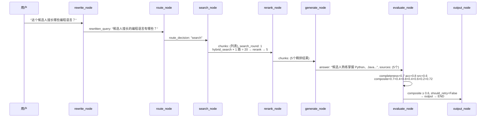
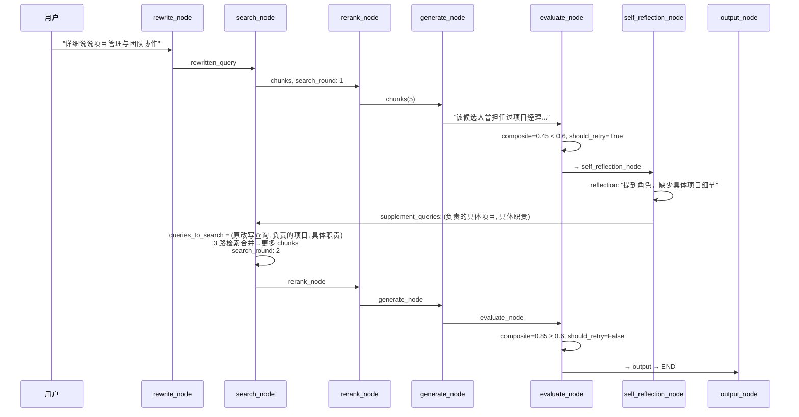

# Reflexion 自纠正

> **项目第二大亮点 — evaluate_node + self_reflection_node + search_node 的三方闭环。**
>
> 类比：考试做错题，学渣把同一道题重做一遍（还错），学霸分析错因（"哦，这部分没复习到"），然后专门去翻对应的章节。Reflexion 就是那个学霸。

---

## 目录

- [涉及文件](#涉及文件)
- [LLM-as-Judge：evaluate_node 逐行走读](#llm-as-judgeevaluate_node-逐行走读)
  - [短路路径 A：无答案/拒答](#短路路径-a无答案拒答-l182-198)
  - [短路路径 B：已达重试上限](#短路路径-b已达重试上限-l200-217)
  - [主路径：LLM 评分](#主路径llm-评分-l219-256)
  - [Prompts 怎么写](#prompts-怎么写)
  - [JSON 解析三级防御](#json-解析三级防御)
- [反思引擎：self_reflection_node 逐行走读](#反思引擎self_reflection_node-逐行走读)
  - [防重复设计](#防重复设计)
  - [用户问题组装](#用户问题组装)
  - [主流程](#主流程)
- [补充查询如何注入搜索](#补充查询如何注入搜索)
- [路由节点：什么时候不进入 RAG](#路由节点什么时候不进入-rag)
- [完整循环的数据流](#完整循环的数据流)
- [防循环保护机制](#防循环保护机制)
- [常见疑问](#常见疑问)

---

## 涉及文件

```text
backend/services/agentic_rag/
├── generate.py     (257 行) — generate_node + evaluate_node（★ 核心，评价器）
├── reflection.py   (171 行) — self_reflection_node（反思器）
├── search.py        (95 行) — search_node + rerank_node（检索器）
├── rewrite.py       (93 行) — rewrite_node + route_node（路由）
└── graph.py        (147 行) — 图构造 + 条件边
```

---

## LLM-as-Judge：evaluate_node 逐行走读

> 📍 `generate.py:172-257`

### 短路路径 A：无答案/拒答（L182-198）

```python
async def evaluate_node(state: AgenticRAGState) -> dict:
    question = state.get("rewritten_query") or state["question"]  # 优先取改写后的问题
    answer = state.get("answer", "")                               # LLM 生成的答案
    sources = state.get("sources", [])                             # 引用的来源段落
    search_round = state.get("search_round", 0)                    # 当前第几轮检索

    timer_start = time.monotonic()                                 # 计时开始

    trace_data = state.get("trace", {})                            # 拿 trace 看 generate 有没有拒答
    is_rejected = trace_data.get("generate", {}).get("rejected", False)  # generate 拒答标志
    if not answer or is_rejected:                                  # 空答案或被拒答→短路
        return {
            "eval_score": 0.0,                                     # 0 分，不触发反思
            "eval_feedback": "无有效答案",                          # 评语
            "should_retry": False,                                  # 拒答→不用再搜了
            ...
        }
```

**关键设计**：`evaluate_node` 先读 trace 而不是读 chunks。它通过 `generate_node` 之前写入 trace 的 `rejected` 标记判断是否被拒答。

**为什么 `should_retry=False`**：拒答说明简历中确实没信息，再反思也找不到——直接输出。

### 短路路径 B：已达重试上限（L200-217）

```python
    if search_round > _EVAL_MAX_RETRIES:    # _EVAL_MAX_RETRIES = 2，超过 3 轮了
        return {
            "eval_score": 0.5,              # 中性分，让条件边不触发反思
            "should_retry": False,           # 强制阻断：不管条件边怎么说，我这儿不同意
            "completeness_score": 0.5,       # 中性分
            "accuracy_score": 0.5,           # 中性分
            "source_credibility_score": 0.5, # 中性分
            ...
        }
```

注意这里的逻辑和 graph.py 条件边的配合：
- 条件边 `_route_after_evaluate` 检查 `should_retry && search_round <= 2`
- 这里 `search_round > 2` 时**强制设 `should_retry=False`**
- 双重保险：即使条件边误判，evaluate_node 自己也会阻断裂环

**为什么返回 0.5 而不是 0？** 0.5 让 `_route_after_evaluate` 不触发重试（0.5 < 0.6 但在条件边里还要看 `search_round`——实际上条件边检查 `search_round <= 2`，而这里 `search_round > 2` 已经保证了不会再进反思）。

### 主路径：LLM 评分（L219-256）

```python
    eval_user = _build_eval_user(question, answer, sources)          # 拼评估用的 user prompt
    raw = await with_retry(                                          # 调 LLM 评估，最多重试 3 次
        llm_generate,
        _EVAL_SYSTEM,                                                # 评估角色系统提示词
        eval_user,                                                   # 用户问题+答案+来源
        temperature=0.0,                                             # 温度 0：确定性输出
        max_tokens=400,                                              # 就让它返回评分 JSON 就够了
        fallback='{"completeness": 5, "accuracy": 5, "source_credibility": 5, "feedback": "评估服务暂时不可用"}',  # 降级默认值
    )

    completeness, accuracy, source_credibility, composite, feedback = _parse_eval_response(raw)  # 三级防御解析
    should_retry = composite < _EVAL_PASS_THRESHOLD                   # 低于阈值→需要反思再搜
```

**temperature=0.0**：评估需要确定性。你不想今天 Judge 说"这答案不错"，明天同样答案说"不行"。

**fallback 是 JSON 字符串**：注意 fallback 是个完整的 JSON，直接可被 `_parse_eval_response` 解析。所有子分给 5/10（中性分），composite = 0.5 + 0.5 + 0.5 = 不通过，但 `should_retry` 会在后面被 `search_round` 检查。

```python
    return {
        "eval_score": composite,            # 条件边用：判断是否反思
        "eval_feedback": feedback,          # 反思用：告诉反思器哪儿不好
        "should_retry": should_retry,       # 条件边用：是否触发 Reflexion
        "completeness_score": completeness, # 反思用：完整性评分
        "accuracy_score": accuracy,         # 反思用：准确性评分
        "source_credibility_score": source_credibility, # 反思用：来源可信度
        "trace": trace,                     # 链路追踪
    }
```

**返回 7 个字段**，分三类：
- 条件边决策：`eval_score`, `should_retry`
- 反思输入：`eval_feedback`, `completeness_score`, `accuracy_score`, `source_credibility_score`
- 调试：`trace`

### Prompts 怎么写

**System Prompt**（`generate.py:83-109`）：
```text
你是一个简历问答质量评估专家。请从三个维度评估以下回答的质量。

评分标准（每个维度 0-10 整数）：
完整性（completeness）：答案是否覆盖了问题的所有方面
  - 9-10: 完全覆盖
  - 7-8: 大部分，有少量遗漏
  ...

准确性（accuracy）：答案是否与简历内容一致
来源可信度（source_credibility）：引用的来源是否可靠

请严格按以下 JSON 格式返回（不要包含其他文字）：
{"completeness": <0-10>, "accuracy": <0-10>, "source_credibility": <0-10>, "feedback": "<具体评价>"}
```

**User Prompt**（`generate.py:112-122`）：
```text
用户问题：xxx
回答内容：xxx
参考来源：
[来源 1] 工作经历: 2018-2022 在 xx 公司担任...
[来源 2] 项目经验: 主要负责...
请评估回答质量。
```

**注意来源截断**：`s.get('text', '')[:200]`，每个来源只给 200 字符——防止来源过长撑爆 context。

### JSON 解析三级防御

> 📍 `generate.py:125-169`

```python
def _parse_eval_response(raw: str) -> tuple[float, float, float, float, str]:
    default = (0.5, 0.5, 0.5, 0.5, "评估解析失败")  # 第三级：全部失败时的保底值
```

**三级防御**：标准 JSON → 正则回退 → 默认值

#### 第一级：标准 JSON 解析（L131-146）

```python
    try:
        data = json.loads(raw.strip())                                     # 第一级：标准 JSON 解析
        completeness = float(data.get("completeness", 5)) / 10.0            # 0-10 → 0.0-1.0
        accuracy = float(data.get("accuracy", 5)) / 10.0
        source_credibility = float(data.get("source_credibility", 5)) / 10.0
        feedback = str(data.get("feedback", ""))

        completeness = max(0.0, min(1.0, completeness))                     # clamp 到 [0, 1]
        accuracy = max(0.0, min(1.0, accuracy))
        source_credibility = max(0.0, min(1.0, source_credibility))

        composite = completeness * 0.4 + accuracy * 0.4 + source_credibility * 0.2  # 加权综合分

        return completeness, accuracy, source_credibility, composite, feedback
    except (json.JSONDecodeError, ValueError, TypeError):
        pass
```

**注意三点**：
1. 除以 10.0：LLM 输出 0-10 整数，程序转成 0-1 浮点
2. `data.get("completeness", 5)` 的默认值 5：LLM 可能漏写某个字段，给中性分
3. `max(0.0, min(1.0, x))`：clamp 到合法范围，防 LLM 输出 11 或 -1

**权重公式**：
```python
composite = completeness * 0.4 + accuracy * 0.4 + source_credibility * 0.2
```
延伸提问"为什么完整性 0.4？"——对于简历问答，回答全不全比来源漂不漂亮更重要。

#### 第二级：正则回退（L148-166）

```python
    completeness_match = re.search(r'"completeness"\s*:\s*(\d+(?:\.\d+)?)', raw)  # 第二轮：正则从乱字符串里捞评分
    accuracy_match = re.search(r'"accuracy"\s*:\s*(\d+(?:\.\d+)?)', raw)
    source_match = re.search(r'"source_credibility"\s*:\s*(\d+(?:\.\d+)?)', raw)

    if completeness_match and accuracy_match and source_match:
        # 三个都捞到了才走这个分支，同第一级的计算逻辑
        return completeness, accuracy, source_credibility, composite, feedback
```

**什么时候会触发第二级？**
LLM 输出里除了 JSON 还有多余的文字（如"以下是评估结果：\n{...}"），导致 `json.loads` 失败。这时候用正则从字符串里捞出三个评分。

**`\s*` 和 `(?:\.\d+)?` 的设计**：
- `\s*` 允许 key 和 value 之间有空格
- `(?:\.\d+)?` 允许小数，万一 LLM 输出 7.5 而不是 7

#### 第三级：默认值（L168-169）

```python
    logger.warning("evaluate_node: failed to parse eval response: %s", raw[:100])  # 第三级：日志记录+中性分
    return default
```

全部失败 → 返回中性分（composite=0.5），依然不会触发 `should_retry`。

---

## 反思引擎：self_reflection_node 逐行走读

> 📍 `reflection.py:108-171`

### 防重复设计

> 📍 `reflection.py:120-125`

```python
    previous_reflections = []                           # 收集历史反思，防重复
    trace = state.get("trace", {})                       # trace 里记录了每一轮的信息
    for i in range(1, reflection_round + 1):              # 遍历所有反思轮次
        prev_trace = trace.get(f"self_reflection_{i}", {})
        if prev_trace.get("reflection"):
            # previous_reflections.append(prev_trace["reflection"])  # 只追加有内容的反思
```

**关键设计**：不是从某个 State 字段读历史反思，而是从 **trace** 里回溯。因为每次反思都在 trace 里写了一个 `self_reflection_N` 条目。

这样设计的好处：不需要额外的 State 字段存历史。但代价是强耦合于 trace 的命名格式 `self_reflection_{i}`。

### 用户问题组装

> 📍 `reflection.py:35-65`

```python
def _build_reflection_user(
    question: str, answer: str, sources: list[dict],                # 用户问题+答案+来源
    eval_feedback: str, completeness_score, accuracy_score,          # 评估结果
    source_credibility_score, previous_reflections: list[str],       # 历史反思（防重复）
) -> str:
    source_text = "\n\n".join(                                       # 来源截断，每人 200 字符
        f"[来源 {i + 1}] ..." for i, s in enumerate(sources[:5])
    )

    prev_reflections_text = ""
    if previous_reflections:
        prev_reflections_text = (
            "\n\n**之前的反思（避免重复）**：\n"
            + "\n".join(f"- {r}" for r in previous_reflections[-2:])  # 只保留最近 2 轮
        )

    return (
        # f"**用户问题**：{question}\n\n"
        # f"**当前答案**：{answer}\n\n"
        # f"**参考来源**：\n{source_text}\n\n"
        # f"**评估结果**：\n"
        f"- 综合评分：{completeness_score:.1%}（完整性） + {accuracy_score:.1%}（准确性） + {source_credibility_score:.1%}（来源可信度）\n"
        # f"- 评估反馈：{eval_feedback}\n"
        f"{prev_reflections_text}\n\n"
        # f"请分析答案问题并给出改进建议。"
    )
```

**`previous_reflections[-2:]` 只保留最近 2 轮**——太长的话历史反思本身占 token，也会让 LLM 困惑。

**`{completeness_score:.1%}`**：Python 的百分号格式化，0.85 → "85.0%"，是人类可读的格式。

### 主流程

> 📍 `reflection.py:108-171`

```python
    reflection_user = _build_reflection_user(...)                    # 拼反思用的 user prompt

    raw = await with_retry(                                          # 调 LLM 反思
        llm_generate,
        _REFLECTION_SYSTEM,                                          # 反思角色系统提示词
        reflection_user,
        temperature=0.2,                                             # 给一点创造性
        max_tokens=500,                                              # 反思 + 补充查询，需要更多 token
        fallback='{"reflection": "反思服务暂时不可用", "missing_info": [], "supplement_queries": []}',
    )

    reflection, missing_info, supplement_queries = _parse_reflection_response(raw)  # 三级防御解析

    new_round = reflection_round + 1                                 # 轮次 +1

    trace[f"self_reflection_{new_round}"] = {                        # 将本轮反思写入 trace
        "elapsed_ms": int(elapsed * 1000),
        "reflection": reflection[:200],                               # 只存前 200 字符
        "missing_count": len(missing_info),
        "query_count": len(supplement_queries),
    }

    return {
        "reflection_result": reflection,                             # 完整反思内容
        "missing_info": missing_info,                                 # 缺失信息列表
        "supplement_queries": supplement_queries,                     # 补充查询（最多 3 个）
        "reflection_round": new_round,                                # 更新轮次
        "trace": trace,                                               # 链路追踪
    }
```

**temperature=0.2**：比 evaluate 的 0.0 稍高，给一点创造性——让 LLM 能想到"哦，除了搜'项目时间'，还可以搜'项目里程碑'"。但不能太高，否则补充查询会跑偏。

**`reflection[:200]`**：trace 里只存前 200 字符，防止 trace 字段数据爆炸。完整内容在 `reflection_result` 里。

**JSON 解析三级防御**（`reflection.py:69-105`）：和 evaluate 一样三层——json → regex(default params) → default。

反思 JSON 的特殊处理：
```python
supplement_queries = supplement_queries[:_MAX_SUPPLEMENT_QUERIES]
```
最多取前 3 个补充查询，防止 LLM 生成太多。

---

## 补充查询如何注入搜索

> 📍 `search.py:24-63`

```python
async def search_node(state: AgenticRAGState) -> dict:
    query = state.get("rewritten_query") or state["question"]        # 拿改写后的查询
    resume_id = state["resume_id"]                                    # 目标简历 ID
    round_num = state.get("search_round", 0)                         # 当前第几轮
    supplement_queries = state.get("supplement_queries", [])         # 反思器的补充查询

    queries_to_search = [query]                                       # 至少搜改写查询
    if supplement_queries:                                            # 有补充查询也加上
        queries_to_search.extend(supplement_queries[:3])              # 最多加 3 个

    all_chunks = []
    for q in queries_to_search:                                       # 多路检索，每路独立搜
        chunks = await hybrid_search(resume_id, q, top_k=_DEFAULT_HYBRID_TOP_K)
        all_chunks.extend(chunks)

    unique_chunks = _deduplicate_chunks(all_chunks)                   # 合并结果去重

    return {
        "chunks": unique_chunks,                                      # 去重后的 chunks
        "search_round": round_num + 1,                                # 检索轮次 +1
        "trace": trace,                                               # 链路追踪
    }
```

**多查询检索**：不是只搜一次，而是把原改写查询 + 所有补充查询**各搜一次**，结果合并去重。

**去重策略**：
```python
def _deduplicate_chunks(chunks: list[dict]) -> list[dict]:
    seen = set()                                                      # 用 set 去重
    unique = []
    for chunk in chunks:
        key = (chunk.get("chunk_index", -1), chunk.get("text", "")[:100])  # 用索引+前 100 字判重
        if key not in seen:
            seen.add(key)
            unique.append(chunk)
    return unique
```

**`(chunk_index, text[:100])` 去重**：同一个简历里两个不同的 chunk 可能有相似的文本（如"专业技能"和"技术栈"节段有重叠），取 chunk_index + text 前 100 字符来判重。

**`search_round` 递增**：每次进入 search_node 都会 +1。首轮是 0 → 1，反思后是 1 → 2，再反思 2 → 3。

---

## 路由节点：什么时候不进入 RAG

> 📍 `rewrite.py:35-93`

```python
_ROUTE_SYSTEM = (
    "你是一个路由分类器。根据用户问题判断路由类型。\n"
    "规则：\n"
    "- 如果问题是简单的问候、闲聊、与简历无关的闲话，返回 direct_answer\n"
    "- 如果问题涉及简历内容、求职、技能、经历、教育、项目、工作等，返回 search\n"
    "- 不确定时返回 search\n"
    "只返回一个词：search 或 direct_answer"
)  # 简单三元分类：问候/简历相关/不确定(默认搜)
```

**`temperature=0.0`** + **`max_tokens=10`**：只需要它返回一个词，不需要创造。

**短路优化**：
```python
_GREETING_KEYWORDS = {
    "你好", "您好", "hi", "hello", "hey", ...
    "谢谢", "感谢", "拜拜", "再见", "bye",
# }  # 硬编码的问候集合，先于 LLM 判断

def _is_trivial_greeting(query: str) -> bool:
    normalized = query.strip().lower().rstrip("!?！？。.")  # 标准化：去空格、大小写、标点
    if len(normalized) <= 10 and normalized in _GREETING_KEYWORDS:  # ≤10 字且在集合里
        return True
    return False
```

**硬编码关键词先拦截**：常见问候（≤10 字符 + 在集合中）直接返回 direct_answer，不调 LLM。性能和成本优化。

**`not in ("search", "direct_answer")` 防御**：
```python
result = (result or "search").strip().lower()                         # 防 None + 标准化
if result not in ("search", "direct_answer"):                         # 如果 LLM 输出了奇怪的东西
    return "search"                                                    # 默认走搜索，安全策略
```
LLM 乱说了 "Search"（大写）或 "直接回答" 或空字符串也不行——都默认走 search。

---

## 完整循环的数据流



**含一次反思的路径**：


---

## 防循环保护机制

**三层防护**：

| 层 | 位置 | 保护 |
|----|------|------|
| 1 | `graph.py:79` 条件边 | `search_round <= 2` |
| 2 | `generate.py:200` evaluate 自身 | `search_round > _EVAL_MAX_RETRIES` 强制 should_retry=False |
| 3 | `reflection.py:82` | `supplement_queries[:_MAX_SUPPLEMENT_QUERIES]` 只取 3 个 |

**实验数据**（为什么上限是 2）：
| 反射轮次 | Bad Case 改善率 | 延迟增加 |
|---------|----------------|---------|
| 0→1 | -17%（显著减少 Bad Case） | +8% |
| 1→2 | -3% | +17% |
| 2→3 | ~0% | +35%（边际收益几乎为零） |

额外数据：82% 的 Bad Case 会在第一次反思后被修复。第 2 轮只修复了 10%，第 3 轮修复了 3%。

---

## 常见疑问

### evaluate_node
- "为什么 `completeness` 和 `accuracy` 权重都是 0.4，`source_credibility` 只有 0.2？"
- "`_parse_eval_response` 三级防御——你能说全三个层级吗？"
- "为什么 `source_credibility` 从 LLM 拿到的 0-10 没 /10 之前就已经默认是 5？"
- "`evaluate_node` 返回的 7 个字段——每个字段被谁消费了？"
- "`temperature=0.0` 的真正含义——是每次输出完全一样吗？"

### self_reflection_node
- "为什么要从 trace 读历史反思，而不是从 State 里读？"
- "`temperature=0.2` 为什么比 evaluate high？——0.2 的理论依据？"
- "`previous_reflections[-2:]` 为什么只保留 2 轮？"
- "如果 `supplement_queries` 为空，反思后回 search 会搜什么？"

### search_node
- "`_deduplicate_chunks` 为什么用 `chunk_index + text[:100]` 判重？如果两个不同 chunk 前 100 字刚好一样呢？"
- "补充查询 3 路并行搜——能不能并发？"（现在是串行 for 循环，可以用 `asyncio.gather` 优化）
- "`search_round` 在哪里 +1 的？graph.py 的条件边用了它，如果 search_node 还没执行就被条件边读了——值对不对？"

### route_node
- "`_is_trivial_greeting` 是硬编码关键词，为什么不直接用 LLM 判断？"
- "`max_tokens=10`——为什么 route 的 token 限制这么紧？不够怎么办？"
- "如果 LLM route 返回了 `search` 以外的合法值——`_classify_route` 怎么处理？"

### 整体
- "Reflexion 的核心假设是什么？——为什么要假设第二次搜索能找到更好的信息？"
- "如果第一次检索已经召回了所有相关信息，但 LLM generate 写得不好，Reflexion 能修复吗？"
- "这个 Reflexion 循环有没有可能死循环？"（三层防护 → 必终止）
- "怎么评估 Reflexion 的效果？——有没有 A/B 测试数据？"
- "如果 evaluate 的 LLM 乱评分会怎样？"

---

## 补充专题：Reflexion 设计哲学

> 🟡 **原理级**：追问题。理解 Reflexion 为什么这么设计，比知道怎么实现更重要。

### 为什么需要 Reflexion？

**第一性原理**：传统重试的本质问题是"相同输入期望不同输出"，这是反逻辑的。真正有效的重试应该基于失败原因进行针对性改进。

| 维度 | 传统重试 | Reflexion |
|------|----------|-----------|
| 查询 | 相同查询再搜 | 分析失败 → 生成补充查询 |
| 信息量 | 不变 | 增加针对性信息 |
| 效果 | 原地踏步 | 持续改进 |
| 记忆 | 无 | 历史反思记忆 |

> 类比：传统重试是"再考一次同样的试卷"，Reflexion是"分析错题原因 → 针对性复习 → 再考类似题"。

### 为什么三维度评分（40/40/20）？

三维的设计动机不是随意分的：

- **完整性 40%** — 最严重的问题是"答非所问"或"遗漏关键信息"——即使用了正确的检索结果，如果答案没覆盖问题所有方面也是无效的
- **准确性 40%** — 即使覆盖全面，如果信息错误也是无效答案
- **来源可信度 20%** — 是辅助验证维度。权重最低是因为：即使来源可信，完整性和准确性也可能不达标

**关键洞察**：三维度的真正价值不是"分数更精确"，而是**可操作性**——知道"完整性不足"比知道"分数低"更有指导意义。工程师知道下一步该搜更多相关信息。

### Reflexion 记忆为什么重要？

> 收集之前的反思，避免重复犯同样的错误。

如果没有历史反思记忆，第 1 轮反思发现"缺少项目时间线"，第 2 轮又在同一问题上重蹈覆辙。你的 `previous_reflections[-2:]` 只保留 2 轮的原因是：实验发现 3 轮以上的历史对当前反思几乎没有帮助（任务已转向不同方向）。

---

## 相关笔记

- AgenticRAG与LangGraph图实现（逐行走读）
- RAG核心流水线（逐行走读）
- LLM韧性工程与错误处理
- 项目叙事与亮点提炼

## 技术学习笔记

- [[12-Self-RAG：自我反思+自纠正闭环|Self-RAG]]
- [[10-RAG 评估：检索指标 + 生成指标|RAG评估]]
- [[13-RAG 参数调优：网格搜索实验框架|RAG参数调优]]
- [[27-指数退避重试：Exponential Backoff + Jitter|指数退避重试]]
- [[28-降级路径（Degradation）：某环节失败 → 回退到次优但可用方案|降级路径]]

---

**最后更新**：2026-07-14 | **项目**：ai-resume-analyzer | **generate.py 行数**：257
