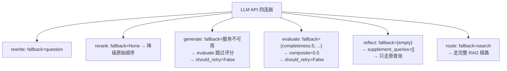
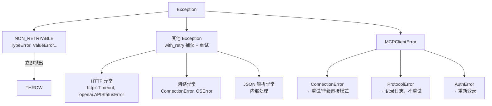
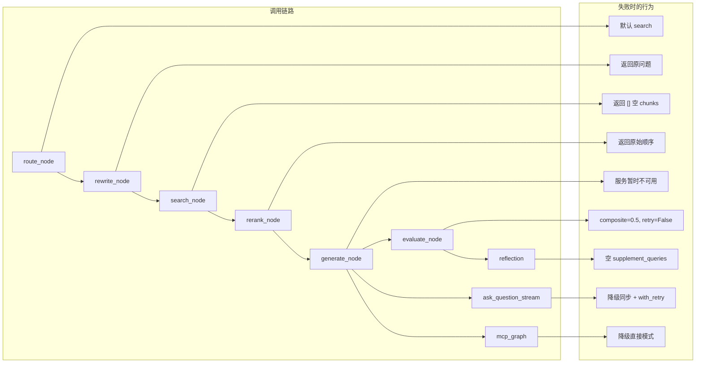

# 韧性工程

> **生产级的 LLM 应用不怕 API 挂掉——怕的是挂了之后系统没反应。**
>
> 好比开车不能指望永远不爆胎，而是要备个备胎 + 学会换胎。LLM 调用的韧性设计就是这套"备胎方案"。

---

## 目录

- [retry.py 逐行走读（49 行全量）](#retrypy-逐行走读49-行全量)
- [with_retry 的 8 个调用点](#with_retry-的-8-个调用点)
- [NON_RETRYABLE 机制](#non_retryable-机制)
- [Fallback 传播路径](#fallback-传播路径)
- [异常层次结构](#异常层次结构)
- [降级全景图](#降级全景图)
- [常见疑问](#常见疑问)

---

## retry.py 逐行走读（49 行全量）

> 📍 `backend/core/retry.py:1-49`

```python
import asyncio
import logging
from collections.abc import Callable, Coroutine  # 类型标注：可调用 + 协程
from typing import Any, TypeVar                   # Any: 任意类型, TypeVar: 泛型变量

logger = logging.getLogger(__name__)

T = TypeVar("T")                                   # 泛型 T，让返回值类型和 fallback 类型一
```

**`TypeVar("T")`**：泛型标注。`with_retry` 的返回值类型和 `fallback` 类型绑定于传入函数 `fn` 的返回类型。这么说可能抽象，看调用处就明白了：

```python
answer = await with_retry(
    llm_generate, ...,
    fallback="服务暂时不可用，请稍后重试。",
)
# answer 的类型就是 str（和 llm_generate 的返回值一致）
```

```python
NON_RETRYABLE = (
    TypeError,       # 参数类型不对 → 代码写错了
    ValueError,      # 参数值非法    → 逻辑错误
    AttributeError,  # 调了不存在的方法 → 拼写错误
    KeyError,        # 字典 key 不存在 → 数据不对
    IndexError,      # 列表下标越界 → 边界问题
    AssertionError,  # 断言失败     → 逻辑错得离谱
)  # 6 种"重试也没用"的内置异常，直接抛
```

**6 种不可重试异常的出处**：全是 Python 内置异常。没有自定义异常。

```python
async def with_retry(
    fn: Callable[..., Coroutine[Any, Any, T]],  # 异步函数，返回值类型 T
    *args,
    max_retries: int = 3,                        # 重试 3 次（共 4 次尝试）
    base_delay: float = 1.0,                     # 初始等待 1 秒，指数递增
    fallback: T | None = None,                   # 全部失败时的保底值
    **kwargs,
) -> T:                                          # 返回值类型就是 T
```

**函数签名分析**：
- `fn`: 一个 async 函数，接受 `*args` 和 `**kwargs`
- `max_retries`: 3（默认），测试时可以调小
- `base_delay`: 1.0 秒
- `fallback`: 可选，类型必须和 `fn` 返回值类型一致

```python
    last_error: Exception | None = None          # 记录最后一次异常
    for attempt in range(max_retries + 1):       # range(4) → 0,1,2,3 共 4 次尝试
        try:
            return await fn(*args, **kwargs)     # 调目标函数，成功就提前返回
```

**`range(max_retries + 1)`**：共 `max_retries + 1` 次调用。
- 第 0 次是初次调用（不等待）
- 第 1-3 次是重试（每次等 `2^{i}` 秒）

```python
        except NON_RETRYABLE:                    # 不可重试异常——直接抛，不 catch
            raise  # 编程错误不重试，直接抛
```

**这个 except 必须在 `except Exception` 上面**，因为 `NON_RETRYABLE` 里的都是 `Exception` 的子类。Python 的 except 匹配顺序是从上到下。

```python
        except Exception as e:                   # 其他异常→捕获并重试
            last_error = e
            if attempt < max_retries:            # 还有重试次数
                delay = base_delay * (2 ** attempt)  # 指数退避：1s, 2s, 4s
                logger.warning(
                    "retry %d/%d after %.1fs: %s", attempt + 1, max_retries, delay, e
                )
                await asyncio.sleep(delay)       # 等完再重试
            else:
                logger.error("all %d retries exhausted: %s", max_retries, e)

    if fallback is not None:                     # 有 fallback → 保底返回
        return fallback
    raise last_error                             # 没 fallback → 抛最后一个异常
```

**最后 3 行是设计精髓**：
1. 有 fallback → 返回 fallback（系统继续运行）
2. 无 fallback → 抛出最后一个异常（调用方自行处理）

---

## with_retry 的 8 个调用点

### 调用点 1：rewrite_query（改写）

```python
# rag_service.py:290-292
rewritten = await with_retry(
    llm_generate, system, user, temperature=0.1, max_tokens=200, fallback=question,
)
```
**fallback=question**：改写失败，返回原始问题。不会让检索无查询可用。

### 调用点 2：rerank（精排）

```python
# rag_service.py:471
data = await with_retry(_call_api, fallback=None)
```
**fallback=None**：调用方检查 None 后打印日志降级。注意这里传的是 `_call_api`（一个 async 闭包函数），不是直接传 lambda。

### 调用点 3：generate_node（生成）

```python
# generate.py:52-58
answer = await with_retry(
    llm_generate, prompt["system"], prompt["user"],
    temperature=_GENERATE_TEMPERATURE, fallback="服务暂时不可用，请稍后重试。",
)
```
**fallback=中文字符串**：重试耗尽后告诉用户"服务挂了"。这是用户体验层面的降级——不暴露技术细节。

### 调用点 4：evaluate_node（评估）

```python
# generate.py:220-227
raw = await with_retry(
    llm_generate, _EVAL_SYSTEM, eval_user,
    temperature=0.0, max_tokens=400,
    fallback='{"completeness": 5, "accuracy": 5, "source_credibility": 5, "feedback": "评估服务暂时不可用"}',
)
```
**fallback=JSON 字符串**：注意 fallback 是一个可以被 `_parse_eval_response` 解析的有效 JSON。LLM 挂了 → 返回中性评分 composite=0.5 → `should_retry=False` → 当前答案直接通过。

### 调用点 5：self_reflection_node（反思）

```python
# reflection.py:138-145
raw = await with_retry(
    llm_generate, _REFLECTION_SYSTEM, reflection_user,
    temperature=0.2, max_tokens=500,
    fallback='{"reflection": "反思服务暂时不可用", "missing_info": [], "supplement_queries": []}',
)
```
**fallback=空 JSON**：空查询意味着反思后 search 会用原始修改查询再搜一次。

### 调用点 6：ask_question_stream（流式降级）

```python
# rag_service.py:663-665
fallback = await with_retry(
    llm_generate, prompt["system"], prompt["user"], fallback=FALLBACK_MESSAGE,
)
```
注意这里没有 `temperature` 参数——`llm_generate` 的默认 temperature=0.1。

### 调用点 7：route_node（路由，间接调用）

```python
# rewrite.py:46-53
result = await with_retry(
    llm_generate, _ROUTE_SYSTEM, f"问题：{query}",
    temperature=0.0, max_tokens=10, fallback="search",
)
```
**fallback="search"**：路由失败默认走完整 RAG——宁可多花 token 搜一次也不能错失问答。

### 调用点 8：rewrite_node（重写异常保护）

```python
# rewrite.py:15-19
try:
    rewritten = await rewrite_query(question)
except Exception:
    rewritten = question
```
注意 rewrite_node 自己包了一层 `try/except`——即使 `with_retry` 内部已经处理了所有异常，这里再加一层双重保险。

---

## NON_RETRYABLE 机制

**为什么这 6 种异常不重试？**

```python
NON_RETRYABLE = (
    TypeError,     # 参数类型不对 → 代码写错了
    ValueError,    # 参数值非法    → 逻辑错误
    AttributeError,# 调了不存在的方法 → 拼写错误
    KeyError,      # 字典 key 不存在 → 数据不对
    IndexError,    # 列表下标越界 → 边界问题
    AssertionError,# 断言失败     → 逻辑错得离谱
)
```

**延伸追问**：如果把 `ValueError` 从 NON_RETRYABLE 里移除行不行？
→ 可以，但不好。如果 LLM API 返回了 `{"error": "rate limit"}` 且 SDK 抛出 `ValueError`，你希望重试。但系统设计者认为 ValueError 不应该来自外部 API——如果外部 API 抛 ValueError，那是 SDK 的 bug，不是瞬时故障。

在实际项目中，更稳健的方式是定义一个"可重试异常"白名单（如 `httpx.TimeoutException`, `openai.APIStatusError`），其他都直接抛出。但当前项目用了更激进的黑名单方式——绝大多数异常都可重试，只排除 6 种"100% 是 bug"的异常。

---

## Fallback 传播路径

每层从下到上的 fallback 链：



**关键保障**：任何单点故障都不会让整个请求挂掉。最坏情况：用户收到"服务暂时不可用"或者"抱歉，简历中未提及该信息"。

---

## 异常层次结构



---

## 降级全景图



---

## 常见疑问

### retry.py 设计
- "`for attempt in range(max_retries + 1)`——为什么不用 `for i in range(max_retries): ... else: raise` 结构？"
- "`NON_RETRYABLE = (...) ` 为什么用元组不用列表？"（元组可哈希，性能稍好，语义上不可变）
- "`except NON_RETRYABLE` 在 `except Exception` 之前——如果顺序反过来会怎样？"
- "为什么没有 jitter？——纯指数退避在分布式环境下会导致 thundering herd"（所有客户端同时重试）
- "`TypeVar('T')` 的作用——没有它会怎样？"（fallback 类型检查失效）

### 调用点比较
- "8 个调用点——为什么 rewrite 的 fallback 是 question 而不是空字符串？"
- "generate 的 fallback 是中文——如果系统要切换到英文环境要改几处？"
- "evaluate 的 fallback 返回中性分——如果希望 evaluate 挂了就通过，为什么不直接返回 should_retry=False？"
- "route 为什么是 max_tokens=10？如果 LLM 返回 'direct_answer' 但 token 不够被截断会怎样？"

### 设计哲学
- "NON_RETRYABLE 没有包含 `openai.AuthenticationError`——如果 API key 过期了，重试有用吗？"
- "怎么样给 with_retry 加一个 '只有特定异常才重试'的功能？"
- "为什么不用 @retry 装饰器模式？——Python 的 tenacity 库用过吗？"

---

## 踩坑实录（开发中的真实事故）

> 🟡 **原理级**：实践中随口说出几个踩坑经历，比讲任何设计理念都有说服力。这些来自项目开发全过程的真实记录。

| 阶段 | 事故 | 根因 | 修复方案 |
|------|------|------|---------|
| Phase 0 | Docker 多阶段构建失败 | 忘记复制 requirements.txt | 修正 Dockerfile 中的 COPY 路径 |
| Phase 1 | CORS 配置硬编码 | 硬编码的前端 URL，换环境就崩 | 改成环境变量注入 |
| Phase 1 | BM25 索引并发写报错 | 未加锁，多请求同时修改索引 | `asyncio.Lock` 保护索引更新 |
| Phase 1 | Embedding 缓存并发不安全 | dict 读写未加锁 | `asyncio.Lock` 保护缓存读写 |
| Phase 2 | MCP Server 挂载路径重写 | FastAPI 子应用 mount 路径被父应用覆盖 | 修正中间件链顺序 |
| Phase 2 | SSE 传输 Content-Type 错误 | MCP Streamable HTTP 的响应头未设 `text/event-stream` | 显式设置 Content-Type |
| Phase 3 | 反思结果 JSON 解析不稳定 | LLM 输出的 JSON 可能不完整/不标准 | 加 JSON 修复逻辑 + fallback 解析 |

**一句话讲清示例**：
> *"调试最久的问题可能是 MCP Server 挂载路径重写——FastAPI 子应用的中间件链和父应用是独立的，MCPAuthMiddleware 只拦截 `/mcp` 路径，但父应用的路由重写把路径改了，导致认证失效。查了半小时才发现是中间件顺序问题。"*

---

## 相关笔记

- [[04_Reflexion自纠正|🔄 04 Reflexion自纠正循环（逐行走读）]]
- [[02_RAG流水线|🔧 02 RAG核心流水线（逐行走读）]]
- [[08_可观测性|📈 08 工程化与可观测性]]

## 技术学习笔记

- [[27-指数退避重试：Exponential Backoff + Jitter|指数退避重试]]
- [[28-降级路径（Degradation）：某环节失败 → 回退到次优但可用方案|降级路径]]
- [[18-工具调用失败处理：文件不存在-超时-权限不足→恢复与重试|工具调用失败处理]]
- Agent韧性工程概述

---

**最后更新**：2026-07-14 | **项目**：ai-resume-analyzer | **retry.py 行数**：49
