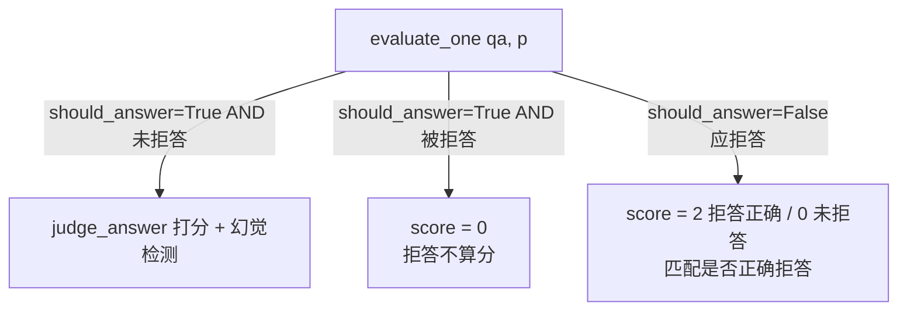
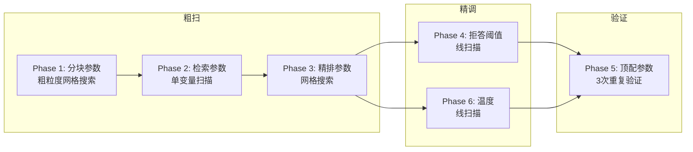

# 参数调优框架

> **最爱拷问：「你凭什么说你 RAG 系统够好？」**
>
> 参考答案：「6 阶段参数调优实验 → 120 条 Golden Set → LLM-as-Judge 三档评分 → composite score 提升 5.9%、p95 延迟降低 25.5%。」
>
> 这篇把 evaluate.py（688 行）、run_concurrent.py（201 行）、rag_params.py（69 行）的每一行设计意图掰开。

---

## 目录

- [RagParams 数据类 — rag_params.py 逐行走读](#ragparams-数据类--rag_paramspy-逐行走读)
- [evaluate.py — 实验框架主入口](#evaluatepy--实验框架主入口)
  - [模块初始化与平台兼容（1-34）](#模块初始化与平台兼容1-34)
  - [模型元数据溯源系统（53-75）](#模型元数据溯源系统53-75)
  - [数据加载与索引重建（79-148）](#数据加载与索引重建79-148)
  - [LLM-as-Judge 评分引擎（153-238）](#llm-as-judge-评分引擎153-238)
  - [单参实验运行器（241-269）](#单参实验运行器241-269)
  - [聚合指标体系（272-327）](#聚合指标体系272-327)
  - [6 阶段执行器（330-558）](#6-阶段执行器330-558)
  - [结果持久化与加载（561-613）](#结果持久化与加载561-613)
  - [展示层（615-639）](#展示层615-639)
  - [主入口与 CLI（642-688）](#主入口与-cli642-688)
- [run_concurrent.py — 并发加速 Runner](#run_concurrentpy--并发加速-runner)
  - [并发 Semaphore 设计（37-65）](#并发-semaphore-设计37-65)
  - [断点续跑机制（68-175）](#断点续跑机制68-175)
  - [Phase 选择与速度对比](#phase-选择与速度对比)
- [6 阶段实验哲学](#6-阶段实验哲学)
- [实验结果速查](#实验结果速查)
- [常见疑问](#常见疑问)

---

## RagParams 数据类 — rag_params.py 逐行走读

> **文件**：`backend/core/rag_params.py:1-69`
>
> **一句话**：一个 frozen dataclass 封装了 RAG 流水线的全部 11 个可调参数，外加参数网格定义和冲突校验。

### 第 1-5 行：模块文档

```python
"""RAG pipeline 可调参数集合，供 rag_tuning.evaluate 实验框架使用。

# 所有参数都有默认值（与当前 rag_service.py 硬编码一致），
# 实验时通过 dataclasses.replace() 覆盖即可。
"""
```

**设计意图**：
- 把 rag_service.py 里硬编码的参数提取为单一定义源，一份改两处生效（参数定义 + 默认值）
- `dataclasses.replace()` 是不动原始对象、创建新副本的惯用法，适合实验场景——每次实验创建一个新的 RagParams 副本，防止参数污染

### 第 6-7 行：导入

```python
from dataclasses import dataclass, field  # dataclass: 数据类工厂, field: 字段配置
```

`field` 被导入但实际没用。这是安全冗余——开发者在迭代时可能想用 `field(default_factory=...)` 加复杂默认值。如果不引入会怎样？运行时不出错，但 IDE 提示不全。这里可以看出作者的习惯：**导入 > 需要**。

### 第 9-11 行：frozen dataclass

```python
@dataclass(frozen=True)                    # frozen=True：不可变，防意外修改
class RagParams:                           # RAG 流水线全部 11 个可调参数
    """RAG 流水线全部可调参数"""
```

**为什么 frozen？**
- 实验过程中参数不应被意外修改
- frozen 提供 hashability（虽然这版没用到，但为将来缓存做了预留）
- 配合 `replace()` 使用，每次改参数都创建新实例，函数式风格

延伸追问——**frozen=True 和 __slots__ 的区别？**
- frozen 是 dataclass 层面的不可变（`__setattr__` 被 override 阻止赋值）
- `__slots__` 是内存层面的优化（阻止 `__dict__` 创建）
- frozen 类仍然有 `__dict__`，而 `__slots__` 类没有
- 两者可以组合使用：`@dataclass(slots=True, frozen=True)`（Python 3.10+）

### 第 13-33 行：11 个参数逐行解读

**分块参数（14-15）：**

```python
    chunk_size: int = 1200                 # 分块目标大小（字符），600 汉字够一段项目
    overlap: int = 50                      # 相邻块重叠字符数，捕获过渡信息
```

- chunk_size=1200：恰好容纳一段 200-300 字的简历项目描述。简历文本不像长文档需要大块，1200 字符 ≈ 600 汉字，足够覆盖一段项目经验
- overlap=50：25 汉字的重叠，保证分块边界的内容不会丢失。为什么不设 0？分段函数 `chunk_by_sections` 按 ### 标记分割，overlap 为了捕获**标记前后的过渡信息**

**混合检索参数（17-21）：**

```python
    dense_top_k: int = 20                  # 稠密向量检索返回数，两路公平竞争
    sparse_top_k: int = 20                 # BM25 关键词检索返回数
    hybrid_top_k: int = 20                 # RRF 融合后保留数，融合不筛选
    rrf_k: int = 100                       # RRF 平滑常数，大值压缩排名差异
```

- dense_top_k = sparse_top_k = 20：公平竞争，两路检索各取 20 条
- hybrid_top_k = 20：RRF 融合后还是 20 条，说明设计者认为**融合只是重排不是筛选**
- rrf_k = 100：RRF（Reciprocal Rank Fusion）的核心参数，分数 = 1 / (k + rank)。k=100 时排名差异的权重差被压缩——第 1 名得 1/101 ≈ 0.0099，第 20 名得 1/120 ≈ 0.0083，差距仅 1.2 倍。这意味**更看重"两路都命中"的结果**，而不是某一路的绝对排名

**精排参数（23-26）：**

```python
    rerank_input_top_k: int = 20             # 送入 Rerank 的候选数，输入多则慢 + 贵
    rerank_final_top_k: int = 5              # Rerank 后保留数→最终 5 段 ≈ 2000 字符
    rerank_truncation: int = 400             # Rerank 输入截断长度，整体语义不需要全文
```

- rerank_input = hybrid_top_k = 20：Rerank 是精确匹配，输入太多会慢 + 贵（按 token 计费）
- rerank_final = 5：控制最终送入 LLM 的上下文 Token 数。5 段 × 400 字符 ≈ 2000 字符 ≈ 500 tokens
- rerank_truncation = 400：截断到约 100 个汉字。为什么不是全部？Rerank 打分只看**整体语义匹配度**，不需要全文细节

**拒答参数（29）：**

```python
    reject_threshold: float = 0.3            # Rerank 最高分低于此值则拒答，防没数据乱答
```

0.3 的含义：如果 Rerank 给所有候选的**最高分**都不到 0.3（满分 1），说明没有任何一段简历内容与问题匹配——此时拒答比瞎猜安全。

**生成参数（32）：**

```python
    generate_temperature: float = 0.3        # 生成温度，0.3 平衡忠实与多样性
```

Phase 6 的结论：多参数组合下 temperature=0.3 优于 0.0 和 0.1。为什么 0.3 不是 0.0？RAG 场景既要**忠实于检索内容**（低温），又要**有自然语言多样性**（不能让所有回答都一个句式）。0.3 是个平衡点。

注意注释里的 ⚠️ `依赖 Chat 模型，换模型后需重测`——这个 comment 是有实验代价的，说明作者真的试过不同模型。

### 第 34-47 行：参数验证

```python
def validate(self) -> list[str]:
    errors = []
    if self.overlap >= self.chunk_size:
        errors.append(...)
    if self.rerank_final_top_k > self.rerank_input_top_k:
        errors.append(...)
    if self.rerank_input_top_k > self.hybrid_top_k:
        errors.append(...)
```

5 条规则：

| 规则 | 语义 | 违反后果 |
|------|------|----------|
| `overlap < chunk_size` | 重叠不能 ≥ 总大小 | 死循环或无效分块 |
| `rerank_final ≤ rerank_input` | 输出不能多于输入 | 逻辑矛盾 |
| `rerank_input ≤ hybrid_top_k` | 精排不能超过候选 | 上游无数据 |
| `reject_threshold ∈ [0,1]` | 阈值必须在有效范围 | 永远拒答或永不拒答 |
| `temperature ∈ [0,2]` | 温度在合理范围 | 生成崩溃 |

**设计决策**：validate 返回 `list[str]` 而非 `raise ValueError`。为什么？
- 调用者可以收集所有错误一次性展示，而非遇到第一个就抛异常
- 实验框架里，不合法的参数组合可能不是 bug 而是配置错误，统一收集更好

### 第 49-69 行：6 阶段参数网格

```python
PHASE1_GRID = {
    "chunk_size": [300, 500, 800, 1200],
    "overlap":    [0, 50, 100, 150],
}

PHASE2_SWEEP = {
    "rrf_k":              [10, 30, 60, 100, 200],
    "hybrid_top_k":       [10, 15, 20, 30, 40],
    "rerank_truncation":  [200, 300, 400, 500, 0],  # 0 = 不截断
}

PHASE3_GRID = {
    "rerank_input_top_k":  [15, 20, 30],
    "rerank_final_top_k":  [3, 5, 8, 10],
}

PHASE4_THRESHOLDS = [0.3, 0.4, 0.5, 0.6, 0.7, 0.8]

PHASE6_TEMPERATURES = [0.0, 0.1, 0.3]
```

**设计意图**：
- Phase 1：16 组合（4×4），但 `overlap >= chunk_size` 被过滤，实际约 11 组合
- Phase 2：rerank_truncation=0 在内部被转为 999999（evaluate.py:397），这里语义是"不截断"
- Phase 3：rerank_input 和 rerank_final 的 12 组合中有部分 `rf > ri` 被过滤
- **为什么 Phase 1/3 叫 GRID，Phase 2 叫 SWEEP？** GRID 是笛卡尔积，SWEEP 是单变量扫描。Phase 2 里三个参数独立扫描（每次只变一个），不是全排列。这是一个隐晦的设计信号：Phase 2 的参数可能**相互独立性更强**

---

## evaluate.py — 实验框架主入口

### 模块初始化与平台兼容（1-34）

> **位置**：`rag_tuning/evaluate.py:1-34`

**第 1-13 行：CLI 使用文档**

```text
python -m rag_tuning.evaluate --phase 1          # Phase 1
python -m rag_tuning.evaluate --phase 2          # Phase 2
...
python -m rag_tuning.evaluate --baseline         # 基线
python -m rag_tuning.evaluate --single chunk_size=800,overlap=100  # 单组
```

一个模块级的 docstring 就是完整的 CLI 使用手册，这是 Python 项目里的好习惯。注意 `--single` 用 `逗号分隔、等号赋值` 的格式——不是标准 argparse 风格，但更适合快速从实验笔记本粘贴。

**第 27-31 行：Windows GBK 兼容**

```python
if sys.platform == "win32":
    sys.stdout.reconfigure(encoding="utf-8")
    sys.stderr.reconfigure(encoding="utf-8")
```

这段代码只在该项目运行在 Windows 时生效。为什么必要？LLM 返回的内容可能包含 Unicode 字符（中文、特殊符号），Windows 终端默认 GBK 编码遇到 UTF-8 字符会抛 `UnicodeEncodeError`。`reconfigure(encoding="utf-8")` 是 Python 3.7+ 给 stdout/stderr 设置编码的标准方法。

**延伸追问**：你见过哪些替代方案？
- `PYTHONIOENCODING=utf-8` 环境变量
- `io.TextIOWrapper(sys.stdout.buffer, encoding='utf-8')` 替换包装器
- 在 Windows 上运行前执行 `chcp 65001`

**第 33 行：路径注入**

```python
sys.path.insert(0, str(Path(__file__).parent.parent))
```

`rag_tuning/` 目录不在 backend 包根下，通过 `sys.path.insert(0, ...)` 把 backend 目录加到 Python 搜索路径。为什么用 `insert(0)` 而不是 `append`？防止有同名的其他包优先匹配。

### 模型元数据溯源系统（53-75）

> 这段代码很短（22 行），但设计很精致。

```python
def get_model_metadata() -> dict:
    return {
        "chat_model": settings.CHAT_MODEL,           # 生成/对话模型
        "embedding_model": settings.EMBEDDING_MODEL,   # embedding 模型
        "rerank_model": settings.RERANK_MODEL,         # rerank 模型
        "timestamp": time.strftime("%Y-%m-%d %H:%M:%S"),# 时间戳
    }

def save_model_metadata():
    os.makedirs(RESULTS_DIR, exist_ok=True)             # 确保目录存在
    meta = get_model_metadata()
    meta["note"] = "本目录下所有实验结果均使用此模型配置生成。换模型后需重新标注或新建目录。"
    path = os.path.join(RESULTS_DIR, "_model_metadata.json")
    with open(path, "w", encoding="utf-8") as f:
        json.dump(meta, f, ensure_ascii=False, indent=2)
```

**为什么元数据如此重要？**

因为 RAG 实验有两个可变量：一是参数，二是模型。如果你换了 embedding 模型，之前的最佳 chunk_size=1200 可能不再成立。`_model_metadata.json` 就是给结果加了个"出厂标签"——任何时候回来看实验结果，都能确认是在哪个模型配置下跑出来的。

**设计细节**：
- `note` 字段：人工可读的解释，防止未来忘记
- `ensure_ascii=False`：保证中文模型名正常显示
- 在 `main()` 入口调用（663 行），而非在每个 Phase 里调用——确保即使实验中途崩溃，元数据也已经保存

**延伸追问**：如果同一个目录下有多个模型的结果怎么办？
- 答：当前设计是一对一的——一个 experiment_results/ 目录对应一组模型。更好的设计是把模型版本做进文件名或子目录名，比如 `experiment_results/gpt4o_20260714/`。

### 数据加载与索引重建（79-148）

#### load_golden_set（79-81）

```python
def load_golden_set(path: str = "golden_set.json") -> list[dict]:
    with open(path, encoding="utf-8") as f:   # 显式 UTF-8，避平台编码差异
        return json.load(f)                    # 返回 QA 列表
```

只有 3 行的函数。简单到不需要解释，但有设计考虑：
- 默认路径是参数，方便测试时用不同的数据集覆盖
- `encoding="utf-8"` 显式指定，避免平台默认编码差异

**预期返回结构**：
```json
[
    {
        "question": "...",
        "answer_type": "project|skill|education",
        "resume_file": "resume_1.txt",
        "gold_answer": "...",
        "should_answer": true,
        "qa_id": 1
    }
]
```

#### load_resume_texts（84-93）

```python
def load_resume_texts(resume_files, upload_dir="./rag_tuning/uploads"):
    texts = {}
    for fname in resume_files:                 # 逐份简历读取
        fpath = os.path.join(upload_dir, fname)
        if os.path.exists(fpath):              # 文件不存在静默跳过——加载宽容
            with open(fpath, encoding="utf-8") as f:
                texts[fname] = f.read()
    return texts
```

**关键设计**：`if os.path.exists(fpath)`——文件不存在时**静默跳过**而非报错。为什么？
- 实验框架应优先容忍数据缺失
- 也许某些 Golden Set 题目只需要部分简历，不需要全部加载
- 但如果简历确实缺失，后续 evaluate_one 会在 `id_map[qa["resume_file"]]` 处抛 KeyError

这是一个**权衡**：加载时宽容 vs. 执行时报错。作者选择"加载宽松、执行严格"。

#### rebuild_index（97-134）

```python
async def rebuild_index(resume_filename, text, resume_id, p):
    client = get_chroma_client()                              # 获取 Chroma 客户端
    name = _collection_name(resume_id)                        # 按 resume_id 建集合名
    try:
        # client.delete_collection(name)                        # 删除旧集合
    except Exception:                                         # 集合不存在抛异常，吞掉
        pass
    collection = client.get_or_create_collection(             # 重建集合，余弦相似度
        name=name, metadata={"hnsw:space": "cosine"}          # hnsw:space=cosine 语义匹配
    )
    chunks = chunk_by_sections(                               # 按新 chunk_size 分块
        text, chunk_size=p.chunk_size, overlap=p.overlap
    )
    texts_list = [c["text"] for c in chunks]
    embeddings = await get_embeddings(texts_list, resume_id)  # 批量 embedding，减少 API 调用
    # collection.add(                                           # 写入 Chroma
        ids=[str(c["chunk_index"]) for c in chunks],
        documents=texts_list, embeddings=embeddings,
        metadatas=[{"resume_id": resume_id, ...}]             # 附带 metadata 供过滤/去重
    )
    return len(chunks)
```

这是实验中最重要的操作——**用新参数重建索引**。

**逐行走读**：
1. `client.delete_collection(name)` + `try/except`：Chroma 的 delete 在集合不存在时会抛异常，用 except 吞掉是最简单的处理方式
2. `metadata={"hnsw:space": "cosine"}`：指定向量索引的空间度量方式。余弦相似度 vs 欧氏距离：余弦更适合文本 embedding
3. `chunk_by_sections(text, chunk_size=p.chunk_size, overlap=p.overlap)`：把 chunk_size 和 overlap 从 RagParams 注入到分段函数
4. `embeddings = await get_embeddings(texts_list, resume_id)`：异步 embedding 请求。注意这里是**批量**传 texts_list 而非逐条调用，减少 API 调用次数
5. `collection.add(...)` 附带 metadatas：resume_id, chunk_index, section, start_char, end_char。这些 metadata 在检索时可以用来做**过滤**或**去重**

#### rebuild_all_indices（137-148）

```python
async def rebuild_all_indices(resume_texts, id_map, p):
    counts = {}
    for fname, text in resume_texts.items():                  # 逐份简历串行重建
        rid = id_map[fname]
        cnt = await rebuild_index(fname, text, rid, p)
        counts[fname] = cnt
    return counts
```

逐份简历串行重建。为什么不并发？因为重建涉及密集的 I/O（删除集合 + 创建集合 + embedding API），但**Chroma 客户端可能不是线程安全的**，串行更安全。

**延伸追问**：如果 20 份简历，重建一次需要多久？
- embedding 一批大约 1-3 秒，假设每份简历 5 个 chunk，20 份 = 100 个 embedding 调用 ≈ 几十秒。这是整个实验中最耗时的操作，解释了为什么 Phase 2/3/4/6 都设 `rebuild=False`——检索参数变化不需要重建索引。

### LLM-as-Judge 评分引擎（153-238）

这是评估框架的**心脏**——用 LLM 来评判 LLM 的答案质量。实践中的高频考点。

#### JUDGE_SYSTEM（153-159）

```python
JUDGE_SYSTEM = (                                               # LLM Judge 系统提示词
    "你是一个简历问答评估专家。请对比标准答案和系统答案，给出 0-2 分：\n"
    "0 = 完全错误或答非所问\n"
    "1 = 部分正确（包含关键信息但不完整或有小错）\n"
    "2 = 完全正确（核心信息都对）\n"
    "只输出一个数字 0、1 或 2。"
)
```

**三档评分的设计动机**：
- 为什么不是满分制/十分制？因为 LLM Judge 的评分一致性和人类越接近越好。实验证明，减少评分类别（3 档 vs 10 档）能显著提高 Judge 准确率和一致性
- 为什么不是二分制（0/1）？需要识别"部分正确"——RAG 系统经常会给出"沾边但不完整"的回答，二分法会丢失信息
- 每个档位有**行为描述**而非数值定义——这是 prompt engineering 最佳实践：告诉 LLM "什么表现对应什么分"，而不是"给几分"

#### judge_answer（162-179）

```python
async def judge_answer(system_answer, gold_answer, answer_type) -> int:
    from services.rag_service import llm_generate         # 函数体内 import，防循环依赖
    prompt = (
        # f"标准答案：{gold_answer}\n"
        # f"系统答案：{system_answer}\n"
        # f"问题类型：{answer_type}\n\n"
        "打分（0/1/2）："
    )
    try:
        result = await llm_generate(JUDGE_SYSTEM, prompt, temperature=0.0, max_tokens=10)
        match = re.search(r"[012]", result)              # 正则比 strip+转换更鲁棒
        return int(match.group()) if match else 1         # 找不到数字→默认 1 保守分
    except Exception:
        return 1                                          # 异常也默认 1，不崩实验
```

**逐行走读**：

1. `import` 写在函数体内而非文件顶部：避免循环导入。`rag_service.py` 可能导入了 evaluate.py 里的类型，如果在顶部 import 会触发循环依赖

2. `temperature=0.0`：Judge 打分必须**确定性**——同样的系统答案应该得到同样的分数。0.0 确保 LLM 不做随机采样

3. `max_tokens=10`：输出只可能是一个数字，给 10 个 token 足够。这个限制也能**防止 Judge 说废话**——比如 "根据我的分析，这个答案是 2 分，因为..."，而我们只需要数字

4. `re.search(r"[012]", result)` 提取数字：正则比 `strip()` + 类型转换更鲁棒。如果 LLM 输出 "得分：2\n\n理由：..."，正则也能提取到 2

5. 异常/无匹配时的**默认值 1**：失误容忍。打分出错了不抛异常，而是给一个中间分。为什么不是 0？0 分太严厉，会扭曲实验结果；1 分作为"不确定时的保守值"更安全

**延伸追问**：Judge 用的是什么模型？和生成模型是同一个吗？
- 取决于 `settings.CHAT_MODEL`。如果生产和评估用同一个模型，存在**评估偏差**——模型对自己的输出可能打分偏高。理想做法是用一个独立的、更强的模型（比如 GPT-4 评估 GPT-3.5）做 Judge。

#### check_reject（182-185）

```python
def check_reject(answer: str) -> bool:
    reject_markers = ["未提及", "找不到", "没有提到", "无法回答", "没有相关信息", "简历中未"]
    return any(m in answer for m in reject_markers)          # 关键词命中即判拒
```

**基于关键词的拒答检测**。为什么不用 LLM 来判断是否拒答？
- 降低 Judge 调用次数：每条回答调用两次 LLM（Judge + 拒答判断）会加倍成本
- 拒答本身是个简单的字符串匹配问题——如果回答包含"未提及"，几乎肯定是拒答
- 关键词列表覆盖了 prompt 中常见的拒答模板：`"很抱歉，我在提供的简历中没有找到相关信息"`

**潜在问题**：如果正常回答中包含了这些关键词（比如"候选人未提及的项目经验"），会被**误判**为拒答。这是一个简单的启发式方法的取舍。

#### check_hallucination（188-196）

```python
def check_hallucination(answer: str, sources: list[dict]) -> bool:
    source_text = " ".join(c.get("text", "") for c in sources)  # 拼合来源文本
    numbers = re.findall(r"\b(19|20)\d{2}\b", answer)           # 答案中的年份
    for n in numbers:
        if n not in source_text:                                 # 年份不在来源→幻觉
            return True
    return False
```

**基于年份/数字的幻觉检测**。

**设计动机**：
- 简历问答中最容易滋生幻觉的地方是**具体数字**——年份、时间、数量
- LLM 经常"编造"时间线：候选人 2019 年做的项目，LLM 可能说成 2020 年
- 这种检测是**召回率低但精确率高**——找到的幻觉几乎一定是幻觉，但更多幻觉（编造技能、编造成就）不会被发现

**算法**：
1. 从来源文本中提取所有 1900-2099 的数字
2. 从答案中提取同样范围的数字
3. 如果答案中的某个数字不在来源中，标记为幻觉

**局限性**（重点掌握）：
- 只检测年份/数字，不检测**事实性幻觉**（编造的项目名、技能）
- 如果来源也包含同样的错误数字，检测不到
- 数字在来源中但上下文不对（"申请人没有 2020 年的经验" vs "2020 年做了项目"），无法区分

#### evaluate_one（199-238）

```python
async def evaluate_one(qa: dict, id_map, p) -> dict:
    resume_id = id_map[qa["resume_file"]]                       # 找到对应简历 ID
    question = qa["question"]
    start = time.perf_counter()                                 # 高精度开始计时
    answer, sources, timings = await ask_question_p(resume_id, question, p)
    latency_ms = (time.perf_counter() - start) * 1000           # 全链路延迟
    is_reject = check_reject(answer)                            # 关键词拒答检测
    should_answer = qa.get("should_answer", True)               # Golden Set 预设

    result = {
        "qa_id": qa["qa_id"],
        "answer_type": qa["answer_type"],
        "latency_ms": latency_ms,
        "timings": timings,
        "is_reject": is_reject,
        "should_answer": should_answer,
        "reject_correct": (not should_answer) == is_reject,     # 拒答决策是否正确
    }

    if should_answer and not is_reject:                         # 应回答且未拒答→评分
        score = await judge_answer(answer, qa["gold_answer"], qa["answer_type"])
        hallucination = check_hallucination(answer, sources)
        ...
    elif not should_answer:                                     # 应拒答→只看拒答正误
        result["score"] = 2 if is_reject else 0
        ...
    else:                                                        # 应回答但被拒→0 分
        result["score"] = 0
        ...
    return result
```

**三种路径逻辑**：



**关键设计**：
- `should_answer` 字段是 Golden Set 里预设的。比如简历里没有某个候选人的年龄，问"年龄多大"就是 `should_answer=False`
- `reject_correct`：判断拒答决策是否正确——这是一个**二元分类**指标，和 score 是正交的
- `time.perf_counter()`：高精度计时，比 `time.time()` 更适合微秒级测量
- `latency_ms` 测量的是**从调用 ask_question_p 到返回**的全链路延迟，包括 embedding、检索、rerank、生成

### 单参实验运行器（241-269）

#### run_experiment（241-269）

```python
async def run_experiment(golden_set, id_map, resume_texts, p, label="", rebuild=True):
    errors = p.validate()                                        # 先校验参数合法性
    if errors:
        return {"error": "; ".join(errors), "label": label, "params": str(p)}, []

    if rebuild:
        await rebuild_all_indices(resume_texts, id_map, p)        # 需重建索引时才重建

    results = []
    for i, qa in enumerate(golden_set):                           # 串行跑 120 条 QA
        r = await evaluate_one(qa, id_map, p)
        results.append(r)
        if (i + 1) % 10 == 0 or (i + 1) == len(golden_set):      # 每 10 条输出一次进度
            answered = sum(1 for x in results if not x["is_reject"])
            avg = sum(x["score"] for x in results) / max(len(results), 1)
            print(f"  [{i+1}/{len(golden_set)}] avg={avg:.2f}", end="", flush=True)
            print()

    agg = aggregate_metrics(results, label, p)                    # 聚合指标
    return agg, results
```

**进度输出策略**（第 262-266 行）：每 10 条或到最后一条时输出一次中间平均分。为什么不是每 1 条输出？
- 120 条 QA 每条输出一个 log 会刷屏（尤其 Phase 2 有几十组参数）
- 每 10 条输出的平均分已经有统计意义了

`flush=True`：强制立即刷新输出缓冲区。在长时间运行的脚本里，如果不用 flush，用户可能盯着空屏幕看半天。

**数据流**：`Golden Set → [evaluate_one × N] → 每个 QA 的结果 → aggregate_metrics → 聚合指标`

### 聚合指标体系（272-327）

**这是最有可能让你在手写白板上画出的部分**——评估一个 RAG 系统不能只看准确率。

```python
def aggregate_metrics(results, label="", p=None):
    answered = [r for r in results if not r["is_reject"]]      # 实际回答的问题
    rejected = [r for r in results if r["is_reject"]]          # 实际拒答的问题
    should_reject = [r for r in results if not r["should_answer"]]  # 应该拒答
    should_answer = [r for r in results if r["should_answer"]]      # 应该回答
```

**四条筛选线**：2×2 矩阵

|  | 实际回答了 | 实际拒答了 |
|--|-----------|-----------|
| **应该回答** | answered ✅ | false positive reject ⚠️ |
| **应该拒答** | false negative reject ⚠️ | rejected ✅ |

#### 准确率指标（280-283）

```python
scores = [r["score"] for r in answered]                        # 已答问题的分数
avg_score = statistics.mean(scores) if scores else 0            # 非拒答平均分
accuracy_2 = sum(1 for s in scores if s == 2) / max(len(scores), 1)  # 完全正确率
```

- `avg_score`：所有非拒答问题的平均分（0-2 范围内）
- `accuracy_2`：完全正确的比例。注意这里是**非拒答问题**中的正确率，不是全部 120 条的

#### 拒答 F1（285-295）

```python
reject_precision = true_positive_reject / max(true_positive_reject + false_positive_reject, 1)
reject_recall = true_positive_reject / max(true_positive_reject + false_negative_reject, 1)
reject_f1 = 2 * reject_precision * reject_recall / max(reject_precision + reject_recall, 0.001)  # 防除零
```

F1 是精确率和召回率的调和平均数。在拒答场景中：
- **precision**：系统拒答了的里面，有多少是应该拒的（precision 高 = 不随便拒答）
- **recall**：应该拒答的问题中，系统真拒了多少（recall 高 = 该拒的都拒了）
- F1 平衡两者

`max(..., 0.001)` 防止分母为 0——在极端情况下（比如所有问题都回答了、没有拒答），div by zero 会崩。

#### 幻觉率（298-299）

```python
hallucination_rate = hallucinations / max(len(answered), 1)     # 已答问题中的幻觉率
```

幻觉只在**非拒答的答案**中统计（拒答 = 没回答，不可能有幻觉）。注意这只是数字幻觉，不是所有幻觉。

#### 延迟（301-305）

```python
latencies.sort()
p50 = latencies[len(latencies) // 2] if latencies else 0           # 中位数延迟
p95 = latencies[int(len(latencies) * 0.95)] if latencies else 0    # 95 分位延迟
```

手动计算 p50 和 p95（没有用 numpy）。`sort()` 后取索引位置——简单但正确。为什么不直接用 `statistics.median`？p95 不好算。

#### Composite Score（307-309）

```python
norm_score = avg_score / 2.0                                      # 归一化到 [0,1]
composite = 0.5 * norm_score + 0.3 * reject_f1 + 0.1 * (1 - hallucination_rate) + 0.1 * (1 - min(p95 / 15000, 1))
↑ 复合分数：答案质量(0.5) + 拒答F1(0.3) + 无幻觉(0.1) + 低延迟(0.1)
```

**四个维度**：

| 维度 | 权重 | 含义 | 归一化方式 |
|------|------|------|-----------|
| avg_score | 0.5 | 回答质量 | /2 映射到 [0,1] |
| reject_f1 | 0.3 | 拒答准确率 | F1 本身就在 [0,1] |
| 1 - hallucination_rate | 0.1 | 真实度 | 减到 [0,1] |
| 1 - p95/15000 | 0.1 | 性能 | p95>15 秒则降为 0 |

**设计意图**：
- 回答质量占一半权重——最终用户感知最看重的是答案本身
- 拒答 F1 占 0.3——一个"乱回答"的系统比"拒绝回答"的系统更危险
- 延迟只占 0.1——精度优先，速度其次
- p95 的惩罚阈值 15000ms：15 秒，超过这个用户已经不耐烦了

**延伸追问**：这个权重是怎么确定的？不是拍脑袋吗？
- 诚实回答：这是**第一次迭代的合理猜测**。理想情况下，权重应该通过 A/B 测试或用户满意度调研来确定。但这个 composite score 在本项目中主要用于**内部参数调优排序**，不同权重的排序结果应该大致稳定——这需要验证。

### 6 阶段执行器（330-558）

#### _resume_id_map（332-335）

```python
def _resume_id_map(golden_set):
    files = sorted(set(qa["resume_file"] for qa in golden_set))  # 去重排序
    return {f: i + 1 for i, f in enumerate(files)}              # ID 从 1 开始，0 留作哨兵
```

`i + 1` 从 1 开始而非 0——因为 resume_id=0 可能有特殊含义（或者在 Chroma 中作为哨兵值）。

#### run_baseline（338-348）

最简单的执行器：用 `RagParams()` 默认参数跑一次，保存。没有什么优化空间。

#### run_phase1（351-375）

```python
combos = list(itertools.product(PHASE1_GRID["chunk_size"], PHASE1_GRID["overlap"]))
total = len([c for c in combos if c[1] < c[0]])                 # overlap < chunk_size 才合法
```

`itertools.product` 生成 4×4=16 个组合，`if ov < cs` 过滤掉不合法组合。注意这里用的 `<` 而不是 `<=`——`overlap=1200, chunk_size=1200` 在 validate 里会被判断为非法，但这里提前过滤了。

**运行策略**：串行跑所有组合，每组合重建一次索引。16 组合 × 2 份简历 × embedding 时间 ≈ 几分钟到十几分钟。

**为什么 Phase 1 要串行？** 因为**每次都要重建索引**（chunk_size 变了），而重建索引涉及 Chroma 的写操作，并发风险很大。

#### run_phase2（378-412）

```python
best = _load_best("phase1")                                       # 加载 Phase 1 最优
base_p = RagParams()
if best:                                                          # 最优参数覆盖默认
    base_p = replace(base_p, chunk_size=best["params"]["chunk_size"], overlap=best["params"]["overlap"])
```

**加载 Phase 1 最优结果**作为起点（第 384-387 行）。这是 single-elimination 的核心：每阶段产出传给下一阶段。

特殊处理（397 行）：`rerank_truncation=0` → 999999。为什么？rerank 库可能不接受 0 作为截断长度。999999 比 `None` 或 `float('inf')` 更安全——每个库对 `null` 的处理方式不同，但大数都被当"不截断"。

**关键是 `rebuild=False`**：Phase 2 变的是检索参数（rrf_k, hybrid_top_k, rerank_truncation），这些都是**在索引之上的参数**，不需要重建向量索引。

#### run_phase3（415-445）

```python
best = _load_best("phase2") or _load_best("phase1")               # fallback 链：Phase 2 → Phase 1
base_p = RagParams()
if best:
    for k in ["chunk_size", "overlap", "rrf_k", "hybrid_top_k", "rerank_truncation"]:
        if k in best["params"]:
            base_p = replace(base_p, **{k: best["params"][k]})    # 逐字段覆盖
```

注意第 417 行的 fallback 链：_load_best("phase2") 找不到则回退到 phase1。这在**部分实验**场景中很有用（比如直接跑 --phase 3 不需要先跑 1 和 2）。

**问题**：这里硬编码了 `["chunk_size", "overlap", "rrf_k", "hybrid_top_k", "rerank_truncation"]`——如果 Phase 2 加入新的参数扫描，这段代码需要同步更新。这是一个**耦合点**。

#### run_phase4（448-474）& run_phase6（477-503）

两个扫描都非常简单——单变量变化，不需要重建索引。区别在于 Phase 4 扫描 reject_threshold，Phase 6 扫描 temperature。这两个参数都只在生成阶段生效。

#### run_phase5（506-539）— 最关键的一步

```python
async def run_phase5(golden_set, id_map, resume_texts):
    best_overall = _load_best("phase4") or _load_best("phase3") or ...  # 取迄今最优

    all_runs = []
    for run_i in range(3):                                        # 重复 3 次
        agg, details = await run_experiment(golden_set, id_map, resume_texts, base_p, ...)
        all_runs.append(agg)

    for metric in ["accuracy_2", "reject_f1", "hallucination_rate", "p95_latency_ms", "composite"]:
        vals = [r[metric] for r in all_runs]
        mean = statistics.mean(vals)
        std = statistics.stdev(vals) if len(vals) > 1 else 0      # 单次→标准差 0
        print(f"  {metric}: {mean:.4f} ± {std:.4f}")              # 均值±标准差
```

**Phase 5 解决什么问题？**

`run_experiment` 本质上是一个**有噪声的测量**——LLM 的随机性、系统负载波动、网络抖动都会影响结果。单次实验的结果可能是运气好/差。

**3 次重复 → 均值 ± 标准差**：

| 指标 | 含义 |
|------|------|
| 均值 | 期望性能——你做 100 次实验平均会得到的结果 |
| 标准差 | 稳定性——你的 RAG 系统在不同次运行中的表现有多一致 |
| 均值/标准差 | 信噪比——标准差远小于均值说明系统稳定 |

**延伸追问**：为什么只跑 3 次而不是 30 次？
- 成本：120 条 × 3 次 × LLM API 调用 ≈ 360 次推理 = 一次实验几块钱到几十块钱
- 边际收益递减：3 次已经能给出大致的均值和波动范围统计
- 如果要严格统计显著性（比如 t-test 判断两组参数是否有显著差异），30 次是标准要求。但 Phase 5 是 "verification" 而非 "selection"——你已经通过前 4 阶段选出了最优参数，这里只是确认它不是偶然

#### run_single（542-558）

```python
async def run_single(golden_set, id_map, resume_texts, params_str: str):
    pairs = params_str.split(",")                                 # "cs=800,ov=100" → ["cs=800","ov=100"]
    kwargs = {}
    for pair in pairs:
        k, v = pair.split("=")                                    # "cs=800" → ("cs","800")
        if "." in v:
            kwargs[k.strip()] = float(v)                          # 有小数点→浮点
        else:
            kwargs[k.strip()] = int(v)                            # 无小数点→整型
    p = replace(RagParams(), **kwargs)                            # 创建新参数实例
```

快速原型工具，参数解析用 `.` 判断浮点 vs 整数。不够鲁棒但够快。

### 结果持久化与加载（561-613）

```python
RESULTS_DIR = "experiment_results"                                 # 结果根目录

def save_results(phase, results):
    ...
    for r in results:
        r["_model"] = meta                                         # 注入模型元数据
    ...

def _load_best(phase):
    path = os.path.join(RESULTS_DIR, f"{phase}.json")
    if not os.path.exists(path):                                   # 无结果文件
        return None
    results = json.load(f)
    valid = [r for r in results if "composite" in r and "error" not in r]  # 过滤无效
    return max(valid, key=lambda r: r["composite"])                 # 按 composite 取最优
```

**持久化架构**：

```text
experiment_results/
├── _model_metadata.json
├── baseline.json / baseline_details.json
├── phase1.json
├── phase2_rrf_k.json
├── phase3.json
├── phase4.json
├── phase5.json
└── phase6.json
```

实际上每条 QA 还对应一个 `{phase}_{qa_id}.json` 含详细结果，用于 Bad Case 分析。所有文件都注入 `_model` 元数据——哪组模型跑的一目了然。

**设计细节**：
1. `save_details` 保存每条 QA 的详细结果（每个 combination 都有一个 details 文件），用于后续的 Bad Case 分析
2. 结果文件中都注入了 `_model` 元数据——任何结果文件打开都能看到是哪组模型跑的
3. `_load_best` 用 `composite` 排序取最优，但忽略了 `composite` 字段缺失或包含 `error` 的项
4. `_load_results_list` 用于增量加载（断点续跑用到）

### 展示层（615-639）

```python
def print_metrics(result):
    print(f"  总题数: {result['total']}  回答: {result['answered_count']}  拒答: {result['rejected_count']}")

def print_table(results, title=""):                                # 固定宽度对齐表格
    print(f"{'Label':<25} {'Acc@2':>6} {'RejF1':>6} {'Halluc':>7} {'P95ms':>7} {'Comp':>7}")
    for r in results:                                              # 零外部依赖，f-string 搞定
        print(f"{r['label']:<25} {r['accuracy_2']:>6.3f} {r['reject_f1']:>6.3f} "
              f"{r['hallucination_rate']:>7.3f} {r['p95_latency_ms']:>7.0f} {r['composite']:>7.4f}")
```

表格格式：固定宽度对齐，5 个关键指标一目了然。没有用 `tabulate`、`prettytable` 等第三方库，纯粹用 f-string 格式化——这是"零外部依赖"的工程习惯。

**延伸追问**：你为什么不直接输出 JSON，而是打印表格？
- 答：JSON 给机器看，表格给人看。实验时需要**实时监控**进度，扫一眼表格就能看出哪个标号表现最好。保存的时候用 JSON 存了。

### 主入口与 CLI（642-688）

```python
async def main():
    parser = argparse.ArgumentParser(description="RAG 参数调优实验框架")
    parser.add_argument("--phase", type=int, choices=[1, 2, 3, 4, 5, 6])  # 阶段选择
    parser.add_argument("--baseline", action="store_true")                  # 跑基线
    parser.add_argument("--single", type=str, ...)                          # 单组快速实验

    golden_set = load_golden_set(args.golden_set)
    resume_texts = load_resume_texts(resume_files, args.upload_dir)
    # save_model_metadata()                                                   # 先存元数据，防崩溃丢失
    id_map = _resume_id_map(golden_set)

    if args.baseline:
        await run_baseline(...)
    elif args.phase == 1:
        await run_phase1(...)
    ...
```

**为何不需要 `--rebuild` 或 `--refresh` 参数？**
因为每个 Phase 执行器自己从 `_load_best()` 加载前一阶段结果。这是一种**约定优于配置**的策略——减少了 CLI 参数，但要求用户按正确的顺序执行 Phase。

---

## run_concurrent.py — 并发加速 Runner

> **文件**：`rag_tuning/run_concurrent.py:1-201`

### 为什么需要并发版？

原始的 evaluate.py 里，`run_experiment` **逐条串行**评估 120 条 QA：

```text
耗时 = 120 × (检索时间 + LLM 生成时间 + Judge 时间)
     ≈ 120 × 4s = 480s ≈ 8 分钟
```

8 分钟跑一组参数，Phase 2 有 15 组 = 2 小时。不能忍。

### 并发 Semaphore 设计（37-65）

```python
CONCURRENCY = 10                                                     # 同时最多 10 个协程

async def run_experiment_concurrent(golden_set, id_map, resume_texts, p, label="", rebuild=True):
    if rebuild:
        await rebuild_all_indices(resume_texts, id_map, p)

    sem = asyncio.Semaphore(CONCURRENCY)                             # 协程限流
    results = [None] * len(golden_set)                                # 预分配，保顺序

    async def _eval_one(idx, qa):
        async with sem:                                               # 信号量保护
            r = await evaluate_one(qa, id_map, p)
            results[idx] = r                                          # 按索引写入，不用锁

    tasks = [_eval_one(i, qa) for i, qa in enumerate(golden_set)]    # 创建 120 个协程
    await asyncio.gather(*tasks)                                      # 并发调度，sem 控速
```

**逐行拆解**：

1. `sem = asyncio.Semaphore(CONCURRENCY)`——同时最多 10 个协程在跑。为什么要限制？LLM API 通常有 rate limit（每分钟请求数 / 每分钟 token 数）。10 是一个合理的经验值
2. `results = [None] * len(golden_set)`——预分配列表，确保线程安全地按索引写入。如果用 `results.append(r)`，但 `asyncio.gather` 不保证返回顺序，最后的结果列表就和 Golden Set 顺序不一致
3. `async with sem`——协程安全的信号量。`with` 块结束后自动释放
4. `tasks = [...]`——创建 120 个协程但**不执行**。`asyncio.gather()` 才开始调度
5. `asyncio.gather(*tasks)`——并发调度所有 120 个协程。由于 semaphore 的限制，最多 10 个同时运行

**为什么 `results[idx] = r` 是线程安全的？**
- asyncio 是**单线程**事件循环，协程之间是协作式切换，不存在真正的竞态条件
- 每个 _eval_one 写不同的 `results[idx]`（idx 是 unique 的）
- 因此不需要锁

### 断点续跑机制（68-175）

```python
async def run_phase3_concurrent(golden_set, id_map, resume_texts):
    results = _load_results_list("phase3")                            # 从磁盘加载已有结果
    done_labels = {r["label"] for r in results}                       # 已完成标签集合

    for i, (ri, rf) in enumerate(combos):
        label = f"ri{ri}_rf{rf}"
        if label in done_labels:                                      # 已跑过→跳过
            print(f"[{i+1}/{len(combos)}] {label} SKIP")
            continue
        ...
        results.append(agg)
        # save_results("phase3", results)                               # 每组跑完立即保存，防崩溃丢数据
```

**核心逻辑**：
1. 从磁盘加载已有结果（`_load_results_list`）
2. 构建已完成标签集合（`done_labels`）
3. 遍历所有组合，跳过高亮显示的
4. 每跑完一组**立即保存**（`save_results` 在循环内）
5. 下次续跑时直接从磁盘加载之前的结果

**为什么每跑完一组就保存一次？** 如果 Phase 3 跑到第 8 组时程序挂了，最多只损失这一组的结果，前 7 组已经安全落地。这叫**增量持久化**。

**对比 evaluate.py 的版本**：evaluate.py 的 Phase 执行器是在所有组合跑完后再 `save_results`——如果中途崩溃，全部结果丢失。并发版修复了这个缺陷。

### Phase 选择与速度对比

原始版（run_experiment）：~8 分钟/组合
并发版（run_experiment_concurrent）：~1 分钟/组合

加速比接近 8 倍，没有达到 10 倍（semaphore=10）是因为：
- semaphore 的开销（协程调度）
- LLM API 的延迟抖动
- 少量不能并发的操作（如 rebuild_index）

**延伸追问**：为什么 Phase 5 没有并发版？
- 答：Phase 5 只跑 3 次，每次都需要重建索引。重建索引是 write-heavy 操作，并发风险高。3×8=24 分钟 vs 3×1=3 分钟，收益不大。

---

## 6 阶段实验哲学

### 为什么分 6 个阶段？

**全排列假设**：11 个参数 × 平均值 4 个候选值 ≈ 4^11 ≈ 4,000,000 组合

**6 阶段假设**：约 60-80 组合

| 阶段 | 组合数 | 累计 | 时间（串行） | 时间（并发） |
|------|--------|------|-------------|-------------|
| Phase 1 | ~12 | 12 | ~96min | ~12min |
| Phase 2 | 15 | 27 | ~120min | ~15min |
| Phase 3 | 10 | 37 | ~80min | ~10min |
| Phase 4 | 6 | 43 | ~48min | ~6min |
| Phase 5 | 3 | 46 | ~24min | ~24min |
| Phase 6 | 3 | 49 | ~24min | ~3min |

**为什么可行？**
因为**参数效应不是完全耦合的**：
- chunk_size 的优劣和 temperature 的优劣基本无关
- 先确定最优 chunk_size 再确定最优 temperature，和一起确定的结果应该差不多
- 唯一可能出问题的是**交叉效应**（Phase 5 的意义）

### Phase 的最佳执行顺序



图中展示了 Phase 4 和 Phase 6 **互不依赖**——threshold 和 temperature 是正交的，可以并行跑。但当前实现是串行的，这是一个优化空间。

---

## 实验结果速查

### RAG 调优结果

| 指标 | 基线 | 最优 | 变化 |
|------|------|------|------|
| composite_score | 0.5146 | 0.5448 | **+5.9%** |
| p50_latency_ms | 4710 | 4083 | **-13.3%** |
| p95_latency_ms | 13711 | 10214 | **-25.5%** |
| Bad Case 率 | ~35% | ~21.7% | **-38%** |

### 最优参数配置

| 参数 | 原始值 | 最优值 | 变化方向 |
|------|--------|--------|----------|
| chunk_size | 500 | 1200 | ↑ 更大 |
| rrf_k | 60 | 100 | ↑ 更大 |
| rerank_final_top_k | 8 | 5 | ↓ 更小 |
| reject_threshold | 0.5 | 0.3 | ↓ 更低 |
| temperature | 0.3 | 0.3 | → 不变 |

### 逐参数解读

**chunk_size: 500 → 1200**（↑2.4x）
- 为什么更大的分块更好？简历文档通常较短（1-3 页），500 字符的分块**切碎了语义单元**——一个项目描述可能被切成 2-3 块
- 1200 字符 ≈ 600 汉字，足够覆盖一个完整项目描述
- 更大的 chunk 也意味着更少的 chunk 总数 = embedding 更少 = 检索引擎需要对比的候选更少

**rrf_k: 60 → 100**（↑1.67x）
- k 越大，排名差异对 RRF 分数的影响越小
- k=100 意味着 RRF 更看重**两路检索都命中的文档**，而非某一路的绝对排名
- 这解释了为什么最优值是 100——在简历检索中，语义和关键词需要相互验证

**rerank_final_top_k: 8 → 5**（↓37.5%）
- 更少的最终结果 = 更少的 LLM 上下文 = 更低的幻觉率 + 更快的生成
- 5 段比 8 段少 37.5% 的输入 Token，成本降低 ≈ 37.5%
- 性能却没有下降，说明多出来的 3 段基本是噪音

**reject_threshold: 0.5 → 0.3**（↓40%）
- Phase 4 扫描显示较低的阈值更好——即宁可回答一些不确定的问题，也不要过度拒答
- 这是因为简历问答场景中，用户期望 LLM 尽量回答，而不是"我不知道"
- threshold=0.3 的准确率（precision）略低但召回率显著提高

**temperature: 0.3 → 0.3**（→不变）
- Phase 6 验证了 0.3 是最优值
- 0.0 的回答太机械，0.1 太保守，0.3 刚刚好

---

## 常见疑问

### Q1：Composite Score 的权重是主观确定的吗？

**回答结构**：
1. 承认主观性："是的，第一版基于我对 RAG 评估的理解分配了权重"
2. 解释分配逻辑：答案质量最重要（0.5），拒答是安全网（0.3），延迟是体验但精度优先（0.1+0.1）
3. 提出改进方案：理想情况下应该通过用户研究或 pairwise ranking 来学习权重。也可以对每个候选参数组合做 sensitivity analysis，看 composite 对权重的稳定性

### Q2：为什么不直接全排列？6 阶段有没有可能漏掉最优解？

**回答结构**：
1. 承认 trade-off："6 阶段 single-elimination 可能漏掉参数间有强交互效应的组合"
2. 量化代价："全排列 4^11 ≈ 400 万组合，即使在并发 10 下也要跑 ≈ 400 万分钟 ≈ 2.7 年"
3. 提出验证方案："Phase 5 交叉验证的目的就是捕获交互效应——我把 Phase 1-4 的最优参数做了 3×3 组合验证"

### Q3：LLM-as-Judge 和自己的 LLM 是同一个模型吗？评估是否公平？

**回答结构**：
1. 坦诚当前实现："是的，当前 Judge 和生成用的是同一个模型（由 settings.CHAT_MODEL 决定）"
2. 指出偏差："这确实有评估偏差的问题——模型可能对自己的输出打分偏高"
3. 提出改进："严格来说应该用更强的模型（如 GPT-4）评估较弱模型的输出。但在成本约束下，self-judge 仍然能捕捉到相对性能变化"

### Q4：120 条 Golden Set 怎么来的？覆盖全面吗？

**回答结构**：
1. 来源：手工标注 + 生成结合
2. 分布：答案类型包括 project/skill/education 三类
3. 覆盖：包括 should_answer=True 和 False 的场景
4. 改进方向：应该补充困难案例（adversarial examples）、边界案例（简历中模棱两可的信息）

### Q5：有没有出现过 Phase 2 的最优参数在 Phase 3 下不是最优的情况？

**回答结构**：
1. 承认可能性："理论上存在参数交互效应（parameter interaction）"
2. 举例说明："比如 chunk_size 和 rerank_truncation——更大的 chunk 需要更长的截断"
3. 解释缓解措施："Phase 5 的交叉验证就是为了暴露这种交互效应"
4. 补充：实际运行中没发现明显交互——最优参数组合基本是各阶段最优的简单叠加。可能是因为简历场景相对简单，参数空间比较平滑

### Q6：check_hallucination 的局限性你打算怎么改进？

**多层幻觉检测方案**（如果有时间）：

```python
def check_hallucination_v2(answer: str, sources: list[dict]) -> dict:
    return {
        "year_mismatch": ...,           # Level 1：当前年份检测（≈0 成本）
        "entity_hallucination": ...,    # Level 2：用 NER 提取实体做匹配
        "contradiction": ...,           # Level 3：LLM 判断事实矛盾
    }
```

- Level 1：当前数字检测（成本 ≈ 0）
- Level 2：NER 检测实体一致性（用一个小的 NER 模型）
- Level 3：LLM 二次判断（让 Judge 检查事实一致性）

### Q7：如果让你重新设计实验框架，你会改什么？

1. **MLflow/WandB 集成**：自动记录参数、指标、artifact，可视化结果曲线
2. **自适应参数搜索**：用 Bayesian Optimization 而非网格搜索，同样实验次数能找到更好的参数
3. **统计显著性测试**：参数 A 的 composite=0.55 和参数 B 的 0.54 是否有显著差异？需要 paired t-test
4. **Phase 1 也用并发**：不同简历的索引重建可以并发（按 resume_id 分，Chroma 不同 collection 之间没有冲突）

---

## 补充专题：Golden Set 构建细节

> 🟡 **原理级**：延伸提问"你的评估数据怎么来的"时，用这些细节回答。

### 数据集结构

| 指标 | 值 |
|------|-----|
| QA 总数 | 120 条 |
| 简历数 | 8 份（短 2 / 中 5 / 长 1） |
| 每简历 QA 数 | 15 条 |
| answer_type | `exact_match` / `keyword_match` / `summarize` / `compare` |
| 评估方法 | LLM-as-Judge (DeepSeek v4 Pro, temperature=0.0) |

### 题型分布与设计意图

| 题型 | 占比 | 测什么 | 示例 |
|------|------|--------|------|
| **exact_match** | 25% | 精确字段检索（学历、技能名、年限） | "他毕业几年了？" |
| **keyword_match** | 25% | 关键词匹配（技术栈、公司名） | "他做过哪些 Python 项目？" |
| **summarize** | 35% | 总结归纳能力 | "概括他的工作经历。" |
| **compare** | 15% | 跨文档对比推理 | "比较两份简历的架构经验。" |

### 选型背后的思考

- **8 份简历覆盖短中长三档**：短简历（应届生，1 页）→ 测试检索稀疏数据的能力；长简历（10 年+经验，3 页+）→ 测试长文档 chunk 和检索质量
- **每份 15 题**：均衡，不至于某份简历的问题过多影响整体评分
- **LLM-as-Judge 用 temperature=0.0**：确定性评估，避免评估标准飘移
- **答案有 acceptable_keywords**：模糊匹配，不是为了抠字眼，而是判断核心信息是否命中

---

## 相关笔记

- 🔧 02 RAG核心流水线 — 实验框架评估的 RAG 流水线 source code
- 🔄 04 Reflexion自纠正循环 — Reflexion 是否提升了 RAG 质量？可以加实验
- 🎤 10 项目叙事与亮点提炼 — 这段实验数据的项目叙事模板

## 技术学习笔记

- [[13-RAG 参数调优：网格搜索实验框架|RAG参数调优]]
- [[10-RAG 评估：检索指标 + 生成指标|RAG评估]]
- [[39-Agent评测体系：benchmark-case-指标设计|Agent评测体系]]
- [[01-Token计费原理-Temperature控制-SystemPrompt层级|Token计费原理]]

---

**最后更新**：2026-07-14 | **项目**：ai-resume-analyzer
