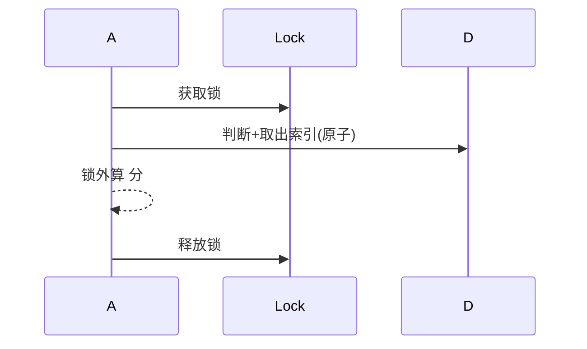
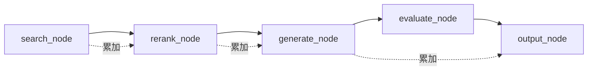

# 错误处理与透传

> 电梯陈述：「分两层做了系统的韧性——底座层把重试、并发安全、超时全覆盖补齐（统一错误分类、RetryBudget、BM25 锁、Chroma 懒重连）；上层利用 LangGraph  新增 `tool_errors` 累加字段，让  感知检索工具的局部失败，实现『能答多少答多少』的部分降级，API 带回 `degraded` 标记。」

## 一、背景

系统有几个根深蒂固的隐患：外部  挂了直接 500、并发一上来  索引读到半截、重试没有预算控制、retry 只支持  不支持同步。同时，即使检索工具局部失败（某路向量库超时），整条问答链路也直接崩溃，用户连一句"对不起"都收不到。这两层问题决定了系统的脆弱性天花板。

## 二、底座：错误分类与重试安全

### 2.1  索引并发读竞态

`_keyword_search` 只在加载索引那一段拿了 `asyncio.Lock()`，真正读 `_bm25_indexes.get(resume_id)` 时锁已释放。高并发下，另一协程 `clear_resume_vectors` 可能正在 pop，这边就读到 None。

**解决**：把锁的临界区扩展到"判断在不在 + 取出来用"的全过程，取完立刻释放，真正算  分在锁外。



### 2.2  原地修改副作用

原函数直接 `chunks.sort(...)` 并对每个  原地写 `rerank_score`。若同一列表被多处复用（先做拒答判断再做生成答案），第一次排序和打分污染第二次输入。

**解决**：用 `sorted(scored, ...)` 返回新列表，分数写到新  上。函数无副作用，调用方用返回值。

### 2.3 缓存与删除的锁

`get_embedding` 缓存读写加锁；`clear_resume_vectors` 的 `pop` 挪到 `_bm25_lock` 保护下。

### 2.4 with_retry 支持同步

内部判断  是不是 coroutine function，分别 `await` 或直接调用，async/sync 通吃。

### 2.5 超时全覆盖 +  懒重连

`AsyncOpenAI` 客户端和  的 `httpx.AsyncClient` 显式传 `httpx.Timeout(30, connect=10)`。`get_chroma_client` 调用时抛异常则丢弃旧  重建。

## 三、上层：错误透传与部分降级

第一层做好了异常分类底座，第二层在其上做了「透传」——把失败本身变成下游能消费的信号。

### 3.1  新增 `tool_errors`

在 `AgenticRAGState` 加 `tool_errors: list[dict]`，每个元素带 `tool`/`query`/`error` 三个维度。累加语义——各节点  不覆盖。

### 3.2 Search/Rerank 节点吞异常记日志

```python
tool_errors = list(state.get("tool_errors", []))
for q in queries_to_search:
    try:
        chunks = await hybrid_search(resume_id, q, top_k)
    except Exception as exc:
        tool_errors.append({"tool": "hybrid_search", "query": q, "error": str(exc)[:300]})
        continue
```

 同理——失败则 tool_errors.append 并降级为原文顺序。



### 3.3  条件注入降级

无失败时  完全不变；有失败时追加：
```text
【检索降级提示】以下工具调用失败：1. hybrid_search（查询：xxx）
请基于已有简历内容回答，若问题涉及缺失信息请明确说明，不要编造。
```

### 3.4  返回 `degraded` 标记

```python
class AnswerResponse(BaseModel):
    degraded: bool = False
```

`/ask` 走  图后 `degraded = bool(tool_errors)`，前端据此可提示用户。

## 四、关键决策与取舍

| 决策 | 选择 | 取舍 |
|------|------|------|
| 锁粒度 | `asyncio.Lock` 包临界区 | 改动最小，单机够用 |
|  纯度 | 返回新列表 | 零回归，防污染 |
| 重试控制 | RetryBudget | 防重试风暴 |
| tool_errors | `list[dict]` 累加 | 信息更全，下游多写几行 |
| 降级 prompt | 条件注入 | 无失败时零回归 |
| `/ask` 改为走  图 | 功能升级+携带降级信号 |  与编排耦合 |

## 五、踩坑

1. **测试本身有 bug**：某个测试用 `inspect.getsource` 做字符串检测，逻辑恒为真。启示：测试也不一定是金科玉律。
2. **注释触发误判**：加了注释含 `chunks.sort`，被测试字符串检测命中。启示：写给测试看的代码，连注释都要干净。
3. **永远不抛异常的陷阱**：`rag_service.rerank` 把异常吞成 fallback，必须在节点层再 try/except 才能观测到。
4. **同步方法用 `await`**：测试函数写成 `def` 却 `await`，SyntaxError。

## 六、Q&A

**Q：`asyncio.Lock` 够吗？** — 项目全是  协程，用协程级锁不阻塞事件循环。`threading.Lock` 在  里反而可能死锁。

**Q：重试预算怎么定？** — 按下游  估算，配合指数退避+抖动。

**Q：为什么不靠重试解决一切？** — 重试救不回"这路本就无结果/工具不可用"，透传的价值是失败也有用。

**Q：LLM 会无视降级说明吗？** — 降级是软约束，但答案仍只基于真实 chunk，模型没有外部知识注入通道。


> ▶ 关联技术研读：[[01_技术研读/06_韧性工程|06_韧性工程]]
