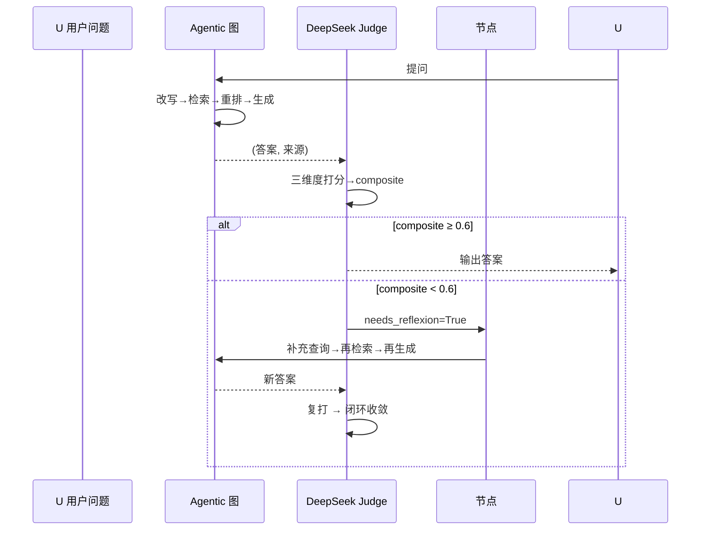

# 评估框架升级

> 电梯陈述（一句话能背）：给简历问答系统接了一套「独立裁判」——用  当评委，按完整性40%/准确性40%/来源可信度20% 给每条答案打三维度分，综合分低于 0.6 就打回  自纠正闭环，并用一份覆盖  个简历维度的黄金数据集把评估标准化，让  调优有了可信基线。

## 一、背景（为什么要做这个）

这个  简历分析系统，之前评估答案好坏基本是「自己答、自己改卷」：用业务  模型生成答案，又用同一个模型去打分。问题是模型天然会偏爱自己的输出，分数虚高、不可信。

到了阶段  要做  参数调优、阶段  要出评估报告，没有一个**中立、可复现**的评估口径，调优就是在盲调。所以阶段  的核心目标就三个：

1. **换一个独立的裁判模型**来打分，消除同模型自评偏差；
2. **建立三维度评分口径**（完整性/准确性/来源可信度），而不是笼统一个分；
3. **攒一份黄金评测集**（`golden_set.json`），把「什么叫答得好」固化成数据。

更重要的是，阶段  和阶段 11（代码重构）是并行波，新建的文件不能因为对方在改 `graph.py` 就  崩掉——这是这次最容易被忽略的并发坑。

## 三、逐个讲：问题 → 怎么想 → 怎么解（配 Mermaid）

### 答题与打分必须用两套模型

**问题是什么**：原系统 `rag_tuning/evaluate.py` 里的 `judge_answer` 直接 `from services.rag_service import llm_generate`，也就是用业务  给自己打分。

**怎么分析的**：类比考试——如果让出卷老师同时批改自己的卷子，分数必然松。LLM-as-Judge 的研究结论也是：同家族/同模型当裁判会有显著正向偏差。要让分可信，裁判必须和选手「不同源」。

**最终怎么解的**：新增 `rag_tuning/judge_client.py`，基于 DeepSeek（ 兼容协议，`AsyncOpenAI`）独立实现 `judge()`，配置全部来自 `core/config.py` 里新增的 `JUDGE_*`（`JUDGE_API_KEY / JUDGE_BASE_URL / JUDGE_MODEL / JUDGE_TEMPERATURE / JUDGE_ENABLED`）。业务  的 `CHAT_*` **一个字没动**。

```mermaid
flowchart LR
     生成侧[生成角色 - 业务 Chat]
        Q[用户问题] --> G[agentic_rag_graph<br/>Xiaomi MiMo]
        G --> A[系统答案 + 来源]
    end
     裁判侧[裁判角色 - 独立 Judge]
        A --> J[judge_client.judge<br/>DeepSeek]
        R[标准参考答案] --> J
        S[检索来源片段] --> J
        J --> T[三维度分 + 理由]
    end
     生成侧 fill:#e8f0fe
     裁判侧 fill:#fde7e9
```

两个角色分属两个模块、两套密钥，**物理隔离**，从根上消除自偏好。

### P2 + P4：三维度评分 +  闭环

**问题是什么**：原来只有 0/1/2 总分，答得「不全」和答得「有错」被混为一谈；而且低分答案没有任何自动处置。

**怎么分析的**：简历问答的「坏」至少有三种形态，必须拆开看——
- **完整性**：关键信息点漏了没（漏答）；
- **准确性**：陈述和事实一致吗（答错/编造）；
- **来源可信度**：答案能不能在检索到的简历片段里找到依据（凭空捏造最恶劣）。

权重怎么定？完整性和准确性直接决定答案「对不对、全不全」，是核心，各给 0.4；来源可信度是「防幻觉」的保险杠，给 0.2。这就是 MEMORY.md 里约定的权威口径 `0.4/0.4/0.2`。

**最终怎么解的**：`judge()` 返回 `JudgeResult{completeness, accuracy, source_credibility, rationale}`，`composite = 0.4*完整性 + 0.4*准确性 + 0.2*来源可信度`。`composite < 0.6` → `needs_reflexion=True`。这个 0.6 阈值正好对上 `graph.py` 里 `SELF_REFLECTION_NODE` 的触发条件——评估分数低，图就自动走补充检索+重写，形成闭环。



> 生活化类比：`composite` 像期末总评，平时分（完整性）和考试分（准确性）各占 40%，考勤（来源可信度）占 20%；总评不及格（<0.6）就进「补考」环节，不是直接判死。

### 黄金数据集怎么设计

**问题是什么**：没有标准集，调优前后没法比，分数也没有「标尺」。

**怎么分析的**：简历问答要覆盖不同维度才不被「偏科」骗分。按  建议设计了  份不同方向候选人（后端/前端/数据/SRE/AI），并在 `golden_set.json` 里用 `resumes{}` + `qa[]` 两段式结构，每条 `qa` 带 `id / resume_id / category / question / reference_answer / expected_source_keywords`。`expected_source_keywords` 专门喂给  校验「来源可信度」用。

**最终怎么解的**：产出 **条**评测项，覆盖 **个维度**：education(教育) / work(工作经历) / skills(技能) / projects(项目) / certificate(证书) / rejection(拒答) / comparison(比较) / reasoning(推理)。其中  类明确标 `should_answer=false`，专门验证「简历没提的问题要拒答而非编造」。校验函数 `validate_golden_set()` 强制：条目 ≥10、字段齐全、resume_id 都能对上、`category` 覆盖 ≥4 维。

### 图导入必须懒加载

**问题是什么**：阶段  正在把 `mcp_graph` 合并进 `services/agentic_rag/graph.py`。如果模块顶层就 `from ...graph import create_agentic_rag_graph`，对方一改文件、该  就可能在并行期崩，CI 互炸。

**怎么分析的**：评估器真正需要图，只有在「跑真实  管线」时才需要。导入时机应该推迟到调用点，而不是模块加载期。

**最终怎么解的**：`evaluate_judge.py` 顶层**不 import** 任何 `services.agentic_rag` 的东西；图的导入只在 `_run_graph()` 函数体内：`from services.agentic_rag.graph import create_agentic_rag_graph`。并提供 `run_graph=False` 的离线模式（用预置 answer），测试根本不碰图。还专门写了测试 `test_evaluate_module_does_not_import_graph_at_top_level` 锁死这个约束。

### 测试绝不真调 DeepSeek

**问题是什么**：评估逻辑要测，但真实调  会泄露 `JUDGE_API_KEY`、还要联网，CI 跑不了。

**怎么分析的**：把「真实  调用」和「打分逻辑」切开——前者抽成 `_call_deepseek()`（可 monkeypatch），后者 `_parse_judge_response()` 是纯函数。测试只需替换最薄的那层。

**最终怎么解的**：`test_stage7_evaluation.py` 里用 `monkeypatch.setattr(judge_client, "_call_deepseek", fake_call)` 返回假 JSON，验证真实解析路径；单条评估 `evaluate_entry()` 支持注入 `judge_fn`，直接传 fake  验证  与  标记。整套 **个测试全绿，零网络、零密钥**。

## 四、关键决策与取舍

- **独立模型而非复用 Chat**：取舍是「多一套密钥/多一笔调用成本」换「评估中立可信」。判断这是本阶段的命根子，坚决隔离。即使  偶发不稳定，只在 `JUDGE_FALLBACK_TO_CHAT` 显式开启时才回退到 MiMo——**默认关**，因为回退会让偏差回归。
- **三维度权重 0.4/0.4/0.2**：把「来源可信度」压到 0.2 是因为它更像「防幻觉的兜底信号」，不像前两者直接决定答案对错。这个口径记在 MEMORY.md，全项目统一。
- **新建模块而非覆盖旧 `evaluate.py`**：仓库里已有一份阶段  要用的 `rag_tuning/evaluate.py`（Phase1-6 调优框架）。**严格遵守「只新增 rag_tuning/」**，把阶段  评估器命名为 `evaluate_judge.py`，**绝不覆盖**调优框架，避免破坏阶段 12。这是和计划书「修改 evaluate.py」措辞的偏差，下面「待决策」里已标注。
- **`JUDGE_ENABLED` 默认 False**：未配置密钥时直接报错而非静默跑偏，fail-fast 更安全；真实评估需显式开启。

## 五、踩坑（值得讲的故事）

1. **算术坑**：三维度加权手算写错——`0.4*0.9 + 0.4*0.8 + 0.2*0.7` 一度写成 0.86，实际是 **0.82**。测试一跑就暴露，说明把加权逻辑抽成纯函数 `compute_composite()` 并参数化测试非常值。
2. **误伤  检查**：写的「图不在顶层 import」测试，初版用字符串包含判断，结果被模块  里「`from services.agentic_rag.graph import ...`」这句说明文字误判为真的 import。改成「只匹配以该串开头的真实  语句行」才通过——教训：用 AST/行首特征判断  比全文子串稳。
3. **离线模式忘了 async**：`_local_heuristic_judge` 初版是同步函数，但 `evaluate_entry` 里 `await judge_fn(...)`，跑 `--fake-judge` 直接 `'JudgeResult' object can't be awaited`。统一成  解决。
4. **`re` 未导入**：离线启发式用到 `re.split` 但文件没 `import re`，冒烟才报 `NameError`。补  即好——提醒自己：新增函数用到标准库先确认 import。

## 六、常见疑问

**Q1：为什么不直接用 RAGAS / 现成评估框架？**
A：RAGAS 偏通用  且依赖自己的  调用约定，而已有  图里内生的 eval/reflection 节点，需要把「外部裁判分」和「图内自评分」对齐全（都走 0.6 阈值）。自建轻量客户端能精确对齐三维度口径和  闭环，也更好 mock、零额外重依赖（复用已有  库）。

**Q2：三维度权重 0.4/0.4/0.2 怎么来的，凭什么？**
A：来自项目  里的权威评分口径。理由：完整性+准确性直接决定「答案对不对、全不全」，是评估主干，各 0.4；来源可信度是「防幻觉」的校验信号（答案能否对应检索来源），作为兜底保险 0.2。权重集中放在 `WEIGHTS` 常量，改口径只动一处。

**Q3：DeepSeek 和  用同一家  协议，为什么还要分两套密钥？**
A：分密钥是为了「角色可独立管理+可独立限流+故障隔离」。即便协议相同，配置分离让  的启用/降级完全不干扰业务问答；而且  偶尔不稳时可单独走 `JUDGE_FALLBACK_TO_CHAT` 回退，而业务  永远在线。

**Q4：composite < 0.6 就 Reflexion，这个阈值拍脑袋吗？会不会误杀？**
A：0.6 是和图内 `SELF_REFLECTION_NODE` 对齐的约定阈值，保证评估与生成共用同一道闸。误杀风险靠「Reflexion 最多  轮 + 补充检索」收敛，且评估是离线批处理、不影响线上实时问答，阈值偏保守只会让更多样本进自纠正、提升最终质量，代价是评估耗时略增。

**Q5：黄金集只有  条，样本够吗？会不会过拟合？**
A：15 条覆盖  维度是为了先立基线、可快速迭代；计划书目标是拆成 tuning_set(~120)+eval_set(~55)。刻意把 `validate_golden_set` 的覆盖约束写死（≥10 条、维度 ≥4），后续扩量只要往 `qa[]` 里加项即可，结构不用改，也不会过拟合——因为评估集和调优集是分开维护的。

**Q6：测试怎么保证没偷偷调了 DeepSeek？**
A：两层保险——①真实调用被抽成 `_call_deepseek`，测试只 `monkeypatch` 它返回假 JSON；②单条评估支持注入 `judge_fn`，直接传 fake。而且 `JUDGE_ENABLED` 默认 False，即便误调也会先报错而非发请求。CI 里  个测试零网络。


> ▶ 关联技术研读：[[01_技术研读/07_参数调优框架|07_参数调优框架]]
