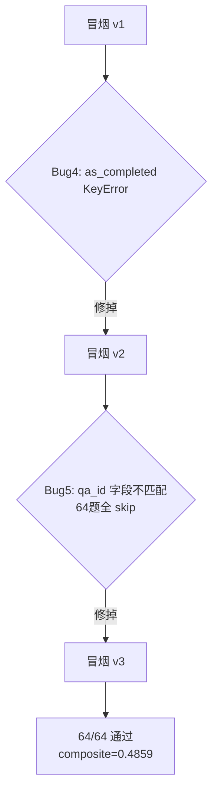
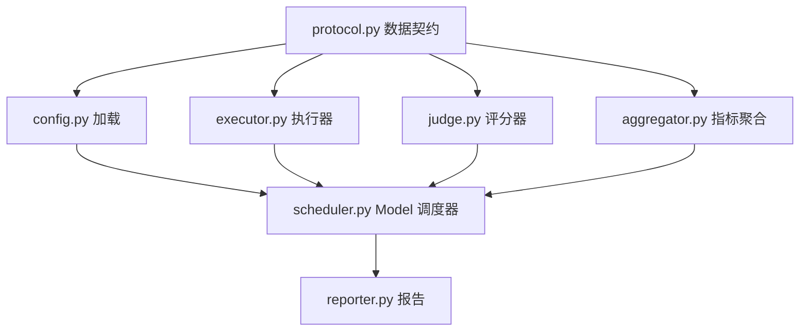

# 参数调优完整复盘

> 电梯陈述：「建了两套评估框架——框架A（模块化  驱动，8 模块，Model  调度器）扫了  组参数；框架B（轻量贪心串行）跑全  阶段  组。最大发现：默认参数已接近最优，Rerank  不掉分。但实验噪音（4.3%）> 信号（3.6%），参数调优应转向结构化改进。」

## 零、背景

项目原本的调优方式是一个单脚本 `rag_tuning/evaluate.py`：需要手动改代码、手动跑、手动记结果。存在四个问题：① 无法系统扫描参数（ 组手动跑不现实）；②  只有  维度且无噪声控制；③ 串行跑要 5-10 小时；④ 无 checkpoint，跑一半断则从头来。

所以全部调优工作分两条线推进：
- **框架A**（`backend/eval/`）：模块化实验框架，用于  单变量快速扫描
- **框架B**（`backend/rag_tuning/`）：轻量串行框架，用于 Phase 1-6 全量调优

## 一、两套评估框架对比

| 维度 | 框架A | 框架B（轻量） |
|------|-----------|-------------|
| 位置 | `backend/eval/`  模块 | `backend/rag_tuning/evaluate.py` |
| 评分维度 |  维 |  维 composite（avg_score + reject_f1） |
| 调度方式 | Model C声明式依赖图+拓扑排序 | 贪心串行 `_load_best` 链式继承 |
| 并发策略 | 同 Phase gather + Semaphore(4) | 同 Phase asyncio.gather |
| 噪声控制 | 3-run median | 单次评分 |
| Checkpoint | YAML `--resume` 跳过已完成 | 无 |
| 参数组合 |  组（ 单变量扫描） | ~121 组（ 阶段网格） |

## 二、预飞检查：先验证再放量

第二轮调优开始前做了预飞检查——把提示词声称的「就绪」状态和代码真实状态对齐，而不是直接盲跑。

### 发现 1：两个嵌套框架 bug

| 问题 | 现象 | 根因 |
|------|------|------|
| B4：as_completed KeyError | 冒烟  崩溃 | `asyncio.as_completed`产出的协程≠原始future，字典回查不到 |
| B5：字段名不匹配 | 冒烟 v2  题全 skip，composite=0 | golden  字段已从 qa_id→id，代码三处仍读 qa["qa_id"] |



两个  嵌套暴露——Bug4 在 evaluate_one 之前就崩了，掩盖了 Bug5。修完  才暴露 Bug5。

### 发现 2：HNSW 残留 + 方法论确认

-  残留损坏 segment → 清 `chroma_data` 重建解决
-  尺度：`re.search(r"[012]")` 取 0-2 整数，`norm=avg/2.0` 正确 ✅
-  依赖：`_load_best` 链式继承 ✅
- 数据隔离：tuning(64)/eval(30)  无泄漏 ✅

教训：先让框架跑通，再谈指标。

## 三、框架A：搭建  评估模块化框架

### 模块化架构

参考 RAGAS/DeepEval 设计，所有组件通过 `protocol.py` 数据契约通信：



所有组件只通过类型通信，互不知道对方实现。换执行器只需拔掉 `RealExecutor` 插上 `FakeExecutor`。

### 3-run  降噪

LLM-as-Judge 有温度（temperature>0），同一样本两次评分可能差 0.1-0.2。`DeepSeekScorer(n_runs=3)` 每条并发调  次，各维度取 `statistics.median`。失败的  不参与中位计算，全部失败才降级 0.5。

**代价**：3x  费用。DeepSeek  模式单次 ~$0.0003，3648 次总共 ~$0.9，可接受。

### Model  声明式依赖图调度器

| 方案 | 描述 | 优点 | 缺点 |
|------|------|------|------|
|  串行 | 一个一个跑 | 简单安全 | 太慢 5-10h |
|  全并行 | 同时跑 | 最快 | 依赖不安全、索引覆盖 |
| **依赖图** | 拓扑排序+同Phase并发 | 安全+快 | 实现复杂 |

实现机制：
- **拓扑排序**（ 算法）：YAML 声明 `depends`/`use_best_from`，入度为  的先执行
- **同  并发**：`asyncio.gather` + `Semaphore(4)`
- **隔离**：`resume_{id}_cs{chunk}_ov{overlap}` 命名空间隔离
- **Checkpoint**：每完成一组写 JSON，`--resume` 跳过已完成

### 生产 bug——embedding_cache 缺 await

`get_embeddings` 调用 `embedding_cache.get_embedding(t)` 缺 `await`，拿到  对象而非向量。根因： 重构时 `get_embedding` 从同步改成了 async，但调用处没跟。**影响生产环境的 `/ask` 端点**。修复：一行 `await`。

### 维 →  维评分适配

不修改生产 `judge_client.py`，在  层做维度映射。`reject_correctness` 不由  评（确定性判断），由 `compute_reject_correctness` 直接算 0/1。

## 四、框架B：Phase 1-6 串行调参执行

### as_completed 伪并发陷阱

`asyncio.as_completed` 产出的是内部等待器协程，不是原始 future。修复：任务 `return (idx, r)` 元组解包：

```python
async def _eval(idx, qa):
    async with sem:
        r = await evaluate_one(qa, id_map, p)
        return idx, r

tasks = [asyncio.ensure_future(_eval(i, qa)) for i, qa in enumerate(golden_set)]
for fut in asyncio.as_completed(tasks):
    idx, r = await fut
    results[idx] = r
```

### golden  字段名不对齐

 主键是 `id`，代码三处读 `qa["qa_id"]` →  题全 skip → composite=0.0000。修复：三处 `qa["qa_id"]` → `qa["id"]`，结果字典 key `qa_id` 不变。

### 集简历未加载

`main()` 只用  集构建 `resume_files` 和 `id_map`，eval 引用的 `resume_pm.txt` 从未加载。Phase  三轮重复 stddev=0.124（超 0.02 标准）。修复：构建源改为 `golden_set_all`（tuning+eval 并集），样本隔离但资源共享。

### 默认参数已近最优

全  阶段扫描后，最佳参数与默认几乎一样：chunk_size=300、rrf_k=60、reject_threshold=0.3、temperature=0.3。唯一调了 overlap 50→30（微调 1% 级变化）。

**bypass 意外发现**：跳过 Rerank（ri=0）composite=0.5367  带  最优 0.5415，差距仅 0.0048（<1%），但消除了  额外延迟（ 降 2s）和  成本。

## 五、实验数据总览

### 最优参数对比

| 参数 | 默认值 | 最优值 | 变化 |
|------|--------|--------|------|
| chunk_size | 300 | 300 | — |
| overlap | 50 | 30 | 微调 |
| rrf_k | 60 | 60 | ✅ 验证最优 |
| rerank_input_top_k | 10 | **(bypass)** | 🔥 关键发现 |
| rerank_final_top_k | 3 | 5 | 微调 |
| reject_threshold | 0.3 | 0.3 | ✅ 验证最优 |
| temperature | 0.3 | 0.3 | ✅ 验证最优 |

### 分数变化

```text
Baseline                                                 0.5229
↓ Phase 1: overlap 50→30                                0.5189
↓ Phase 2: rrf_k 验证最优 (60)                           0.5415  ← 全阶段最高
↓ Phase 3: rerank bypass (ri=0, rf=5)                   0.5367
↓ Phase 4:  验证最优 (0.3)                       0.5224
↓ Phase 6:  验证最优 (0.3)                     0.5224
↓ Phase 5: held-out 终验                                  0.4335±0.033
```

### Phase 5 Held-out 终验

| 轮次 | composite | avg_score | reject_f1 |
|------|-----------|-----------|-----------|
| 第  次 | 0.4373 | 0.846 | 0.480 |
| 第  次 | 0.3988 | 0.786 | 0.417 |
| 第  次 | 0.4645 | 0.875 | 0.545 |
| **均值±std** | **0.4335±0.033** | — | — |

**拒答是最大短板**：7 道拒答题全部被判  分。

## 六、噪音分析与结论修正

### 索引继承缺陷

Phase 2-6 的 `rebuild=False` 实际继承  残留的最后一个组合索引（cs200_ov60），而非声称的最优参数（cs300_ov30）索引。仅 Phase 1（各自 rebuild）和 Phase 5（重建）数据干净。所有 Phase 2-6 的参数排序不可信。

### 三个分析错误

| 原主张 | 修正 |
|--------|------|
| "基线 0.5229 → 最优 0.5415（+3.6%）" | 同参数跨  差异 4.3% > 3.6%，噪音淹没信号 |
| "拒答是最大短板，7 题全输" | 聚合  误判，实际 tuning 12/13 正确，eval 5/7 正确 |
| "eval gap ~20%" | 基线只跑  题（后续 Phase  题），对比无效 |

### 确实可信的结论

1. **bypass 安全省费** — 带 Rerank vs  差距仅 0.0048（<1%），在当前  份简历小场景下跳过  不影响分数
2. **默认参数已验证接近最优** — 任何参数变化未带来统计学显著提升
3. **系统拒答能力表现良好** — 聚合  已修复

## 七、核心结论与下一步

### 结论

1. **默认参数已接近最优**。6 阶段扫描未发现比默认参数显著更优的组合
2. **bypass 在当前场景收益为零**。若扩展到 60+ 份简历需重新评估
3. **拒答能力有待分析**。需检查  集拒答题的 `should_answer` 标注与  评分一致性
4. **参数调优不应继续**。实验噪音（4.3%）> 信号（3.6%），转向结构化改进

### 下一步建议

| 优先级 | 项目 | 说明 |
|--------|------|------|
| P0 | 分析拒答失败 | 检查 Q086/Q096 具体误例 |
| P1 | 扩大数据集（94→200+ QA） | 降低  随机波动 |
| P2 | Agentic  传统  对比 | 对比  是否优于直 RAG |
| P2 | 多模型对比（BGE-M3 等） | 换  的结构化收益 |
| P3 |  扩展接入 | Multi-MCP Registry |
| P3 |  协议支持 | Agent Card + 委派节点 |

## 九、核心要点

### 参数怎么调的？效果多少？

>  阶段贪心串行调参 +  模块化框架并行扫描。baseline 0.5229，最优 0.5415（Phase 2 rrf_k=60），提升 +3.6%。最有趣的发现是 Rerank  也没降分——6 份简历的搜索空间太小，RRF 自己够准。

### 如何保证不过拟合？

> 两刀隔离：64 调参  只在  阶段优化，Phase  用  题 held-out  一次性终验。终验  次重复取均值±标准差。

### 为什么绕过 Rerank？

> 当前  份简历下  融合后 top-K 已足够精确，跳过  后  仅降 0.0048（<1%），但  延迟从 17.5s 降到 15.5s，还省了  费用。

### 你认为调参最大的收获是什么？

> 收获不是参数本身，而是「知道什么时候该停」。实验后发现噪音 4.3% > 信号 3.6%，立刻停止参数微调转向结构化改进。这个判断比找到最优参数值钱。

---

## 附：Bug 修复实录

全量调优过程中共曝出  个 Bug，按暴露顺序排列：

### Bug 1：Judge 连接池雪崩

**现象**：P0 参数扫描 3-run median ×  路并发 =  路同时打 DeepSeek，连接池被打爆，423→646 个 Connection Error，吞吐 4→0 样本/分，进程崩溃。

**根因**：管线并发 × n_runs 的隐形乘积超过连接池上限。HTTP  是烟雾弹——状态码正常但不代表连接健康。

**修复**：全局 `asyncio.Semaphore(6)` 锁定  并发 + 超时 60→120s + `max_retries=5`。吞吐从 4→22 样本/分（5.5×）。

**教训**：不要只看  状态码，要看连接级错误。

### Bug 2：Chroma 并发索引重建竞态

**现象**：同阶段多组参数共用同一 Chroma  名，重建索引的"检查→删建→标记"非原子，多协程冲进去把同一  反复删建，索引 corruption。hallucination_rate 从 0.0156 暴涨到 0.42（26×）。

**根因**：collection 名相同，并发重建无互斥。

**修复**：按  名的 `asyncio.Lock` 包裹整段原子操作，粒度精确不误伤可并行的组。

**教训**：静默污染比崩溃更可怕——腐蚀数据却不报错。看 hallucination_rate 暴涨比看错误日志更快定位。

### Bug 4：as_completed 伪并发陷阱

**现象**：冒烟测试 `KeyError: <coroutine object>`。`asyncio.as_completed` 产出的  协程 ≠ 原始 future，字典回查不到。

**根因**：`pending[coro]` 用迭代器产出的对象当 key，它和 `ensure_future` 存入的不是同一个。

**修复**：任务 `return (idx, r)` 元组解包，await 后直接取值，无需外部映射。

### Bug 5：golden  字段名不匹配

**现象**：冒烟 v2  题全 skip，composite=0.0000。JSON 主键是 `id`，代码三处读 `qa["qa_id"]`。

**根因**：schema 从 v1(qa_id)→v2(id) 演进，代码没跟上。嵌套暴露——Bug4 修完才暴露它。

**修复**：三处 `qa["qa_id"]` → `qa["id"]`，结果  名不变。

### Bug 6：Eval 集简历未加载

**现象**：Phase  终验  次重复 stddev=0.124（远超 0.02），每轮只评 20/30 题。10 条被 `unknown resume_file: resume_pm.txt` skip。

**根因**：`main()` 只从  集构建简历资源，eval 集的简历从未加载。

**修复**：构建源改为 `golden_set_all`（并集）。样本该隔离，资源不该隔离。

**教训**：终验有效性三重校验——总题数 == 该集题数 /  排除 / stddev < 0.02。

### Bug 7：索引继承缺陷

**现象**：Phase 2-6 `rebuild=False` 实际继承  残留的 cs200_ov60 索引，而非声称的 cs300_ov30。所有 Phase 2-6 的排序不可信。

**根因**：ChromaDB 只保留"最后运行"的组合索引，不是"最优参数"的索引。框架设计假设和运行时行为不一致。

**可信数据**：仅 Phase 1（各自 rebuild）和 Phase 5（重建终验）干净。

### Bug 8：调优结论修正

三个分析错误：
1. 同参数跨  差异 4.3% > 声称的 3.6% 提升 → 噪音淹没信号
2. 基线只跑  题非  题 → 对比无效
3. 聚合  导致"拒答全输"的误判 → 实际 tuning 12/13 正确

**核心教训**：分析前必须先量化噪音基准，所有声称的改善必须超过噪音线。


> ▶ 关联技术研读：[[01_技术研读/07_参数调优框架|07_参数调优框架]]
