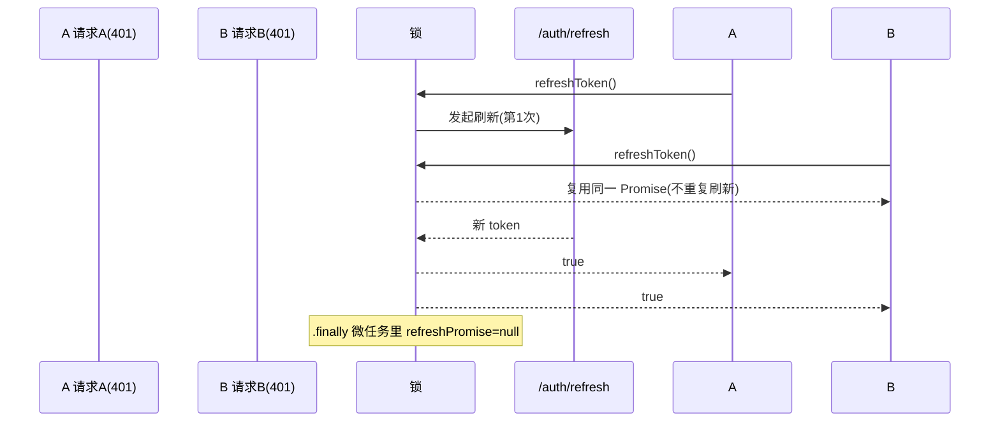
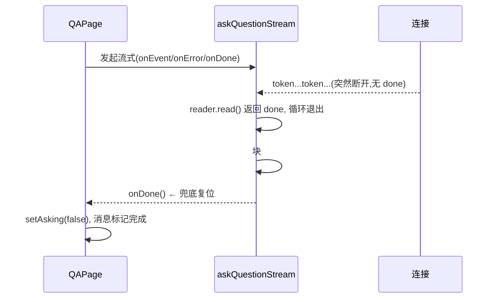
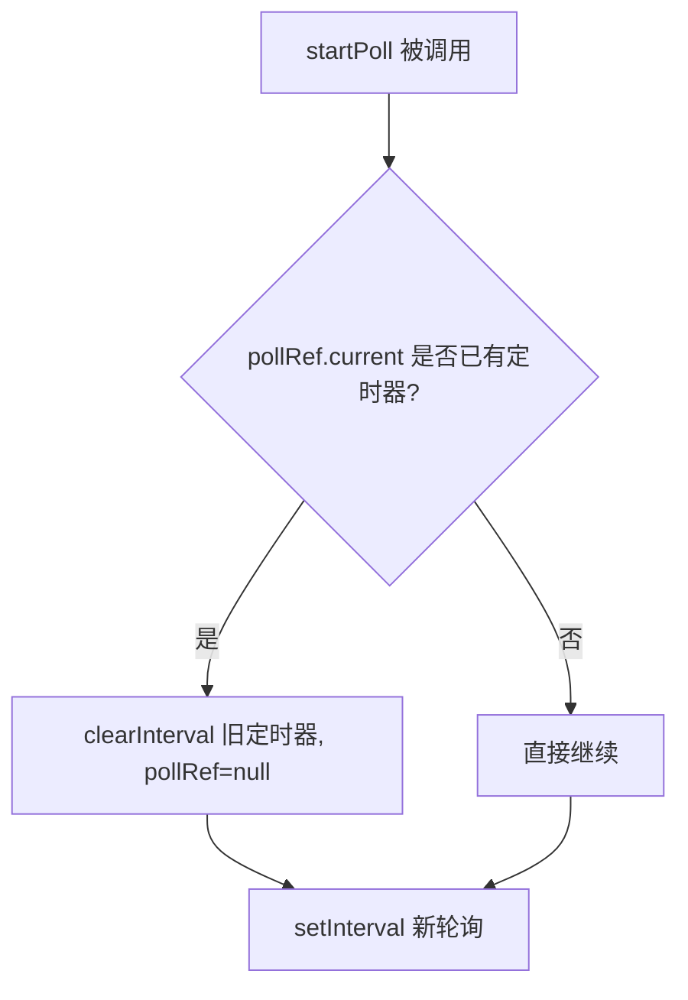
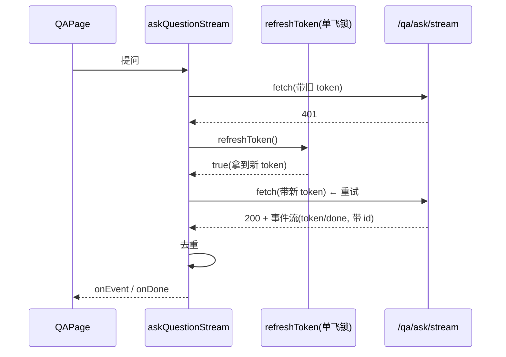

# 前端关键  修复

> 电梯陈述（一句话能背）：「修了  类前端稳定性 Bug（ 刷新竞态、SSE 流式中止卡死、轮询定时器泄漏、JWT 解码崩溃、流式鉴权与事件去重），全部用 TDD红绿闭环，14 个测试全绿、vite  通过；过程中测试还意外逼出单飞锁的一个真实释放 bug。」

## 一、背景（为什么要做这个）

这个  简历分析系统，前端是 React 19 + TypeScript + Tailwind（`frontend/`），后端 FastAPI。前期阶段已经把后端错误处理和  架构打牢，但前端还有一批**直接卡用户脖子的 Critical/High 级 Bug** 没人收口：

- 用户开着页面，token 过期后多点几下就整个被踢登；
- 问  一个问题，网络抖一下，输入框就永远卡在"发送中"点不了；
- 连着上传几份简历，旧的处理中状态永远不刷新；
- 后端偶尔下发一段不合规 token，前端直接白屏；
- 流式回答碰上  直接失败、且重连可能把同一段答案重复拼接。

这些都不是"新功能"，而是**让已有功能在边界条件下不崩**。 只动前端文件，和后端零冲突，是并行波里独立、安全、可立即交付的一块。

## 三、逐个讲：问题 → 怎么想 → 怎么解（配 Mermaid）

### 1)  刷新竞态

**问题是什么**：页面加载时经常并发发多个请求（列表、历史、用户信息等）。一旦 access_token 过期，这些请求**同时**拿到 401，于是每个都去调 `/auth/refresh`。如果后端启用了 **refresh_token 轮转**（每次刷新都作废旧 refresh_token、发新的），那么：

- 请求  用旧 refresh_token 刷新成功，`refresh_token` 被轮转为 R'；
- 请求  用**同一个旧 refresh_token** 再去刷新 → 后端判定  已作废 → 刷新失败 → 用户被踢登。

哪怕后端不轮转，多次刷新也是浪费，且各请求拿到的 `access_token` 互相覆盖，时序混乱。

**怎么想的**：这本质是**并发重复执行同一副作用**的经典问题。生活化类比：一栋楼电梯坏了，10 个人同时打电话叫维修，结果  个维修工同时出发——既浪费，又可能因为"先到的人已经修好、后到的人发现门锁已换"而互相打架。正确做法是：**第一个人打电话，其余  个人等他的结果**。这就是"单飞"：同一时刻只允许一个刷新在飞，其余并发调用**复用同一个 Promise**。

**怎么解的**：在 `client.ts` 用模块级 `refreshPromise` 做锁。难点在于"释放锁"的时机——第一版写 `refreshToken = (async()=>{...})()` 并在 `finally` 里 `refreshPromise=null`，结果测试发现**锁永远不释放**（详见第五节踩坑）。最终用 `.finally()` 微任务模式：

```ts
let refreshPromise: Promise<boolean> | null = null;

async function doRefresh(): Promise<boolean> {
  const token = localStorage.getItem("refresh_token");
  if (!token) return false;
  try {
    const res = await fetch(`${BASE}/api/v1/auth/refresh`, { method: "POST", /* ... */ });
    if (!res.ok) return false;
    const data = await res.json();
    localStorage.setItem("access_token", data.access_token);
    localStorage.setItem("refresh_token", data.refresh_token);
    return true;
  } catch { return false; }
}

export function refreshToken(): Promise<boolean> {
  if (!refreshPromise) {
    refreshPromise = doRefresh().finally(() => { refreshPromise = null; });
  }
  return refreshPromise;
}
```

并把它导出给 `qa.ts` 的流式刷新复用，保证**普通请求和流式请求共享同一把锁**。



---

### 2)  异常断开卡死 → `finally` 兜底 `setAsking(false)`

**问题是什么**：`QAPage` 里有个 `asking` 状态控制"发送/取消"按钮和输入框禁用。正常流程是流结束后端发 `done` 事件 → 页面 `setAsking(false)`。但如果**网络中途断了**（没收到 `done` 事件），`askQuestionStream` 的 `while` 循环因 `reader.read()` 返回 `done:true` 自然退出，却没有任何 `onEvent` 回调触发复位 → `asking` 永久为 `true` → 输入框永远禁用，用户只能刷新页面。

**怎么想的**：生活化类比：你点外卖，骑手  说"正在配送"就断网了，永远不弹"已送达"，于是你的门禁一直卡在"等外卖"状态出不去。要的是**不管有没有收到"已送达"，只要配送流程结束（无论是正常送达还是异常中断），门禁就解开**。

**怎么解的**：给 `askQuestionStream` 加一个 `onDone` 回调参数，放在 `try/catch` 的 `finally` 里调用（用户主动取消 `abort` 的情况除外，因为取消由调用方自己复位）。`QAPage` 传入的 `onDone` 负责 `setAsking(false)` 并把仍处于 `streaming` 的消息标记为完成。这样**无论流是正常结束、异常、还是断网缺 `done`，UI 状态一定被兜底复位**。



---

### 3) polling  泄漏 → 先 `clearInterval` 再启动

**问题是什么**：`ResumeListPage` 上传简历后是 `processing` 状态，要轮询 `/resumes/:id` 直到 `ready`。轮询句柄存在单个 `pollRef` 里。如果用户**连传两份简历**，第二份调用 `startPoll` 时直接 `pollRef.current = setInterval(...)` 把旧的句柄覆盖掉，而**旧定时器从没被 `clearInterval`** → 它永远在后台跑（泄漏），且第一份简历的状态再也不会被正确更新/显示。

**怎么想的**：生活化类比：你雇了两个闹钟叫你起床，结果第二个闹钟装上时把第一个的"关闭按钮"弄丢了——第一个闹钟  响，而且你其实只想要第二个。正确做法：**装新闹钟前，先关掉旧的**。

**怎么解的**：`startPoll` 开头先判断 `pollRef.current` 是否存在，存在就 `clearInterval` 置空，再 `setInterval`。最小改动、对症。



---

### 4)  解码崩溃 → `safeDecodeJwt` 兜底

**问题是什么**：`AuthContext` 启动和解码用户时直接 `JSON.parse(atob(token.split(".")[1]))`。若  不是标准三段式（少一段），`token.split(".")[1]` 是 `undefined`，`atob(undefined)` 抛 `InvalidCharacterError` 直接冒泡。启动处的 `try/catch` 能兜住，但 **`login` 函数里的同一段解码没有 `try/catch`** → 登录接口明明成功了，却因为前端解码崩了而白屏/未捕获异常。

**怎么想的**：解码一个可能来自网络/存储的字符串，和"解析用户上传的 Excel"一样，是**永远不能信任的外部输入**。类比：你拿钥匙去开锁，钥匙万一弯了，正确做法是"开不了就报个错让你换钥匙"，而不是让整扇门炸掉。

**怎么解的**：抽出一个纯函数 `safeDecodeJwt(token): JwtPayload | null`，任何异常（缺段、base64 非法、JSON 损坏）都返回 `null`，**绝不抛**。启动处和 `login` 处统一用它；`login` 解码失败时回退为"清除凭证并抛友好错误"，而不是让异常冒泡导致白屏。

---

### 5) 流式 401 刷新 + 事件去重

**问题是什么**：`client.request` 会自动处理  刷新重试，但**流式问答 `askQuestionStream` 没走 `request`**，自己直接 `fetch`。于是用户会话期 access_token 过期后点"提问"，SSE 端点直接 401 → 整个流式失败。

**问题是什么**：刷新/重连后，后端可能**重发同一事件**（例如同一段 `token`）。如果不去重，答案会被重复拼接成 "你好你好你好"。

**怎么想的**：普通请求有"自动续命"，流式请求也该有，否则用户会困惑"为什么普通接口没事、一聊天就掉线"。**两条通道共用同一把单飞锁**即可。
**怎么想的**：类比快递：同一个包裹被重复投递两次，你签收时应该只记一次，而不是堆两个一样的包裹在家。给每个事件加 `id`，见过的就跳过。

**怎么解的**：
- 在 `qa.ts` 里 `import { refreshToken, clearSessionAndRedirect } from "./client"`，流式遇 401 时先 `refreshToken()`，成功则带新 token 重试一次，失败则跳转登录页。
- 给 `SSEEvent` 增加可选 `id` 字段；抽出纯函数 `shouldSkipEvent(seen, event)`——后端没下发 `id` 就不去重（保持兼容），下发过则按 `id` 去重。状态用 `Set<string>` 维护在本次流生命周期内。



## 四、关键决策与取舍

1. **共享单飞锁而非各写各的**：`refreshToken` 从 `client.ts` 导出、被 `qa.ts` 复用。取舍：多了一次跨文件依赖，但保证普通请求和流式请求**不会各刷各的、互相打架**，也避免重复实现。
2. **`.finally()` 微任务释放锁  在 `try` 内手动置空**：最终选 `.finally()` 是因为它能在"同步早返回"和"异步返回"两种路径下**都正确释放**，详见踩坑。放弃"在每次  前手动置空"是怕漏（早返回路径多，容易漏写一处就泄漏）。
3. **用 `onDone` 兜底而非信任 `done` 事件**：取舍是 `onDone` 在 `done` 事件之后仍会跑一次（幂等，无副作用），换来"断网也必复位"的强保证。代价是回调多一个参数，但  向后兼容（可选参数）。
4. **只在有 `id` 时去重**：取舍是后端若没下发 `id` 就完全不去重，避免把"本来就是两条不同内容"的事件误杀。代价是老后端拿不到去重收益，但**绝不引入回归**。
5. **不引入新请求库/状态管理**：全部用最小改动（加参数、加 `try/catch`、加一行 `clearInterval`），不动组件结构、不引入第三方依赖，降低评审与回归风险。

## 五、踩坑（值得讲的故事）

**最值钱的一个坑：测试逼出了单飞锁的真实释放 bug。** 第一版把 `refreshToken` 写成：

```ts
refreshPromise = (async () => {
  try { /* ... */ }
  finally { refreshPromise = null; }
})();
return refreshPromise;
```

 写"连续两次刷新应发起两次请求"的用例时**死活红**：第二次永远返回第一次的陈旧结果、fetch 调用  次。追进去才明白——当 IIFE **同步**走到 `return`（比如"没有 refresh_token"的早返回，或测试里同步 resolve），`finally{refreshPromise=null}` 在**赋值语句求值期间**就执行了，紧接着 `refreshPromise = <那个 Promise>` 又把锁**覆盖回去**。结果锁永远清不掉，后续所有刷新都被短路。

这不止是测试问题，是**生产真实 bug**：一旦某次刷新走了同步早返回路径，锁就卡死，之后任何  都不会再真正刷新。修法是把清理挪到 `.finally()` **回调（微任务）**里——保证 `refreshPromise = p` 这个赋值先完成，锁稍后被清。一句话：**赋值的副作用顺序 vs  的执行时机，是单飞锁最容易写错的地方。**

另一个小坑：Vitest 在  下测试 `setInterval`/`clearInterval` 泄漏时，要 `vi.useFakeTimers()` + `vi.spyOn(global,'setInterval')`，并用 `act()` 包裹 `fireEvent.change` + `advanceTimersByTimeAsync`，否则  状态更新会报 `not wrapped in act(...)` 警告。

## 六、常见疑问

**Q1：单飞锁和"防抖/节流"有什么区别？**
A：完全不同。防抖是"等你不抖了再执行一次"，节流是"固定时间间隔最多执行一次"，它们都会**丢弃**一部分调用。单飞是"并发的相同调用**合并成一次真实执行**，其余调用拿到同一份结果"，一个都不丢。这里要的是"只刷新一次、但所有人都拿到新 token"，所以必须单飞。

**Q2：并发 401 全部复用同一个刷新 Promise，那刷新成功后，原来那几个请求怎么拿到新 token？**
A：每个请求在拿到 `refreshToken()` 的 `true` 后，都重新 `localStorage.getItem("access_token")` 读最新值，再用新 token 重试自己的原请求。锁只保证"刷新动作只做一次"，重试是各自做的，互不干扰。

**Q3：用 `finally` 调 `onDone`，那如果流正常收到 `done` 事件，`onDone` 再跑一次会不会出问题？**
A：不会。`done` 事件里已经 `setAsking(false)` 并写入 `sources`；`onDone` 只做"幂等的 `setAsking(false)` + 把仍 `streaming` 的消息标记完成"。重复执行是安全的。设计原则就是**兜底逻辑必须幂等**，这样正常路径和异常路径可以共存而不互相破坏。

**Q4：解码失败就清 token 并抛错，那用户不就登出了吗？**
A：先说前提：正常后端下发的是合规 JWT，解码失败是极端边界（存储被篡改、跨环境串 token）。比起"前端白屏崩溃"，**优雅降级为重新登录**是更可接受的结果。而且对"启动时发现过期 token"也是同一套逻辑：过期 → 清凭证 → 跳登录，体验一致。

**Q5：去重用的是 `Set`，流很长（成百上千个 token 事件）会不会内存涨？**
A：本次流生命周期内 `seenIds` 随组件/请求结束就回收，不是全局长存。即便万级事件，`Set` 内存也可忽略。如果未来真要无限流，可以改成"只保留最近 N 个 id 的滑动窗口"或按业务只给关键事件去重，目前没必要过度设计。

**Q6：你为什么给流式也加了  刷新，而不是让前端统一走 `client.request`？**
A：因为  是 `fetch` + `ReadableStream` 长连接，和 `request`（一次性 `json()`）的语义不同，强行统一会把流式读取逻辑塞进 `request`，反而复杂易错。更务实的是**复用同一个 `refreshToken` 原子能力**（共享锁），各自的请求骨架保持独立。这就是"复用能力、而非复用形状"。


> ▶ 关联技术研读：[[01_技术研读/01_架构概览|01_架构概览]]
