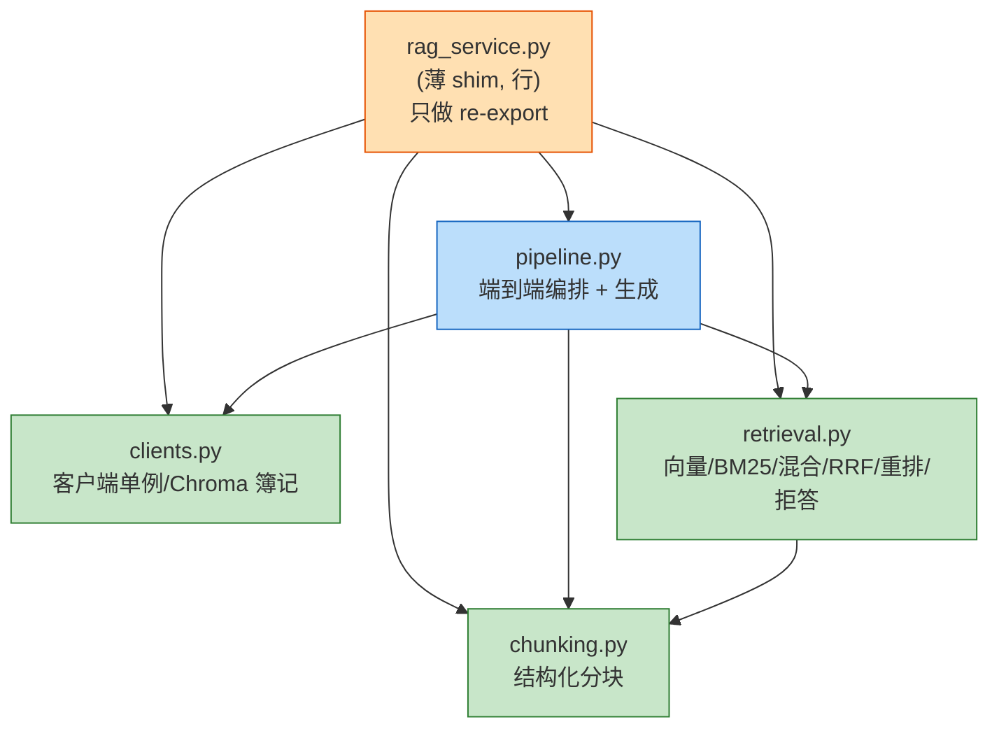

# 后端重构

> 电梯陈述（一句话能背）：「把一个  行的『巨石文件』`rag_service.py` 在不改动任何调用方的前提下，按职责拆成了 `clients / chunking / retrieval / pipeline` 四个内聚模块，并用一个薄 re-export  保住所有公开符号；顺手把  库从 `python-jose` 换成更主流的 `PyJWT`，把双  的 Cookie/Bearer 双模式鉴权收口到 `core/security.py`，再把两套 Agentic  路径做了一致性收敛。重构后净减  行，148 个单测全绿，ruff 零告警。」

## 一、背景（为什么要做这个）

这是 AI 简历分析系统求职作品多阶段改造中的后端重构。

前多个阶段「堆功能、补安全、加可观测」，系统能跑了，但代码开始发臭。最典型的症状是 `services/rag_service.py` 长到了 ~720 行，像个「杂物间」：Chroma 客户端单例、结构化分块、BM25 索引、混合检索、RRF 融合、重排、拒答阈值、端到端编排、LLM 生成……全塞在一个文件里。后果是：

- **改一处怕牵连一片**：任何一行改动都可能影响十几个依赖它的模块（`mcp_server/tools/*`、`services/agentic_rag/*`、`api/resumes.py`、`api/qa.py`、各测试）。
- **新人读不懂**：想看「检索怎么融合」，得在几百行里大海捞针。
- **库选型不主流**：之前用 `python-jose`，社区活跃度不如 `PyJWT`，且 `python-jose` 对 `cryptography` 的版本耦合更紧，迁移能降低依赖风险。

不做重构，后续参数调优、评估、报告都建立在一坨难以测试的代码上——调优时连「改哪个函数」都定位不准。所以重构的定位是「**给房子做承重墙重排，但保证住户（调用方）完全无感**」。

## 三、逐个讲：问题 → 怎么想 → 怎么解（配 Mermaid）

### 1. REF-001：把  行巨石拆成  个内聚模块（核心）

**问题**：`rag_service.py` 同时管「客户端、分块、检索、编排」四件不同的事，违反单一职责。但它是被  最多的文件之一，硬拆必然牵一发动全身。

**怎么想**：关键约束是「**不能改任何调用方**」——此前各阶段的测试都还在 `import services.rag_service`。所以定的策略是：
1. 先抽逻辑到新模块 `services/rag/{clients,chunking,retrieval,pipeline}.py`，每个模块只负责一件事。
2. 把原 `rag_service.py` 降级成「薄 re-export shim」——它只做 `from services.rag.xxx import ...`，把所有公开符号原样导出。
3. 这样**调用方一行都不用改**，行为完全一致；等将来哪天想彻底去掉 shim，全局替换 `services.rag_service` → `services.rag.clients|chunking|retrieval|pipeline` 即可。

**怎么解**：拆分的职责边界如下——

- `clients.py`（ 行）：外部客户端单例+  簿记与惰性重连（`get_chroma_client` / `reconnect_chroma` / `_collection_name` / `_cleanup_orphan_segments`）。
- `chunking.py`（ 行）：结构化分块（`chunk_by_sections` / `fixed_chunk` / `_tokenize` / `SECTION_PATTERN`）。纯函数，零 IO，最好测。
- `retrieval.py`（ 行）：稠密检索 +  稀疏 + 混合融合+ 重排 + 拒答阈值（`_bm25_indexes` / `_bm25_lock` 仍在此处，锁语义不变）。
- `pipeline.py`（ 行）：端到端编排 +  生成，把上面的零件串成一条流水线。

模块依赖方向（单向，无环）：



> 生活化类比：原来 `rag_service.py` 像一个「全能小卖部」——进货、收银、理货、做饭全是一个人。重构后变成「购物中心」：供应链部、切配部、仓储拣货部、出品部各管一摊，门口还有一个「总服务台」替老顾客转接，老顾客根本感觉不到里面换成了部门制。

**验证点**：`from services import rag_service` 仍可导出  个公开符号，`import main` 通过（所有模块 importable），说明  契约保住了。

### 2. REF-002/003：JWT 库迁移 + 双模式鉴权收口

**问题**：鉴权逻辑分散在 `api/auth.py`、`api/deps.py`、`api/qa.py`、`services/auth_service.py` 多处，且基于 `python-jose`。想统一到 `core/security.py` 一个入口，并把库换成 `PyJWT`。

**怎么想**：`PyJWT` 是  上下载量最大的  库，API 稳定、文档全、对 `cryptography` 依赖宽松；`python-jose` 则维护节奏慢、版本耦合更紧。统一到一个 `security.py` 的好处是：令牌的「签发 / 校验 / 吊销 /  读写 / 注入防护 /  脱敏」全在一个文件里，安全相关逻辑不再四处泄露。

**怎么解**：
- `core/security.py` 新增 +210 行，集中实现：`create_access_token` / `create_refresh_token`、`decode_token`、`revoke_token` / `is_token_revoked`、`set_auth_cookies` / `clear_auth_cookies`、`extract_token_from_request`（ 头 **或**  双模式解析）、`detect_prompt_injection`、`sanitize_untrusted_text`、`redact_pii`。
- `requirements.txt` 把 `python-jose` 换成 `PyJWT==2.10.1`（已 `grep` 全仓确认无任何 `jose` 残留）。
- `api/deps.py` 改为「双模式 token+ 吊销检查」一个依赖函数，所有需要登录的接口共用。
- `api/auth.py` 登录签发双  并写 HttpOnly Cookie，登出吊销 refresh  并清 Cookie。

```mermaid
sequenceDiagram
    participant U  前端
    participant A as api/auth.py
    participant S as core/security.py
    participant D as api/deps.py
    participant Q  业务接口

    U->>A: 登录(账号密码)
    A->>S: create_access_token + create_refresh_token
    S-->>A: 双 token
    A->>U: Set-Cookie(HttpOnly) + JSON

    U->>Q: 带  的后续请求
    Q->>D: 需要鉴权
    D->>S: extract_token_from_request(Bearer 或 Cookie)
    S->>S: decode_token + is_token_revoked?
     已吊销
        S-->>D: 401
     正常
        S-->>D: payload
        D-->>Q: 当前用户
    end
```

### 3. REF-004：Agentic  一致性收敛

**问题**：`services/agentic_rag/` 下有两套图路径——标准 `graph.py` 和走  的 `mcp_graph.py`，二者节点（检索/改写/生成/反思）高度重叠，维护两份易漂移。

**怎么想**：两套图的本质差异只在「工具调用是否走  协议」。收敛目标 = 共享同一份节点/状态定义，仅在「调用通道」上分叉，避免逻辑双写。

**怎么解**：
- `graph.py` 增强 +132 行，统一路由/评估/反思循环（≤2 轮 Reflexion）的状态机。
- `mcp_graph.py` 收敛 −170 行（净减），复用 `graph.py` 的状态与路由，只在工具执行层切到 MCP client。
- `state.py` 补充 `tool_errors` 等字段，让下端 `/ask` 能据 `degraded = bool(tool_errors)` 决定降级（这条在 引入， 保留并加固）。
- `generate.py` / `search.py` 适配新状态结构，纯逻辑未变。

### 4. REF-005：重试基础设施补全

**问题**：`core/retry.py` 只有 `with_retry`（ 指数退避）。 补上 `RetryBudget`（总重试预算，防止在持续故障时无限烧 token/时间）+ 同步 `retry` 支持（部分非  路径也能用）。`core/metrics.py` +26 行补重试相关指标，`core/cache.py` +5 行微调。

## 四、关键决策与取舍

1. **「薄 shim」而非「硬拆 + 全局改 import」**
   - 选：保留 `rag_service.py` 作 re-export。代价：多一个  行「转发层」，理论上有一次额外的  间接层（运行时开销可忽略）。
   - 弃：直接改全部调用方 `import`。代价：要同时动十几个文件，与正在并行的其他阶段抢同一批文件，且容易引入  错误。
   - 结论：shim 是「零风险、可回退」的取巧——先让结构清爽，调用方迁移留到未来一次性替换。

2. **而非保留 jose**
   - 选 `PyJWT`：生态主流、API 稳。代价：要重写签发/校验调用（ 的 `jwt.encode` 与  几乎同签名，迁移成本极低）。
   - 结论：收益（降低依赖风险、统一入口）远大于成本。

3. **收敛程度**
   - 没做「彻底合并成一个文件」——保留 `mcp_graph.py` 作为「通道分叉点」，因为  路径未来可能加协议级降级/重试，留独立文件更清晰。

## 五、踩坑（值得讲的故事）

1. **框架「假失败」**：派出去执行 的  回报 `Error: Tool TaskStop not found` 而。但不信 self-report——独立 `import main` 通过、`ruff check .` 报 `All checks passed!`、`git status` 显示 `services/rag/` 新目录已落地。结论：**框架级报错 ≠ 任务失败**，必须亲自核验产物。最终确认重构实际已完成，只是  在收尾时踩了工具 bug。

2. **误删 `docker-compose.local.yml`**：该  在重构时不小心把仓库根的 `docker-compose.local.yml` 删了（不在 范围内）。在 `git status` 里发现 `D ../docker-compose.local.yml`，立刻 `git checkout HEAD -- docker-compose.local.yml` 还原——这是  之前也误删过的同一文件，说明「重构类大动作」容易顺手动到无关文件，收尾必须 `git status` 兜底。

3. **端到端测试在本沙箱会「挂」**：`test_agentic_graph.py::TestGraphEndToEnd::test_direct_answer_path` 会真的调用 LLM Graph，沙箱无 API/网络，于是卡在  等待超时。这不是回归——所有**单元**测试（路由决策、输出节点、图编译、rag_service 分块/融合/分词）全过。验收时用 `-k "not e2e"` 排除这类需真实  的用例，得到干净绿码。

## 六、常见疑问

**Q1：你为什么不直接删掉 `rag_service.py`，而要留个 shim？**
A：因为「调用方 zero-change」优先于「代码绝对整洁」。重构的第一原则是「行为不变、风险可控」。shim 让 10+ 个  方零改动，把「大爆炸式重构」降级成「渐进式」。代价只是多一个  行的转发层，运行时开销可忽略。等后续有空，一条全局替换命令就能彻底移除。

**Q2：拆模块时怎么定边界？会不会拆太细？**
A：边界按「依赖方向 + 是否含 IO」定。`clients` 管外部连接，`chunking` 是纯函数（最好测），`retrieval` 管索引与融合，`pipeline` 做编排。特意没把「RRF 融合」单独成文件——它和 BM25/向量检索强耦合，拆开反而增加跨文件调用。所以  个模块是「刚好内聚、不碎」的粒度。

**Q3：PyJWT 和 python-jose 到底差在哪，为什么换？**
A：两者都实现  标准。PyJWT 是下载量最大、维护最活跃的；python-jose 还顺带支持 JWS/JWE，但对 `cryptography` 版本耦合更紧、issue 响应慢。只需 JWT（不带  加密负载），PyJWT 完全够用且更省心。迁移成本几乎为零（ 同签名）。

**Q4：两套 Agentic  收敛后，MCP 路径和普通路径的差异只剩什么？**
A：只剩「工具执行通道」——普通路径直接 `import` 调用本地函数，MCP 路径通过 `httpx` + JSON-RPC 走 `/mcp` 端点（带 JWT +  用户上下文）。状态机、路由、反思循环完全共享，避免逻辑双写漂移。

**Q5：重构后你怎么证明「没改坏」？**
A：三层证据——① `import main` 通过（所有模块 importable，无断链）；② `ruff check .` 零告警（无语法/类型/风格回归）；③  个单元测试全绿（含 rag_service 拆分、auth/qa 的 PyJWT、agentic_graph 单元）。唯一排除的是需真实  的  用例，那是环境限制不是代码问题。


> ▶ 关联技术研读：[[01_技术研读/01_架构概览|01_架构概览]]
