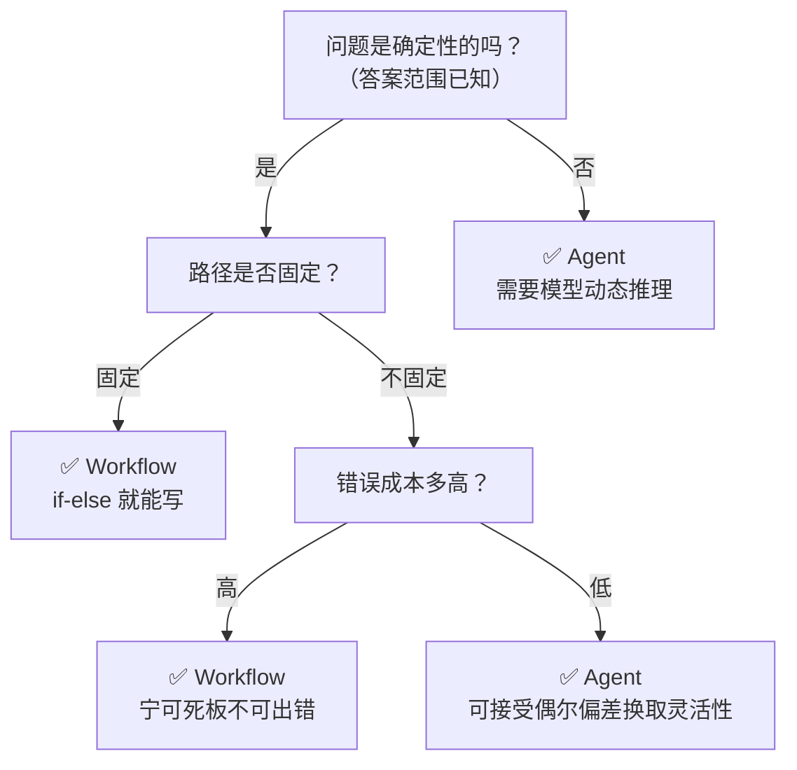
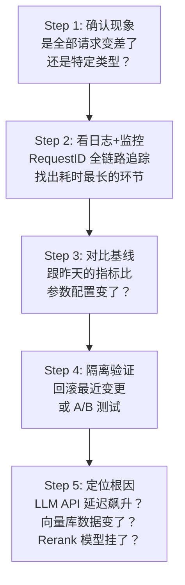
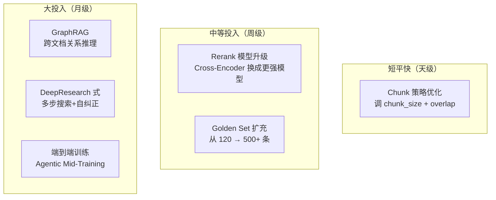

# 从 ai-resume 出发：Agent 系统设计与排障方法论

> 前面的技术研读讲的是"这个项目每个模块怎么实现"，这篇换个视角：当你面对一道开放式设计题——"设计一个 XX 系统"或"系统出问题了怎么办"——该用什么样的思考框架去拆解。
>
> 开放式问题没有标准答案，真正有价值的是**结构化的思考路径**：遇到不确定的问题时，怎么一步步拆到可落地。下面所有框架都用 ai-resume-analyzer 作为参照系。

---

## 目录

- [01：Workflow vs Agent 选型决策树](#01workflow-vs-agent-选型决策树)
- [02：开放性系统设计题解题框架](#02开放性系统设计题解题框架)
- [03：典型系统设计题三连](#03典型系统设计题三连)
- [04：线上问题排查方法论](#04线上问题排查方法论)
- [05：极限优化题："从 90% 到 99%"](#05极限优化题从-90-到-99)
- [06：常考的 6 个开放追问](#06常考的-6-个开放追问)

---

## 01：Workflow vs Agent 选型决策树

"为什么这里用 Agent 而不是普通 Workflow"，这个问题的核心是一种判断力：**什么时候该让模型决策，什么时候该固定逻辑。**



**一条实用原则**：能用 if-else 写出来的就不交给 LLM——能确定的逻辑，绝不交给模型去猜。在 ai-resume 里，"这个候选人年龄多大"这种精确查询走传统 RAG 就够了，不需要 Agentic RAG 的完整流程；只有需要多步推理、需要检索后评估质量的场景，才值得走 Agent 路径。

### 实际案例对照表

| 场景 | 选型 | 理由 |
|------|------|------|
| "候选人年龄多大" | Workflow（简单 RAG） | 精确字段，一次检索足够 |
| "这个候选人适合微服务岗吗" | **Agent**（你的项目） | 需要检索+分析+评估+可能反思 |
| "生成每日简历摘要报告" | Workflow（定时任务） | 流程固定，不需要模型判断 |
| "分析两份简历的差异" | **Agent** | 需要多步推理和交叉验证 |

---

## 02：开放性系统设计题解题框架

"设计一个 XX 系统"是最常见的开放题型。下面这套框架能把模糊需求逐步拆到可落地。

### 四步设计框架（STAR+）

以"设计一个客服 Agent"为例，按这四步走：

```text
Step 1: 明确边界          Step 2: 拆解模块          Step 3: 关键决策         Step 4: 量化验证
"我们先定义这个        "系统分四层："           "检索用混合检索，     "如何评估效果？
Agent 的核心场景         1. 用户接入层             Rerank 用 Cross-     RAGAS 打分、Bad Case
——是售前咨询还是        2. AI 推理层              Encoder"             回归"
售后工单？"     →       3. 知识检索层    →        "Agent 编排用        →  "预期延迟 p50 < 3s"
                         4. 数据与评估层"          LangGraph 状态机"
```

### 用 ai-resume 的经验去套这个框架

设计客服 Agent 时，其实不需要从零开始，而是把已有的**项目经验迁移过去**：

| 你的项目元素 | 映射到客服 Agent |
|-------------|----------------|
| RAG 检索简历 | RAG 检索知识库文档 |
| LangGraph 9 节点 | LangGraph 客服对话状态机 |
| Reflexion 自纠正 | 回答质量自检+转人工 |
| MCP 工具 | CRM 查询/工单创建/退款操作 |
| 拒答门控 | 不确定性高于阈值转人工 |
| 可观测性体系 | 同上——RequestID+Prometheus |

> **核心思路：好的系统设计往往不是从零发明，而是把成熟的架构模式迁移到新场景。**

---

## 03：典型系统设计题三连

### 题一：设计一个客服 Agent

**设计框架**（把 ai-resume-analyzer 迁移过去）：

| 模块 | 你的设计 | 对应项目组件 |
|------|---------|-------------|
| 知识 ingestion | PDF/Word 解析 → Chunking → 向量化 → 存入向量库 | `rag_service.py` |
| 用户意图识别 | Route 节点判断：查知识库 / 查订单 / 转人工 | `graph.py` route_node |
| 检索策略 | 混合检索（向量+BM25）+ RRF + Cross-Encoder 精排 | `rag_service.py:80-200` |
| Agent 编排 | LangGraph 状态机，每个对话轮次走一次图 | `graph.py` |
| 质量保证 | LLM-as-Judge 评估是否回答了问题，不达标反思 | `reflection.py` |
| 转人工兜底 | 拒答门控 score < 0.3 → 转人工 | `rag_service.py` reject |
| 可观测性 | RequestID 全链路 + Prometheus 指标 + 结构化日志 | `main.py` + `metrics.py` |

**小结**：简历分析项目里的 RAG 流水线和 Agent 编排方案可以直接迁移到客服场景——核心差异只是知识源从简历变成了知识库文档；额外多出的"转人工"兜底逻辑，可以用现有的拒答门控机制扩展。

### 题二：设计一个 PDF 智能解析系统

这也是 RAG 类的变体题——你的项目直接覆盖：

| 你的项目 | 在这个场景中的应用 |
|---------|-----------------|
| `chunk_by_sections` 语义切分 | 按 PDF 章节层级分块 |
| `get_embeddings` 向量化 | 用已经选型的百炼 Embedding |
| `hybrid_search` 混合检索 | 支持标题搜索+内容搜索 |
| SSE 流式渲染 | 边解析边展示进度 |
| 202 异步轮询上传 | 大 PDF 解析异步不阻塞 |

**关键点**：PDF 解析的核心挑战不是 OCR，而是表格和混合排版的语义还原。ai-resume 用 PyMuPDF 做布局分析、按标题层级分块；但更复杂的表格解析（跨页表格、合并单元格）仍是一个已知的待改进点。

### 题三：设计一个模型评估平台

这道题的关键是"数据驱动"思维——ai-resume 的 07 笔记（参数调优框架）直接覆盖：

| 所需能力 | 你的经验来源 |
|---------|-------------|
| 评估数据集构建 | 120 条 golden set（07 笔记） |
| 评估指标设计 | Composite / Recall@K / Latency / Bad Case Rate |
| 自动化评估流程 | LLM-as-Judge 评估器（04 笔记） |
| 实验管理 | 6 阶段实验框架 + 断点续跑（07 笔记） |
| 回归测试 | 326 个自动化测试（08 笔记） |

> **小结**：做参数调优时搭的 6 阶段实验框架虽然简陋，但已包含评估平台的核心要素——golden set、自动化评估、对比实验、结果记录。要做成正式的评估平台，只需在此基础上加一层前端界面和多用户管理。

---

## 04：线上问题排查方法论

"系统线上效果突然下降了怎么排查"——比起具体答案，更重要的是有没有一套**系统化的排障思路**。

### 五步排查法



### 针对你的项目的排查清单

| 症状 | 可能原因 | 排查路径 |
|------|---------|---------|
| **回答变差了** | LLM 模型换版本了 / Prompt 被改了 | 查 Langfuse 日志，对比前后两次 LLM 输出 |
| **延迟飙升** | ChromaDB 查询变慢 / LLM API 超时 | Prometheus 看 p50/p95，定位哪一步慢了 |
| **检索不准** | 新上传的简历 embedding 质量差 / Chunking 策略不合适 | 对比 golden set 上的 Recall@K |
| **MCP 调用失败** | JWT 过期 / MCP Server 重启 | 看 MCP 日志 + 检查 token 刷新机制 |
| **拒绝正确回答** | Reject threshold 过高 / Rerank score 分布变化 | 分析当前 rerank score 分布 vs baseline |

### 一个真实案例

项目里遇到过一次典型问题：参数调优后 p95 延迟从 13.7s 降到 10.2s，但过了两天又回到 13s。排查发现不是代码问题，而是 ChromaDB 的数据量增长了（用户上传了更多简历）导致查询变慢。解决方向有两个：一是给 ChromaDB 加索引优化，二是换成原生异步、更快的 Qdrant。这个案例的教训是——**线上问题排查不能只盯代码，要看全链路**。

---

## 05：极限优化题："从 90% 到 99%"

"如果要把准确率从 90% 提升到 99% 怎么做"——重点不在于能不能真做到 99%，而在于有没有**分层的工程优化直觉**。

### 优化方向金字塔



**核心判断**：从 90% 到 99% 不是线性过程。前 5 个点（90%→95%）靠工程优化——更好的 chunk 策略、更强的 rerank 模型、更全的 golden set；后 4 个点（95%→99%）需要架构升级——GraphRAG 做跨文档推理、DeepResearch 式的多步搜索。这也解释了为什么 ai-resume 的参数调优做到 composite 0.5448 就停了：不是做不到更好，而是投入产出比开始下降，需要架构级改进才能突破。

---

## 06：多 Agent 通信与架构设计

"多个 Agent 之间怎么协作"，主流有下面三种通信模式。

### 三种通信模式

| 模式 | 机制 | 适用场景 | 复杂度 |
|------|------|---------|--------|
| **串行编排** | Agent A → Agent B → Agent C | 流程确定的流水线 | 低 |
| **路由分发** | 主 Agent 判断 → 子 Agent 执行 | 任务可分类（你的 Route 节点就是这个思路） | 中 |
| **发布订阅** | Event Bus，松散耦合 | 复杂系统，异步通信 | 高 |

### 多 Agent 异常处理四件套

```text
1. 超时 → 设定 TTL，超时降级/重试
2. 失败 → 指数退避重试（1s→2s→4s，最多 3 次）
3. 死循环 → 最大步数限制（如 search_round ≤ 2）
4. 工具幻觉 → 工具名严格校验 + 参数服务端校验
```

### 传统 Web vs Agent 系统架构对比

> Agent 系统的后端和传统 Web 后端在设计范式上有本质差异。

| 维度 | 传统 Web | Agent 系统 |
|------|---------|-----------|
| 模式 | 请求-响应 | 循环执行（感知→思考→行动） |
| 状态 | 无状态/有状态简单 | 复杂状态管理（Context + Checkpoint） |
| 错误 | 明确的（404/500） | 模糊的（幻觉/规划错/工具失败） |
| 成本 | 服务器+带宽 | Token（每次推理都花钱） |
| 测试 | 单元测试覆盖所有分支 | 评估指标 + Bad Case 分析 |
| 用户体验 | 快+稳 | 智能+灵活 |

---

## 07：上下文漂移（Context Drift）解决方案

多轮对话中"上下文越来越乱"是一个高频难题。

上下文漂移的典型表现：对话超过 5 轮后，Agent 开始"忘记"前面的结论，或者被前几轮的噪声带偏。

| 策略 | 做法 | 你的项目现状 |
|------|------|-------------|
| **上下文截断** | 保留最近 N 轮，丢弃最老的 | 当前仅单轮，没这个问题 |
| **摘要压缩** | 每 N 轮对历史做一次摘要，摘要替换原始对话 | ❌ 未实现，但 State 已预留 |
| **检索式记忆** | 不保留完整历史，按需检索相关历史 | ❌ 未来改进方向 |
| **Token 预算** | 设定上下文 Token 上限，超限触发压缩 | ❌ 可加 |

**现状与规划**：ai-resume 当前只支持单轮问答，所以暂时没有上下文漂移问题。但要做多轮的话，LangGraph 的 Checkpoint 其实已经支持——state 可以保留历史问答列表。后续计划结合 Redis 做会话缓存 + LLM 摘要，07 笔记的评估框架也可以升级到多轮场景。

---

## 08：六个常见的开放性设计问题

这些"如果……怎么办"式的问题，本质是在检验工程决策的完整性。逐一记录我的思路。

### Q1：如果要支持 1000 个用户并发，会怎么改？

**A：** 三个方向：

1. **数据库**：MySQL 加连接池，用 PgBouncer 或 ProxySQL 做连接复用
2. **LLM API**：请求队列 + 背压控制，防止突发请求打满 API 配额
3. **向量检索**：ChromaDB 换成 Qdrant（原生异步+更快），或者加缓存层（相同的简历查询结果缓存）

当前系统的瓶颈大概率在 LLM API——其他都是计算密集型的可水平扩展，LLM 受限于 API 并发限制。

### Q2：这个系统怎么收费？

**A：** 按调用收费最合理——基础套餐（每月 500 次问答 + 50 份简历处理），超出按次计费。主要原因：用户的使用量差异很大，HR 密集招聘期可能一天用 100 次，平时可能 0 次。固定月费要么让重度用户觉得划算、轻度用户觉得亏。

成本大头是 LLM API（占总成本约 70%），所以定价锚点是 LLM 调用次数。

### Q3：如果 DeepSeek 不能用了怎么办？

**A：** 这就是韧性工程设计的原因之一。06 笔记里提到我们的 LLM 调用封装了**模型回退**——如果 DeepSeek 挂了，自动降级到备用模型。当前实现只支持一个备用模型，但架构上可以扩展成模型池 + 健康检查 + 自动切换。

### Q4：怎么防恶意用户？

**A：** 三道防线：

1. **认证层**：JWT 双 token，token 有效期短（access 15min / refresh 7d）
2. **限流层**：FastAPI 的限流中间件，按 user_id + endpoint 限流
3. **内容层**：Prompt Injection 检测 + 敏感词过滤（当前没实现，是改进方向）

### Q5：怎么知道 120 条 golden set 质量足够？

**A：** 三条标准：

1. **覆盖度**：覆盖常见的简历问答类型（事实查询、技能匹配、项目经验、软技能）
2. **多样性**：不同简历类型（应届/资深、技术/非技术）
3. **难易分层**：简单（姓名学历）← 中等（技能匹配）← 难（项目经验深度分析）

120 条是一个开始，还不够。理想是 500+，并且从线上日志中持续补充 Hard Case。

### Q6：怎么验证参数调优没有过拟合？

**A：** 两个机制：

1. **交叉验证**：golden set 分训练/验证集，最优参数在验证集上确认
2. **对照组**：保留一组"最优参数 vs 基线参数"的对比测试，下次改参数时重新跑

这是 07 笔记里说到的——**防止过拟合不是一次性的，是一个持续的过程**。每个新参数组合都要在验证集上确认，而不是只看训练集上的提升。

---

## 相关笔记

- [[06_韧性工程|💪 06_技术研读/韧性工程]] — 容错降级经验
- [[07_参数调优框架|📊 07_技术研读/参数调优框架]] — 评估实验方法论
- [[08_可观测性|📈 08_技术研读/可观测性]] — 可观测性帮助排查
- [[09_前沿视野|🔭 09_技术研读/前沿视野]] — 架构升级方向
- [[01_项目叙事与话术|🎤 ai-resume 项目复盘：架构决策与技术亮点]]

---

**最后更新**：2026-07-14 | **项目**：ai-resume-analyzer
