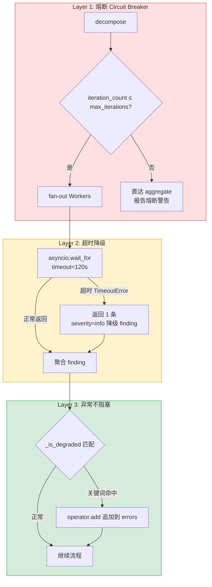

# 04 - 三层容错与并发 bug

## 核心机制（重点 / 要会画图）

### 1. 熔断（Circuit Breaker）

**位置**：`services/supervisor/graph.py:111-137` `_route_after_decompose` + `build_supervisor_graph`

**逻辑**：`iteration_count > max_iterations`（默认 3）→ 条件边跳过所有 Worker 直达 `aggregate`。

```text
decompose(iteration_count++) ──┬── iteration_count ≤ 3 ──→ fan-out 4 Workers
                                └── iteration_count > 3 ──→ 直达 aggregate（熔断）
```

- `max_iterations` 通过 state 传入，每个请求可自定义覆盖
- `aggregate` 内检测熔断状态，报告追加 `"已达最大迭代次数"` 警告（`graph.py:159-162`）
- 当前是单趟架构所以不会真触发，但机制已就位，后续加迭代循环即生效

### 2. Worker 超时降级

**位置**：`services/workers/base.py:108-135` `BaseWorker.review()`

```text
asyncio.wait_for(self._call_llm(...), timeout=self.timeout)
```

- `timeout` 默认 `settings.LLM_TIMEOUT = 120s`，测试可覆写为 `0.01`
- 超时捕获 `asyncio.TimeoutError` + `APITimeoutError`，返回 1 条 `severity=info` 的降级 finding
- **不抛异常、不阻塞其他 Worker**
- 超时不走 `with_retry` 重试——若第一次已耗 ~119s，重试大概率仍超时，得不偿失

### 3. 异常不阻塞

**位置**：`graph.py:81-108` `_make_worker_node` + `graph.py:69-78` `_is_degraded`

- `_make_worker_node` 包装 Worker 调用，降级 finding 通过 `_is_degraded` 关键词匹配（"异常"/"超时"/"timeout"/"降级"等）追加到 `state.errors`
- `errors` 用 `operator.add` reducer → 多个 Worker 并发追加不覆盖

### ⚠️ 常见坑：errors reducer 覆盖

`graph.py:11` 注释已说明：`errors 用 operator.add reducer，多 Worker 并发写不覆盖`。但若 reducer 配成 `operator.setitem` 或默认 `replace`，后完成的 Worker 会覆盖前面的 errors。确认 `SupervisorState` 中 errors 字段 reducer 为 `operator.add`。

---

## 了解级

### 指数退避重试

**位置**：`core/retry.py:26-60` `with_retry()`

```text
退避序列：base_delay * 2^attempt → 1s → 2s → 4s（默认 max_retries=3）
```

- `NON_RETRYABLE`（编程错误）不重试，直接 raise：`TypeError` / `ValueError` / `AttributeError` / `KeyError` / `IndexError` / `AssertionError`
- 重试耗尽可传 `fallback` 返回值，不传则 raise 最后错误
- 同步/异步 callable 通用（内部检测 `iscoroutine`）

---

## 测试策略

**位置**：`tests/test_resilience.py`

三类测试（TDD RED → GREEN）：

| 测试 | 策略 | 核心断言 |
|------|------|---------|
| `test_circuit_breaker_skips_workers` | `max_iterations=0` → 熔断 | `worker_results == []` + 报告含"熔断" |
| `test_timeout_returns_degraded_finding` | `_SlowFakeClient(delay=1.0)` + `timeout=0.01` | 降级 finding 含 "timeout" |
| `test_timeout_does_not_block_others` | 混合客户端：1 个慢 Worker + 3 个正常 | `worker_results >= 4` |
| `test_exception_recorded_to_errors` | `_BoomClient` 所有 Worker 抛 RuntimeError | `len(errors) > 0` + 报告含"审查警告" |
| `test_partial_failure_still_produces_report` | `_MixedClient`：仅 security Worker 抛异常 | 报告仍生成 + errors 含 security 记录 |

---

## Mermaid：三层容错嵌套



## Q&A

**Q1：三层容错从外到内分别防什么？**  
**A**：从外到内三层防御——熔断（防无限迭代耗尽资源）→ 超时降级（防单个 Worker 卡死整趟审查）→ 异常不阻塞（防异常抛出让 Graph 中断）。每层只防御自己那一域的故障，互不替代。

**Q2：errors reducer 坑是怎么发现的？**  
**A**：LangGraph 的 `State.add_edges` 若使用默认 `replace` 模式，后完成的 Worker 会覆盖之前 Worker 追加的 errors。解决方案是用 `operator.add` 作为 reducer，让 errors 以 list 形式累加。关键检查点：确认 `SupervisorState` 中 errors 字段的 reducer 配置正确。

**Q3：超时为什么是可注入的？测试怎么覆写？**  
**A**：`BaseWorker.__init__` 接受 `timeout` 参数，默认走 `settings.LLM_TIMEOUT`，但测试时可传入 `0.01` 秒覆写。配合 `_SlowFakeClient(delay=1.0)` 模拟慢 LLM，构造超时场景。无需 mock 任何全局变量。

**Q4：为什么超时不走 with_retry 重试？**  

---

## 相关笔记

- [[00-17条架构决策总览|00 17条架构决策总览]]
- [[01-Supervisor-Worker编排与StateGraph|01 Supervisor-Worker编排与StateGraph]]
- [[02-Worker与TemplateMethod模式|02 Worker与TemplateMethod模式]]

## 技术学习笔记

- [[27-指数退避重试：Exponential Backoff + Jitter|指数退避重试]]
- [[28-降级路径（Degradation）：某环节失败 → 回退到次优但可用方案|降级路径]]
- [[18-工具调用失败处理：文件不存在-超时-权限不足→恢复与重试|工具调用失败处理]]
- Agent韧性工程概述
**A**：超时发生在调用已接近耗尽的边缘（假设已跑 119s），重试大概率同样超时，徒增延迟。正确的策略是降级返回一条 info finding，让 aggregate 层在已有结果上继续工作。with_retry 设计用于瞬态网络抖动（几百 ms 级），不是超时这种持续性故障。
