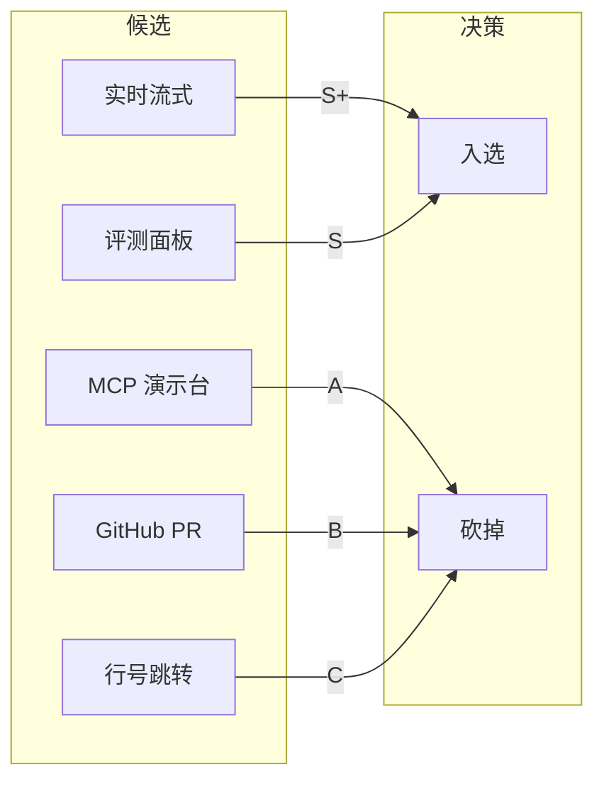
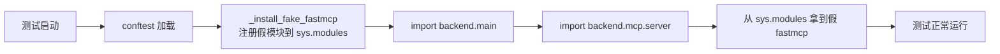

# 地基搭建与项目初始化

> 如何在没有完整第三方依赖的环境下，用 TDD 从零搭起 SSE 流式审查后端，并靠自动化 mock 隔离外部依赖，让测试环境先跑起来。

## 一、背景

项目原有功能已经"能用"（同步 POST 审查、历史记录、主题切换），但要展示就必须从"能用"升级到"能讲"。

动工之前先做了一轮规划。当时 5 个候选功能摆在面前（A-GitHub PR / B-实时流式 / C-评测面板 / D-行号跳转 / E-MCP 演示台），不能全做，必须取舍。按"价值 + 与项目一差异化 + 工作量"三个维度打分，从 5 个砍到 2 个（B+C）。

选了 B+C 后，还有三个棘手前提：一是沙箱环境有代理限制，`pip install fastmcp` 走不通；二是 LangGraph 的 `astream_events` API 版本不确定，不实测不敢用；三是同步 POST 已经有，新加流式容易代码重复。动第一行代码之前，需要先解决这些"环境 + 技术选型"问题。

## 二、逐个讲：问题 → 怎么想 → 怎么解

### 1. 从 5 个候选砍到 2 个 → 优先级矩阵

**问题**：候选功能 5 个，全做时间不够，必须取舍。而且不能只凭直觉——要和第一个项目（ai-resume-analyzer）做出差异化。

**怎么想**：用三个维度打分——价值（1-5）、与项目一差异化（1-5）、工作量（小/中/大）。价值高 + 差异化强 + 工作量小的优先。另外先搜了 2026 求职市场信号，发现 MCP 虽热但项目一已有，再做边际价值低。

**怎么解**：拉了一张对比表——实时流式（价值 5 / 差异化 5 / 工作量中）和评测面板（5/5/中）胜出。MCP 演示台（4/2/中-大）被砍。关键判断：cr-agent 的护城河是"多 Agent 编排 + 双轨评测"，最缺的是"实时流式"。SSE 而非 WebSocket 也是在这轮定的——审查是单向流，SSE 够用。

### 2. 沙箱装不了 fastmcp → 模块级 mock 隔离

**问题**：`backend/main.py` 模块级 import `from backend.mcp.server import mcp`，只要 import main.py 就报 `ModuleNotFoundError: No module named 'fastmcp'`。测试 / 开发服务器都起不来。

**怎么想**：两个选择。① 想办法装 fastmcp——沙箱有代理限制，这条路走不通。② 在测试环境和开发环境把 fastmcp mock 掉——fastmcp 不是我要测的东西，它只是被依赖的外部模块，mock 是标准做法。

**怎么解**：在 `conftest.py` 和 `dev_server.py` 里写 `_install_fake_fastmcp()`，在 `sys.modules` 里提前注册一个假的 fastmcp 模块，提供 `FastMCP` 类的最小实现（构造 + `tool()` 装饰器 + `resource()` 装饰器 + `http_app()` 方法）。这样 `backend.mcp.server` import 成功，MCP 相关功能被 mock 掉但不影响 review API。

### 2. LangGraph astream_events 事件名不确定 → 写调试脚本实锤

**问题**：我最初假设整个图的结束事件 `name == "graph"`，结果 `final_state` 永远是 None，report 为空字符串。

**怎么想**：不能瞎猜 LangGraph 内部实现，要实测。写个调试脚本，把 astream_events 的前 25 条事件全打印出来。

**怎么解**：跑了临时脚本后发现：根图的事件名是 **"LangGraph"**（不是 "graph"），业务节点是 `decompose`、`worker_*`、`aggregate`，内部节点是 `_route_after_decompose`（下划线开头）。修了两处：取 final_state 用 `name == "LangGraph"` 的 `on_chain_end`；过滤业务节点用 `_is_user_node()` 函数排除 "LangGraph" + 下划线开头的内部节点。

### 3. 路由顺序坑 → 固定路径路由放参数路由前面

**问题**：`POST /stream` 实际命中了 `/{review_id}` 的 GET 路由，返回 405 而不是 404。

**怎么想**：FastAPI 先匹配路径再匹配方法，`/stream` 和 `/{review_id}` 在路径层面冲突了。

**怎么解**：把 `POST /stream` 放在 `GET /{review_id}` 之前。FastAPI 按定义顺序匹配，放后面的话 stream 会被当成 review_id。

## 三、关键决策与取舍

| 决策 | 选择 | 取舍 |
|------|------|------|
| SSE 而非 WebSocket | 单向推送，SSE 够用 | 不支持反向推送，但审查场景不需要 |
| mock fastmcp 而非等环境修复 | 沙箱 pip 不可行 | mock 可能漏测 MCP 耦合，但两者独立 |
| astream_events 而非自己埋点 | 零侵入 graph 代码 | 版本依赖，langgraph 升级可能改事件格式 |
| 同步和流式不硬抽公共函数 | 控制流完全不同（return vs yield） | 少部分重复代码但可读性更好 |
| B+C 而非 A+E | 差异化更强 | 工作量大但 ROI 更高 |

## 四、踩坑

1. **PYTHONDONTWRITEBYTECODE 忘加，输出被 PermissionError 淹没**。现象：langsmith 往 site-packages 写 `__pycache__` 被沙箱拦截，几百行 PermissionError 噪音盖住测试结果。解法：加 `$env:PYTHONDONTWRITEBYTECODE="1"`。教训：沙箱跑 Python 测试先禁掉 pyc 生成。

2. **中文句号 SyntaxError？其实是 dict 没闭合**。测试跑不起来报 `SyntaxError: invalid character '。'`，指向 docstring。排查半天发现是上面一行的 dict 少了 `}`，Python 解释器继续往下找闭合，报错位置完全不对。教训：语法错误位置看似不对时往上找——大概率是前面括号没闭合。

3. **405 vs 404**：第一次写测试时断言 404，实际返回 405。RED 阶段发现 405 反而帮我确认了路由顺序问题。教训：有路径参数的路由一定要放最后。

## 五、常见疑问

**Q1：为什么用 SSE 而不是 WebSocket？** A：审查是单向流，服务端推事件给前端。SSE 有三大优势：浏览器原生 EventSource 零依赖、与 HTTP Bearer 鉴权天然兼容、自带自动重连。WebSocket 是双向通道，单向场景用是过度设计。

**Q2：fastmcp 缺失为什么用 mock 而不是装上去？** A：两个原因。环境限制（沙箱 pip 有问题）。TDD 原则——只测你关心的东西，fastmcp 是 MCP Gateway 用的，Review API 的 SSE 流式跟它独立。mock 后测试更聚焦、更快、更稳定。当然 MCP 相关的 bug 这个测试测不出来，需要专门的 MCP 测试套件。

---

## 相关笔记

- [[01-技术研读/00-17条架构决策总览|00 17条架构决策总览]]
- [[01-技术研读/06-项目搭建与TDD实践|06 项目搭建与TDD实践]]
- [[02_Supervisor-Worker编排|02 Supervisor-Worker编排]]

## 技术学习笔记

- [[15-Agent架构与工具调用|Agent架构与工具调用]]
- [[44-LangChain框架入门|LangChain框架入门]]
- [[笔记/技术学习/工程化与部署/08-pytest异步测试基础设施|pytest异步测试]]
- unittest.mock
- [[笔记/技术学习/工程化与部署/07-pre-commit代码规范|pre-commit代码规范]]

**Q3：astream_events 如果版本升级改了 API 怎么办？** A：两层隔离。SSE 事件构造集中在 `_sse_event()` 函数，节点过滤集中在 `_is_user_node()` 函数。langgraph 改格式只改这两个函数。备选方案是用 asyncio.Queue 手动推事件。
