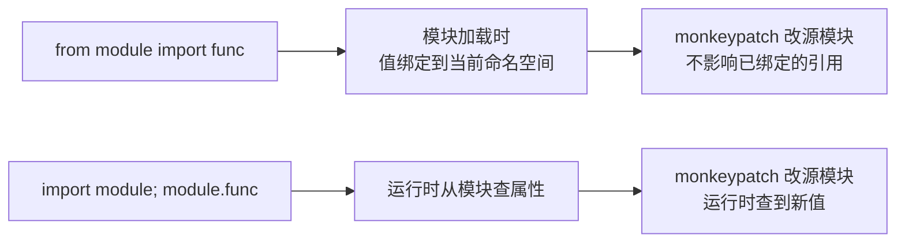

# Supervisor-Worker 编排

> 从零搭建 LangGraph StateGraph，核心踩了三个坑：`from-import` 导致 monkeypatch 失效、LLM 输出 JSON 裹着 ``` 需要正则抠取、以及普通 list 字段在并发分支里被后写者覆盖——最后一条修了一行代码，查了两小时。

## 一、背景

cr-agent 的核心卖点是"多 Agent 并行审查"——不是用一个 LLM 看所有维度，而是拆成安全/质量/性能/架构四个专业 Worker 并行执行。实现这个模式需要三个能力：**状态共享**（所有节点读写同一份数据）、**并发分支**（4 个 Worker 同时跑）、**条件路由**（正常走并行，超限走熔断）。

LangGraph 的 StateGraph 正好提供这三样：共享 TypedDict 作为"数据总线"、add_conditional_edges 返回 list 自动 fan-out、reducer 解并发写冲突。第一版目标是先搭骨架——占位 Worker 调通链路，验证图能跑、路能通、结果能合。

## 二、逐个讲：问题 → 怎么想 → 怎么解

### 1. 为什么选 LangGraph 而非 CrewAI/AutoGen？

**问题**：多 Agent 编排框架有 CrewAI、AutoGen、LangGraph 三个主流选择，哪个更适合代码审查场景？

**怎么分析**：三个框架的定位完全不同。CrewAI 是"角色委派"模式——定义 Agent 角色和 Task，call kickoff 一键执行，内部怎么路由完全黑盒。AutoGen 是"对话协商"模式——Agent 之间互相聊天达成共识，适合谈判/辩论场景。LangGraph 是"有向图编排"——节点是函数、边是路由、状态是共享 TypedDict，每一步都显式可控。

代码审查是流水线式（拆任务→并行执行→聚合报告），不需要 Agent 对话。而且实践中我要能讲清楚"为什么这么路由、并发数据怎么不丢"，CrewAI 的黑盒让我讲不出来。

**怎么解**：选 LangGraph。核心优势是条件路由返回 `list[str]` 自动 fan-out，配合 `Annotated[list, operator.add]` reducer 解决并发写冲突。这两个特性恰好对应 cr-agent 的两个核心需求：并行审查和结果合并。

### 2. from-import 导致 monkeypatch 失效

**问题**：test_decompose_success 期望 LLM 返回 1 个 task，结果拿到 4 个降级默认任务。日志显示 Missing credentials——说明 decompose_node 调的是真实 get_chat_client，我 monkeypatch 的假客户端根本没生效。

更诡异的是 test_build_graph_and_invoke 居然"过了"，但那是因为真客户端报错→走降级→恰好也产出报告，属于"假绿"。

**怎么分析**：decompose.py 里写的是 `from backend.core.llm import get_chat_client`。这行在模块加载时把函数对象**绑定到了 decompose 自己的命名空间**。之后 `monkeypatch.setattr("backend.core.llm.get_chat_client", fake)` 只改了 backend.core.llm 模块的属性，decompose 内部那个早已绑好的引用**不会跟着变**。

**怎么解**：改成模块级引用 `from backend.core import llm as llm_mod`，运行时 `llm_mod.get_chat_client()`。这样 monkeypatch 改 `backend.core.llm.get_chat_client` 就能被看到。



### 3. LLM 返回的 JSON 不能直接 json.loads

**问题**：LLM 常把 JSON 包在 ```json ``` 里，或前后夹解释文字，直接 `json.loads(text)` 必抛 JSONDecodeError。

**怎么解**：用正则 `re.search(r"\[.*\]", text, re.DOTALL)` 抠出第一个 `[` 到最后一个 `]` 的子串再解析。抓不到就抛错走降级。这一步让"LLM 返回了非 JSON"和"LLM 废话太多"都被同一个降级路径兜住。

## 三、关键决策与取舍

| 决策 | 选择 | 取舍 |
|------|------|------|
| 编排框架 | LangGraph StateGraph | 比 CrewAI 多写 ~100 行图定义，但每步执行可观测、可中断、可断点续跑 |
| 并发模型 | StateGraph fan-out（多节点多边） | 框架自动并行，无需手写 asyncio.gather |
| 状态容器 | TypedDict + Annotated | 比自建 dataclass 省样板，reducer 声明式 |
| LLM 调用 | 模块引用（import module） | 比 from-import 多一行，但 monkeypatch 可工作 |
| JSON 解析 | 正则抠 `[ ]` 后 json.loads | 比要求 LLM 输出纯 JSON 更宽容，但可能抠到无关内容 |

## 四、踩坑

1. **from-import 假绿**：`from module import func` 值绑定 + monkeypatch 改源模块，导致测试"假绿"（真客户端报错→降级→断言通过）。修了引用方式后，又在一个测试里发现同样的假绿——因为同事写的新节点也用了 from-import。教训：**代码审查不仅要看逻辑，还要看依赖注入方式**。

2. **LLM JSON 外套 ```json**：第一版 `json.loads(text)` 必挂，改成正则 `\[.*\]` 后解决了 90% 的 case。但有个特殊 case：LLM 返回 `{"findings": [...]}`（对象包裹数组）。解法：先试对象提取，失败再试数组提取。

3. **空代码导致 decompose 调 LLM**：初始版没检查 code 为空，空代码也调 LLM 拿回一坨无意义 task。加 `if not code: return {"tasks": [], "errors": [...], "iteration_count": 0}` 短路。

## 五、常见疑问

**Q1：为什么不用 CrewAI？** A：三个原因。第一，我需要并行 fan-out，CrewAI 的任务委派是串行的——它更适合"按顺序做三件事"不是"同时做四件事"。第二，我需要结构化共享状态 + reducer 处理并发写冲突，CrewAI 各 Agent 状态独立。第三，我需要条件路由做熔断，LangGraph 的 `add_conditional_edges` 原生支持。选型的第一性原理是架构-任务对齐。

**Q2：LangGraph 的 reducer 是什么？** A：Reducer 定义多个并发分支写同一个 state 字段时怎么合并。默认是 last-writer-wins（后写覆盖）。`Annotated[list, operator.add]` 告诉框架：并发分支的 list 用 `+` 拼接，而不是覆盖。类似数据库的 merge 语义。

---

## 相关笔记

- [[01-技术研读/00-17条架构决策总览|00 17条架构决策总览]]
- [[01-技术研读/01-Supervisor-Worker编排与StateGraph|01 Supervisor-Worker编排与StateGraph]]
- [[03_Worker与TemplateMethod设计|03 Worker与TemplateMethod设计]]

## 技术学习笔记

- [[15-Agent架构与工具调用|Agent架构与工具调用]]
- [[44-LangChain框架入门|LangChain框架入门]]
- RAG vs Agent
- [[37-Multi-Agent协作模式|Multi-Agent协作模式]]
- [[27-指数退避重试：Exponential Backoff + Jitter|指数退避重试]]

**Q3：如果 Workers 数量不固定怎么办？** A：当前架构就支持动态路由。`_route_after_decompose` 从 `state["tasks"]` 读实际角色列表，只 fan-out 出现的 Worker。小代码段可能只跑 2-3 个 Worker。初始版写死了 4 个，W3 才改成动态的——演进路径是"先跑通再优化"。
