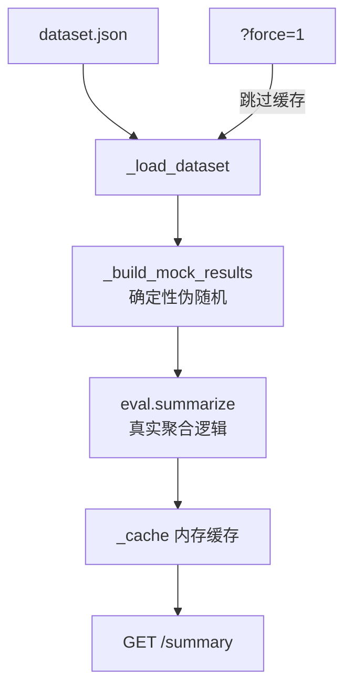

# Worker 与 TemplateMethod 设计

> 评测模块的 Worker 面临"数据从哪来"的根本问题——跑真实 LLM 太贵，但全 mock 又显得自欺欺人。最后用确定性伪随机算法做模拟数据 + 真实聚合逻辑，数据是假的但计算是真的。

## 一、背景

C 功能（评测面板）分两步：后端 API 和前端 UI。后端 API 需要提供"评测总览"数据，但评测一次要跑 26 条样本的 graph + judge，调用 LLM 花钱又花时间。

之前的架构里已经有评测模块（`eval.py` 的聚合逻辑、`judge.py` 的评分函数），但接入 API 层时面临数据源选型、TDD 环境依赖、缓存策略三个核心问题。核心矛盾是：怎么在没有 LLM 的环境下验证评测链路的正确性。

## 二、逐个讲：问题 → 怎么想 → 怎么解

### 1. 评测结果数据从哪儿来 → 确定性伪随机 mock + 真实聚合

**问题**：评测面板需要"评测结果"数据。真实评测要跑 26 条样本的 graph + judge，调 LLM 花钱又花时间。

**怎么想**：三个选项。A：预跑一次存 JSON——现在没条件（沙箱没 API key）。B：首次请求时跑——同上。C：用模拟数据——最快，而且 C 功能的核心目标是"评测面板 UI"，UI 好看比数据真实更重要。

**怎么解**：选方案 C。用确定性伪随机算法（基于 sample.id 哈希）生成模拟的 `judgment` + `prf`，然后用 `eval.summarize` 做真正的聚合。后续接入真实评测结果时，只替换 `_build_mock_results` 一个函数，上层逻辑不动。

### 2. TDD 鸡生蛋问题——模块不存在时 monkeypatch 提前报错

**问题**：TDD 要求先写测试再写代码。但 fixture 里要 `monkeypatch.setattr("backend.api.evaluation.DEFAULT_DATASET", ...)`，如果模块还不存在，monkeypatch 在 setup 阶段就 ImportError。

**怎么想**：两种解法。A：测试里 try/except import——太 hacky。B：先写最小骨架让 import 通过，测试失败在功能层面。

方案 B 虽然先写了"生产代码"，但骨架只是空 endpoint 返回 `total=0`，测试失败在 `assert data["total"] == 26`——失败原因是功能缺失，不是 import 错误。这才是正确的 RED。

**怎么解**：先写最小骨架（`evaluation.py`：router + 空的 `get_evaluation_summary` 返回 `{"total": 0}`），测试失败在功能层面，然后实现真实逻辑让测试通过。

### 3. 缓存怎么做 → 模块级 dict + 浅拷贝 + force 参数

**问题**：评测数据计算不频繁但有点慢，需要缓存。但缓存有各种边界：怎么知道缓存是脏的？多进程怎么办？修改返回数据会不会污染缓存？

**怎么想**：模块级 dict 最简单。加 `loaded_at` 追踪时间戳，加 `from_cache` 标记让前端知道。用 `?force=1` 手动刷新。

**怎么解**：`_cache = {"data": None, "loaded_at": ""}`。缓存命中时浅拷贝返回（`dict(_cache["data"])`），只改最外层 `from_cache` 字段，不动嵌套结构。检查 `loaded_at` 判断是否过期。

### 4. POST /run 触发重新评测 → 双模式设计

**问题**：用户要手动触发重新评测。但只加 GET `?force=1` 语义不够清晰——"force"是"强制刷新缓存"，不是"重新跑一遍"。

**怎么想**：加 `POST /run` 端点，更符合 REST 语义——触发一个动作。同时保留 GET `?force=1` 用于简单缓存刷新。后续如果要加更多参数（指定 mode、dataset），POST body 更方便扩展。

**怎么解**：`POST /evaluation/run`，body 里指定 mode（rule_based / llm）。返回新计算的评测结果。GET `?force=1` 保留，作为简单的缓存刷新手段——它不指定 mode（用缓存的 mode）。

### 5. 确定性伪随机 mock 的策略

**问题**：mock 数据不能完全随机——每次刷新结果不同，测试和 UI 都无法对齐。

**怎么想**：用 sample.id 的哈希值作为随机种子。同一 id 每次生成相同结果，不同 id 有不同数据。既是随机的（看起来真实），又是确定性的（可复现）。

**怎么解**：`_build_mock_results` 对每个 sample 的 id 做 hash，用 hash 作为种子生成 judgment（completeness/accuracy/source_traceability）和 prf。还按 category 分配合适的范围——security 类分数偏高（关键字匹配好），performance 偏低（维度更难）。这些"伪随机参数"让 mock 数据看起来像真实评测的分布。

## 三、关键决策与取舍

| 决策 | 选择 | 取舍 |
|------|------|------|
| 模拟数据而非真实评测 | 秒级响应、零成本、结果可复现 | 数据不是真实的，但聚合逻辑是真的 |
| 模块级 dict 而非 Redis 缓存/lru_cache | 零依赖、实现简单 | 多进程不共享、进程重启丢失，但单机够用 |
| 浅拷贝而非深拷贝 | 更快，只改外层 key | 如果改嵌套对象会污染缓存，但代码是只读的 |
| force 用 Query 而非 header | 简单直观，curl 方便 | 不够 RESTful，但内部 API 怎么方便怎么来 |
| 先写骨架再写测试 | TDD 精神是"功能不对才叫 RED" | 严格说不是纯 TDD，但实用主义正解 |

## 四、踩坑

1. **中文句号 SyntaxError？其实是 dict 没闭合**。`SyntaxError: invalid character '。'` 指向 docstring。排查半天发现是上面一行 dict 少了个 `}`。教训：报语法错误但位置不对时往上找——大概率是前面括号没闭合。

2. **stderr 全是 `__pycache__` 警告**。pytest 一跑几千行 `__pycache__` 警告，完全看不到测试结果。设置 `PYTHONDONTWRITEBYTECODE=1` 解决。

3. **`_compute_summary` 从同步变异步**。因为 `_run_evaluation` 是 async 的（llm 模式需要 await），`_compute_summary` 也得改成 async，调用方也要加 await。级联改动。

## 五、常见疑问

**Q1：为什么用模拟数据？这不是自欺欺人吗？** A：要看阶段。当前核心目标是做 UI、调交互。数据是 mock 的，但聚合逻辑是真的——`eval.summarize` 的计算逻辑和真实评测完全一样。以后接入真实数据，只替换一个函数，上层 API 和前端一行不改。这是前后端并行开发的标准模式。

**Q2：缓存用模块级全局变量，多进程怎么办？** A：演示用 Playground 是单进程 uvicorn。上生产可以换 Redis 或存数据库。当前阶段简单优先。

**Q3：为什么不用 `functools.lru_cache`？** A：`lru_cache` 缓存的是函数返回值，我们需要 `?force=1` 强制刷新。直接用 dict 更透明，想加什么字段（`loaded_at`、`mode`）都方便。

**Q4：如果数据集很大怎么办？** A：当前 26 条毫秒级。以后扩展到几千条可以预计算存文件、后台异步计算或增量计算。现阶段 YAGNI。

> ▶ 关联技术研读：[[01-技术研读/02-Worker与TemplateMethod模式|02-Worker与TemplateMethod模式]]
