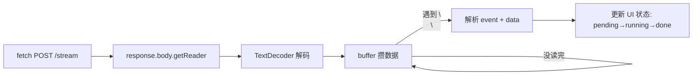

# Supervisor-Worker 编排

> 后端 LangGraph 的 Supervisor-Worker 架构做好了，但用户看不见就等于没有。前端进度面板要可视化 6 节点 DAG 的实时流动，核心难点是：怎么用 POST 发 SSE、怎么让 4 个并行 Worker 不显示乱、怎么在没有后端的沙箱里测前端。

## 一、背景

在开发1时做好了后端 SSE 流式 endpoint，但光有接口没用——用户看不见进度，就感受不到"多 Agent 并行审查"的核心卖点。前端进度面板是把 Supervisor-Worker 架构"可视化"的关键一步。

后端已经有了完整的 6 节点 DAG：Supervisor（任务拆解）→ 4 个 Worker（安全/质量/性能/架构）并行 → Aggregator（报告聚合）。前端需要把每个节点的状态（pending → running → done）实时反映到 UI 上。

## 二、逐个讲：问题 → 怎么想 → 怎么解

### 1. EventSource 只支持 GET，没法 POST 传长代码 → fetch + ReadableStream 手动解析 SSE

**问题**：浏览器原生 EventSource 只支持 GET 请求，但 code 参数可能长达 5 万字，query string 塞不下。

**怎么想**：两个方案。A：用 EventSource，先发 POST 创建任务再用 GET 订阅——要改后端接口，拆成两步。B：用 `fetch` + `response.body.getReader()` 手动读 SSE 流，自己解析 `event:`/`data:` 行——后端不用动。

方案 B 更灵活，可以加自定义 header、传 JSON body，而且解析逻辑很简单。

**怎么解**：选方案 B。用 `TextDecoder` 把 Uint8Array 转字符串，buffer 攒数据遇到 `\n\n` 拆事件，每个事件里找 `event:` 和 `data:` 前缀。~20 行代码搞定。

### 2. 后端起不来（fastmcp 缺失）→ dev_server.py mock

**问题**：开前端调试需要后端配合，但直接 `uvicorn backend.main:app` 报 `ModuleNotFoundError`。

**怎么想**：跟测试环境一样的问题。前端要测，后端必须能跑。写一个启动脚本，在 import app 之前 mock 掉 fastmcp。

**怎么解**：`dev_server.py`——在顶部 mock fastmcp（跟 conftest 一样的逻辑），再 import app 启动 uvicorn。开发环境能跑起来了。

### 3. 浏览器缓存旧前端 → URL 参数 bypass

**问题**：改了 index.html，刷新浏览器还是旧页面。

**怎么想**：FastAPI 的 StaticFiles 不应该缓存……但浏览器会缓存静态资源。而且自动化工具的浏览器实例可能有自己的缓存策略。

**怎么解**：开发调试时用 `?v=时间戳` 绕过缓存。

### 4. 4 个 Worker 并行显示会不会乱 → 各维护独立状态

**问题**：4 个 Worker 同时执行，前端怎么保证显示不乱？

**怎么想**：每个 Worker 有独立的节点卡片，各自维护自己的状态（pending → running → done）。4 个同时变 running 正好体现"并行执行"的卖点。

**怎么解**：6 个节点纵向排列，`setNodeState(nodeId, state)` 函数根据 `node_start` / `node_end` 事件更新对应卡片。事件驱动，没有额外的状态协调逻辑。

## 三、关键决策与取舍

| 决策 | 选择 | 取舍 |
|------|------|------|
| fetch + ReadableStream 而非 EventSource | 支持 POST + JSON body，更灵活 | 多写 ~20 行解析代码，但逻辑简单 |
| 进度面板放侧栏而非代码区顶部 | 不压缩主工作区 | 侧栏宽度需要调整，但可折叠缓解 |
| 6 节点纵向排列而非时间线 | 适配侧栏窄布局 | 缺少"时间流动"视觉感，但三态图标够表达 |
| 保留旧的 submitReview 作 fallback | 流式出问题能切回同步 | 多一份重复代码，但控制流完全不同 |

## 四、踩坑

1. **browser 工具点 Sample 按钮报 "Click target intercepted"**。用 `browser_evaluate` 执行 JS 触发点击绕过坐标计算。教训：自动化工具点击坐标可能不准，JS 触发更可靠。

2. **改了 index.html 但浏览器还是旧页面**。PowerShell `Invoke-WebRequest` 确认服务器返回新文件，说明是浏览器缓存。加 `?v=2` 解决。教训：前端开发时缓存永远是第一个要排查的。

3. **fastmcp 缺失导致后端起不来**。跟测试环境一样的问题，写 `dev_server.py` 启动脚本 mock 掉。教训：开发环境和测试环境保持一致的 mock 策略。

## 五、常见疑问

**Q1：为什么不用 WebSocket 做实时进度？** A：审查进度是单向流，WebSocket 是双向通道——用在单向场景是过度设计。SSE 自带自动重连，跟 HTTP 鉴权兼容。如果以后要做"取消审查"这种双向交互再切 WebSocket。

**Q2：EventSource 是标准 API，为什么自己用 fetch 解析？** A：EventSource 只支持 GET，传不了长代码。用 fetch + ReadableStream 手动解析 SSE，可以用 POST 传 JSON body，加自定义 header，灵活得多。解析也不复杂——按 `\n\n` 拆事件，20 行代码。

**Q3：4 个 Worker 并行显示会不会乱？** A：每个 Worker 有独立卡片，各自维护状态。4 个同时变 running 正好体现"并行执行"的卖点——用户一眼看到"4 个 Agent 同时在审查代码"。这是 Feature 不是 Bug。

---

## 相关笔记

- [[01-技术研读/00-17条架构决策总览|00 17条架构决策总览]]
- [[01-技术研读/05-API与CLI接口契约|05 API与CLI接口契约]]
- [[04_Aggregator聚合与E2E链路|04 Aggregator聚合与E2E链路]]

## 技术学习笔记

- [[15-Agent架构与工具调用|Agent架构与工具调用]]
- [[笔记/技术学习/TypeScript React/05-React-Router路由系统|React-Router路由系统]]
- [[笔记/技术学习/TypeScript React/06-React Hooks深入|React Hooks深入]]
- [[笔记/技术学习/TypeScript React/07-React副作用与自定义Hook|React副作用与自定义Hook]]
- [[笔记/技术学习/异步与鉴权/03-SSE流式响应与Backpressure控制|SSE流式响应]]

**Q4：进度面板和后端 graph 节点一一对应吗？** A：一一对应。后端 6 个业务节点，前端 6 个卡片。后端发 `node_start` 前端设 running，发 `node_end` 前端设 done。纯事件驱动，没有中间层。后端加节点，前端加一个 HTML 元素就行。
