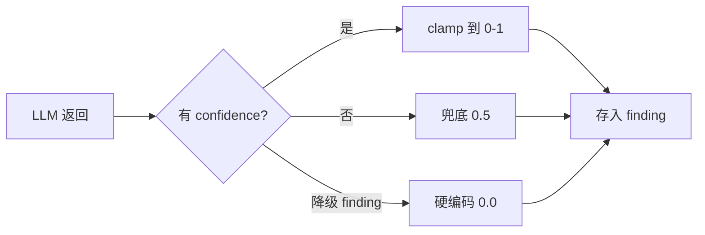
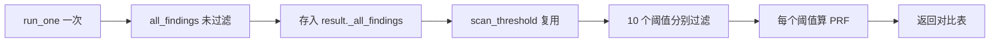

# Bad Case 优化与置信度体系

> 给每条 LLM 审查结果贴上"可信度标签"，用阈值过滤把 precision 从 0.08 拉到可接受范围，并可视化调参过程。

## 一、背景（为什么要做这个）

跑 26 条评测集，composite=0.87、recall=0.77，但 precision 只有 **0.08**——LLM 每报 10 个问题，只有 0.8 个是真的，剩下 9 个都是误报。这个数字放到场上，一听 precision 0.08 直接就皱眉头了。

根源：所有 finding 没有置信度信号。LLM 天生爱"多报"，宁可误报也不漏报。每条 finding 都没有"我有多确定"的信号，我完全没法区分"LLM 非常确定这是硬编码密钥"和"LLM 随口说这里命名不太好"。

解法很直觉：**让 LLM 自评置信度**。confidence 字段（0-1），后续 Aggregator 用阈值过滤低置信度噪音。但这里有个先有鸡还是先有蛋的问题——数据层没有 confidence，再好的过滤方案都落地不了。所以必须先从数据结构改起。

## 二、逐个讲：问题 → 怎么想 → 怎么解

### 2.1 Worker 加 confidence 字段（做 Task 13.1 时）

**问题**：所有 finding 没有置信度，数据层面不支持过滤。

**怎么想**：让 LLM 自评 confidence。Prompt 里要求它输出置信度，但代码层必须兜底——LLM 可能不听话。**Prompt 是建议，代码是合同**。

**怎么解**：`_clamp_confidence` 纯函数，三档兜底。正常返回 clamp 到 [0,1]；缺失给 0.5（不偏不倚）；降级 finding 给 0.0（最不可信）。这里有个关键考量——降级 finding 本质是"Worker 出问题了，没真正审查"，不是"审查了但不确定"，所以给 0.0 让它被过滤掉。

### 2.2 Aggregator 阈值过滤（做 Task 13.2 时）

**问题**：数据有了但没用起来，所有 finding 一股脑进报告，precision 还是 0.08。

**怎么想**：阈值过滤放 Aggregator 层不是 Worker 层。Worker 层过滤了，Aggregator 就看不着完整数据，没法调参。分层职责——Worker 产数据，Aggregator 做展示决策，Report 层渲染。

**怎么解**：`split_by_confidence` 纯函数返回 (high, low)。报告分两区：正式发现 + 低置信度提示（折叠）。**先过滤再去重**，避免两个 Worker 报同一问题但 confidence 不同时，合并逻辑不知道取哪个。

### 2.3 阈值扫描找最优 F1（做 Task 13.3 时）

**问题**：最优阈值靠拍脑袋。默认 0.0 是占位值，手动改配置跑一遍 10 个阈值要 10 × 10 分钟 = 100 分钟。

**怎么想**：跑一次 graph 拿所有 findings，过滤是纯本地 O(n) 操作。LLM 调用和调参解耦——空间换时间。

**怎么解**：`scan_threshold` 复用 `_all_findings` 扫 0.0-0.9 共 10 个阈值。第一版用"乐观估计"（假设过滤掉的都是 FP），写完测试发现 recall 不变——这不科学。根因：过滤掉的可能包含 TP。改成用真实 expected 数据重算 PRF。**能直接用真实数据就别用假设**。

### 2.4 前端阈值面板（做 Task 13.4 时）

**问题**：CLI 入口，用户看不着。

**怎么想**：用模拟数据（基于 sample id 哈希确定性生成）非真实 LLM findings，秒级响应。真实最优阈值跑 CLI 拿。MVP 阶段先跑通端到端链路，数据真实性分阶段提升。

**怎么解**：Chart.js 折线图 P/R/F1 三条线+色盲友好配色，滑块整数 0-9 映射 0.0-0.9（避免浮点精度问题），4 种调参建议（最优/接近最优/偏低/偏高），5% 容差避免"最优 0.4 选 0.5 被警告"的过度敏感。

## 三、关键决策与取舍

| 决策 | 选择 | 取舍 |
|------|------|------|
| confidence 兜底 | Worker 层 0.5，Aggregator 层 0.0 | 分层防御：Worker 公平，Aggregator 保守 |
| 过滤位置 | Aggregator 层 | 调参灵活 vs 数据完整性 |
| 过滤 vs 去重顺序 | 先过滤再去重 | 规避合并取舍问题 vs 丢 cross-worker 印证 |
| scan_threshold 数据源 | 复用已有 results | 秒级 vs 同一套 findings 扫全部，精度差点 |
| 前端数据 | 模拟数据非真实 LLM | 秒级响应 vs 最优阈值不真实 |
| 前端滑块 | 整数 0-9 映射 | 稳 vs 步长 0.05 更精确 |
| 调参建议 | 4 状态 + 5% 容差 | UX 友好 vs 精确但敏感 |

## 四、踩坑（值得讲的故事）

**scan_threshold 第一版用乐观估计算 recall**——公式里假设过滤掉的都是 FP，recall 不变。测试跑完发现 recall 全程不变才意识到错。其实这是"不想加 _expected 字段"的偷懒。老老实实在 `run_one` 返回值里塞 `_expected` 和 `_all_findings`，用真实数据重算，代码更简单、结果更可信。

**RED 阶段意外有 1 个 passed**。写 8 个测试跑 RED 预期全 failed，结果 `test_parse_response_with_confidence` 居然过了。排查发现原代码用 `setdefault` 设 worker 字段，setdefault 只在 key 不存在时才赋值，LLM 返回的 confidence 被原样保留。**旧代码恰好兼容测试期望**——不是测试写错。

**Chart.js 没有 destroy 导致叠加渲染**。每次切 Tab 折线图多一层，越来越花。根因：`renderScanChart` 创建新实例前没销毁旧的。修复很 trivial：模块顶层声明实例变量，渲染前 destroy。

**滑块初始化不触发事件**。HTML `<input value="0">` 设了初始值但 `updateThresholdMetrics` 不自动跑——只有 `input` 事件才会。手动初始化时调一次即可。这是 DOM 事件模型的常见坑。

**CLI 的 SimpleNamespace 没 import**。REFACTOR 阶段发现 `_RuleJudgeClient` 用了 `SimpleNamespace` 但模块顶部没 import。GREEN 阶段测试用 `_FakeJudgeClient` 不走 CLI 路径，所以没暴露。**CLI 路径需要冒烟测试**。

## 五、常见疑问

**Q: confidence 完全靠 LLM 自评，怎么保证可信？**
A: 不保证。LLM 可能过度自信（全部给 0.9）或过度谦虚（全部给 0.5）。当前方案是"从 0 到 1"——先让数据结构支持置信度，后续可加 cross-worker 交叉验证（同问题多 Worker 报时加分）和历史校准（对比自评和实际命中率）。

**Q: 为什么缺失 confidence 的处理在 Worker 和 Aggregator 不一致？**
A: 分层防御。Worker 层缺失是 LLM 没给字段，给 0.5 公平。Aggregator 层如果还缺，说明数据来源不规范，给 0.0 保守。每层对自己输入做最保守假设。

**Q: scan_threshold 只扫 confidence 一个参数，够吗？**

---

## 相关笔记

- [[01-技术研读/00-17条架构决策总览|00 17条架构决策总览]]
- [[01-技术研读/09-LLM评测体系搭建|09 LLM评测体系搭建]]
- [[13_Langfuse可观测性搭建|13 Langfuse可观测性搭建]]

## 技术学习笔记

- [[39-Agent评测体系：benchmark-case-指标设计|Agent评测体系]]
- [[10-RAG 评估：检索指标 + 生成指标|RAG评估]]
- [[13-RAG 参数调优：网格搜索实验框架|RAG参数调优]]
- [[01-Token计费原理-Temperature控制-SystemPrompt层级|Token计费原理]]
- [[笔记/技术学习/可观测性与监控/01-Prometheus四层指标|Prometheus四层指标]]
A: 不够。实际可调的还有去重相似度阈值、Worker prompt、角色模型等。但 scan_threshold 的设计模式可复用——跑一次存数据，扫不同超参数。
