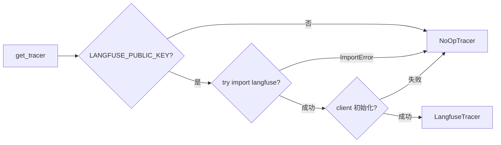
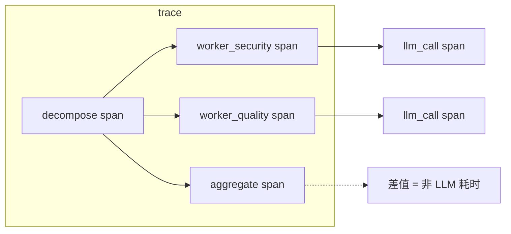

# Langfuse 可观测性搭建

> 给 Agent 装"黑匣子"：三层降级的 tracing 模块 + LLM 调用追踪 + 节点级链路，让 Agent 执行过程不再是个黑盒。

## 一、背景（为什么要做这个）

用户反馈"这次审查漏报了"，只能看平铺日志——哪个 Worker 跑了多久、LLM 调用花了多少 token、哪个节点失败重试，一概不知。日志是平的，不是结构化的调用链。

但有个现实约束：我当时没装 langfuse SDK（依赖冲突 / 用户环境差异），不能强制依赖。这引出了核心设计原则——**可选依赖 + 静默降级**。Observability 工具的可靠度应该 > 业务可靠度——业务挂了 observability 还在，才能排查问题。

## 二、逐个讲：问题 → 怎么想 → 怎么解

### 2.1 tracing 模块抽象（做 Task 14.1 时）

**问题**：Langfuse SDK 可能不存在，但 tracing 模块不能让业务挂掉。

**怎么想**：抽象 Span/Tracer 接口，NoOp + Langfuse 双 backend。Span 支持 `with` 上下文管理（资源自动释放 + 异常安全）。`_backend` 桥接模式——NoOp 时纯本地，Langfuse 时同步到 backend。

**怎么解**：`get_tracer()` 工厂函数三层降级——未配置返 NoOp，SDK 未装返 NoOp + warning，初始化失败返 NoOp + warning。任何错误降级为 NoOp，记日志但不抛异常。单例避免重复检测配置。

**踩坑**：单例跨测试泄漏。`get_tracer()` 的 `if _tracer is not None: return _tracer` 让前一个测试的 NoOpTracer 缓存污染了后续测试。8 个测试就这一个因为顺序依赖性失败，排查半小时。修复：加 `reset_tracer()` + autouse fixture 每个测试前后清空。

### 2.2 LLM 调用追踪（做 Task 14.2 时）

**问题**：tracing 基础设施有了但没人调用——空转。

**怎么想**：接入点选 `BaseWorker._call_llm`（Template Method），4 个 Worker 子类共享。改一处全覆盖，比在每个子类 `review()` 里加 tracing DRY 10 倍。

**怎么解**：`with tracer.start_span("llm_call", metadata={role, model, prompt_length})` 包裹。业务层用 `time.perf_counter()` 算 latency，Span 只存不计算。`getattr(resp, "usage", None)` 防御取值——OpenAI SDK 的 usage 可能为 None。

**踩坑**：fake client 没有 `resp.usage`。原有 `_make_fake_client` 只模拟 `choices[0].message.content`，测试永远拿不到 tokens。真实 SDK 的 resp 是有 usage 字段的。扩展 fake client 加 `total_tokens` 参数。

**踩坑**：monkeypatch 目标写错。base.py 用 `from backend.core import tracing as tracing_mod` 模块引用风格，patch 要打 `backend.core.tracing.get_tracer` 而不是 `base.get_tracer`。做 Phase 2 时就踩过这个 import 引用的坑，到 Phase 14 又踩了。

### 2.3 节点级链路追踪（做 Task 14.3 时）

**问题**：LLM 调用有 trace 了，但 decompose 花多久、worker 节点总耗时 vs LLM 耗时、aggregate 花多久——链路断片。

**怎么想**：给 graph 每个节点外包 span。节点 span 和 LLM span 嵌套后，差值 = 非 LLM 耗时（prompt 构建 + 结果解析），一图看清瓶颈。

**怎么解**：`_trace_node(name, fn)` 装饰器统一处理 6 个节点。`functools.wraps` 保留 `__name__`（LangGraph 诊断用）。异常路径记录 error + re-raise，不吞异常。metadata 只记 state_keys / result_keys 不记 values（省 token + 隐私）。部署时：`g.add_node("decompose", _trace_node("decompose", decompose_node))`。

**踩坑**：测试断言过宽。`test_node_span_metadata_has_state_keys` 写的是"所有 span 都要有 state_keys"，但 llm_call span 的 metadata 只有 role/model/prompt_length。不同类型的 span 有不同的 metadata 契约。修复：按 span name 分组检查。

**踩坑**：patch decompose_node 不生效。graph.py 用 `from ... import decompose_node` 绑定到模块命名空间，patch 源模块不影响。patch graph 模块的引用才生效。同一个 import 引用坑再踩一次。

## 三、关键决策与取舍

| 决策 | 选择 | 取舍 |
|------|------|------|
| SDK 集成 | try/except import 可选依赖 | 零侵入 vs 用户需手动装包 |
| 降级策略 | 三层降级到 NoOp | 业务永不挂 vs 用户不知 tracing 没开 |
| Span 接口 | 同步 with 上下文 | async 函数内能用 vs 异步 __aenter__ 更灵活 |
| latency 计算 | 业务层 time.perf_counter | 职责分离 vs Span 内自动算更方便 |
| 节点 tracing | 装饰器统一包裹 | DRY 一次写 6 处复用 vs 堆栈多一级 |
| 异常路径 | 记录 error + re-raise | 可观测 vs 不吞异常可能触发熔断 |
| metadata | 只记 keys 不记 values | 省 token + 隐私 vs debug 不够用 |

## 四、踩坑（值得讲的故事）

**单例跨测试泄漏**排查了最久。`test_get_tracer_with_langfuse_sdk_returns_langfuse_tracer` 测试拿到 NoOpTracer 不是因为代码错了——是因为前一个测试先创建了 NoOp 单例缓存在模块变量里。这是"测试顺序决定结果"的经典陷阱。`reset_tracer()` 函数 + autouse fixture 解决。

**Python import 引用的坑踩了三次**。graph.py 用 `from m import f` 风格时，patch 目标必须是 graph 模块的 `f` 引用。base.py 用 `from m import m as m_mod` + `m_mod.f()` 风格时，patch 目标却是源模块的 `f`。两种风格混用极容易出错。根治：**统一所有模块的 import 风格**——都改成 `from m import m as alias` + `alias.f()`，patch 目标就统一是源模块了。

## 五、常见疑问

**Q: NoOp tracer 真的零开销吗？**
A: 接近。NoOpTracer.start_span 只是 return Span(name, metadata)，Span.__enter__ return self，__exit__ 设 `_ended = True`。没有网络 IO、序列化、磁盘写入。相对 LLM 调用的秒级耗时，可忽略。

**Q: 装饰器方案有什么缺点？**
A: 让堆栈加一级，调试时 traceback 多一层。`functools.wraps` 虽然保留 `__name__` 和 `__doc__`，但 `inspect.signature` 看到的还是 `wrapped(state)` 的签名，不是原节点函数。当前 LangGraph 不依赖这个。

**Q: 为什么不记 prompt 全文？**

---

## 相关笔记

- [[01-技术研读/00-17条架构决策总览|00 17条架构决策总览]]
- [[01-技术研读/09-LLM评测体系搭建|09 LLM评测体系搭建]]
- [[14_AgentHarness评估框架|14 AgentHarness评估框架]]

## 技术学习笔记

- [[39-Agent评测体系：benchmark-case-指标设计|Agent评测体系]]
- [[笔记/技术学习/可观测性与监控/01-Prometheus四层指标|Prometheus四层指标]]
- [[笔记/技术学习/可观测性与监控/02-Grafana-Dashboard预置面板|Grafana Dashboard]]
- [[笔记/技术学习/可观测性与监控/05-结构化JSON日志|结构化JSON日志]]
- [[笔记/技术学习/可观测性与监控/08-Request-ID-全链路追踪|Request-ID全链路追踪]]
A: 代码可能几千行，上传 Langfuse 会爆 token 配额 + 泄露用户代码。如果 debug 需要全文，应该 10% 概率采样上传或截断前 2K tokens。
