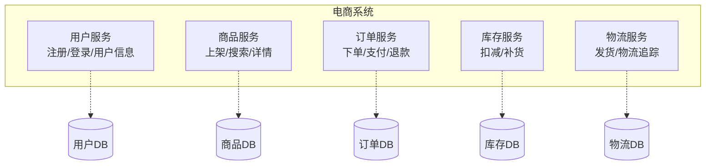
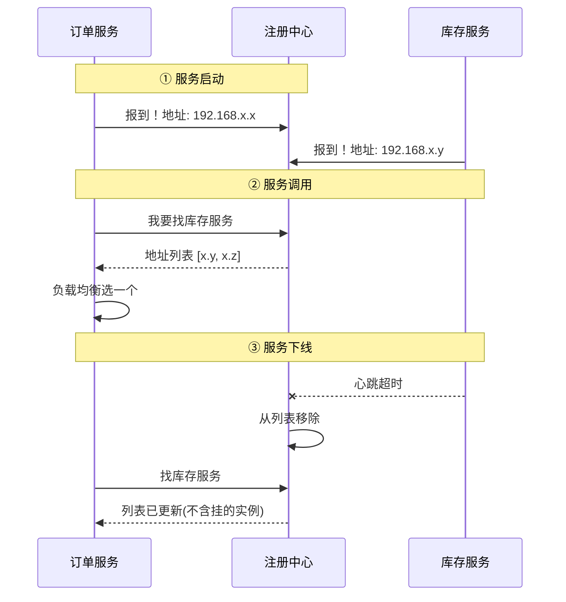
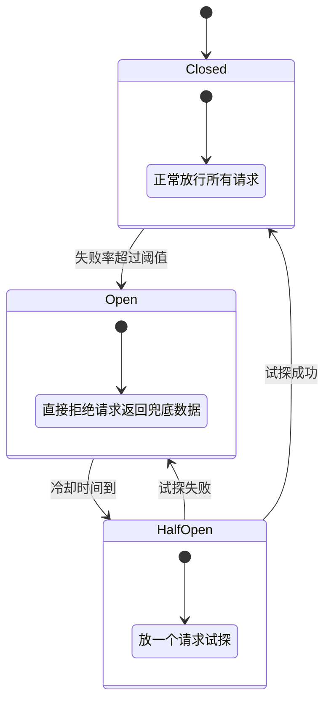
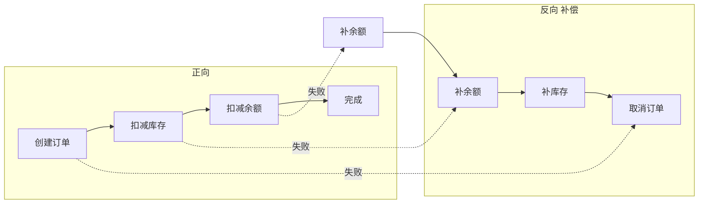
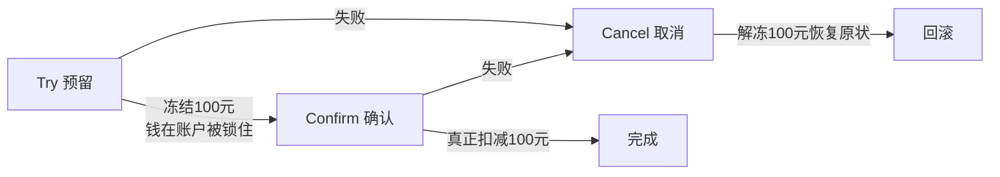
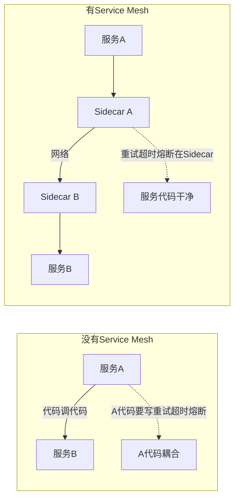

---

title: "微服务架构"

created: "2026-07-13"

tags:

  - 八股文

  - 分布式

source: "每日笔记综合"

---

# 微服务架构

---

## 一、单体架构 vs 微服务架构
### 1.1 什么是单体架构

把所有功能模块（用户、订单、支付、库存……）打包成一个应用部署。就像一家餐厅——厨师、服务员、收银员全挤在一个屋子里，共享同一个厨房（数据库）、同一套工具。

**优点**：部署简单、调试方便、一个项目就能跑起来。

**缺点**：代码耦合严重，改一行代码要重新部署整个应用；一个模块出了 Bug 可能把整个系统拖垮；技术栈被锁死，不能单独升级某个模块。

### 1.2 什么是微服务架构

把一个大系统拆成多个**独立的小服务**，每个服务只负责一件事，各自部署、各自维护。就像一家连锁餐饮集团——中央厨房（API Gateway）负责接单，各个分店（微服务）独立运营，互不干扰。

| 维度 | 单体架构 | 微服务架构 |

| ------ | ---------- | ----------- |

| 部署 | 一起部署，改一个全重来 | 独立部署，改哪个重启哪个 |

| 技术栈 | 全部统一 | 每个服务可以用不同语言/框架 |

| 扩展 | 整体扩容，浪费资源 | 按需扩容——订单服务扛不住就只扩订单 |

| 故障隔离 | 一个模块挂了全站挂 | 一个服务挂了，其他服务正常运行 |

| 开发效率 | 初期快，后期代码量大了变慢 | 初期慢（要搭基础设施），后期各团队并行开发快 |

| 复杂度 | 代码复杂但架构简单 | 代码可能简单但运维复杂 |

> **一句话讲清**："单体架构适合早期快速验证，微服务适合业务复杂到一定程度后的拆分。不是越早拆越好——过早微服务化等于给自己找一堆运维麻烦。"

---

## 二、服务拆分原则
### 2.1 按业务领域拆（DDD 思想）

不要按技术层拆（数据层、接口层、逻辑层），而是按**业务能力**拆：

### 2.2 拆分的三条铁律

| 原则 | 说明 | 违反的后果 |

| ------ | ------ | ----------- |

| **高内聚** | 一个服务内的功能应该紧密相关 | 用户服务里混了订单逻辑 → 改订单要动用户服务 |

| **低耦合** | 服务之间只通过 API 通信，不共享数据库 | 订单服务直接读库存表 → 库存表结构一改订单就崩 |

| **单一职责** | 一个服务只做一件事 | 商品搜索和商品推荐放一个服务 → 搜索挂了推荐也挂 |

---

## 三、服务注册与发现
### 3.1 问题：服务怎么找到彼此？

微服务架构下，服务实例的 IP 地址和端口是动态变化（容器随时扩缩容）。不能在代码里写死 `http://192.168.1.100:8080`——这个 IP 明天可能就变了。

### 3.2 解决方案：注册中心

### 3.3 常见注册中心对比

| 注册中心 | 开发者 | 一致性模型 | CAP 选择 | 特点 |

| --------- | -------- | ----------- | --------- | ------ |

| **Eureka** | Netflix | AP | 可用性优先 | 自我保护机制，临时节点 |

| **Nacos** | 阿里巴巴 | CP/AP 可切换 | 灵活 | 支持配置中心，社区活跃 |

| **Zookeeper** | Apache | CP | 一致性优先 | 强一致但写性能低 |

| **Consul** | HashiCorp | CP | 一致性优先 | 内置健康检查和 KV 存储 |

> **一句话讲清**："注册中心选型看场景——需要强一致用 Zookeeper/Consul，需要高可用用 Eureka，想功能全就用 Nacos。阿里系项目普遍用 Nacos，因为它同时解决了注册中心和配置中心两个问题。"

---

## 四、API Gateway（网关）
### 4.1 为什么需要网关

如果没有网关，客户端（App/网页）需要直接知道每个微服务的地址——几十个服务的地址全写在前端代码里，改一个地址就要重新发版。

网关就是所有请求的**统一入口**——客户端只认网关一个地址，网关负责把请求转发到后面的微服务。

### 4.2 网关的核心功能

| 功能 | 说明 | 类比 |

| ------ | ------ | ------ |

| **路由转发** | 根据 URL 把请求转到对应的微服务 | 酒店前台——"301 房间？找客房部" |

| **负载均衡** | 同一个服务有多个实例时，均匀分配请求 | 高速收费站——车多就多开几个窗口 |

| **认证鉴权** | 统一验证 Token，没登录的不让进 | 门卫——没工作证不让进大楼 |

| **限流熔断** | 防止某个服务被打爆影响全局 | 保险丝——电流过大自动断开 |

| **协议转换** | 对外暴露 HTTP，内部用 gRPC | 翻译官——对外说中文，对内说英文 |

### 4.3 常见网关方案

| 方案 | 特点 |

| ------ | ------ |

| **Spring Cloud Gateway** | Java 生态首选，响应式架构 |

| **Kong** | 基于 Nginx/OpenResty，高性能，插件丰富 |

| **Nginx** | 轻量级网关，适合简单路由场景 |

| **APISIX** | 国产开源，基于 Nginx + Lua，动态配置 |

---

## 五、服务间通信
### 5.1 同步通信：REST vs gRPC

| 维度 | REST (HTTP/JSON) | gRPC (HTTP/2 + Protobuf) |

| ------ | ------------------- | -------------------------- |

| 协议 | HTTP/1.1 | HTTP/2 |

| 数据格式 | JSON（文本，可读） | Protobuf（二进制，不可读但极快） |

| 性能 | 一般 | 比 REST 快 5-10 倍 |

| 跨语言 | 天然支持（HTTP 标准） | 需要生成代码（Proto 文件定义接口） |

| 学习成本 | 低 | 中等 |

| 适用场景 | 对外 API、前后端交互 | 服务内部通信、高性能要求 |

> **一句话讲清**："REST 适合对外暴露的 API——简单、跨平台、调试方便。gRPC 适合内部微服务之间的通信——二进制协议性能高，Proto 文件定义接口还能做编译期类型检查。两者不矛盾，网关对外用 REST，内部用 gRPC。"

### 5.2 异步通信：消息队列

服务之间不需要实时返回结果的场景，用消息队列解耦。比如用户下单后不需要等库存扣减完成——把消息扔到 MQ 就返回，库存服务自己慢慢消费。

具体 MQ 选型参见 [[06-消息队列MQ]]。

---

## 六、服务熔断与降级
### 6.1 熔断器模式（Circuit Breaker）

当下游服务出问题时，不要让请求继续傻等——直接断开，返回兜底数据。

### 6.2 降级策略

系统扛不住时，**主动砍掉非核心功能**，保住核心链路：

| 降级级别 | 策略 | 示例 |

| --------- | ------ | ------ |

| 一级降级 | 返回缓存数据 | 商品评价服务挂了 → 返回缓存里的评价 |

| 二级降级 | 返回默认数据 | 推荐服务挂了 → 返回热门商品列表 |

| 三级降级 | 功能直接关闭 | 积分服务挂了 → "积分功能维护中" |

### 6.3 常见熔断框架

| 框架 | 开发者 | 特点 |

| ------ | -------- | ------ |

| **Hystrix** | Netflix | 经典但已停止维护 |

| **Sentinel** | 阿里巴巴 | 实时监控+规则动态推送，Spring Cloud 生态 |

| **Resilience4j** | 社区 | 轻量级，函数式编程风格，Hystrix 替代品 |

详细对比参见 [[08-限流与熔断降级]]。

---

## 七、分布式事务
### 7.1 问题：跨服务的数据一致性

订单服务创建订单和库存服务扣减库存不在同一个数据库——没法用一个本地事务搞定。如果订单创建了但库存没扣，数据就不一致了。

### 7.2 解决方案一：Saga 模式

把一个长事务拆成一系列**本地小事务**，每个小事务都有对应的**补偿操作**。正向执行失败时，反向调用补偿操作回滚。

**优点**：每个服务只关心自己的本地事务，实现简单。

**缺点**：最终一致性，中间状态对外可见；补偿逻辑复杂且容易出 Bug。

### 7.3 解决方案二：TCC（Try-Confirm-Cancel）

两阶段提交的变种——先把资源**预留**起来，确认没问题再真正提交。

**优点**：资源预留保证了一致性。

**缺点**：每个服务都要实现 Try/Confirm/Cancel 三个接口，开发量大。

### 7.4 三种方案对比

| 方案 | 一致性 | 实现难度 | 性能 | 适用场景 |

| ------ | -------- | --------- | ------ | --------- |

| **2PC** | 强一致 | 低 | 差（锁资源） | 同一数据库内的跨表事务 |

| **TCC** | 强一致 | 高（三个接口） | 中 | 资金相关，需要预留机制 |

| **Saga** | 最终一致 | 中 | 好 | 长事务，业务流程可补偿 |

---

## 八、服务网格（Service Mesh）
### 8.1 什么是 Service Mesh

把微服务之间通信的复杂逻辑（熔断、限流、负载均衡、监控）从应用代码里**抽出来**，下沉到基础设施层。应用代码只管写业务逻辑，不用管通信怎么搞。

### 8.2 Sidecar 模式

每个服务实例旁边都挂一个**代理进程**（Sidecar），所有进出流量都经过这个代理。代理之间自动处理路由、熔断、监控。

### 8.3 Istio vs Linkerd

| 维度 | Istio | Linkerd |

| ------ | ------- | --------- |

| 开发者 | Google + IBM | Buoyant |

| 底层代理 | Envoy | Linkerd2-proxy (Rust) |

| 功能丰富度 | 极高（流量管理、安全、可观测） | 精简（核心通信） |

| 资源消耗 | 较高 | 极低 |

| 学习曲线 | 陡峭 | 平缓 |

| 适用场景 | 大规模复杂微服务 | 中小规模，轻量需求 |

> **一句话讲清**："Service Mesh 的核心价值是让业务代码和基础设施解耦。业务开发不用关心服务间通信的复杂性，运维团队统一管理流量策略。但 Service Mesh 引入了额外的延迟和运维成本，不是所有项目都需要——中小项目用好 Spring Cloud + Sentinel 就够了。"

---

## 九、快速问答

| 问题 | 一句话答案 |

| ------ | ----------- |

| 微服务和单体架构怎么选？ | 早期用单体快速验证，业务复杂到一定程度再拆微服务；过早微服务化是自找麻烦 |

| 微服务拆分原则是什么？ | 高内聚低耦合，按业务领域拆，一个服务只做一件事，不共享数据库 |

| 服务注册与发现是什么？ | 服务启动时向注册中心报到，调用时先问注册中心目标在哪——解决动态 IP 问题 |

| Eureka 和 Nacos 区别？ | Eureka 只做注册（AP），Nacos 同时做注册+配置中心，支持 CP/AP 切换 |

| API Gateway 的作用？ | 统一入口——路由转发、负载均衡、认证鉴权、限流熔断，客户端只认网关一个地址 |

| REST 和 gRPC 怎么选？ | REST 对外 API（简单跨平台），gRPC 内部通信（高性能二进制协议） |

| 什么是熔断器模式？ | 下游出问题→自动断开请求→返回兜底数据→冷却后试探恢复；三态：关闭→打开→半开 |

| Hystrix 和 Sentinel 区别？ | Hystrix 已停维护，Sentinel 是阿里开源的替代品，支持实时监控和动态规则推送 |

| 分布式事务怎么解决？ | 2PC（强一致但慢）、TCC（预留资源）、Saga（最终一致+补偿）——根据一致性要求选型 |

| Service Mesh 解决什么问题？ | 把熔断/限流/路由等通信逻辑从应用代码抽到 Sidecar 代理，业务代码只写业务逻辑 |

| 微服务有哪些常见问题？ | 服务雪崩、数据一致性、链路追踪、配置管理、部署复杂——都需要配套基础设施解决 |

---

## 速记卡（面试闪卡）

**Q1：一句话讲清「微服务架构」到底是什么？**

A：微服务把单体大系统拆成多个独立小服务，各自部署维护；适合业务复杂到一定程度，过早拆是自找运维麻烦。

**Q2：一、单体 vs 微服务（monolith vs microservice） —— 怎么理解？**

A：单体像一家小餐馆——厨师收银全挤一屋，部署简单但改一行要重发整个应用，一个 Bug 拖垮全场。微服务像连锁集团——中央厨房（网关）接单，各分店独立运营互不干扰，改哪个重启哪个、挂一个不影响其他。不是越早拆越好。

**Q3：二、拆分原则与注册发现（DDD & registry） —— 怎么理解？**

A：按业务领域拆（DDD），不是按技术层：高内聚（功能紧密相关）、低耦合（只走 API、不共享库）、单一职责。服务 IP 动态变，不能写死——启动时向注册中心（Eureka/Nacos/Zookeeper）报到，调用时先问注册中心拿到地址列表再做负载均衡。

**Q4：三、网关与通信（API Gateway & gRPC） —— 怎么理解？**

A：网关是所有请求的统一入口：路由转发、负载均衡、认证鉴权、限流熔断、协议转换（对外 REST 中文、对内 gRPC 英文）。服务间同步用 REST（对外）或 gRPC（内部，快 5-10 倍二进制）；不需实时返回就扔消息队列解耦。

**Q5：四、熔断、分布式事务与 Service Mesh —— 怎么理解？**

A：下游挂了用熔断器（Closed→Open→HalfOpen）断流返兜底，扛不住就降级砍非核心。跨库一致性用 2PC（强一致慢）/TCC（预留资源）/Saga（最终一致+补偿）。Service Mesh 把通信逻辑下沉到 Sidecar 代理，业务代码只写业务，但中小项目用 Spring Cloud+Sentinel 就够了。

**Q6：核心速记主线有哪些？**

- 概念：单体拆成独立小服务，各部署各维护

- 拆分：按业务领域，高内聚低耦合单一职责

- 发现：注册中心报到，调用先问地址

- 通信：网关统一入口；REST 对外 gRPC 对内

- 容错：熔断降级 + 分布式事务（2PC/TCC/Saga）

**口诀**

A：微服务把单体拆，

各店独立互不碍；

注册发现动态来，

熔断降级保态在。

## 相关链接

- [[八股文学习路线图]]

- [[00-全局导航|全局导航]]

- 🔗 [[语言与框架/Redis/八股/15-Cluster哈希槽与数据分片|Redis Cluster]] — 微服务与数据分片的架构设计

- 🔗 [[语言与框架/Redis/八股/11-分布式锁SET_NX_EX与Redisson|Redis分布式锁]] — 微服务中的分布式锁

- 🔗 [[计算机基础/设计模式/04-MVC与MTV架构|MVC与MTV架构]] — 微服务是架构模式的演进

