# Git：rebase vs merge / stash / cherry-pick（零基础全攻略）

## 一句话先记

> **Git = 给代码拍快照 + 在快照之间来回穿梭。核心三板斧：add（拍照前准备）→ commit（拍一张照）→ push（把照片传到网上）。merge = 两条路合并，rebase = 把一条路的起点挪到另一条路的终点，stash = 暂时把半成品藏起来，cherry-pick = 从别人的分支里挑一个提交拿过来。**

---

## 先搞懂——Git 到底是什么？

### 没有 Git 的时候

```text
你写了一个文件 index.html

第一天：改了 10 行 → 另存为 index_v1.html
第二天：又改了 5 行 → 另存为 index_v2.html
第三天：又改了一堆 → 另存为 index_最终版.html
第四天：又改了一堆 → 另存为 index_最终版2.html
第五天：你想找回第二天的版本 → 你翻遍了文件夹，根本分不清哪个是哪个

这就是没有版本控制的痛苦。
```

### Git 怎么解决的

```text
Git = 一个"后悔药"制造机。

每当你觉得"这一步代码可以了"，你就拍一张快照（commit）。
Git 帮你存好这张快照。

之后你可以：
- 随时回退到任何一张快照
- 看看两张快照之间改了啥
- 同时开好几条不同的开发线
```

### Git 的三个区域

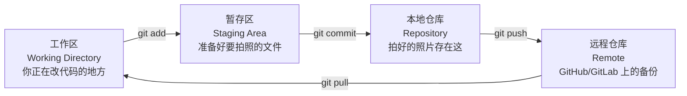

**说人话：**

```text
工作区 = 你的书桌，你正在写作业
暂存区 = 你挑了几张写好的作业放桌上，准备交给老师检查
本地仓库 = 老师批改完存档在柜子里
远程仓库 = 柜子的复印版放在家里保险柜（防止柜子被烧了）

git add → 把作业从桌面放到"待批改"的盒子里
git commit → 老师批改完存进柜子（生成一个版本号）
git push → 复印一份放家里保险柜
git pull → 从保险柜把最新版本拿回来
```

---

## 最基本操作

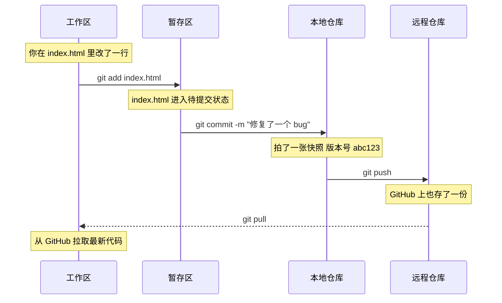

### 常用命令

```text
git init                → 把当前文件夹变成 Git 仓库（初始化）
git status              → 看看现在什么文件被改了
git log                 → 看所有历史提交
git log --oneline       → 精简版历史
git add 文件名           → 把某个文件放到暂存区
git add .               → 把所有改了文件放到暂存区
git commit -m "说明"     → 拍一张快照
git push                → 把本地照片传到 GitHub
git pull                → 从 GitHub 拉最新代码
```

---

## 分支——Git 最强的能力

### 为什么需要分支

```text
你在写一个网页。

突然老板说："加个支付功能！"（需要两天）
同时："立刻把首页的错别字改掉！"（需要 30 秒）

没有分支：
你改了首页的错别字，想上线——但支付功能写了一半，不能上线。
你卡住了。要么等支付写完，要么把支付代码删了。

有分支：
- 建一个分支叫 feature/payment，专门写支付
- 切回主分支，改错别字，上线
- 切回 feature/payment，继续写支付
两个开发线互不干扰。
```

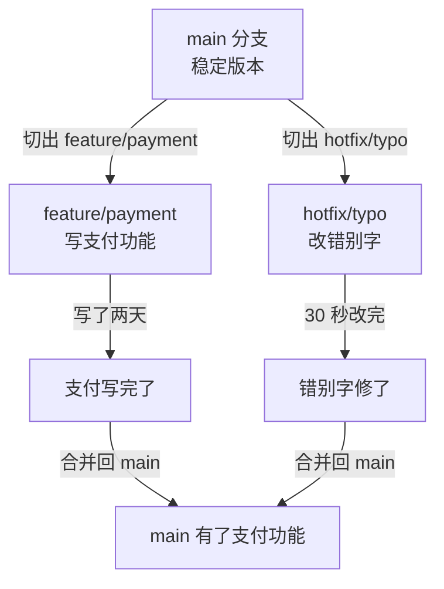

### 分支的本质

```text
Git 的分支 = 一个指针，指着某次提交。

main 分支 → 指向提交 #5
feature 分支 → 指向提交 #3（从 #3 那里分出来的）

你每提交一次，分支指针就往前移一格。
```

### 分支命令

```text
git branch               → 查看所有分支（* 表示当前所在分支）
git branch 分支名         → 创建一个新分支
git checkout 分支名       → 切换到某个分支
git switch 分支名         → 切换到某个分支（新版 Git 推荐）
git checkout -b 分支名    → 创建并切换到新分支
git branch -d 分支名      → 删除分支
```

---

## 核心操作一：merge——合并

### 场景

```text
你在 main 分支上，建了一个 feature/login 分支写登录功能。
写完了，想把它合并回 main。
```

### 两种 merge 方式

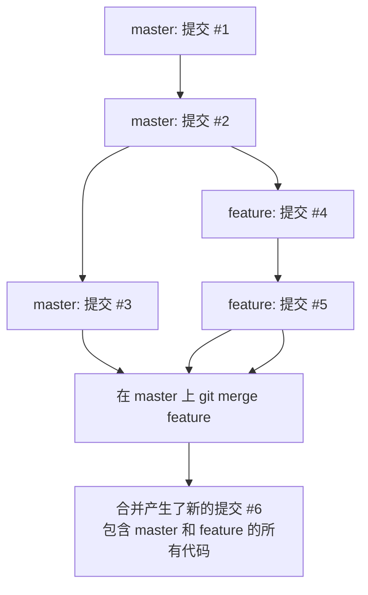

### 实际操作

```text
# 确保你在 main 分支上
git checkout main

# 把 feature/login 合并进来
git merge feature/login

# 如果没冲突 → 自动合并成功
# 如果有冲突 → Git 说"有冲突，手动解决" → 修完文件 → git add → git commit
```

### 冲突是什么

```text
你和同事同时改了同一个文件的同一行。

你改的：
用户名称：显示中文

同事改的：
用户名称：显示英文

Git 不知道听谁的 → 停下来让你自己选。

冲突文件里会显示：
<<<<<<< HEAD
用户名称：显示中文
=======
用户名称：显示英文
>>>>>>> feature/login

你需要手动改成你要的版本，然后：
git add 文件
git commit -m "解决了冲突"
```

---

## 核心操作二：rebase——变基

### rebase 是什么

```text
merge = "把两条路汇合到一起，产生一个合并点"
rebase = "把你这条路的起点，移到另一条路的终点"

结果一样（代码合并了），但历史更干净。
```

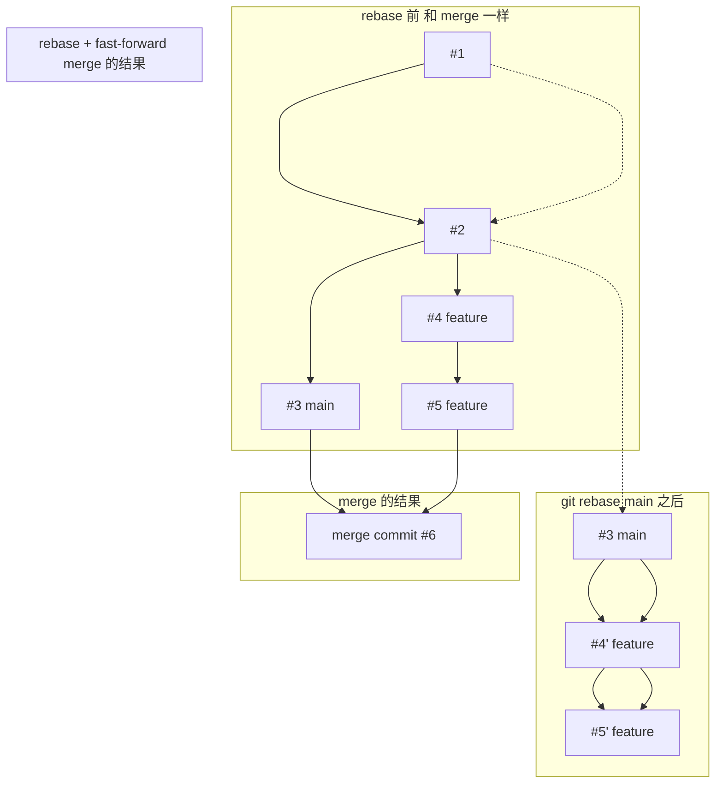

### merge 和 rebase 的区别

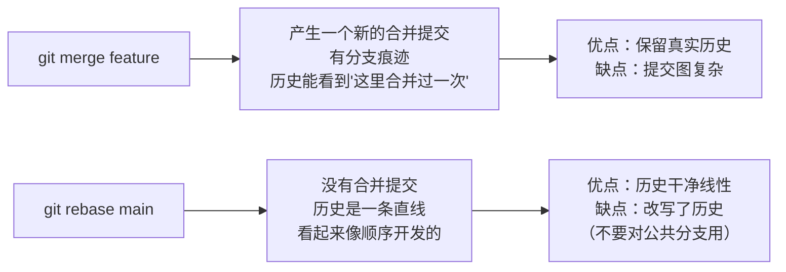

### rebase 怎么操作

```text
你当前在 feature 分支上
git checkout feature
git rebase main

如果有冲突：
# 修完一个文件的冲突 → git add 文件
# 继续 rebase → git rebase --continue
# 想放弃 → git rebase --abort

rebase 完成后，切回 main 合并
git checkout main
git merge feature
# 此时 main 会直接快进（fast-forward），没有额外的合并提交
```

### rebase 黄金法则

```text
永远不要对公共分支（main / master / develop）执行 rebase！

为什么？
rebase 改写了提交历史。
如果你 rebase 了一个别人也在用的分支，
别人下一次 pull 会看到完全不同的历史，直接炸裂。

简而言之：
- 你自己的分支（没人用的）→ 随便 rebase
- 公共分支（多人协作用）→ 只能用 merge
```

### merge vs rebase 怎么选

|      | merge                | rebase           |
| ---- | -------------------- | ---------------- |
| 历史记录 | 保留真实分支结构，看起来像"地铁线路图" | 线性历史，看起来像"单轨道"   |
| 冲突处理 | 一次解决所有冲突             | 每个提交可能都要解决一次冲突   |
| 安全性  | ✅ 安全，不改历史            | ❌ 改写了历史，不能用于公共分支 |
| 场景   | 合并公共分支（main）         | 整理自己的分支历史        |
| 说人话  | "我们在这里合并了分支"         | "假装这些提交是顺序发生的"   |

**公司实际用法：**

```text
1. 在自己的 feature 分支上开发
2. 用 rebase 把自己的提交整理干净（把多个小提交合成一个）
3. git rebase main（把 main 的最新代码同步过来）
4. git checkout main && git merge feature（合并回主分支）
5. 你的 feature 分支删掉

主分支上看到的结果：线性历史，没有乱七八糟的分支痕迹。
```

---

## 核心操作三：stash——藏起来

### 什么时候用 stash

```text
你正在 feature 分支上改代码，改到一半。

突然：线上有个紧急 bug，你得切回 main 分支去修。

问题：你代码改了一半，没写完不能 commit，但切换分支必须工作区干净。
```

### stash 解决

```text
git stash       → 把当前所有未提交的改动"藏起来"
                 工作区变干净了，回到修改前的状态

git checkout main    → 切回 main，修 bug
git commit -m "fix"
git push

git checkout feature → 切回 feature
git stash pop        → 把藏起来的改动拿回来，继续写
```

### stash 完整用法

```text
git stash                    → 藏起来（默认只藏 tracked 文件）
git stash -u                 → 藏起来（包括新文件）
git stash list               → 看看藏了多少次
git stash pop                → 拿回最后一次藏的
git stash apply              → 拿回但不从列表里删除
git stash drop               → 丢掉某次 stash
git stash pop stash@{2}      → 拿回指定的 stash
```

**说人话：**

```text
stash = 你写作业写一半，老师突然叫你去办公室。
        你把写到一半的作业塞进抽屉里（stash）。
        从办公室回来后，拉开抽屉继续写（stash pop）。
```

### stash 和 branch 的区别

```text
stash = 临时保存，不产生提交（半成品）
branch = 长期开发线，产生提交

需要长期开发 → 建分支
临时改个紧急 bug → stash + 切分支 + 改完切回来 + stash pop
```

---

## 核心操作四：cherry-pick——挑一个

### 什么时候用

```text
你在 main 分支上。
同事在 feature/payment 分支上修了一个 bug，提交是 abc123。
你想把这个 bug 修复拿过来，但不想把整个 feature/payment 合并过来。

cherry-pick = 只挑那一个提交，别的不要。
```

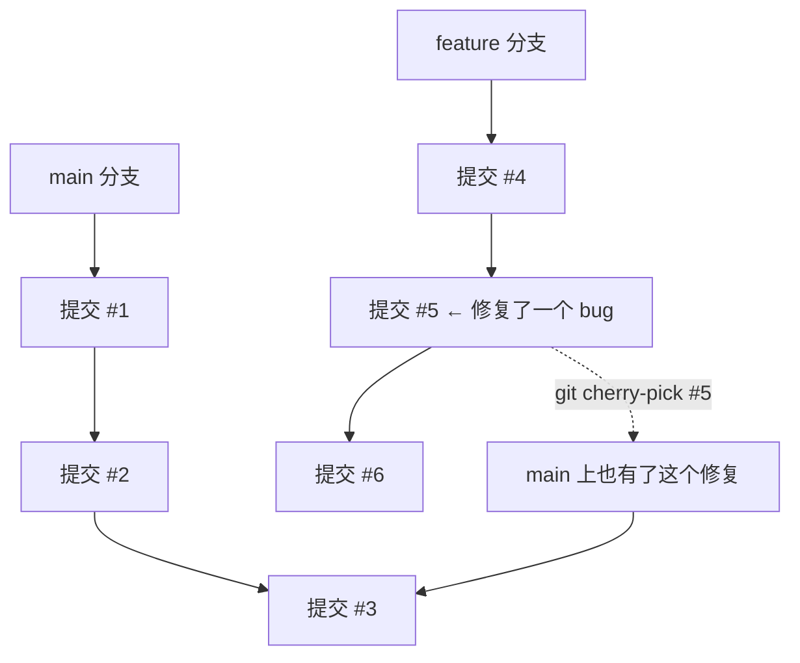

### 操作

```text
# 先看看 feature 分支的提交历史
git log feature --oneline

# 找到你要的那个提交的 hash（比如 abc1234）
# 切换到 main 分支
git checkout main

# 只挑这一个提交过来
git cherry-pick abc1234

# 如果有冲突 → 解决 → git add → git cherry-pick --continue
# 想放弃 → git cherry-pick --abort
```

### cherry-pick 使用场景

```text
1. 紧急修复上线后，忘了合并到其他分支
   → cherry-pick 到其他分支

2. 测试环境验证了一个功能，只想把这个功能上线
   → cherry-pick 这个功能的提交到 main

3. 从别人的分支里"偷"一个提交
   → cherry-pick
```

---

## 其他常用 Git 操作

### push vs pull vs fetch

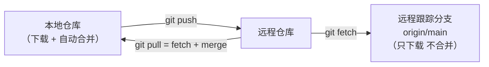

```text
git push            → 把本地提交传到远程
git fetch           → 把远程最新提交下载到本地，但不合并
git pull            → git fetch + git merge（下载并合并）
```

**fetch 和 pull 的区别：**

```text
git fetch：先看看别人改了啥，但不动你的代码。
git pull：直接把你拉进去，代码自动合并。

建议：先用 git fetch 看看情况，再决定要不要 merge。
```

### reset vs revert——回退

```text
两个都是"回到过去"，但方式不一样。
```

| | revert | reset |
| --- | --- | --- |
| 做了什么 | 创建一个"反向提交"来抵消之前的提交 | 直接删掉之前的提交 |
| 改历史吗 | ❌ 不改，新增一个提交 | ✅ 改了，删除了提交 |
| 安全吗 | ✅ 安全，可以 push | ❌ 危险，不能用于公共分支 |
| 说人话 | "我撤销了之前的修改"（历史里能看到撤销记录） | "假装之前的修改没发生过"（历史里直接消失了） |

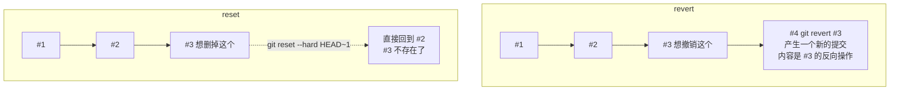

```text
# revert（安全）
git revert abc1234          → 产生一个新的提交，抵消 abc1234 的改动
git push                    → 可以正常 push

# reset（危险，只能用于本地）
git reset --soft HEAD~1     → 撤销最后一次提交，但保留改动在暂存区
git reset --mixed HEAD~1    → 撤销最后一次提交，保留改动在工作区（默认）
git reset --hard HEAD~1     → 撤销最后一次提交，改动全丢掉
```

### HEAD 是什么

```text
HEAD = 你当前在哪里的指针。

每次你 git checkout main → HEAD 指向 main 分支
每次你 git checkout feature → HEAD 指向 feature 分支
HEAD 永远指向你"当前所在的位置"。
```

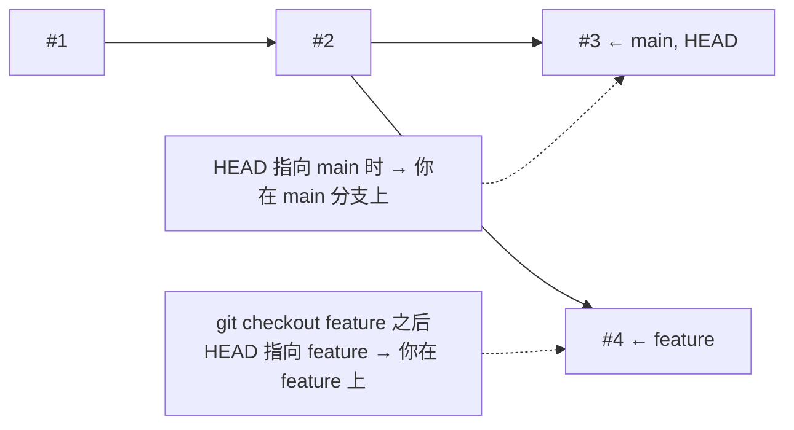

### detached HEAD（分离头指针）——你"悬空"了

**正常情况：HEAD 指向一个分支名。**

```text
HEAD → main → #3
HEAD → feature → #4

你每次 git commit，分支往前移一格，HEAD 跟着分支走。
就像你坐在一辆公交车（分支）上，车往前开，你跟着往前。
```

**detached HEAD：HEAD 直接指向一个提交，不在任何分支上。**

```text
HEAD → abc1234（某个历史提交，不在任何分支上）

你下车了，不在任何公交车上，自己站在路边（某个历史提交上）。
```

**怎么进入 detached HEAD：**

```text
git checkout abc1234    ← 直接跳到某个历史提交的 hash

或者更常见的误操作：
git checkout HEAD~3    ← 回到 3 次提交之前
git checkout v1.0      ← 切到某个标签（tag）
```

**为什么危险：**

```text
你在 detached HEAD 状态下做了提交：

HEAD → #5（你新提交的）
        你不在任何分支上！

然后你切走了：
git checkout main

此时 #5 没有任何分支指向它。
没有任何分支包含 #5 这个提交。

你再也找不回来了（除非你用 git reflog）。
```

**怎么解决：**

```text
# 方案 1：你在 detached HEAD 下已经写了代码
git checkout -b new-branch
# 把当前位置变成一个新分支
# 这样就保住了你的提交

# 方案 2：还没写代码，只是看看历史
git checkout main  # 直接切走就行，没损失
```

**类比：**

```text
正常（在分支上）：
你坐在公交车上，车停你就停，车走你就走。
你下车了再上车，车还是在原来的位置。

detached HEAD：
你从公交车上下车，站在路边（某个历史站点）。
你在路边搭了个帐篷（提交了代码）。
然后你走开了（切到别的分支）。
帐篷就留在路边了——没人管，下次清洁工来就扔了。

解决方案：
在搭帐篷的地方插个牌子（git checkout -b 新分支名），
变成一辆新的公交车。
```

**实际最常遇到的 detached HEAD：**

```text
你 git checkout 了一个历史提交的 hash 来"看看以前长啥样"。

Git 提示你：
You are in 'detached HEAD' state.
（你处于分离头指针状态）

这时候你只要不做提交，切回 main 就完事了。
如果做了提交，记得建分支保住它。
```

---

## 综合工作流示例

```text
一个完整的需求开发流程：
```

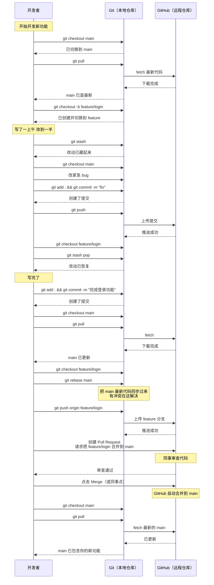

---

## 常见问题

### Q1：rebase 和 merge 到底怎么选？

```text
merge = 保留真实历史，适合公共分支
rebase = 整理历史，适合自己的私有分支

公司实践：
1. 合并到 main → 用 merge
2. 整理自己分支 → 用 rebase
3. 永远不要在公共分支上 rebase

结论：开发用 merge，整理历史用 rebase，无论如何不 rebase 公共分支。
```

### Q2：怎么解决冲突？

```text
1. git pull（或者 git merge / rebase）时报冲突
2. 打开冲突的文件，看到：
   <<<<<<< HEAD
   你的代码
   =======
   别人的代码
   >>>>>>> branch-name
3. 手动改成你想要的样子
4. git add 文件
5. git commit（merge 时）/ git rebase --continue（rebase 时）
```

### Q3：git pull 和 git fetch 有什么区别？

```text
git fetch = 去看看远程有啥新东西，但不拉到你代码里
git pull = fetch + 自动合并

建议：
先 git fetch，看看别人改了啥，
确认没问题再 git pull（或者手动 merge）。
```

### Q4：cherry-pick 什么时候用？

```text
你同事修了一个 bug，提交 hash 是 abc123。
你不想合并他整个分支（可能他还有没写完的代码），
只想拿这个 bug 修复。

git cherry-pick abc123
```

### Q5：git reset 和 git revert 什么时候用？

```text
还没 push（本地 commit 错了）：git reset --soft HEAD~1
已经 push（远程也有这个提交）：git revert abc123

原则：没 push 的可以 reset，已 push 的只能 revert。
```

---

## 一句话总结

> **Git = 拍快照 + 在快照间穿梭。merge = 合并分支保留历史痕迹，rebase = 重放提交保持线性历史（别用在公共分支）。stash = 半成品临时藏起来，cherry-pick = 只挑一个提交过来。学习重点：merge vs rebase 选择、冲突解决、reset vs revert 区别。**


## 速记卡（面试闪卡）

**Q1：一句话讲清「Git：rebase vs merge / stash / cherry-pick（零基础全攻略）」到底是什么？**
A：**Git = 给代码拍快照 + 在快照之间来回穿梭。核心三板斧：add（拍照前准备）→ commit（拍一张照）→ push（把照片传到网上）。merge = 两条路合并，rebase = 把一条路的起点挪到另一条路的终点，stash = 暂时把半成品藏起来，cherry-pick = 从别人的分支里挑一个提交拿过来。**
---

**Q2：一句话先记 —— 怎么理解？**
A：**Git = 给代码拍快照 + 在快照之间来回穿梭。核心三板斧：add（拍照前准备）→ commit（拍一张照）→ push（把照片传到网上）。merge = 两条路合并，rebase = 把一条路的起点挪到另一条路的终点，stash = 暂时把半成品藏起来，cherry-pick = 从别人的分支里挑一个提交拿过来。**
---

**Q3：先搞懂——Git 到底是什么？ —— 怎么理解？**
A：**说人话：**
---

**Q4：最基本操作 —— 怎么理解？**
A：---

**Q5：分支——Git 最强的能力 —— 怎么理解？**
A：---

**Q6：核心速记主线有哪些？**
A：抓住这几根：一句话先记、先搞懂——Git 到底是什么？、最基本操作、分支——Git 最强的能力、核心操作一：merge——合并、核心操作二：rebase——变基。


## 相关链接

- 📋 目录：[[00-分布式-系统设计]]
- 📚 学习清单：[[八股文学习清单]]
