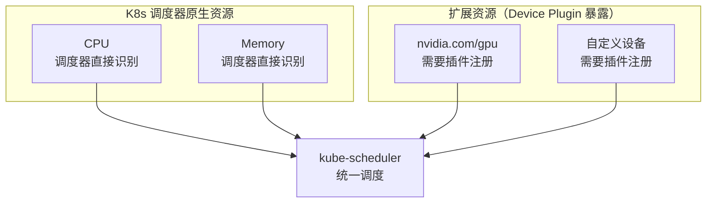
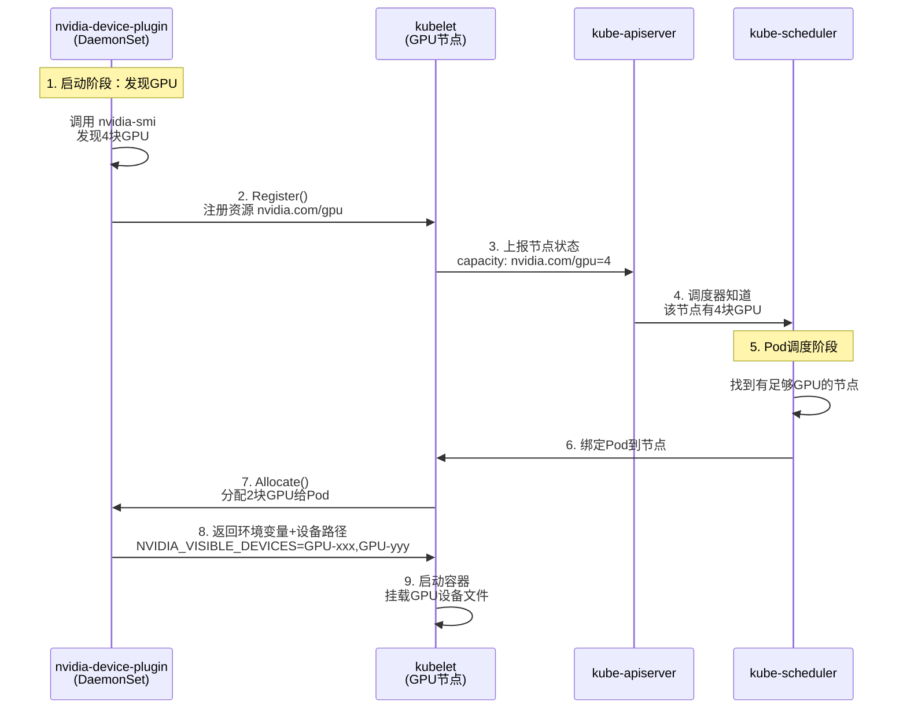
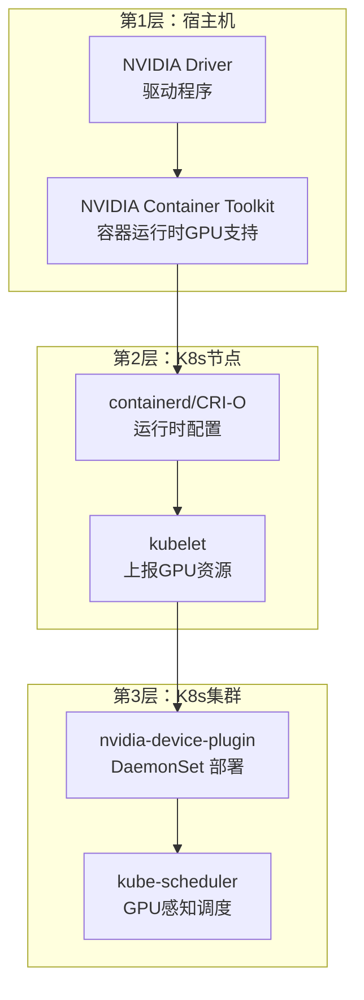
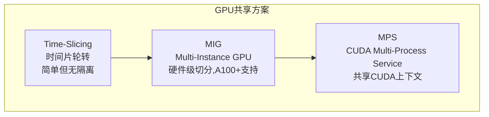

---

title: "Kubernetes GPU 调度：nvidia-device-plugin 原理与配置"

created: "2026-07-21"

tags:

  - 八股文

  - 分布式-系统设计

---

# Kubernetes GPU 调度：nvidia-device-plugin 原理与配置

> CPU 和内存是 K8s 的"亲儿子"——调度器天生就认识它们。GPU 是"干儿子"，需要一个**设备插件（Device Plugin）**来向调度器"报户口"：我有几块 GPU，每块什么状态。nvidia-device-plugin 就是这个"报户口"的中间人。

---

## 一、为什么 K8s 原生不支持 GPU？

K8s 调度器原生只认识 CPU 和 Memory 这两种资源。GPU 属于**扩展资源（Extended Resources）**——它不是 K8s 内核的一部分，而是通过 Device Plugin 框架暴露给调度器的。



---

## 二、nvidia-device-plugin 工作原理
### 2.1 整体架构



### 2.2 Device Plugin 框架三步走

nvidia-device-plugin 的生命周期遵循标准的 Device Plugin 协议：

| 阶段 | gRPC 方法 | 做什么 |

|------|-----------|--------|

| **发现** | `ListAndWatch()` | 持续向 kubelet 上报 GPU 设备列表和健康状态 |

| **分配** | `Allocate()` | kubelet 决定把 GPU 分配给某 Pod 时，调用此方法 |

| **移除** | `Remove()` | Pod 被删除时，回收 GPU 资源 |

> **学习重点**：GPU 作为扩展资源，调度时只看 `limits`（不看 `requests`），且 `requests` 必须等于 `limits`。一个 GPU 只能分配给一个容器——这是硬性隔离。

### 2.3 GPU 节点三层准备



| 层次 | 组件 | 作用 |

|------|------|------|

| **第1层** | NVIDIA Driver | 与 GPU 硬件通信 |

| **第1层** | NVIDIA Container Toolkit | 让容器运行时能访问 GPU |

| **第2层** | containerd + CRI 配置 | 运行时层面启用 GPU 支持 |

| **第2层** | kubelet | 发现并上报 GPU 资源 |

| **第3层** | nvidia-device-plugin | 向 kubelet 注册 `nvidia.com/gpu` 资源 |

| **第3层** | kube-scheduler | 根据 GPU 可用数量调度 Pod |

---

## 三、配置实战
### 3.1 部署 nvidia-device-plugin

```yaml

# nvidia-device-plugin.yml

apiVersion: apps/v1

kind: DaemonSet

metadata:

  name: nvidia-device-plugin-daemonset

  namespace: kube-system

spec:

  selector:

    matchLabels:

      name: nvidia-device-plugin-ds

  template:

    spec:

      tolerations:

        - key: nvidia.com/gpu

          operator: Exists

          effect: NoSchedule

      containers:

        - name: nvidia-device-plugin-ctr

          image: nvcr.io/nvidia/k8s-device-plugin:v0.14.1

          securityContext:

            allowPrivilegeEscalation: false

            capabilities:

              drop: ["ALL"]

          volumeMounts:

            - name: device-plugin

              mountPath: /var/lib/kubelet/device-plugins

      volumes:

        - name: device-plugin

          hostPath:

            path: /var/lib/kubelet/device-plugins

```

> DaemonSet 确保每个 GPU 节点都运行一个 device-plugin Pod。新节点加入集群时自动部署。

### 3.2 Pod 申请 GPU

```yaml

apiVersion: v1

kind: Pod

metadata:

  name: gpu-training

spec:

  containers:

    - name: pytorch

      image: pytorch/pytorch:latest-cuda

      resources:

        limits:

          nvidia.com/gpu: 2    # 申请2块GPU

```

### 3.3 调度策略配置

**节点亲和性**——只调度到带 GPU 的节点：

```yaml

affinity:

  nodeAffinity:

    requiredDuringSchedulingIgnoredDuringExecution:

      nodeSelectorTerms:

        - matchExpressions:

            - key: accelerator

              operator: In

              values: ["nvidia-gpu"]

```

**污点与容忍**——GPU 节点加 taint，防止普通 Pod 占用：

```bash

# 给GPU节点加污点

kubectl taint nodes gpu-node1 nvidia.com/gpu=true:NoSchedule

```

```yaml

# Pod 声明容忍

tolerations:

  - key: "nvidia.com/gpu"

    operator: "Exists"

    effect: "NoSchedule"

```

### 3.4 验证

```bash

# 查看节点GPU资源

kubectl describe node gpu-node1 | grep nvidia.com/gpu

# 查看Pod分配的GPU

kubectl get pod gpu-training -o jsonpath='{.spec.containers[0].resources.limits}'

# 进入容器验证

kubectl exec gpu-training -- nvidia-smi

```

---

## 四、GPU 共享方案

默认一个 GPU 只能给一个容器，独占模式在推理场景下浪费严重。三种共享方案：



| 方案 | 原理 | 隔离性 | 适用场景 |

|------|------|--------|----------|

| **Time-Slicing** | 多个容器轮流使用同一 GPU | 无隔离，互相影响 | 开发测试 / 推理小模型 |

| **MIG** | 硬件级切分 GPU 为多个实例 | 强隔离，独立显存/算力 | A100/H100 多租户 |

| **MPS** | 共享 CUDA 上下文，软件级隔离 | 中等隔离 | 推理服务密集部署 |

### Time-Slicing 配置示例

```yaml

# configmap: time-slicing-config

apiVersion: v1

kind: ConfigMap

metadata:

  name: time-slicing-config

  namespace: kube-system

data:

  any: |-

    version: v1

    flags:

      migStrategy: none

    sharing:

      timeSlicing:

        resources:

          - name: nvidia.com/gpu

            replicas: 4    # 1块GPU虚拟成4块

```

> **MIG 简介**：A100 可切分为 1g.5gb、2g.10gb、3g.20gb、7g.40gb 等实例，每个实例独立显存和计算单元，物理级隔离。适合多租户 AI 平台。

---

## 五、延伸追问
### Q1：nvidia-device-plugin 的核心职责是什么？

三件事：① 发现节点上的 GPU 并向 kubelet 注册为 `nvidia.com/gpu` 扩展资源；② 通过 `ListAndWatch()` 持续上报 GPU 健康状态；③ Pod 被调度到该节点时，通过 `Allocate()` 分配具体的 GPU 设备给容器。

### Q2：GPU 作为扩展资源，调度时有什么特殊行为？

GPU 只看 `limits`（`requests` 必须等于 `limits`），一个 GPU 只能分配给一个容器（独占模式），不支持像 CPU 那样的分时复用。需要共享时要用 MIG（硬件切分）或 Time-Slicing（时间片轮转）。

### Q3：如何确保只有 GPU Pod 才调度到 GPU 节点？

给 GPU 节点加 taint：`kubectl taint nodes gpu-node nvidia.com/gpu=true:NoSchedule`。Pod 声明对应的 toleration 才能被调度过去。同时配合 nodeAffinity 精确选择 GPU 型号。

### Q4：nvidia-device-plugin 的 DaemonSet 部署有什么好处？

DaemonSet 保证每个 GPU 节点上恰好运行一个 device-plugin Pod。新节点自动部署，节点删除自动清理——无需手动管理。

### Q5：推理场景下如何提高 GPU 利用率？

默认独占模式下一块 GPU 跑一个推理容器利用率很低。可以：① Time-Slicing 轮流共享（简单但无隔离）；② MIG 硬件切分（A100+，强隔离）；③ MPS 共享 CUDA 上下文（中等隔离）。

---

## 一句话总结

> **nvidia-device-plugin = GPU 报户口的中间人：发现GPU → 注册为 nvidia.com/gpu 扩展资源 → kube-scheduler 据此调度 → Allocate 分配具体设备给容器。GPU 调度只看 limits、独占分配、需要 NVIDIA 驱动 + Container Toolkit + Device Plugin 三层准备。学习重点：Device Plugin 协议（Register → ListAndWatch → Allocate）、三种 GPU 共享方案对比。**

---

## 速记卡（面试闪卡）

**Q1：一句话讲清「Kubernetes GPU 调度」到底是什么？**

A：nvidia-device-plugin 是 GPU 的「报户口」中间人——K8s 调度器原生只认 CPU 和内存，GPU 是扩展资源，需要 Device Plugin 框架把它注册给调度器。

**Q2：为什么原生不支持 —— 怎么理解？**

A：K8s 调度器内核只认识 CPU（Central Processing Unit，中央处理器）和 Memory（内存）这两种原生资源。GPU 属于扩展资源（Extended Resources），不是内核一部分，必须通过 Device Plugin 协议暴露出来才算「上户口」。

**Q3：工作原理三步走 —— 怎么理解？**

A：遵循标准 Device Plugin 协议三个 gRPC 方法——ListAndWatch（持续向 kubelet 上报 GPU 列表和健康）、Allocate（Pod 调度过来时分配具体设备）、Remove（Pod 删除时回收）。插件以 DaemonSet 部署，保证每个 GPU 节点恰好一个。

**Q4：配置与调度特殊点 —— 怎么理解？**

A：GPU 调度只看 limits（requests 必须等于 limits），且一个 GPU 只能独占分配给一个容器，不支持像 CPU 那样分时复用。防止普通 Pod 占用 GPU 节点：给节点加 taint（污点），Pod 用 toleration（容忍）+ nodeAffinity 精确选型号。

**Q5：共享方案 —— 怎么理解？**

A：独占模式推理场景浪费严重，三种共享：Time-Slicing（时间片轮转，简单但无隔离）、MIG（Multi-Instance GPU，硬件级切分，A100+ 强隔离）、MPS（CUDA Multi-Process Service，共享上下文，中等隔离）。

**Q6：核心速记主线有哪些？**

A：题目、扩展资源概念、Device Plugin 三方法、DaemonSet 部署、独占 + taint、三种共享方案。

**口诀**

A：GPU 调度靠插件，报户口走扩展资源；

ListAndWatch Allocate，独占限制看 limits；

共享三法切片 MIG MPS。

## 相关链接

- 📋 目录：[[00-分布式-系统设计]]

- 📚 学习清单：[[八股文学习路线图]]

- 🔗 [[04-Kubernetes核心资源|K8s 核心资源]] — Pod/Service/Deployment 基础

- 🔗 [[01-Docker与docker-compose部署流程|Docker 基础]] — 容器运行时基础

