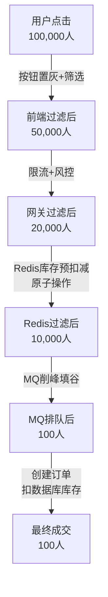
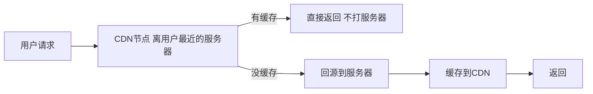
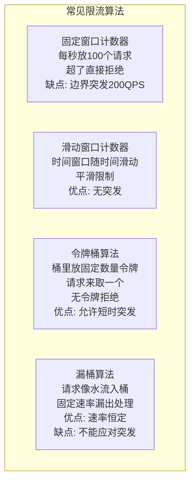
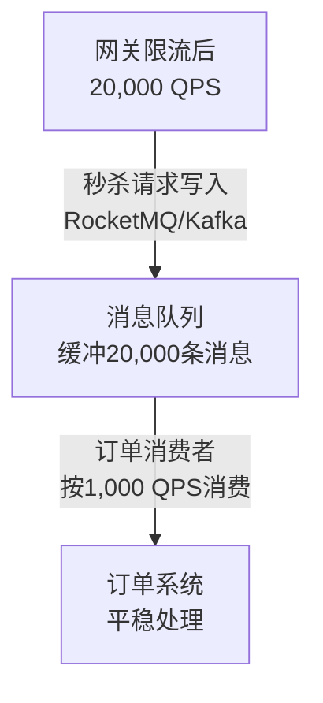
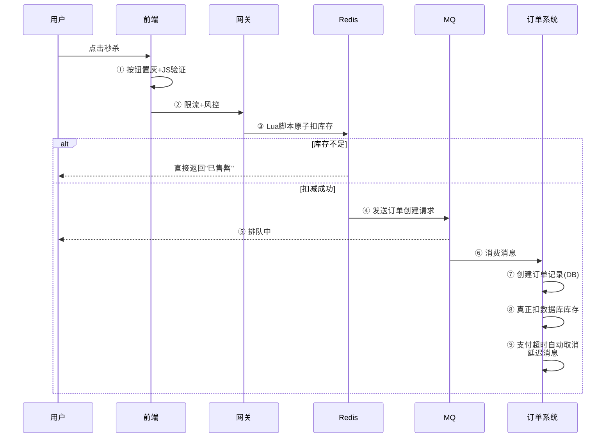

---

title: "秒杀系统设计"

created: "2026-07-13"

tags:

  - 八股文

  - 分布式

---

# 秒杀系统设计

---

## 一、秒杀场景的核心挑战
### 1.1 秒杀的本质

秒杀 = **瞬间海量请求 + 极少库存 + 不能超卖**。

10 万人抢 100 台手机，你要做的不是让 10 万人都抢到，而是让系统在 10 万并发下**不崩、不错、不超卖**。

### 1.2 三高特征

| 特征 | 说明 | 类比 |

| ------ | ------ | ------ |

| **高并发** | 瞬间几万甚至几十万 QPS 涌入 | 双十一零点全校冲食堂 |

| **高可用** | 系统不能崩——崩了就是事故 | 食堂窗口全关了，学生饿肚子 |

| **高一致** | 库存不能超卖——卖出去的必须有货 | 柜台说有 100 台，结果卖了 120 台 |

### 1.3 秒杀系统的流量漏斗

从用户点击到最终下单，每一层都在过滤无效请求：



> **核心思想**：把请求拦在尽量靠前的层级，打到数据库的请求越少越好。

---

## 二、前端优化
### 2.1 静态资源 + CDN

秒杀页面提前做好静态化，把 HTML/CSS/JS/图片全部放到 CDN（内容分发网络）——用户就近获取，不打你的服务器。



### 2.2 前端按钮防刷

| 策略 | 说明 |

| ------ | ------ |

| **按钮置灰** | 点击后立刻禁用按钮，防止重复提交 |

| **倒计时** | 倒计时结束后才激活按钮，防止提前抢 |

| **验证码** | 人机识别，过滤脚本刷子 |

| **URL 动态化** | 秒杀 URL 动态生成，防止提前知道地址直接绕过页面 |

---

## 三、流量整形（Traffic Shaping）
### 3.1 限流（Rate Limiting）

在网关层限制每个用户/每个 IP 的请求频率：



详细算法对比参见 [[08-限流与熔断降级]]。

### 3.2 排队（消息队列削峰）

限流后的请求进入消息队列排队，后端按自己的消费能力处理：



---

## 四、库存管理（Redis 原子操作）
### 4.1 为什么用 Redis 管库存

数据库的锁机制扛不住万级并发——一个 `UPDATE stock SET count = count - 1` 要加行锁，1000 个请求排队等锁，QPS 直接崩。

Redis 是**单线程 + 内存操作**，天然保证原子性，不需要加锁。

### 4.2 Redis 预扣库存

```bash

# 系统启动/秒杀开始前：把库存加载到 Redis

SETEX seckill:product:100 3600 100    # 库存 100，1 小时过期

# Lua 脚本保证"读库存 + 判断 + 扣减"是原子操作

-- 伪代码逻辑：

local stock = redis.call('GET', KEYS[1])

if stock and tonumber(stock) > 0 then

    redis.call('DECR', KEYS[1])     -- 库存 -1

    return 1                         -- 扣减成功

else

    return 0                         -- 库存不足

end

```

**为什么用 Lua 脚本？**

`GET` + `判断` + `DECR` 如果分三条 Redis 命令执行，1000 个请求并发时可能出现：两个请求同时读到库存=1，各自扣减，结果库存变成 -1（超卖）。

Lua 脚本在 Redis 里是**原子执行**的——一个脚本执行期间不会被其他命令插入。

### 4.3 库存预热

秒杀开始前，提前把商品库存加载到 Redis。不要等秒杀开始才从数据库读——那样第一个请求会打到数据库。

---

## 五、订单创建流程
### 5.1 完整下单链路



### 5.2 为什么要"先扣 Redis 库存，再创建订单"

如果先创建订单再扣库存——订单创建成功但库存扣减失败（比如 Redis 挂了），就出现了**订单存在但没库存**的脏数据。

反过来，先在 Redis 扣库存成功 → 再异步创建订单 → 即使订单创建失败，库存已经扣了，可以做补偿（加回去）。这是**乐观策略**——大部分请求能成功，失败的是少数。

---

## 六、幂等性设计
### 6.1 问题：同一个请求被处理多次怎么办

用户点了秒杀按钮，网络超时，前端自动重试——同一条消息可能被 MQ 投递多次。如果不做幂等，一个人可能被扣两次库存、创建两个订单。

### 6.2 幂等性实现方案

| 方案 | 原理 | 适用场景 |

| ------ | ------ | --------- |

| **数据库唯一键** | 订单表加 `user_id + activity_id` 唯一索引，重复插入直接报错 | 最可靠 |

| **Redis 标记** | 下单前先 `SET user:activity "done" NX`，设了就说明已下单 | 高性能 |

| **状态机** | 订单状态只能单向流转（待支付→已支付→已完成），不能重复流转 | 通用 |

| **Token 机制** | 下单前先获取 Token，下单时带上，服务端校验并删除 Token | API 防重 |

> **一句话讲清**："幂等性是秒杀系统的基本要求。核心思路是用唯一键或状态标记——同一个用户对同一个秒杀活动只能成功一次。推荐数据库唯一键 + Redis 标记双保险。"

---

## 七、多级缓存策略
### 7.1 为什么要多级缓存

秒杀场景下，如果所有请求都打到 Redis，Redis 也扛不住。需要在不同层级分散压力。

### 7.2 多级缓存架构

| 层级 | 位置 | 作用 | 命中率 |

| ------ | ------ | ------ | -------- |

| L1 | 客户端浏览器 | 页面缓存、JS 缓存 | 高（本地） |

| L2 | CDN 节点 | 静态资源缓存 | 极高 |

| L3 | Nginx 缓存 | 商品详情页缓存 | 高 |

| L4 | 本地缓存（Caffeine/Guava） | 热点数据在 JVM 内存 | 极高（微秒） |

| L5 | Redis | 分布式缓存，所有实例共享 | 高 |

| L6 | MySQL | 最终数据源 | 兜底 |

### 7.3 缓存预热

秒杀开始前 5-10 分钟，主动把商品数据加载到各级缓存：

- Nginx 缓存：提前请求一次商品详情页

- 本地缓存：服务启动时加载热点商品

- Redis：提前 SET 商品数据和库存

> **一句话讲清**："多级缓存的核心是纵深防御——每一层都挡掉一部分请求，真正打到数据库的可能只有 1%。缓存预热保证秒杀开始瞬间不会出现缓存击穿。"

---

## 八、热数据预加载
### 8.1 热点数据识别

秒杀商品就是典型的热点数据——所有请求都集中在同一个商品上。如果不做特殊处理，这个热点 key 的 QPS 会比其他 key 高几个数量级。

### 8.2 热点 key 的解决方案

| 方案 | 说明 |

| ------ | ------ |

| **本地缓存** | 在应用服务器内存里缓存一份，不走 Redis 网络 |

| **key 分片** | 把一个热点 key 拆成多个（如 stock:100:A、stock:100:B），分散 Redis 压力 |

| **读写分离** | Redis 读请求走从节点，写请求走主节点 |

| **永不过期** | 热点 key 不设 TTL，用逻辑过期替代，防止缓存击穿 |

---

## 九、高可用保障

| 措施 | 说明 |

| ------ | ------ |

| **服务冗余** | 每个微服务多实例部署，挂一个不影响 |

| **熔断降级** | 下游服务出问题 → 返回兜底数据（"排队中"） |

| **限流** | 网关层限流，防止超出系统处理能力的请求打进来 |

| **监控告警** | 实时监控 QPS、RT、错误率，异常立刻告警 |

| **预案演练** | 提前做压力测试，确认系统能扛住预估流量 |

---

## 十、快速问答

| 问题 | 一句话答案 |

| ------ | ----------- |

| 秒杀系统的核心挑战是什么？ | 瞬间海量并发 + 不能超卖 + 系统不能崩——三高（高并发/高可用/高一致） |

| 为什么用 Redis 管库存？ | Redis 单线程+内存操作，原子性天然保证，不需要加行锁，QPS 远高于数据库 |

| Redis 库存扣减怎么保证不超卖？ | Lua 脚本原子执行——"读库存 + 判断 + 扣减"在一个脚本里完成，并发安全 |

| 为什么先扣 Redis 再创建订单？ | 乐观策略——Redis 扣减成功才异步创建订单，失败率低；反过来先建订单再扣库存可能脏数据 |

| 怎么防止重复下单（幂等性）？ | 数据库唯一键（user_id+activity_id）+ Redis 标记双保险 |

| 秒杀的流量漏斗是什么？ | 前端过滤→网关限流→Redis 扣库存→MQ 削峰→订单系统——每一层都过滤无效请求 |

| 消息队列在秒杀中起什么作用？ | 削峰填谷——Redis 扣库存成功后把订单请求扔进 MQ，订单系统按自己节奏消费 |

| 缓存预热为什么重要？ | 秒杀开始瞬间如果缓存是空的，第一个请求会打到数据库（缓存击穿），预热防止这个问题 |

| 多级缓存有哪些层？ | 浏览器→CDN→Nginx→本地缓存→Redis→MySQL，每层挡掉一部分请求 |

| CDN 在秒杀中起什么作用？ | 静态资源放 CDN，用户就近获取，不打你的服务器——节省 70%+ 的带宽 |

| 秒杀按钮为什么要做防刷？ | 前端按钮置灰+验证码+URL 动态化，防止脚本刷子提前知道地址绕过页面 |

| 秒杀系统怎么保证高可用？ | 服务多实例冗余+熔断降级+限流+监控告警+压力测试预案 |

---

## 速记卡（面试闪卡）

**Q1：一句话讲清「秒杀系统设计」到底是什么？**

A：秒杀 = 瞬间海量请求 + 极少库存 + 不能超卖。目标不是让 10 万人都抢到，而是让系统在 10 万并发下「不崩、不错、不超卖」。

**Q2：三高与流量漏斗 —— 怎么理解？**

A：三高——高并发（全校零点冲食堂）、高可用（窗口别关）、高一致（不超卖）。核心思想是把请求拦在尽量靠前的层：前端过滤 → 网关限流 → Redis 扣库存 → MQ 削峰 → 订单系统，打到数据库的越少越好。

**Q3：库存与 Lua 原子 —— 怎么理解？**

A：数据库行锁扛不住万级并发，Redis 单线程 + 内存操作天然原子、不需加锁。关键用 Lua 脚本保证「读库存 + 判断 + 扣减」原子执行——否则两个请求同时读到库存=1，各自扣减就超卖成 -1。

**Q4：订单与幂等 —— 怎么理解？**

A：先扣 Redis 再异步创建订单（乐观策略，失败率低可补偿），反过来先建订单再扣库存会出脏数据。幂等性防重复下单用数据库唯一键（user_id + activity_id）+ Redis 标记 `SET NX` 双保险。

**Q5：缓存与高可用 —— 怎么理解？**

A：多级缓存浏览器 → CDN → Nginx → 本地（Caffeine）→ Redis → MySQL，缓存预热防秒杀瞬间的缓存击穿。高可用靠服务冗余 + 熔断降级 + 限流 + 监控告警 + 压测预案。

**Q6：核心速记主线有哪些？**

A：题目、流量漏斗、Redis + Lua 原子扣减、先扣后单、幂等双保险、多级缓存 + 高可用。

**口诀**

A：秒杀三高一漏斗，前端限流 Redis 扣；

Lua 原子防超卖，先扣后单幂等守；

多级缓存预热好，熔断限流保可用。

## 相关链接

- [[八股文学习路线图]]

- [[00-全局导航|全局导航]]

