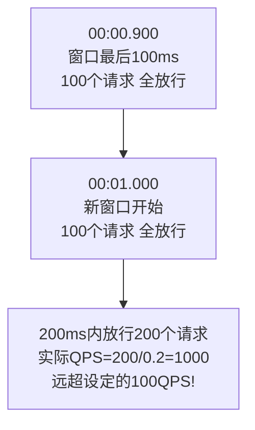
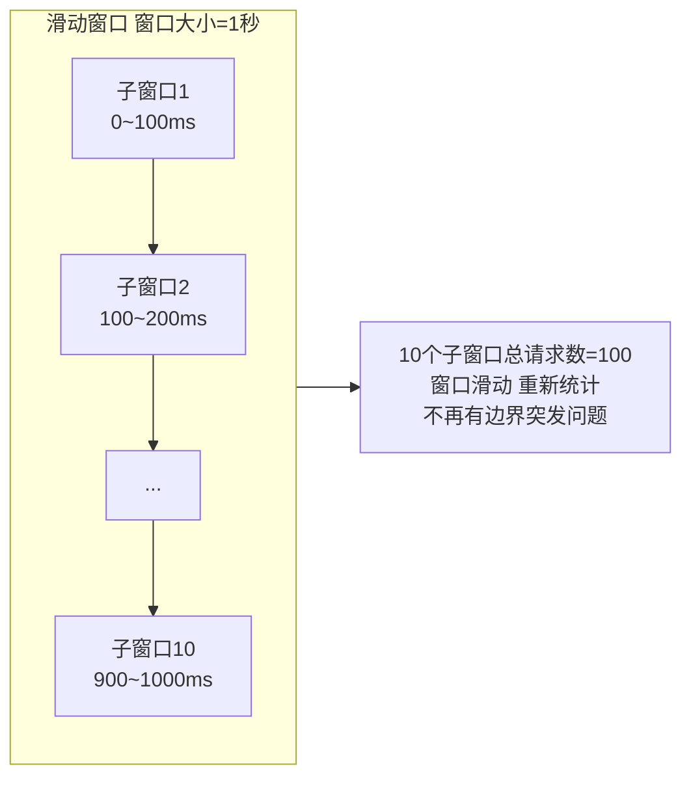
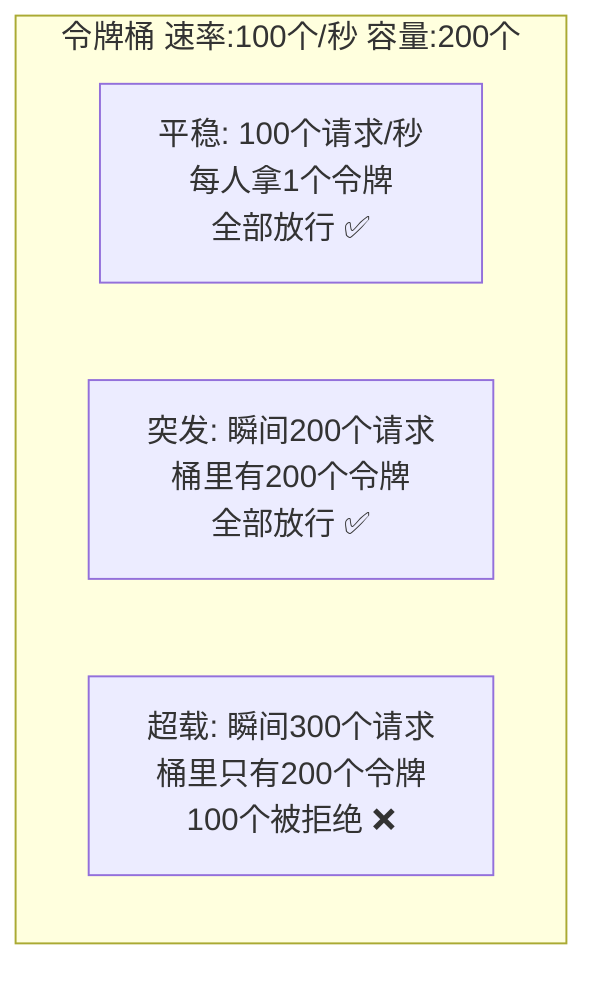
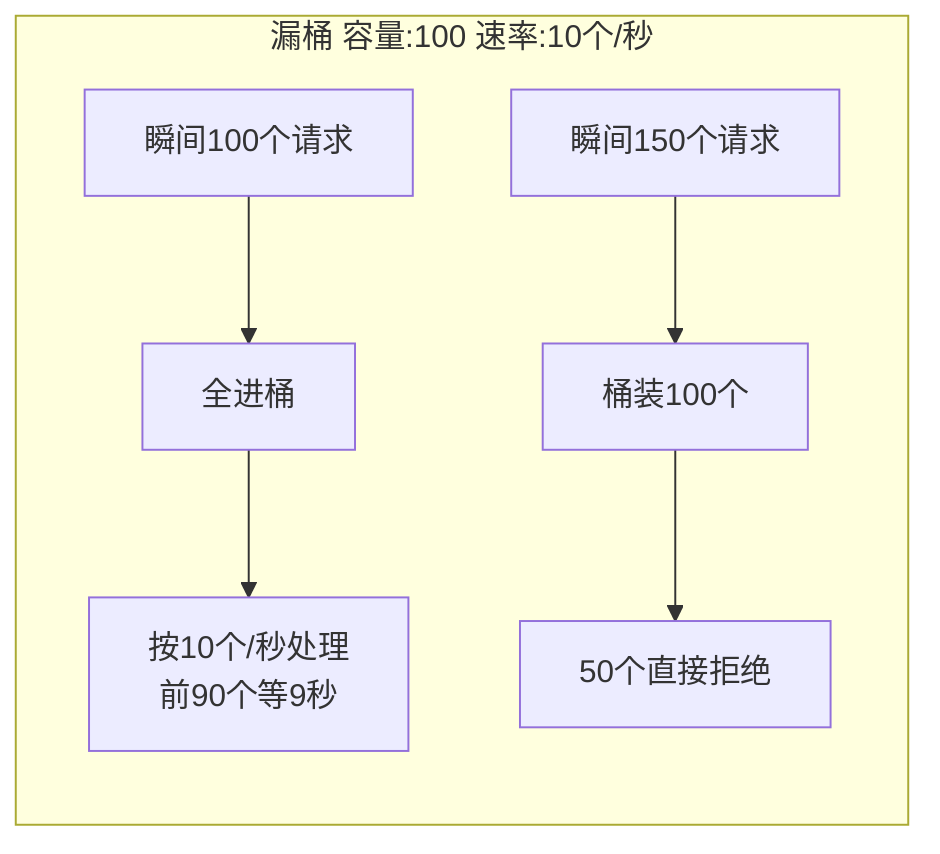
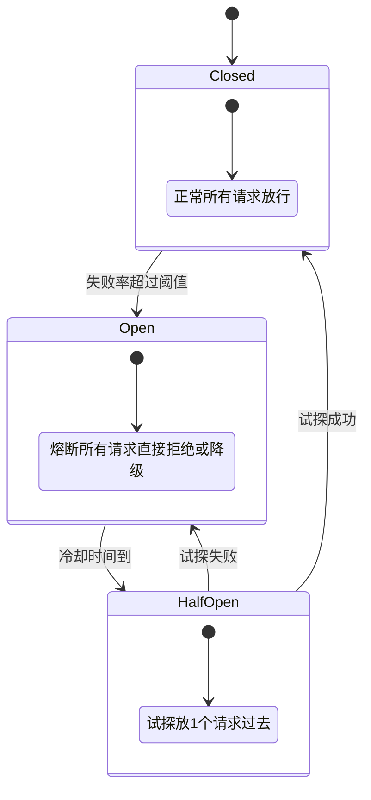
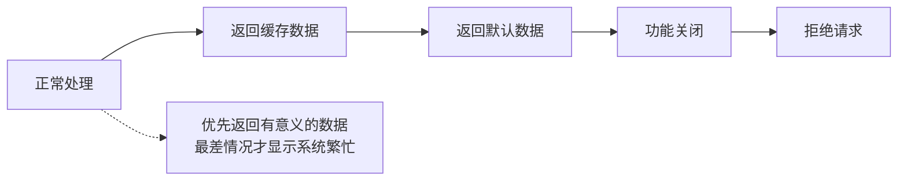
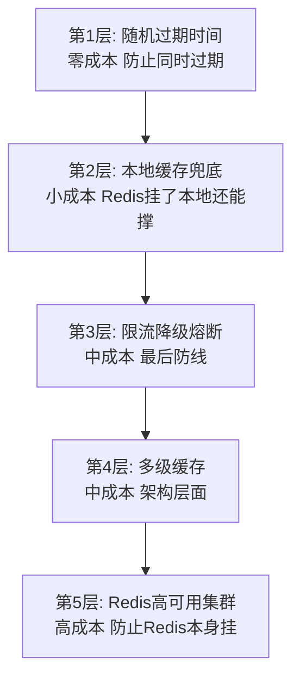

---

title: "限流与熔断降级"

created: "2026-07-13"

tags:

  - 八股文

  - 分布式

---

# 限流与熔断降级

---

## 一、限流算法
### 1.1 固定窗口计数器

最简单的限流——每个时间窗口维护一个计数器，到了窗口边界归零重新计数。

**问题：窗口边界突发**

### 1.2 滑动窗口计数器

把时间窗口分成更小的子窗口，窗口随时间滑动，避免边界突发。

### 1.3 令牌桶算法（Token Bucket）

桶里以固定速率放入令牌，请求来了取一个令牌，取不到就拒绝。桶有容量上限——令牌满了就不放了。

**核心优点**：允许短时间的突发流量（桶里有存货），同时长期速率受控。

**Guava RateLimiter** 就是令牌桶的 Java 实现。

### 1.4 漏桶算法（Leaky Bucket）

请求像水一样流入桶里，桶以**固定速率**漏出处理。桶满了就溢出（拒绝）。

**核心优点**：输出速率恒定，下游服务压力平稳。

**核心缺点**：不能应对突发——即使系统有余力，也要按固定速率处理。

### 1.5 四种算法对比

| 算法 | 是否允许突发 | 实现复杂度 | 适用场景 |
| ------ | ------------- | ----------- | --------- |
| **固定窗口** | 有边界突发问题 | 极简 | 简单限流，精度要求不高 |
| **滑动窗口** | 无突发 | 中等 | 精确限流 |
| **令牌桶** | 允许短时突发 | 中等 | API 网关限流（最常用） |
| **漏桶** | 不允许突发 | 中等 | 下游保护，要求恒定速率 |

> **一句话讲清**："生产环境最常用令牌桶——Guava RateLimiter 就是实现。它允许短时间突发（应对正常流量波动），同时长期速率受控。漏桶适合对下游服务的保护——保证输出速率恒定，但不能应对突发。"

---

## 二、熔断器模式（Circuit Breaker）
### 2.1 为什么需要熔断

如果下游服务挂了，调用方还不断重试——大量请求卡在等待超时上，占用线程池，最终调用方自己也被拖垮。这就是**服务雪崩**。

熔断器的作用：发现下游不行了，**主动切断请求**，不再浪费资源等待。

### 2.2 熔断器三态

### 2.3 熔断器的关键参数

| 参数 | 说明 | 典型值 |
| ------ | ------ | -------- |
| **失败率阈值** | 失败率超过多少触发熔断 | 50% |
| **滑动窗口大小** | 统计失败率的时间窗口 | 10 秒 |
| **最小请求数** | 窗口内至少有多少请求才统计失败率 | 20 个 |
| **冷却时间** | 熔断后多久进入半开状态试探 | 5 秒 |
| **半开请求数** | 半开状态放几个请求试探 | 1 个 |

### 2.4 熔断 vs 限流 vs 降级——三者区别

| 概念 | 目的 | 触发条件 | 行为 |
| ------ | ------ | --------- | ------ |
| **限流** | 控制请求速率 | 请求超过阈值 | 拒绝超量请求 |
| **熔断** | 快速失败 | 下游错误率过高 | 切断请求，返回兜底 |
| **降级** | 保核心链路 | 系统压力大 | 关闭非核心功能 |

> 三者配合：限流卡住大部分流量 → 熔断发现下游不行就切断 → 降级返回简化数据/兜底数据。

---

## 三、降级策略
### 3.1 降级的三种方式

| 降级方式 | 说明 | 示例 |
| --------- | ------ | ------ |
| **返回缓存数据** | 实时数据拿不到，返回缓存里的旧数据 | 商品评价挂了 → 返回缓存中的评价列表 |
| **返回默认数据** | 兜底方案——返回一个"总比没有强"的数据 | 推荐服务挂了 → 返回热门商品列表 |
| **功能直接关闭** | 砍掉非核心功能，保住核心链路 | 积分服务挂了 → "积分功能维护中" |

### 3.2 降级的优先级

---

## 四、Sentinel vs Hystrix
### 4.1 Hystrix（Netflix，已停维护）

Hystrix 是熔断器模式的经典实现，Netflix 开源，2018 年停止维护。

**核心原理**：基于线程池隔离——每个依赖服务用独立的线程池，一个服务挂了不会耗尽全局线程池。

**局限**：

- 基于线程池隔离，高并发下线程切换开销大

- 规则只能通过配置文件修改，不能动态推送

- 已停止维护，不再有新功能

### 4.2 Sentinel（阿里巴巴，活跃维护）

Sentinel 是阿里的流量控制框架，从 Hystrix 的痛点出发设计。

**核心优势**：

| 特性 | Hystrix | Sentinel |
| ------ | --------- | --------- |
| **隔离模型** | 线程池隔离 | 信号量隔离（更轻量） |
| **规则推送** | 静态配置 | 动态推送（Nacos/Apollo） |
| **实时监控** | 无 | 控制台实时查看 QPS、RT、异常率 |
| **流量控制** | 基本 | 丰富的策略（QPS/线程数/关联/链路） |
| **系统自适应保护** | 无 | 根据 CPU、Load 自动调整 |
| **热点参数限流** | 无 | 支持热点 key 限流 |
| **维护状态** | ❌ 停止维护 | ✅ 活跃维护 |

### 4.3 选择建议

> **一句话讲清**："新项目用 Sentinel——功能更丰富，控制台可视化好用，规则动态推送。Hystrix 是经典但已停维护，了解原理即可。Sentinel 在阿里内部双十一已经大规模验证过，稳定性有保障。"

---

## 五、缓存问题与限流熔断的关系
### 5.1 缓存穿透与限流

缓存穿透会导致大量无效请求打到数据库——如果不用限流保护，数据库会被直接打死。

**解法链路**：布隆过滤器拦截大部分 → 缓存空值兜底 → 限流保护数据库

### 5.2 缓存击穿与熔断

热点 key 过期瞬间大量请求打到数据库——如果数据库扛不住开始超时，应该触发熔断，直接返回兜底数据。

**解法链路**：互斥锁/逻辑过期防击穿 → 数据库超时触发熔断 → 降级返回旧数据

### 5.3 缓存雪崩与限流降级

大量 key 同时过期或 Redis 挂了——所有请求打到数据库，这时候**限流降级是最后的防线**。

**解法链路**：随机过期时间防止同时过期 → 多级缓存分散压力 → 限流保护数据库 → 熔断快速失败 → 降级返回兜底数据

### 5.4 雪崩五层防线

> **一句话讲清**："限流熔断降级是系统设计的最后防线——前面的缓存优化做好了，大部分请求不会打到这一层。但一旦前面的防线被突破（比如 Redis 挂了），限流熔断就是保命的关键。"

---

## 六、Sentinel 核心概念速查
### 6.1 Sentinel 的流量控制模式

| 模式 | 说明 | 示例 |
| ------ | ------ | ------ |
| **QPS 模式** | 按每秒请求数限流 | 某接口最多 1000 QPS |
| **线程数模式** | 按并发线程数限流 | 某接口最多 10 个线程同时处理 |
| **关联模式** | 当关联资源压力大时限制当前资源 | 订单写入压力大 → 限制订单查询 |
| **链路模式** | 只限制从特定入口进来的请求 | 从首页进来的放行，从搜索进来的限流 |

### 6.2 Sentinel 的流控效果

| 效果 | 说明 |
| ------ | ------ |
| **快速失败** | 超过阈值直接拒绝（默认行为） |
| **Warm Up** | 预热——系统启动时阈值从低到高逐步提升，防止冷启动被冲垮 |
| **匀速排队** | 超过阈值的请求排队等待，类似漏桶算法 |
| **热点参数限流** | 针对热点参数单独限流（比如某个商品 ID 的请求特别多） |

---

## 七、快速问答

| 问题 | 一句话答案 |
| ------ | ----------- |
| 限流算法有哪些？ | 固定窗口、滑动窗口、令牌桶（允许突发，最常用）、漏桶（恒定速率） |
| 令牌桶和漏桶的区别？ | 令牌桶允许短时突发（桶里有存货），漏桶输出速率恒定（不允许突发） |
| 熔断器三态是什么？ | 关闭→打开→半开：正常放行→失败率高直接拒绝→冷却后试探恢复 |
| 熔断和限流什么区别？ | 限流控制请求速率，熔断在下游出问题时切断请求快速失败 |
| 降级是什么？ | 系统压力大时主动关闭非核心功能，返回缓存/默认数据，保住核心链路 |
| Hystrix 和 Sentinel 区别？ | Hystrix 已停维护基于线程池隔离，Sentinel 活跃维护功能更全（动态规则+实时监控） |
| Sentinel 为什么比 Hystrix 好？ | 信号量隔离更轻量、规则动态推送、实时监控控制台、系统自适应保护 |
| 缓存穿透需要限流吗？ | 需要——布隆过滤器+缓存空值防穿透，限流是兜底保护数据库的最后防线 |
| 缓存雪崩怎么用限流降级？ | 随机过期+多级缓存是预防，限流是最后防线（卡住超量请求），熔断发现 DB 不行就切断 |
| Sentinel 的 Warm Up 是什么？ | 预热模式——系统启动时阈值从低到高，防止冷启动瞬间被冲垮 |
| 生产环境选 Sentinel 还是 Hystrix？ | 新项目选 Sentinel（活跃维护+功能全），Hystrix 了解原理即可 |

---

## 速记卡（面试闪卡）

**Q1：一句话讲清「限流与熔断降级」到底是什么？**

A：限流与熔断降级是保护分布式系统稳定的三件套：限流控速、熔断快速失败、降级保核心。

**Q2：二、熔断器模式（Circuit Breaker） —— 怎么理解？**

A：像家里漏电保护器：下游挂了就主动跳闸切断，不再傻等超时拖垮自己；三态是关闭(Closed)→打开(Open)→半开(Half-Open)试探恢复。

**Q3：三、降级策略 —— 怎么理解？**

A：像餐厅爆满先下架冷门菜：返回缓存/默认数据、或直接关非核心功能，优先保住核心链路(Downgrade)，最差才显示系统繁忙。

**Q4：四、Sentinel vs Hystrix —— 怎么理解？**

A：像新老两代保安：Hystrix 线程池隔离已停维护；Sentinel 信号量隔离更轻、规则可动态推送、带实时监控，新项目首选(Sentinel/Hystrix)。

**Q5：五、缓存问题与限流熔断的关系 —— 怎么理解？**

A：像给数据库加多层盔甲：穿透/击穿/雪崩先靠缓存防，最后防线才是限流熔断降级——前面的缓存没顶住，这里就是保命闸。

**Q6：核心速记主线有哪些？**

- 限流算法：固定/滑动窗口、令牌桶(允许突发)、漏桶(恒定速率)

- 熔断三态：Closed→Open→Half-Open，失败率超阈值就跳闸

- 降级三招：返回缓存、返回默认、关非核心功能

- Sentinel 优于 Hystrix：轻量隔离+动态规则+实时监控

**口诀**

A：限流控速度，令牌桶里能突发

熔断像跳闸，三态切换护全家

降级保核心，缓存默认兜底佳

Sentinel 称王，Hystrix 已退下

## 相关链接

- 📋 总导航：[[00-全局导航|全局导航]]

- 📚 学习清单：[[八股文学习路线图]]

- 🔗 [[语言与框架/Redis/八股/03-缓存穿透|缓存穿透]] — 限流是防御缓存雪崩的手段之一

- 🔗 [[语言与框架/MySQL/八股/36-缓存与数据库双写一致性|缓存与数据库双写一致性]] — 熔断降级保护数据库

- 🔗 [[语言与框架/MySQL/八股/28-连接池原理|连接池原理]] — 连接池与限流都是资源管控手段

