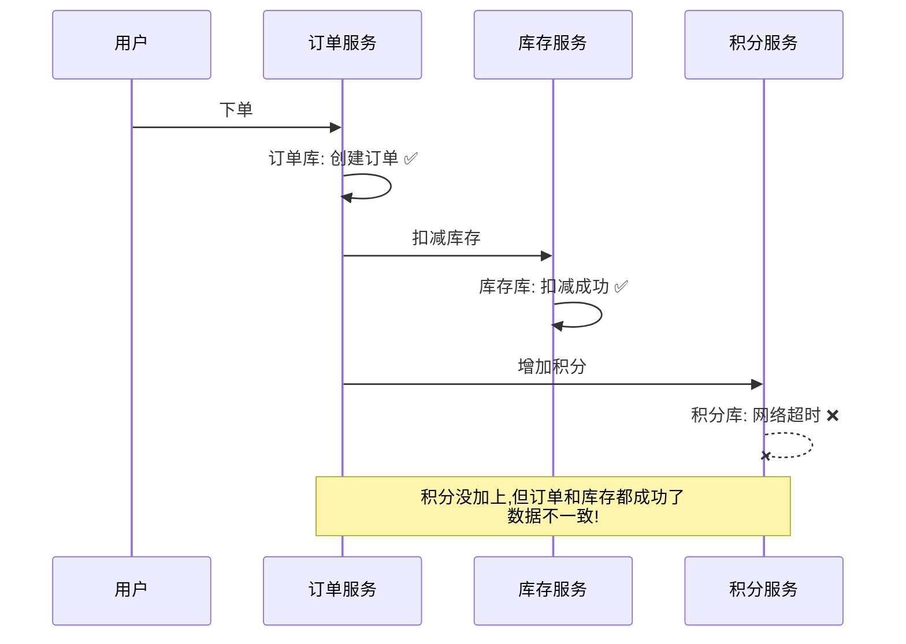
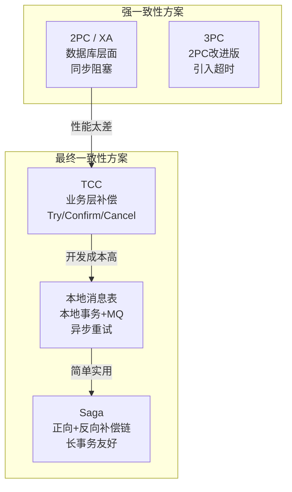
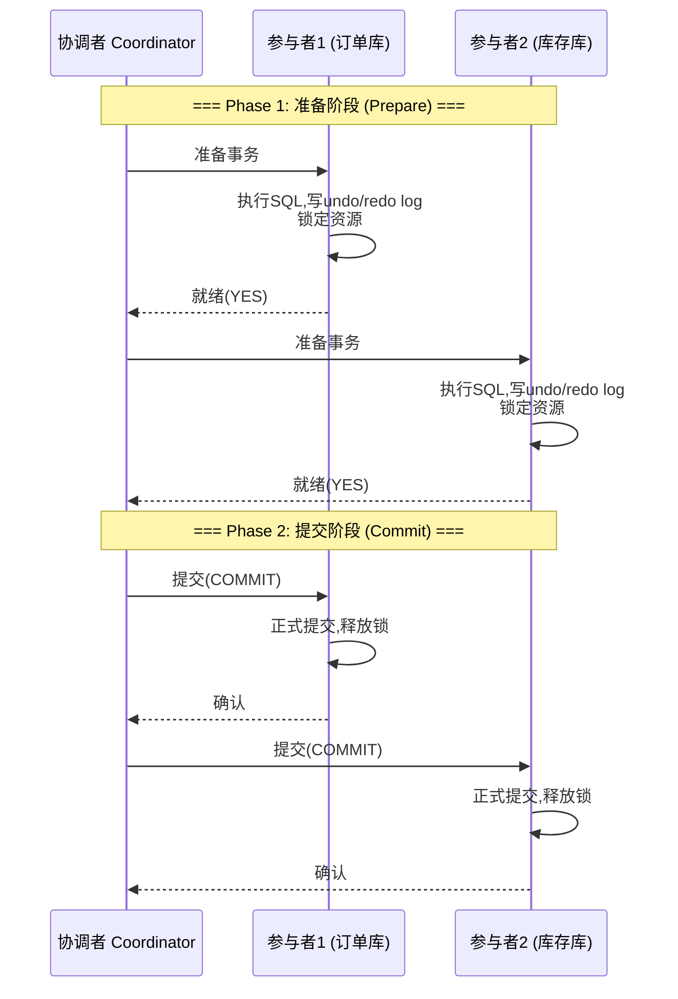
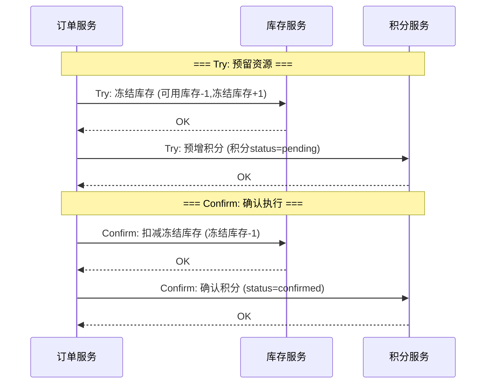
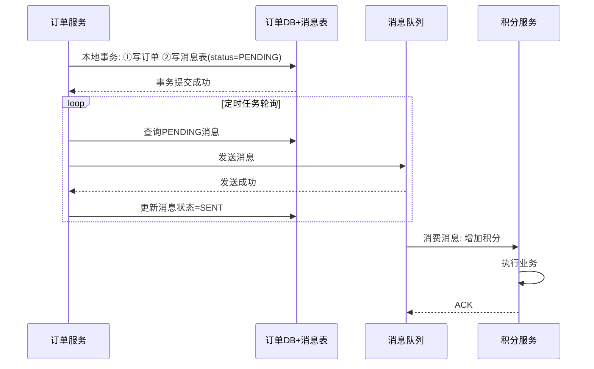
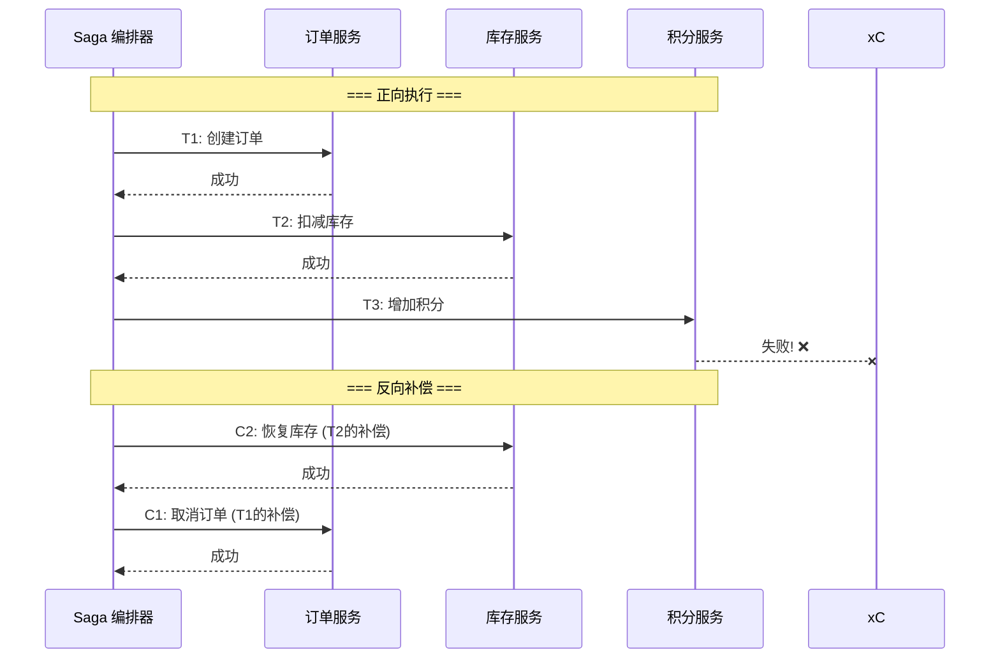
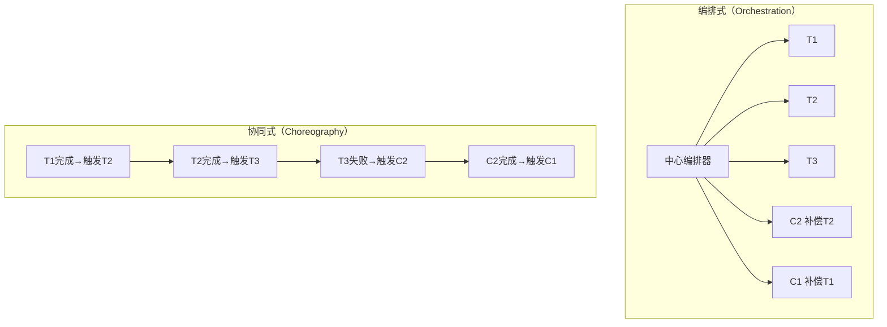
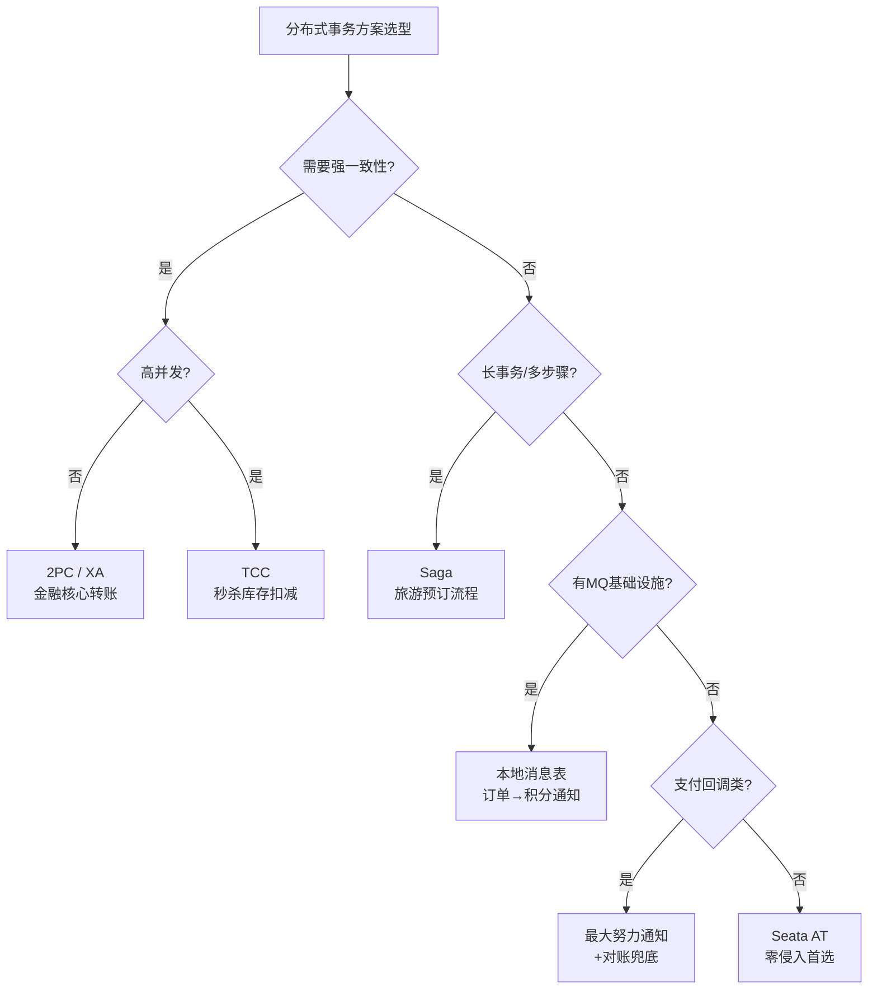

# 分布式事务：2PC / TCC / 本地消息表 / Saga

> 单机事务靠数据库 ACID 就够了。拆成微服务后，一个"下单"操作可能横跨订单库、库存库、积分库——数据库管不了跨库的原子性了。**分布式事务**就是解决"这几个库要么全成功、要么全回滚"的问题。但代价是性能和复杂度，所以现实中的选择题是：你要强一致还是要高可用？

---

## 一、为什么需要分布式事务？

单机事务用数据库的 ACID（Atomicity, Consistency, Isolation, Durability）就能保证原子性。但微服务拆分后，每个服务有独立的数据库，**跨库事务**超出了单个数据库的能力范围——这就是分布式事务存在的原因。

---

## 二、四种主流方案对比

| 方案 | 一致性 | 性能 | 业务侵入 | 适用场景 |
|------|--------|------|----------|----------|
| **2PC/XA** | 强一致 | 低（同步阻塞） | 低（数据库支持） | 金融核心转账 |
| **TCC** | 最终一致 | 高 | 高（三个方法） | 高并发支付/库存 |
| **本地消息表** | 最终一致 | 中 | 低 | 异步通知（订单→积分） |
| **Saga** | 最终一致 | 中 | 中（补偿事务） | 长事务（旅游预订） |

> **国内互联网实践**：Seata AT + 本地消息表覆盖 80% 场景，TCC 覆盖 15% 高并发场景，其余方案占 5%。

---

## 三、2PC（两阶段提交）

### 3.1 原理

**准备阶段**：协调者问所有参与者"能不能提交" → 参与者执行事务但不提交，写 undo/redo log 并锁定资源 → 回复 YES/NO。

**提交阶段**：所有参与者都回复 YES → 协调者发 COMMIT → 参与者正式提交并释放锁；任一回复 NO → 协调者发 ROLLBACK。

### 3.2 优缺点

| 优点 | 缺点 |
|------|------|
| 实现简单，数据库原生支持 | **同步阻塞**：参与者锁定资源等待协调者，高并发下吞吐骤降 |
| 强一致性保证 | **单点故障**：协调者宕机 → 参与者无限阻塞 |
| | **数据不一致风险**：Phase 2 部分提交成功部分失败 → 数据不一致 |

---

## 四、TCC（Try-Confirm-Cancel）

### 4.1 原理

TCC 把一个分布式事务拆成三个**业务层面**的方法：

**Try**：预留资源（冻结库存、预增积分）——但不真正完成业务。
**Confirm**：确认执行，把预留的资源真正扣减/生效。
**Cancel**：取消预留，释放冻结的资源。

### 4.2 优缺点

| 优点 | 缺点 |
|------|------|
| 性能高（锁粒度是业务资源，非数据库行锁） | **开发成本极高**：每个操作要实现 Try/Confirm/Cancel 三个方法 |
| 业务可控，回滚逻辑明确 | **幂等性要求**：Confirm/Cancel 必须幂等（重复调用结果一样） |
| 适用于资金等高一致性场景 | **空回滚**：Try 没执行就收到 Cancel（网络超时），需要正确处理 |

### 4.3 关键设计原则

- **幂等性**：Confirm 和 Cancel 可能被重复调用，必须保证幂等。
- **空回滚处理**：Try 超时未执行就收到 Cancel，Cancel 要识别并返回成功。
- **悬挂防护**：Cancel 先于 Try 到达（网络延迟），后续的 Try 要拒绝。

---

## 五、本地消息表

### 5.1 原理

核心思想：**把"写业务数据"和"发消息"放进同一个本地事务**。

### 5.2 流程详解

1. **本地事务**：订单服务在同一个数据库事务中，同时写入订单记录和消息记录（status=PENDING）。
2. **定时轮询**：独立的定时任务扫描消息表，将 PENDING 消息投递到 MQ。
3. **下游消费**：积分服务消费消息并执行业务，完成后 ACK。
4. **幂等消费**：下游必须幂等处理（用消息 ID 去重），防止重复消费。
5. **重试兜底**：消费失败 → MQ 重试 → 重试耗尽 → 进入死信队列 → 人工处理。

### 5.3 优缺点

| 优点 | 缺点 |
|------|------|
| 实现简单，基于现有数据库和 MQ | 与业务耦合（每个服务要维护消息表） |
| 业务侵入性低 | 依赖定时任务轮询，实时性有延迟 |
| 可靠性高（本地事务保证原子性） | 消息表需要定期清理 |

---

## 六、Saga

### 6.1 原理

把一个长事务拆成一系列**短事务**，每个短事务有对应的**补偿事务**。某一步失败，按**反向顺序**执行补偿。

### 6.2 两种编排模式

| 模式 | 特点 | 优缺点 |
|------|------|--------|
| **编排式** | 中心编排器控制流程 | 流程清晰，但编排器是单点 |
| **协同式** | 服务间事件驱动 | 无中心，但流程分散难追踪 |

### 6.3 优缺点

| 优点 | 缺点 |
|------|------|
| 长事务友好（每步独立提交，不长时间锁资源） | 只能保证最终一致性 |
| 补偿事务实现相对简单 | 补偿逻辑可能很复杂（如已发邮件无法撤回） |
| 业务侵入性中等（只需实现正向+补偿） | 缺乏隔离性（中间状态对外可见） |

---

## 七、方案选型决策树

---

## 八、延伸追问

### Q1：2PC 的阻塞问题怎么产生的？

准备阶段参与者锁定资源后，必须等待协调者的最终指令。如果协调者宕机 → 参与者无限阻塞 → 资源被长时间占用 → 系统吞吐骤降。

### Q2：TCC 的 Try 失败了怎么办？

Try 失败 → 不执行 Confirm，直接执行已成功部分的 Cancel。例如：订单 Try 成功、库存 Try 失败 → 订单 Cancel（取消订单）。

### Q3：本地消息表怎么保证消息不丢？

本地事务同时写业务数据和消息记录，原子性保证"要么全写、要么全不写"。定时任务轮询发送，失败重试。配合幂等消费 + 死信队列 + 对账兜底，三重保障。

### Q4：Saga 的隔离性问题怎么解决？

Saga 的中间状态对外可见（T2 扣了库存但 T3 还没执行）。解决方案：① 业务层面加版本号/状态标记；② 读写锁（在 Try 阶段预留资源）；③ 语义锁（业务状态标记为"处理中"）。

### Q5：Seata 框架支持哪些模式？

AT（自动补偿，零侵入，最常用）、TCC（高性能）、Saga（长事务）、XA（强一致）。国内 80% 场景用 Seata AT + 本地消息表就够了。

---

## 一句话总结

> **分布式事务的本质是在一致性和性能之间做权衡。2PC/XA 强一致但同步阻塞；TCC 性能好但开发成本高；本地消息表简单实用是大多数场景的首选；Saga 适合长事务。学习重点：2PC 两阶段流程、TCC 三个方法设计原则、本地消息表原子性保证、Saga 补偿机制。国内实战推荐：Seata AT + 本地消息表覆盖 80% 场景。**

---

## 速记卡（面试闪卡）

**Q1：一句话讲清「分布式事务：2PC / TCC / 本地消息表 / Saga」到底是什么？**
A：单机事务用数据库的 ACID（Atomicity, Consistency, Isolation, Durability）就能保证原子性。但微服务拆分后，每个服务有独立的数据库，**跨库事务**超出了单个数据库的能力范围——这就是分布式事务存在的原因。
---

**Q2：一、为什么需要分布式事务？ —— 怎么理解？**
A：单机事务用数据库的 ACID（Atomicity, Consistency, Isolation, Durability）就能保证原子性。但微服务拆分后，每个服务有独立的数据库，**跨库事务**超出了单个数据库的能力范围——这就是分布式事务存在的原因。
---

**Q3：二、四种主流方案对比 —— 怎么理解？**
A：| 方案 | 一致性 | 性能 | 业务侵入 | 适用场景 |
|------|--------|------|----------|----------|
| **2PC/XA** | 强一致 | 低（同步阻塞） | 低（数据库支持） | 金融核心转账 |
| **TCC** | 最终一致 | 高 | 高（三个方法） | 高并发支付/库存 |
| **本地消息表** | 最终一致 | 中 | 低 | 异步通知（订单→积分） |

**Q4：三、2PC（两阶段提交） —— 怎么理解？**
A：**准备阶段**：协调者问所有参与者"能不能提交" → 参与者执行事务但不提交，写 undo/redo log 并锁定资源 → 回复 YES/NO。
**提交阶段**：所有参与者都回复 YES → 协调者发 COMMIT → 参与者正式提交并释放锁；任一回复 NO → 协调者发 ROLLBACK。

**Q5：四、TCC（Try-Confirm-Cancel） —— 怎么理解？**
A：TCC 把一个分布式事务拆成三个**业务层面**的方法：
**Try**：预留资源（冻结库存、预增积分）——但不真正完成业务。
**Confirm**：确认执行，把预留的资源真正扣减/生效。
**Cancel**：取消预留，释放冻结的资源。

**Q6：核心速记主线有哪些？**
A：抓住这几根：一、为什么需要分布式事务？、二、四种主流方案对比、三、2PC（两阶段提交）、四、TCC（Try-Confirm-Cancel）、五、本地消息表、六、Saga。

## 相关链接

- 📋 目录：[[00-分布式-系统设计]]
- 📚 学习清单：[[八股文学习清单]]
- 🔗 [[06-消息队列MQ|消息队列 MQ]] — 本地消息表依赖 MQ 基础设施
- 🔗 [[02-微服务架构|微服务架构]] — 微服务拆分是分布式事务的根源
- 🔗 [[10-CAP与BASE理论|CAP/BASE 理论]] — 分布式事务的理论基础
