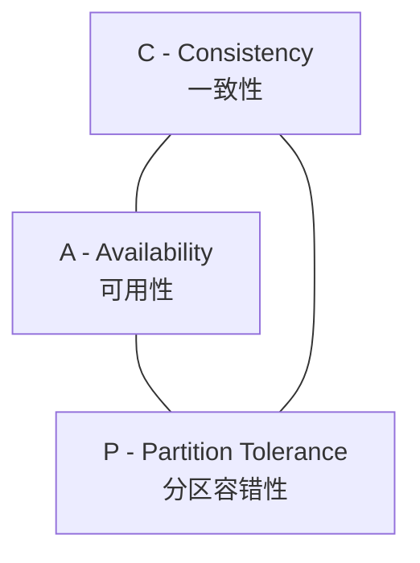
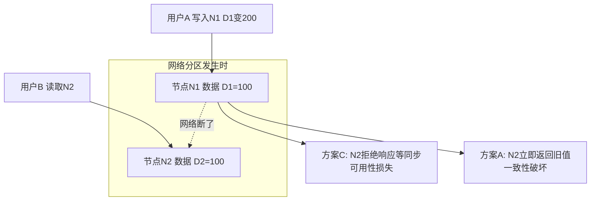
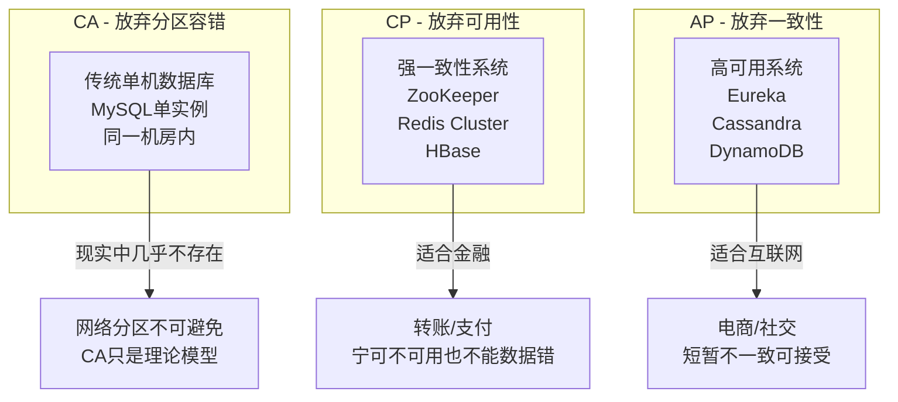
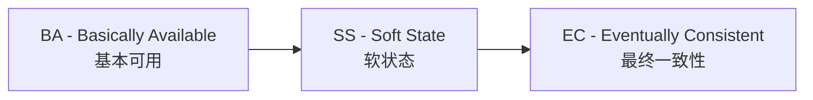
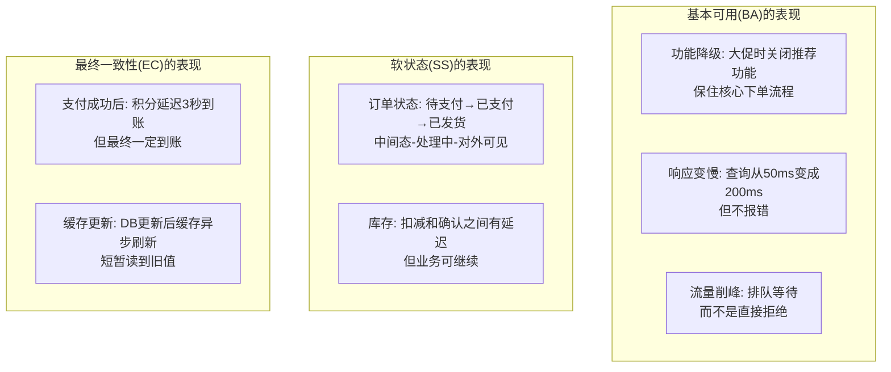
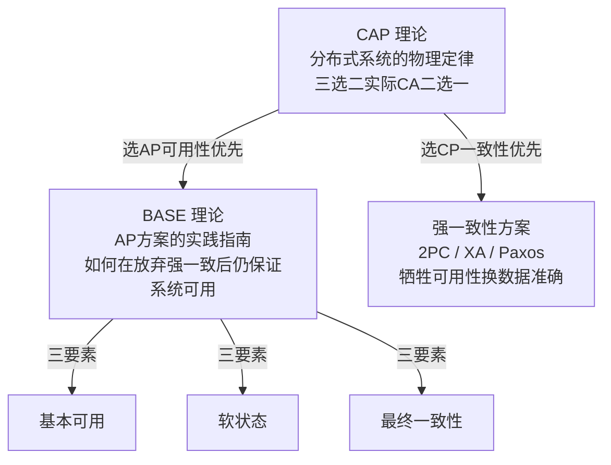

# CAP 理论 + BASE 理论

> CAP 理论是分布式系统的"物理定律"——你不能同时拥有一切。BASE 理论是 CAP 的"务实妥协"——既然强一致太贵，那就退一步追求"最终一致"。理解这两个理论，是回答所有分布式题的底层框架。

---

## 一、CAP 理论

### 1.1 三个要素

| 要素 | 含义 | 生活类比 |
|------|------|----------|
| **C（一致性）** | 所有节点同一时刻看到的数据完全一样 | 你在北京改了银行余额，上海的 ATM 必须立刻显示新余额 |
| **A（可用性）** | 每个请求都能得到非错误响应（不保证是最新数据） | ATM 机随时能取钱，不会告诉你"稍后再试" |
| **P（分区容错性）** | 网络分区（部分节点失联）时系统仍能运行 | 公司内网断了，各部门还能独立办公 |

### 1.2 为什么只能三选二？

**推导过程**：

1. 网络分区不可避免 → **P 必须保证**（分布式系统的基本要求）
2. 分区发生时，节点间无法同步数据
3. 要强一致性（C）→ 必须等同步完成再响应 → 可用性（A）受损
4. 要可用性（A）→ 立即用本地数据响应 → 数据可能不一致 → 一致性（C）受损
5. **所以 P 固定的前提下，C 和 A 二选一**

### 1.3 三种组合与代表系统

| 组合 | 放弃什么 | 代表系统 | 适用场景 |
|------|----------|----------|----------|
| **CA** | 放弃 P（理论模型） | 单机 MySQL | 现实中几乎不存在 |
| **CP** | 放弃 A（宁可不可用） | ZooKeeper、Redis Cluster、HBase、MongoDB | 金融转账、分布式锁 |
| **AP** | 放弃 C（允许暂时不一致） | Eureka、Cassandra、DynamoDB、DNS | 电商下单、社交动态 |

> **关键**：现实中 P 不可避免，所以真正的问题是"CP 还是 AP"——不是"三选二"，而是"在 C 和 A 之间选一个"。

### 1.4 CAP 的常见误解

| 误解 | 正确理解 |
|------|----------|
| "CAP 是三选二" | 实际是 P 必须保，C 和 A 二选一 |
| "选了 CP 就完全不可用" | 只是分区时部分请求被拒绝，不是完全停服 |
| "选了 AP 就完全不一致" | 只是分区时短暂不一致，分区恢复后最终一致 |
| "CAP 适用于所有场景" | CAP 描述的是分区期间的行为，非分区期间可以同时满足 C 和 A |

---

## 二、BASE 理论

BASE 是对 CAP 中 **AP 方案**的扩展——既然放弃强一致性，那怎么在"最终一致"的前提下保证系统可用？

### 2.1 三个要素

| 要素 | 含义 | 生活类比 |
|------|------|----------|
| **BA（基本可用）** | 系统出现故障时，允许损失部分功能，核心功能仍可用 | 超市大促：结账排队变长（响应变慢），但还能买东西（核心功能） |
| **SS（软状态）** | 允许数据存在中间状态，不影响整体可用性 | 外卖已下单但还没配送——"处理中"就是软状态 |
| **EC（最终一致性）** | 经过一段时间后，所有数据副本达到一致 | 转账后对方晚几秒收到——但最终一定收到 |

### 2.2 BASE 的具体表现

### 2.3 最终一致性的五种实现方式

| 方式 | 原理 | 典型应用 |
|------|------|----------|
| **本地消息表** | 本地事务写业务+消息表，定时轮询投递 MQ | 订单→积分/优惠券通知 |
| **事务消息** | RocketMQ 半消息+本地事务 | 支付回调 |
| **可靠消息** | MQ + 重试 + 死信队列 | 服务间异步通知 |
| **最大努力通知** | 定时回调+对账 | 支付平台→商户回调 |
| **TCC/Saga** | 业务层补偿 | 跨服务事务 |

---

## 三、CAP 与 BASE 的关系

| 维度 | CAP | BASE |
|------|-----|------|
| **定位** | 理论定律（描述客观限制） | 实践指南（如何在限制下设计） |
| **回答的问题** | "分布式系统能做什么？" | "不能强一致时怎么办？" |
| **适用阶段** | 架构选型（选 CP 还是 AP） | 具体实现（AP 方案的设计原则） |
| **核心矛盾** | C 和 A 不可兼得 | 用 BA + SS + EC 弥补 C 的损失 |

> **回答框架**：CAP 解决"选哪条路"（CP vs AP），BASE 解决"选了 AP 后怎么走"（基本可用 + 软状态 + 最终一致）。

---

## 四、经典系统 CAP 选型一览

| 系统 | 选型 | 为什么 |
|------|------|--------|
| **ZooKeeper** | CP | 分布式协调需要强一致，宁可短暂不可用 |
| **Eureka** | AP | 服务发现需要高可用，短暂不一致可接受 |
| **Nacos** | CP/AP 可切换 | 服务发现用 AP，配置中心用 CP |
| **Redis Cluster** | CP | 数据分片需要一致性保证 |
| **Cassandra** | AP | 高可用写入优先，最终一致 |
| **MySQL 单机** | CA | 无网络分区时同时满足 C 和 A |
| **MongoDB** | CP（默认） | 默认强一致，可配置为 AP |

---

## 五、延伸追问

### Q1：CAP 理论的核心是什么？

分布式系统最多同时满足一致性（C）、可用性（A）、分区容错性（P）中的两个。由于网络分区不可避免（P 必须保），实际是在 C 和 A 之间做权衡——选 CP（如 ZooKeeper）还是 AP（如 Eureka）。

### Q2：为什么说"CAP 是三选二"是错误的？

严格来说是"P 必须保，C 和 A 二选一"。CA 组合理论上要求放弃分区容错，但网络分区在分布式系统中不可避免，所以 CA 只是理论模型，现实中的选择是 CP 还是 AP。

### Q3：BASE 理论是什么？和 CAP 什么关系？

BASE 是对 CAP 中 AP 方案的扩展——基本可用（BA）：允许损失部分功能；软状态（SS）：允许中间状态存在；最终一致性（EC）：经过一段时间后数据达到一致。CAP 决定"选哪条路"，BASE 解决"选了 AP 后怎么走"。

### Q4：强一致性和最终一致性的区别？

强一致性：写操作完成后，任何后续读操作都能读到最新值（如银行转账）。代价是性能低、可用性差。最终一致性：写操作完成后，允许短暂读到旧值，但经过一段时间（毫秒~秒级）后所有副本达到一致。代价是可能读到过期数据，但性能和可用性好。

### Q5：Eureka 为什么选 AP 不选 CP？

服务发现场景下，可用性比一致性更重要——如果注册中心不可用，所有微服务都无法互相调用，整个系统瘫痪。短暂返回过期的服务列表（AP）比完全不可用（CP）好得多。ZooKeeper 选 CP 是因为分布式协调（如选主）需要强一致。

---

## 一句话总结

> **CAP = 分布式系统的物理定律：P 必须保，C 和 A 二选一。CP 适合金融（ZooKeeper），AP 适合互联网（Eureka）。BASE = AP 方案的实践指南：基本可用 + 软状态 + 最终一致性。学习重点：CAP 真正含义是"C/A 二选一"而非"三选二"、BASE 三要素的含义、经典系统的 CP/AP 选型。**

---

## 速记卡（面试闪卡）

**Q1：一句话讲清「CAP 理论 + BASE 理论」到底是什么？**
A：| 要素 | 含义 | 生活类比 |
|------|------|----------|
| **C（一致性）** | 所有节点同一时刻看到的数据完全一样 | 你在北京改了银行余额，上海的 ATM 必须立刻显示新余额 |
| **A（可用性）** | 每个请求都能得到非错误响应（不保证是最新数据） | ATM 机随时能取钱，不会告诉你"稍后再试" |

**Q2：一、CAP 理论 —— 怎么理解？**
A：| 要素 | 含义 | 生活类比 |
|------|------|----------|
| **C（一致性）** | 所有节点同一时刻看到的数据完全一样 | 你在北京改了银行余额，上海的 ATM 必须立刻显示新余额 |
| **A（可用性）** | 每个请求都能得到非错误响应（不保证是最新数据） | ATM 机随时能取钱，不会告诉你"稍后再试" |

**Q3：二、BASE 理论 —— 怎么理解？**
A：BASE 是对 CAP 中 **AP 方案**的扩展——既然放弃强一致性，那怎么在"最终一致"的前提下保证系统可用？
| 要素 | 含义 | 生活类比 |
|------|------|----------|
| **BA（基本可用）** | 系统出现故障时，允许损失部分功能，核心功能仍可用 | 超市大促：结账排队变长（响应变慢），但还能买东西（核心功能） |

**Q4：三、CAP 与 BASE 的关系 —— 怎么理解？**
A：| 维度 | CAP | BASE |
|------|-----|------|
| **定位** | 理论定律（描述客观限制） | 实践指南（如何在限制下设计） |
| **回答的问题** | "分布式系统能做什么？" | "不能强一致时怎么办？" |
| **适用阶段** | 架构选型（选 CP 还是 AP） | 具体实现（AP 方案的设计原则） |

**Q5：四、经典系统 CAP 选型一览 —— 怎么理解？**
A：| 系统 | 选型 | 为什么 |
|------|------|--------|
| **ZooKeeper** | CP | 分布式协调需要强一致，宁可短暂不可用 |
| **Eureka** | AP | 服务发现需要高可用，短暂不一致可接受 |
| **Nacos** | CP/AP 可切换 | 服务发现用 AP，配置中心用 CP |
| **Redis Cluster** | CP | 数据分片需要一致性保证 |

**Q6：核心速记主线有哪些？**
A：抓住这几根：一、CAP 理论、二、BASE 理论、三、CAP 与 BASE 的关系、四、经典系统 CAP 选型一览、五、延伸追问、一句话总结。

## 相关链接

- 📋 目录：[[00-分布式-系统设计]]
- 📚 学习清单：[[八股文学习清单]]
- 🔗 [[09-分布式事务|分布式事务]] — CAP/BASE 在事务方案选型中的应用
- 🔗 [[02-微服务架构|微服务架构]] — 服务发现（Eureka/Nacos）的 CAP 选型
- 🔗 [[06-消息队列MQ|消息队列 MQ]] — 最终一致性的 MQ 实现方案
