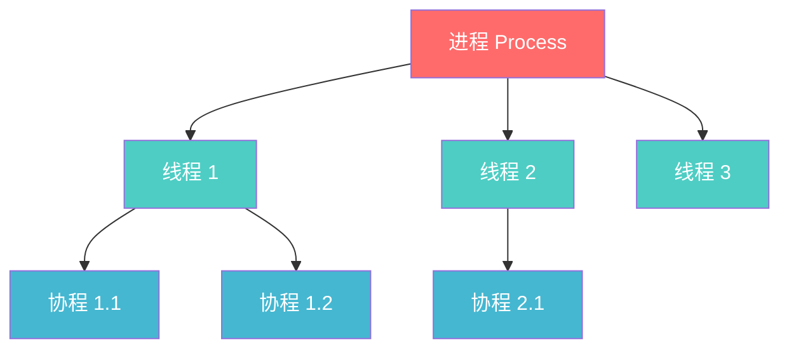
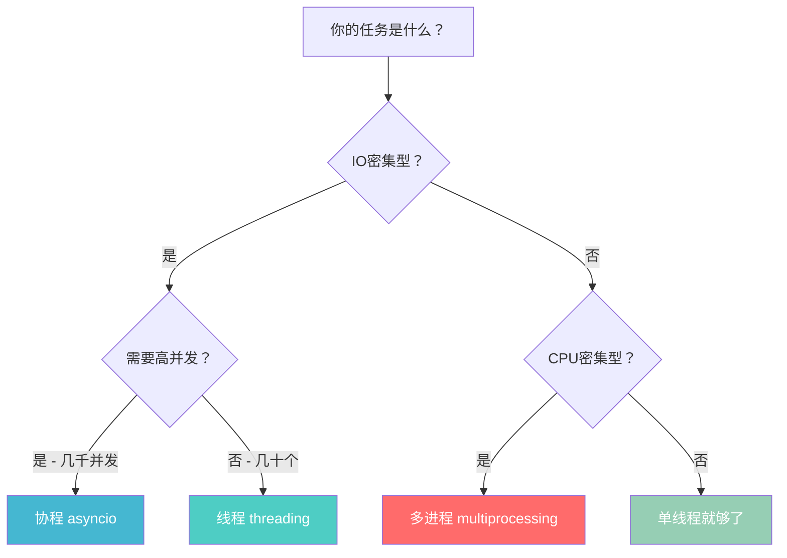

# 进程 vs 线程 vs 协程 三者对比

> **一句话**：进程是工厂，线程是工人，协程是工人的"分身术"。

---

## 一、从零开始：先搞懂"程序"是啥

```text
程序 = 写好的代码（静态的，躺在硬盘上）

进程 = 跑起来的程序（动态的，占着内存和CPU）
```

类比：

- **程序** = 菜谱（写在纸上，不会自己炒菜）

- **进程** = 厨师正在炒菜（占着灶台、锅、食材）

---

## 二、三者定义——用工厂比喻

| 概念 | 一句话定义 | 工厂比喻 |
| ------ | ----------- | ---------- |
| **进程** | 资源分配的最小单位，一个程序跑起来就是一个进程 | 一个**工厂**（有厂房、设备、资金） |
| **线程** | CPU调度的最小单位，进程里的执行单元 | 工厂里的**工人**（共享工厂资源，各自干活） |
| **协程** | 用户态的轻量级线程，由程序自己调度 | 工人的**分身术**（一个工人同时干多件事） |

---

## 三、核心区别——一张表说清楚

| 维度 | 进程 | 线程 | 协程 |
| ------ | ------ | ------ | ------ |
| **本质** | 资源分配单位 | CPU调度单位 | 用户态的"伪线程" |
| **内存** | 独立地址空间 | 共享进程内存 | 共享线程内存 |
| **创建开销** | 大（要分配资源） | 中（共享资源） | 极小（只是函数调用） |
| **切换开销** | 大（涉及内核态） | 中（内核态切换） | 极小（用户态切换） |
| **通信方式** | IPC（管道/共享内存等） | 直接读写共享变量 | 直接读写（同线程） |
| **数量** | 通常几十个 | 通常几百个 | 可以几万个 |
| **崩溃影响** | 一个崩了不影响其他 | 一个崩了整个进程挂 | 一个崩了影响线程 |

---

## 四、关系图——谁包含谁



**包含关系**：进程 ≥ 线程 ≥ 协程

---

## 五、Python 特有：GIL 的影响

> **重点掌握**：Python 有 GIL，多线程不能真正并行？

### GIL 是什么？

```text
GIL = Global Interpreter Lock（全局解释器锁）

同一时刻，只有一个线程能执行 Python 字节码
```

### 所以 Python 多线程是假的？

**不完全对！**

| 场景 | 多线程有没有用？ | 原因 |
| ------ | ---------------- | ------ |
| **CPU 密集型**（计算） | ❌ 没用 | GIL 限制，只能轮流跑 |
| **IO 密集型**（网络/文件） | ✅ 有用 | 等IO时释放GIL，其他线程能跑 |

```python
import threading
import time

# IO密集型：多线程有效
def io_task():
    time.sleep(1)  # 模拟IO，会释放GIL

# CPU密集型：多线程无效
def cpu_task():
    sum(range(10**7))  # 纯计算，不释放GIL
```

---

## 六、协程：Python 的"分身术"

### 为什么需要协程？

```text
线程切换要进内核态 → 开销大

协程切换在用户态 → 开销极小
```

### 类比

| 场景 | 线程 | 协程 |
| ------ | ------ | ------ |
| 你同时看两本书 | 两本书放桌上，眼睛来回切换 | 一本书看5秒，自动跳另一本 |
| 厨师炒两个菜 | 两个灶台，来回跑 | 一个灶台，炒一会这个，炒一会那个 |

### 代码对比

```python
# 线程版本
import threading

def task():
    time.sleep(1)

threads = [threading.Thread(target=task) for _ in range(100)]
# 创建100个线程 → 开销大

# 协程版本
import asyncio

async def task():
    await asyncio.sleep(1)

tasks = [task() for _ in range(100)]
asyncio.run(asyncio.gather(*tasks))  # 极小开销
```

---

## 七、什么时候用什么？——选型决策树



---

## 八、话术——直接背

### Q1：进程和线程的区别？

> 进程是资源分配的最小单位，拥有独立的地址空间；线程是CPU调度的最小单位，共享进程的内存资源。创建进程开销大，创建线程开销小。进程间通信需要IPC机制，线程可以直接读写共享变量。

### Q2：线程和协程的区别？

> 线程由操作系统调度，切换涉及内核态，开销较大；协程由用户程序自己调度，切换在用户态，开销极小。协程本质上是单线程内的并发，适合高并发IO场景。

### Q3：Python 有GIL，多线程还有用吗？

> 对于IO密集型任务有用，因为等待IO时会释放GIL；对于CPU密集型任务没用，因为GIL限制了同一时刻只有一个线程执行字节码。CPU密集型应该用多进程。

---

## 九、实际项目中的应用

| 场景 | 你的选择 | 为什么 |
| ------ | ---------- | -------- |
| FastAPI 处理1000个并发请求 | 协程 | IO密集，需要高并发 |
| 机器人同时处理多个用户消息 | 协程 | IO密集（等LLM响应） |
| 批量数据处理 | 多进程 | CPU密集 |
| 简单脚本 | 单线程 | 没有并发需求 |

---

## 十、记忆口诀

```text
进程重，线程轻，协程最轻巧

进程分资源，线程共享用

协程用户态，切换零开销

GIL 让线程排队走，IO场景协程牛
```

---

**总结**：进程管资源，线程管执行，协程管并发。Python 项目（特别是 FastAPI）默认用协程，CPU 密集用多进程，其他场景用线程。

## 速记卡（面试闪卡）

**Q1：一句话讲清「进程 vs 线程 vs 协程 三者对比」到底是什么？**
A：类比：
**程序** = 菜谱（写在纸上，不会自己炒菜）
**进程** = 厨师正在炒菜（占着灶台、锅、食材）
---

**Q2：一、从零开始：先搞懂"程序"是啥 —— 怎么理解？**
A：类比：
**程序** = 菜谱（写在纸上，不会自己炒菜）
**进程** = 厨师正在炒菜（占着灶台、锅、食材）
---

**Q3：二、三者定义——用工厂比喻 —— 怎么理解？**
A：| 概念 | 一句话定义 | 工厂比喻 |
| ------ | ----------- | ---------- |
| **进程** | 资源分配的最小单位，一个程序跑起来就是一个进程 | 一个**工厂**（有厂房、设备、资金） |
| **线程** | CPU调度的最小单位，进程里的执行单元 | 工厂里的**工人**（共享工厂资源，各自干活） |

**Q4：三、核心区别——一张表说清楚 —— 怎么理解？**
A：| 维度 | 进程 | 线程 | 协程 |
| ------ | ------ | ------ | ------ |
| **本质** | 资源分配单位 | CPU调度单位 | 用户态的"伪线程" |
| **内存** | 独立地址空间 | 共享进程内存 | 共享线程内存 |
| **创建开销** | 大（要分配资源） | 中（共享资源） | 极小（只是函数调用） |

**Q5：四、关系图——谁包含谁 —— 怎么理解？**
A：**包含关系**：进程 ≥ 线程 ≥ 协程
---

**Q6：核心速记主线有哪些？**
A：抓住这几根：一、从零开始：先搞懂"程序"是啥、二、三者定义——用工厂比喻、三、核心区别——一张表说清楚、四、关系图——谁包含谁、五、Python 特有：GIL 的影响、六、协程：Python 的"分身术"。


## 相关链接

- 📋 目录：[[00-操作系统]]

- 📚 学习清单：[[八股文学习清单]]

- 🔗 [[02-进程间通信IPC7种方式|02 进程间通信IPC7种方式]]
- 🔗 [[03-线程同步锁机制|03 线程同步锁机制]]
- 🔗 [[04-进程调度算法|04 进程调度算法]]
- 🔗 [[语言与框架/Python/八股/00-Python|Python八股文]]
- 🔗 [[语言与框架/TypeScript-React/八股/00-React-TS-JS|React-TS-JS八股文]]
- 🔗 [[语言与框架/MySQL/八股/00-MySQL|MySQL八股文]]

