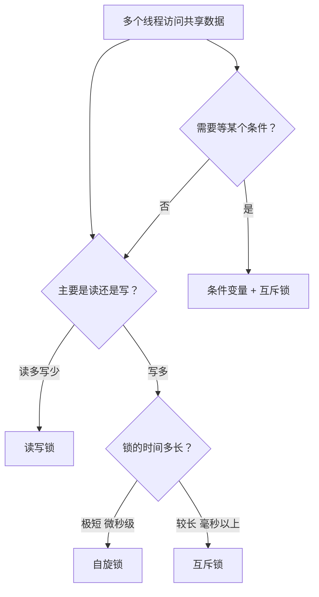

---

title: "线程同步：互斥锁/自旋锁/读写锁/条件变量"

created: "2026-07-20"

tags:

  - 八股文

  - 操作系统

source: "每日笔记"

---

# 线程同步：互斥锁/自旋锁/读写锁/条件变量

> **一句话**：多个线程访问共享数据，不加锁就乱套。锁就是让它们"排队"的工具。

>

> 互斥锁=厕所门栓，自旋锁=一直敲门，读写锁=读可以一起读但写只能一个人写，条件变量=等奶来了再吃饼干。

## 一、四种同步机制的类比速览

```mermaid

mindmap

  root((线程同步 4种方式))

    互斥锁 Mutex

      一个人进去锁门

      其他人门外排队

    自旋锁 Spinlock

      一直敲门问"好了没？"

      不睡觉，死磕

    读写锁 RWLock

      读可以一起读

      写必须独占

    条件变量 Condition Variable

      等条件满足再干活

      不空转，睡着了等人叫

```

| 锁 | 一句话 | 类比 |

| ---- | -------- | ------ |

| **互斥锁** | 一次只能一个人进去，其他人睡觉等 | 厕所门栓 |

| **自旋锁** | 一次只能一个人进去，其他人一直在门口转悠 | 一直敲门问"好了没" |

| **读写锁** | 读可以一起读，写必须独占 | 图书馆自习室 vs 私人包间 |

| **条件变量** | 等某个条件满足再干活，等的时候不浪费 CPU | 等奶来了再吃饼干 |

### 2. 自旋锁（Spinlock）——互斥锁的"急性子"版本
#### 它长啥样

```python

# 自旋锁的概念——不睡觉，一直问

class SpinLock:

    def __init__(self):

        self.locked = False

    def acquire(self):

        while self.locked:

            pass  # 一直转圈，不睡觉！

            # CPU 空转："好了没？好了没？好了没？"

        self.locked = True

    def release(self):

        self.locked = False

```

#### 和互斥锁最核心的区别

| | 互斥锁 | 自旋锁 |

| -- | -------- | -------- |

| 拿不到锁时 | **阻塞**（睡觉） | **空转**（一直问） |

| CPU 占用 | 不占 CPU | **占着 CPU 空转** |

| 切换开销 | 有（休眠→唤醒） | **没有（不用切换）** |

| 适合场景 | 锁的时间长 | **锁的时间极短** |

> **互斥锁：** 拿不到 → 睡觉 → 醒来有开销（像深度睡眠再起床）

> **自旋锁：** 拿不到 → 一直问 → 不睡觉（像一直敲键盘 F5 刷新）

#### 生活类比

你女朋友在卫生间化妆，你要问她拿车钥匙：

| 锁类型 | 你的行为 | 体力消耗 |

| -------- | ---------- | ---------- |

| **互斥锁** | 在门口沙发上躺着等，她出来你再起来 | 不费体力 |

| **自旋锁** | 站在门口每隔 2 秒敲一次门："好了没？好了没？" | 费体力（占 CPU） |

如果她只是洗个手（10 秒）— 自旋锁更好，你刚躺下她就出来了（省了躺下→起来→走过去的时间）

如果她在化妆（30 分钟）— 互斥锁更好，你躺着睡觉，醒来她刚好出来

> **自旋锁的核心哲学：** 我就等一会儿，不值得去睡一觉再起来

#### Python 里没有自旋锁

```python

# Python threading 库只有互斥锁 Lock

```

#### 优缺点

| 优点 | 缺点 |

| ------ | ------ |

| 等待时不用线程切换（快） | 占着 CPU 空转（浪费） |

| 锁的时间极短时比互斥锁快得多 | 锁的时间长了就是灾难 |

**适用场景：** 锁的时间极短（微秒级）。比如：修改一个变量、更新一个计数器、操作一行数据。内核里大量用自旋锁——因为内核里很多操作就是微秒级

### 4. 条件变量（Condition Variable）——"等一个特定条件"
#### 为什么需要它？

前面三种锁都是管**资源的互斥访问**——"一次只能一个人碰数据"。

条件变量管的是另一件事：**等某个条件满足再干活**。

> **互斥锁解决的是：** "别抢！"

> **条件变量解决的是：** "等一会儿！"

#### 一个经典场景

生产者-消费者问题：

**生产者：** 做好了数据，放到队列里

**消费者：** 从队列里取数据，处理

**问题：** 消费者去队列里拿数据 — 空的 → 怎么办？

- 一直轮询检查？ → 浪费 CPU

- 睡觉等通知？ → 条件变量！

```python

import threading

import time

import random

queue = []

cond = threading.Condition()

def producer():

    while True:

        time.sleep(random.random() * 2)

        with cond:

            item = random.randint(1, 100)

            queue.append(item)

            print(f"生产了 {item}")

            cond.notify()        # 通知消费者：有货了！

def consumer():

    while True:

        with cond:

            while not queue:

                cond.wait()      # 没货？睡吧，等通知

            item = queue.pop(0)

            print(f"消费了 {item}")

```

#### 核心方法

| 方法 | 作用 | 类比 |

| ------ | ------ | ------ |

| `wait()` | 在条件变量上**等**，释放锁，线程睡觉 | "没货？我先睡了，有货叫我" |

| `notify()` | 叫醒一个等待的线程 | "来货了，醒醒！" |

| `notify_all()` | 叫醒所有等待的线程 | "全体都有，醒醒！" |

#### 完整的工作流程

**消费者：**

```text

with cond:           # 先拿锁

  while queue为空:    # 检查条件

    cond.wait()      # 没货，睡觉（自动释放锁）

  data = queue取数据  # 有货了，干活

                      # 出 with 自动释放锁

```

**生产者：**

```text

with cond:           # 拿锁

  queue放数据         # 生产

  cond.notify()      # 通知消费者：有货了

                      # 出 with 自动释放锁

```

#### wait 干的三件事

```python

cond.wait()

# 3. 被 notify() 叫醒后，重新拿锁

```

#### 生活类比

🍪 等饼干

```text

你（消费者）想吃饼干 → 打开饼干盒 → 空的

互斥锁方案：每 5 秒来看一次 → 累死了，还费电（占 CPU）

条件变量方案：去睡觉 → 你妈（生产者）买了饼干 → 叫你一声"饼干了！" → 你醒来吃

```

#### 条件变量和互斥锁有啥关系？

条件变量不单独存在，它必须搭配一个互斥锁

- `wait()` 会释放锁 → 别人才能修改条件

- 被唤醒后会重新拿锁 → 安全地检查条件

**适用场景：** 需要等待某个条件满足。比如：队列空等生产、缓存未命中等加载、子线程完成等结果

## 二、选型决策树



## 三、记忆口诀

> **互斥锁，最常用，拿不到就睡觉**

> **自旋锁，急性子，拿不到就转圈**

> **读写锁，最聪明，读能一起写独占**

> **条件变量等人叫，等奶来了泡饼干**

---

**总结**：互斥锁锁门、自旋锁空转、读写锁读共享写独占、条件变量等通知。四个工具解决不同场景的线程同步问题。

## 速记卡（面试闪卡）

**Q1：一句话讲清「线程同步：互斥锁/自旋锁/读写锁/条件变量」到底是什么？**

A：四种线程同步工具：互斥锁、自旋锁、读写锁、条件变量，分别解决排队、空转、读写分离与等待条件。

**Q2：一、四种同步机制的类比速览 —— 怎么理解？**

A：四把"排队神器"：互斥锁像厕所门栓（一人进、他人睡等）；自旋锁像一直敲门（不睡、空转问"好了没"）；读写锁像自习室（多人一起读、写时独占）；条件变量像等妈喊"饼干好了"（条件满足才动）。一句话——别抢、别空转、读共享、等通知。

**Q3：二、选型决策树 —— 怎么理解？**

A：像"按场景选工具"：读多写少→读写锁；写且锁极短（微秒）→自旋锁；写且较长（毫秒+）→互斥锁；要等某条件→条件变量+互斥锁。内核里大量用自旋（操作快），应用层多用互斥（省 CPU）。

**Q4：三、记忆口诀 —— 怎么理解？**

A：现成四句顺口溜最省事：互斥锁最常用、拿不到就睡；自旋锁急性子、拿不到就转；读写锁最聪明、读一起写独占；条件变量等人叫、等奶来了泡饼干。面试背这四句就能展开讲。

**Q5：四把锁的适用边界 —— 怎么理解？**

A：补充边界：互斥锁 Python 有（threading.Lock），自旋锁 Python 没原生（靠 GIL 也意义不大，多见于 C/内核）；读写锁适合缓存、配置等"读远多于写"；条件变量必须配互斥锁，wait 会释放锁、被 notify 叫醒再抢锁。四者不互斥，常组合用。

**Q6：核心速记主线有哪些？**

- 互斥锁：拿不到就阻塞睡眠，适合锁时间较长

- 自旋锁：拿不到就空转忙等，适合微秒级极短锁

- 读写锁：读共享、写独占，适合读多写少

- 条件变量：配互斥锁等待条件，wait 释放锁、notify 唤醒

**口诀**

A：互斥睡觉自旋转，

读写共享写独占；

条件等人配互斥，

四锁各管一段路。

## 相关链接

- 📋 目录：[[00-操作系统]]

- 📚 学习清单：[[八股文学习路线图]]

- 🔗 [[01-进程vs线程vs协程对比|01 进程vs线程vs协程对比]]

- 🔗 [[02-进程间通信IPC7种方式|02 进程间通信IPC7种方式]]

- 🔗 [[06-死锁产生与排查|06 死锁产生与排查]]

- 🔗 [[语言与框架/Python/八股/00-Python|Python八股文]]

- 🔗 [[语言与框架/TypeScript-React/八股/00-React-TS-JS|React-TS-JS八股文]]

- 🔗 [[语言与框架/MySQL/八股/00-MySQL|MySQL八股文]]

