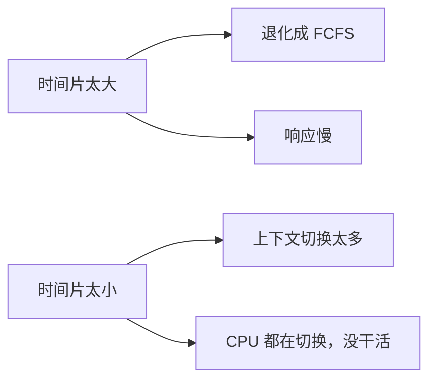

---

title: "调度算法：FCFS / SJF / RR / MLFQ"

created: "2026-07-21"

tags:

  - 八股文

  - 操作系统

source: "每日笔记"

---

# 调度算法：FCFS / SJF / RR / MLFQ

> **一句话**：CPU 一次只能跑一个执行实体，调度器决定"下一个该谁上"。在早期 OS 里调度单位是**进程**，现代 OS 里调度单位是**线程**（Linux 里两者底层统一为 task）。

> FCFS=先来先得，SJF=短活先干，RR=每人玩一会儿轮流，MLFQ=优先级高的先上但防止饿死。

---

## 一、从零开始：为什么需要调度？
### 先搞清楚调度是啥

```text

你的电脑同时开着：

  浏览器（在下载文件）

  VS Code（在等你打字）

  微信（在收消息）

你以为它们在"同时运行"？

其实 CPU 在飞快地来回切换——这秒给浏览器，下秒给 VS Code。

```

**调度 = 调度器在多个就绪的执行实体（现代 OS 里是线程）之间，决定下一个让谁上。**

就像奶茶店只有一个店员，但有 10 个顾客排队。店员叫"下一位！"的时候，选谁？这就是调度。

### 调度发生的三种情况

```text

① 线程自己主动让出 CPU（比如等 IO）："我歇会儿，你先来"

② 线程的时间片用完了（被强制赶下来）："你到时间了，下去"

③ 有优先级更高的线程来了（被抢走）："对不起，领导优先"

```

---

## 二、调度目标——可能先问这个

| 目标 | 意思 | 人话 |
| ------ | ------ | ------ |
| **公平** | 每个执行实体都有机会 | 别让一个线程饿死 |
| **高效** | CPU 利用率高 | 别让 CPU 闲着 |
| **低延迟** | 用户感觉不到卡 | 点击立刻响应 |
| **高吞吐** | 单位时间干完的活多 | 一天写完 10 个任务 |
| **不饿死** | 所有线程都能被执行到 | 别让短任务饿死长任务 |

**不同的目标 → 不同的调度算法。**

---

## 三、四种算法逐个讲
### 1. FCFS（First Come First Served）——先来先得
### 2. SJF（Shortest Job First）——短作业优先
### 3. RR（Round Robin）——时间片轮转
### 4. MLFQ（Multi-Level Feedback Queue）——多级反馈队列
#### 一句话

> 谁先到就谁先上，直到执行完才换下一个。

#### 生活类比

排队买奶茶：

```text

张三 7:00 到 → 排在第一个

李四 7:01 到 → 排在第二个

王五 7:02 到 → 排在第三个

张三点了一杯做起来很复杂的（执行时间长）

李四和王五只能在后面干等

```

#### 例子

```text

进程  到达时间  需要执行时间

P1    0         10

P2    1         1

P3    2         1

FCFS 调度顺序：

P1 → P2 → P3

等待时间：

P2 等了 9 个单位（P1 跑了 10，P2 第 1 到，第 10 才开始）

P3 等了 10 个单位

平均等待时间 = (0 + 9 + 10) / 3 = 6.33

```

#### 优点 vs 缺点

| 优点 | 缺点 |
| ------ | ------ |
| 实现最简单 | **护航效应**：长进程挡着，短进程排长队 |
| 公平（按到达顺序） | 不适合分时系统（大家都要用电脑） |

```text

护航效应（Convoy Effect）：

一个耗时长的进程在前面慢慢跑，

后面一堆短进程（本来 1 秒就能完事）干等。

类比：高速上一个慢车在最左道开 60码，

后面一堆车堵着，明明几秒钟就能过去。

```

---

#### 一句话

> 哪个进程需要的执行时间最短，就先执行哪个。

#### 生活类比

超市收银台：

```text

FCFS 模式：A 买了一车东西在结账，B 只买了一瓶水，排在后面等

                 → B 骂街

SJF 模式：B 只买一瓶水 → 先让 B 结账

          A 买一车东西 → 后面慢慢结

                 → 整体排队时间缩短

```

#### 例子

```text

进程  到达时间  需要执行时间

P1    0         10

P2    1         1

P3    2         1

SJF 调度顺序：

P1（只有 P1 到了，先跑 P1）

→ 第 1 时刻 P2 到了（P2 比当前 P1 短？不，P1 已经在跑了）

→ 第 2 时刻 P3 到了

→ 第 10 时刻 P1 跑完，选最短的 P2（1）→ P3（1）

P1 跑了 10 → P2 跑 1 → P3 跑 1

```

等一下，**非抢占式 SJF** 是这样。但还有**抢占式 SJF（也叫 SRTF，Shortest Remaining Time First）**：

```text

抢占式 SJF：

P1 跑到第 1 时刻 → P2 到达，P2 只需要 1，P1 还剩 9

→ 把 P1 赶下来，先跑 P2

P2 跑完 → P3 到了，P3 只需要 1，P1 还剩 9

→ 先跑 P3

P3 跑完 → 继续跑 P1

平均等待时间更短！

```

#### 核心问题

```text

SJF 有一个致命缺陷：

它需要预先知道每个进程要跑多久

——操作系统怎么可能知道？！

```

| 优点 | 缺点 |
| ------ | ------ |
| 平均等待时间最短（理论上最优） | **无法预知执行时间** |
| 吞吐量高 | 长进程可能**饿死**（总有更短的插队） |

```text

实际系统中不用纯粹的 SJF，

但这个思想很重要——"短任务优先"是很多现代调度器的核心

```

---

#### 一句话

> 每个进程轮流跑一小段时间（时间片），跑完没结束就排到队尾，换下一个。

#### 生活类比

朋友聚餐轮流唱歌：

```text

KTV 包间，5 个人，每人只能唱 1 分钟：

你唱 1 分钟 → 下一个人唱 1 分钟 → 再下一个人...

一轮结束，又轮到你唱 1 分钟

没唱完的歌 → 下一轮接着唱（不会被中断）

→ 每个人都唱过了，没人饿着

```

#### 工作方式

```text

时间片 = 4 个单位

进程队列：[P1] [P2] [P3]

时间 0 - 4：  跑 P1，没跑完，排到队尾

时间 4 - 8：  跑 P2，跑完了！移除

时间 8 - 12： 跑 P3，没跑完，排到队尾

时间 12 - 16：继续跑 P1，跑完了！移除

时间 16 - 20：继续跑 P3，跑完了！

```

#### 时间片大小——最关键的设计



| 时间片 | 效果 | 类比 |
| -------- | ------ | ------ |
| **太大（100ms）** | 用户体验差，感觉卡 | 每人唱半小时才换人 |
| **太小（1ms）** | 切换开销大，CPU 都在做切换没干活 | 刚开口就被打断 |
| **合适（10-50ms）** | 交互流畅，开销可接受 | 每人唱 1 分钟，正好 |

```text

上下文切换开销：

  每次从进程A切到进程B 要花 0.1ms

  时间片设 100ms → 切换占 0.1%

  时间片设 1ms   → 切换占 10%（浪费！）

```

#### 优点 vs 缺点

| 优点 | 缺点 |
| ------ | ------ |
| 公平——每个进程都有机会 | 时间片设置困难 |
| 响应快——适合交互系统 | 吞吐量可能不如 SJF |
| 没人会饿死 | 切换开销 |

```text

适用场景：分时操作系统（Linux、Windows）

你和室友共用一台服务器：

  你在写代码，他在下载电影，她在看网页

  RR 让你们都觉得"电脑是我的！"

```

---

#### 一句话

> 系统有多个不同优先级的队列，进程在队列之间动态升降级——优先跑短任务，但长任务也不会饿死。

#### 这是目前操作系统真正在用的调度算法！
#### 先讲"多级队列"是啥

```text

系统有好几个队列，每个队列优先级不同：

队列 0（优先级最高）→ 时间片 10ms

队列 1（优先级中等）→ 时间片 50ms

队列 2（优先级最低）→ 时间片 200ms

只有高优先级队列空了，才处理下一个队列

```

#### "反馈"是啥意思

```text

反馈 = 进程的优先级会动态变化

       不傻等，根据行为调整

```

#### MLFQ 三大规则

```text

规则 1：优先跑高优先级队列里的进程

         队列 0 有进程 → 不碰队列 1

规则 2：同队列内用 RR（轮流）

         队列 0 有两个进程 → 轮流跑 10ms

规则 3：时间片用完了没跑完 → 降一级

         进程在队列 0 跑了 10ms 没结束

         → 移到队列 1

         在队列 1 跑了 50ms 没结束

         → 移到队列 2

```

#### 逐步动画

```text

进程 P1 进来了：

① 放到队列 0（新进程默认最高优先级）

   跑 10ms（时间片用完了）→ 还没结束

   ↓（降级）

② 放到队列 1

   跑 50ms → 还没结束

   ↓（降级）

③ 放到队列 2（最低优先级）

   跑 200ms → 可能就结束了

如果 P2 这时候新进来：

  P2 → 队列 0（优先级更高！）

  先跑 P2，P1 在队列 2 等着

```

```text

这个设计巧妙在哪？

  短进程：在队列 0 一个时间片就结束了 → 响应极快

  长进程：慢慢降级到低优先级 → 不会饿死，但不会抢短进程的

  IO 密集型：频繁主动让出 CPU → 留在高优先级

  CPU 密集型：总用满时间片 → 自然降到低优先级

```

#### 解决"饥饿"的补充规则

```text

规则 4：每隔一段时间，把所有进程移到最高优先级队列

  → 防止低优先级进程永远吃不到 CPU

  → "全体都有，重置！"

```

#### 生活类比

医院急诊分诊：

```text

队列 0（红色/危重）：马上救！  → 类比短进程（响应极快）

队列 1（黄色/紧急）：等一会儿 → IO 密集型

队列 2（绿色/普通）：慢慢等   → CPU 密集型长任务

一个病人（进程）刚来：

  → 放队列 0，跑最快时间片

  如果治了很久没好（时间片用完）：

  → 降到队列 1，给更长时间

  还是没好：

  → 降到队列 2，保证不会被遗弃

每过一段时间："全体重新检查"（重置）

→ 队列 2 的人也可能发现其实很严重，回到队列 0

```

#### 优点 vs 缺点

| 优点 | 缺点 |
| ------ | ------ |
| 短任务响应快（交互流畅） | 参数配置复杂（几个队列？时间片多大？） |
| IO 密集型进程自然优先生效 | 可能出现**调度抖动** |
| 长任务不会饿死 | |
| 不需要预先知道执行时间 | |

#### 额外的奖励规则（防止被恶意利用）

```text

问题：如果一个进程在时间片用完前 1ms 主动让出 CPU，

      它算"没跑完时间片" → 不会降级！

恶意进程：

  跑 9ms → 主动让出 → 留在高优先级

  又跑 9ms → 主动让出 → 一直赖在最高级

解决方案：

  记录进程"实际占用的 CPU 总时间"

  真·时间到了还是会降级

```

---

## 四、一张表横向对比

| 算法 | 核心思想 | 预先知道执行时间？ | 会不会饿死？ | 响应速度 | 复杂性 |
| ------ | ---------- | ------------------- | ------------- | ---------- | -------- |
| **FCFS** | 先来先得 | 不需要 | 不会饿死 | 慢 | 最简单 |
| **SJF** | 最短优先 | 需要（实际不可能） | 长进程可能饿死 | 快 | 简单 |
| **RR** | 轮流，时间片 | 不需要 | 不会饿死 | 快 | 中等 |
| **MLFQ** | 多级队列动态升降 | 不需要 | 不会饿死（有重置规则） | 最快 | 最复杂 |

---

## 五、一句话讲清
### Q：调度算法有哪些？说几个常用的

> 经典的四种：FCFS、SJF、RR、MLFQ。FCFS 最简单但短进程体验差；SJF 理论最优但没法预知执行时间；RR 轮转保证公平和响应速度，时间片设置是关键；MLFQ 是目前操作系统真正用的，综合了 SJF 和 RR 的优点。

### Q：FCFS 的护航效应是什么？

> 长进程先到并执行，后面短进程排长队等待。就像高速上一个慢车在最左道开 60，后面堵一串。平均等待时间很长。

### Q：RR 的时间片怎么设？

> 不能太大（退化成 FCFS 响应慢），不能太小（切换开销太大）。一般 10-50ms 比较合适，切换开销控制在 1% 以内。

### Q：MLFQ 为什么能同时保证低延迟和高吞吐？

> 短进程在最高优先级一个时间片就结束了，响应极快。长进程会降级到低优先级，不会抢短进程的 CPU。再加上定期重置防止饿死，短任务快、长任务也有保障。

### Q：MLFQ 怎么防止恶意进程？

> 记录进程实际占用的 CPU 时间，不只看"用没用完时间片"。

---

## 六、记忆口诀

```text

FCFS 先来先得——排队买奶茶，慢的堵死快的

SJF 短的优先——理论最牛，实际上用不了

RR 轮流坐庄——时间片到了换人，交互系统必备

MLFQ 多级升降——Linux 在用的真·王者

```

---

**总结**：FCFS 排队、SJF 短活优先（但用不了）、RR 分时间片轮转、MLFQ 分优先级动态升降。MLFQ 是实际系统的答案，记住三条核心规则 + 一个重置机制。

## 速记卡（面试闪卡）

**Q1：一句话讲清「调度算法：FCFS / SJF / RR / MLFQ」到底是什么？**

A：调度器决定多个就绪线程谁先上 CPU，经典有先来先得、短优先、轮转、多级反馈四种。

**Q2：题目核心 —— 怎么理解？**

A：像奶茶店一个店员十人排队，叫"下一位"选谁就是调度；英文 CPU Scheduling，目标是公平高效、低延迟不饿死。

**Q3：思路拆解 —— 怎么理解？**

A：如同 FCFS 排队买奶茶慢的堵死快的（护航效应）；SJF 短活先干理论最优却没法预知时长；英文 Convoy Effect 描述长进程挡道。

**Q4：代码骨架 —— 怎么理解？**

A：好比 RR 聚餐轮流唱 K：每人唱一小段（时间片）没完排尾续；时间片太大退化 FCFS、太小全在切换；英文 Round Robin 时间片轮转。

**Q5：复杂度与实战 —— 怎么理解？**

A：如同医院急诊分诊：MLFQ 多队列动态升降级，短任务快、长任务不饿死，是 Linux 真在用的；英文 Multi-Level Feedback Queue。

**Q6：核心速记主线有哪些？**

- FCFS：先来先得，简单但有护航效应拖慢短任务

- SJF：短作业优先，平均等待最短但需预知时长、可能饿死

- RR：时间片轮转，公平响应快，时间片大小是关键

- MLFQ：多级反馈队列，动态升降级，Linux 实际采用

**口诀**

A：调度四法记心间

先来先得慢的堵

短活优先用不了

轮转多级 Linux 用

## 相关链接

- 📋 目录：[[00-操作系统]]

- 📚 学习清单：[[八股文学习路线图]]

- 🔗 [[01-进程vs线程vs协程对比|01 进程vs线程vs协程对比]]

- 🔗 [[05-死锁四条件与银行家算法|05 死锁四条件与银行家算法]]

- 🔗 [[06-死锁产生与排查|06 死锁产生与排查]]

- 🔗 [[语言与框架/Python/八股/00-Python|Python八股文]]

- 🔗 [[语言与框架/TypeScript-React/八股/00-React-TS-JS|React-TS-JS八股文]]

- 🔗 [[语言与框架/MySQL/八股/00-MySQL|MySQL八股文]]

