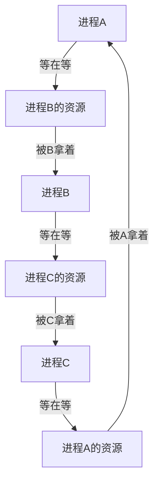

---

title: "死锁四条件 + 银行家算法"

created: "2026-07-20"

tags:

  - 八股文

  - 操作系统

source: "每日笔记"

---

# 死锁四条件 + 银行家算法

> **一句话**：死锁就是两个进程互相等着对方手里的资源，谁也不让谁，大家一起卡死。银行家算法是操作系统预判"这样分配会不会导致死锁"的防患于未然的手段。

## 一、死锁四条件——四个条件必须**同时满足**才会死锁

```mermaid

mindmap

  root((死锁四条件))

    互斥

      资源一次只能给一个进程

    持有并等待

      拿着手里的，等着别人的

    不可剥夺

      别人拿不走我手里的

    循环等待

      你等我、我等他、他等你

```

| 条件 | 一句话 | 类比 |

| ------ | -------- | ------ |

| **① 互斥** | 资源一次只能一个进程用 | 厕所一个坑，不能两个人同时上 |

| **② 持有并等待** | 拿着自己的，还想拿别人的 | 你占着碗，还想要筷子 |

| **③ 不可剥夺** | 进程不主动释放，别人抢不走 | 你不松手，别人拿不走你的碗 |

| **④ 循环等待** | 你等我、我等他、他等你，形成环 | A 等 B、B 等 C、C 等 A |

### 条件 1：互斥（Mutual Exclusion）

```text

资源一次只能给一个进程用。

打印机：你在打印的时候，别人不能同时打印——互斥。

硬盘读：你读文件，别人也能读——不互斥。

只有互斥资源才可能死锁。读共享的文件不会死锁。

```

### 条件 2：持有并等待（Hold and Wait）

```text

进程A 拿着打印机不放手，同时还在等扫描仪。

"我手里的不能给你，你手里的我也想要。"

```

### 条件 3：不可剥夺（No Preemption）

```text

进程A 不主动释放打印机，谁也别想从 A 手里抢走。

除非 A 自愿 release()，否则打印机会一直归 A。

```

### 条件 4：循环等待（Circular Wait）

```text

进程A 等 进程B 的资源

进程B 等 进程C 的资源

进程C 等 进程A 的资源

形成一个环。

```



### 关键：四个条件**缺一不可**

```text

打破任何一个条件，死锁就解了：

  ① 不用互斥资源 → 不现实（打印机就是一次一个人用）

  ② 不让持有等待 → 要么全给你，要么一个都不给

  ③ 允许剥夺 → 操作系统抢走你的资源

  ④ 打破循环 → 所有人都按同一个顺序申请资源

```

## 二、银行家算法（Banker's Algorithm）——操作系统版"风险控制"
### 为什么起这个名字？

```text

银行的运作：

客户找银行贷款 → 银行检查：

  "你总共要借 100 万"

  "你现在已经借了 60 万"

  "你还要再借 20 万"

  "我银行现在有 50 万现金"

银行算：

  借给你 20 万后 → 我手上还剩 30 万

  剩下的人还想借钱的话，我还够不够给？

  如果够 → 借给你

  如果不够，其他人可能还不了款 → 不借！

银行家算法 = 银行家放贷前的风险评估。

```

### 翻译到操作系统

```text

进程 = 客户

资源（内存/打印机/磁盘）= 钱

进程说"我还要资源" = 贷款申请

操作系统 = 银行家

操作系统在分配资源前先算：

  "给了你之后，剩下的资源够不够让所有进程完成任务？"

  "够 → 分给你"

  "不够 → 先不给你，你等着"

```

### 三个关键数据

| 数据 | 含义 | 类比 |

| ------ | ------ | ------ |

| **Max** | 进程总共需要多少资源 | 客户总共要借多少钱 |

| **Allocation** | 进程已经拿到了多少 | 客户已经借了多少钱 |

| **Need** | 进程还差多少 | 客户还要借多少钱 |

```text

Need = Max - Allocation

```

还有一个：

| 数据 | 含义 |

| ------ | ------ |

| **Available** | 系统当前还有多少空闲资源 |

### 算法的核心思想

```text

进程P 申请资源 →

操作系统假装先分给它 →

然后检查：剩下的资源能保证所有进程都完成任务吗？

  能 → 真的分给它（安全状态）

  不能 → 拒绝这次分配（不安全状态）

```

### 具体流程（以单种资源为例）

```text

系统有 10 个资源（比如内存块）

三个进程：

        Max（总共要）  Allocation（已拿）  Need（还差）

进程P1     9               3               6

进程P2     4               2               2

进程P3     7               2               5

已分配 = 3 + 2 + 2 = 7

剩余 Available = 10 - 7 = 3

```

**现在进程P2 请求再要 1 个资源。**

```text

P2 的 Need = 2，它还要 2 个。

现在 P2 请求 1 个 → 操作系统先假装分给它：

假装后的状态：

        Allocation   Need

P1        3          6

P2        3          1   ← 多拿了一个

P3        2          5

剩余 Available = 10 - (3+3+2) = 2

```

**检查是否安全：**

```text

① 看哪个进程的 Need ≤ Available（2）：

   P2 的 Need = 1 ≤ 2 → P2 可以完成！

   假设 P2 完成了 → 释放它的 3 个资源

   Available = 2 + 3 = 5

② 现在 Available = 5：

   P1 的 Need = 6 > 5 → 不行

   P3 的 Need = 5 ≤ 5 → P3 可以完成！

   假设 P3 完成了 → 释放它的 2 个资源

   Available = 5 + 2 = 7

③ 现在 Available = 7：

   P1 的 Need = 6 ≤ 7 → P1 可以完成！

   释放 P1 的 3 个资源

全部都能完成 → 安全状态 ✅ → P2 的请求被批准

```

### 如果刚才的例子改成不安全

```text

假设系统剩余 = 1，P2 请求 1 个后：

        Allocation   Need

P1        3          6

P2        3          1

P3        2          5

Available = 1

检查：

  P1 Need=6 > 1 → 不行

  P2 Need=1 ≤ 1 → 可以完成

  释放 P2 → Available = 1 + 3 = 4

  P1 Need=6 > 4 → 不行

  P3 Need=5 > 4 → 不行

  P1 和 P3 都完成不了 → 不安全状态 ❌

  → 拒绝 P2 的请求！

```

### 安全序列

上面的例子中，找到的完成顺序就是 **安全序列**：

```text

安全序列 = [P2, P3, P1]

按这个顺序执行，所有进程都能完成。

如果存在至少一个安全序列 → 系统处于安全状态。

```

### 银行家算法的局限

```text

① 需要提前知道每个进程的最大需求（Max）

   → 实际中进程经常不知道自己要多少资源

② 进程数量通常是固定的

   → 实际中进程会动态创建和销毁

③ 资源数量不变

   → 实际中可以加内存条

所以银行家算法在实际操作系统中用得不多，

但是常考点——考的是"死锁避免"这个思想。

```

## 三、一句话讲清
### Q：死锁四个必要条件是什么？

> 互斥、持有并等待、不可剥夺、循环等待。四个必须同时满足才死锁，打破任何一个就能预防死锁。

### Q：怎么预防死锁？

> 最实用的是打破循环等待——所有进程按同一顺序申请资源。比如先申请 A 再申请 B，就不会出现 A 等 B、B 等 A 的环。

### Q：银行家算法是什么？

> 死锁避免算法。分配资源前先计算这次分配是否会导致不安全状态——检查是否存在安全序列。如果存在就分配，不存在就拒绝。就像银行家放贷前评估风险。

### Q：安全状态和不安全状态的区别？

> 安全状态存在至少一个安全序列，所有进程能按顺序完成。不安全状态不存在这样的序列，最终可能死锁。但不安全不一定是死锁——只是有风险。

**总结**：死锁四个条件缺一不可。预防靠打破条件，避免靠银行家算法预先计算，检测靠找环，恢复靠杀进程或剥夺资源。银行家算法的核心是"安全序列"——能不能给所有进程善终。

## 速记卡（面试闪卡）

**Q1：一句话讲清「死锁四条件 + 银行家算法」到底是什么？**

A：死锁就是多个进程互相等着对方手里的资源、谁都不松手，全体卡死；银行家算法是提前算"这样分会不会死锁"的风险控制。

**Q2：死锁四条件怎么记 —— 怎么理解？**

A：像四人上厕所：①互斥——坑位一次只容一人；②持有并等待——占着碗还想要筷子；③不可剥夺——你不松手别人抢不走；④循环等待——A等B、B等C、C等A 成环。四个同时成立才死锁。

**Q3：怎么预防死锁 —— 怎么理解？**

A：像定规矩：只要打破四条件之一就解。最实用是打破循环等待——所有人按同一顺序申请资源（先 A 再 B），就不会出现 A 等 B、B 等 A 的死环。也可允许剥夺或一次性全给。

**Q4：银行家算法怎么理解 —— 怎么理解？**

A：像银行放贷前风控：客户（进程）说还要借多少（Need=Max-Allocation），银行家（操作系统）先假装借出，算剩下的钱够不够让所有人还清（存在安全序列）才真借，否则拒。Banker's Algorithm 防患于未然。

**Q5：安全状态 vs 不安全状态 —— 怎么理解？**

A：像末日逃生：安全状态存在至少一个"安全序列"，所有人能按顺序拿到资源干完活、释放出来，全员脱困；不安全状态找不到这样的序列，可能最终死锁——但不安全≠已死锁，只是有风险。

**Q6：核心速记主线有哪些？**

- 四条件：互斥、持有并等待、不可剥夺、循环等待（同时成立才死锁）

- 预防：打破任一即可，最常用按序申请打破循环等待

- 避免：银行家算法先假装分配，验证安全序列再真分

- 恢复：检测靠找环，恢复靠杀进程或剥夺资源

**口诀**

A：死锁四条件，互斥等待环；

占碗想筷子，不抢成死滩。

银行先风控，假装贷一环；

安全序列在，全员能过关。

## 相关链接

- 📋 目录：[[00-操作系统]]

- 📚 学习清单：[[八股文学习路线图]]

- 🔗 [[02-进程间通信IPC7种方式|02 进程间通信IPC7种方式]]

- 🔗 [[04-进程调度算法|04 进程调度算法]]

- 🔗 [[06-死锁产生与排查|06 死锁产生与排查]]

- 🔗 [[语言与框架/Python/八股/00-Python|Python八股文]]

- 🔗 [[语言与框架/TypeScript-React/八股/00-React-TS-JS|React-TS-JS八股文]]

- 🔗 [[语言与框架/MySQL/八股/00-MySQL|MySQL八股文]]

