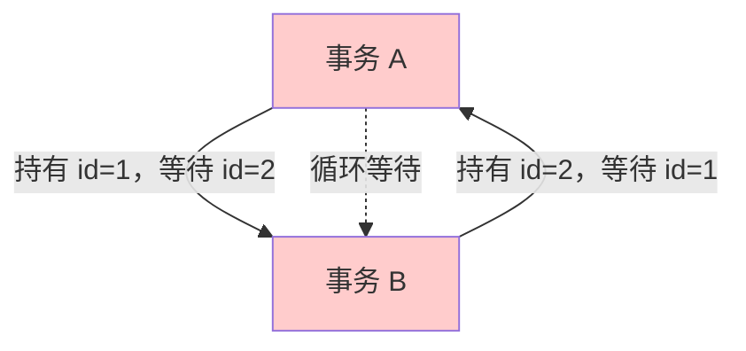
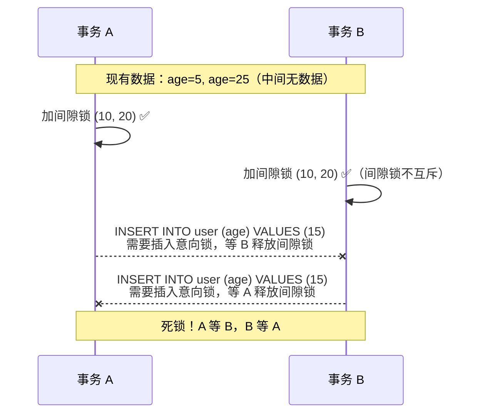

# 死锁产生与排查

## 一句话总结

> **死锁 = 事务 A 拿着 1 号资源等 2 号，事务 B 拿着 2 号资源等 1 号。两个人互相等对方松手，谁也干不完，谁也退不了。**

## MySQL 怎么处理死锁？

死锁发生后，MySQL **不会永远等下去**。它有死锁检测机制：



**死锁不会让整个系统卡死，MySQL 会自动杀掉一个事务。但代价是那个事务的改动被回滚，应用层需要重试。**

## 最常见的死锁场景

### 场景 1：两条记录加锁顺序不一致（最典型）

```sql
-- ❌ 死锁风险

-- 事务 A

UPDATE accounts SET balance = balance - 100 WHERE id = 1;

UPDATE accounts SET balance = balance + 100 WHERE id = 2;

-- 事务 B

UPDATE accounts SET balance = balance - 50 WHERE id = 2;

UPDATE accounts SET balance = balance + 50 WHERE id = 1;

-- 如果 A 锁了 1、B 锁了 2 → 互相等 → 死锁
```

```sql
-- ✅ 修复：按相同顺序加锁

-- 两个事务都先锁 id=1，再锁 id=2

-- 不管转账方向如何，先锁小 id，再锁大 id
```

**最推荐的修复方式：所有事务按同一顺序访问资源。**

### 场景 2：间隙锁导致的死锁

**关键认知：间隙锁不互斥。** 两个事务可以同时持有同一个间隙的间隙锁。



**核心矛盾：两个事务都能拿到同一个间隙的锁（间隙锁不互斥），但都不能插入（插入意向锁互斥）。互相等对方先提交/回滚释放间隙锁，于是死锁。**

**缓解：尽量用等值条件而不是范围条件，减少间隙锁的持有范围。**

### 场景 3：主键冲突导致的死锁

```sql
-- 事务 A

INSERT INTO user (id, name) VALUES (1, 'Alice');

-- 还没提交

-- 事务 B

INSERT INTO user (id, name) VALUES (1, 'Bob');

-- 等待事务 A 释放 id=1（主键冲突）

-- 事务 C

INSERT INTO user (id, name) VALUES (2, 'Charlie');

-- 正常，和 id=1 没关系

-- 但如果有外键或其它锁关联关系，可能让 C 也卷进来
```

### Step 1：查看 `SHOW ENGINE INNODB STATUS` 的输出

**事务 1：**
- `TRANSACTION 2001, ACTIVE 10 sec`
- `MySQL thread id 5, query id 100`
- `UPDATE accounts SET balance = balance - 100 WHERE id = 1`
- **持有锁：** `Record lock, space id 10, page no 5, n bits 72` → 持有 id=1 的行锁
- **等待锁：** `Record lock, space id 10, page no 5, n bits 72` → 在等 id=2 的锁

**事务 2：**
- `TRANSACTION 2002, ACTIVE 8 sec`
- `MySQL thread id 6, query id 101`
- `UPDATE accounts SET balance = balance - 50 WHERE id = 2`
- **持有锁：** `Record lock, space id 10, page no 5, n bits 72` → 持有 id=2 的行锁
- **等待锁：** `Record lock, space id 10, page no 5, n bits 72` → 在等 id=1 的锁

**结果：** MySQL 选择了事务 2 回滚（`WE ROLL BACK TRANSACTION (2)`）

### Step 2：看哪个 SQL 产生的

```sql
-- 开启死锁日志
SET GLOBAL innodb_print_all_deadlocks = ON;
-- 之后每次死锁都会记录到 MySQL error log
-- 直接看日志文件里的死锁信息和 SQL

```
### Step 3：分析业务代码

从死锁日志找到两条 SQL → 定位到代码位置

发现：
- 事务 A：转账 1→2（先锁 1 再锁 2）
- 事务 B：转账 2→1（先锁 2 再锁 1）

修复：两个事务都先锁小 id 再锁大 id

## 一句话讲清

> **延伸提问："死锁怎么产生的？怎么排查？"**
>
> "死锁是事务之间循环等待资源。最常见的是多条记录加锁顺序不一致——A 锁 1 等 2，B 锁 2 等 1。
>
> 排查分三步：
> 1. SHOW ENGINE INNODB STATUS 看最后一次死锁
> 2. 开启 innodb_print_all_deadlocks，监控错误日志
> 3. 从日志里找到两条冲突 SQL，定位代码位置
>
> 预防最有效的是所有事务按相同顺序加锁，比如转账无论方向都先锁小 id。另外事务尽量短、隔离级别别太高。如果死锁不可避免，应用层要做好重试。"

---

## 记忆口诀

> **死锁 = 你等我我等你，两个人僵住了。**

> **MySQL 自动杀一个，另一个正常走，杀的那个要重试。**

> **SHOW ENGINE INNODB STATUS 看现场。**

> **预防就一句话：锁的顺序固定好，事务别太长。**

## 速记卡（面试闪卡）

**Q1：一句话讲清「死锁产生与排查」到底是什么？**
A：**死锁 = 事务 A 拿着 1 号资源等 2 号，事务 B 拿着 2 号资源等 1 号。两个人互相等对方松手，谁也干不完，谁也退不了。**

**Q2：一句话总结 —— 怎么理解？**
A：**死锁 = 事务 A 拿着 1 号资源等 2 号，事务 B 拿着 2 号资源等 1 号。两个人互相等对方松手，谁也干不完，谁也退不了。**

**Q3：MySQL 怎么处理死锁？ —— 怎么理解？**
A：死锁发生后，MySQL **不会永远等下去**。它有死锁检测机制：
**死锁不会让整个系统卡死，MySQL 会自动杀掉一个事务。但代价是那个事务的改动被回滚，应用层需要重试。**

**Q4：最常见的死锁场景 —— 怎么理解？**
A：**最推荐的修复方式：所有事务按同一顺序访问资源。**
**关键认知：间隙锁不互斥。** 两个事务可以同时持有同一个间隙的间隙锁。
**核心矛盾：两个事务都能拿到同一个间隙的锁（间隙锁不互斥），但都不能插入（插入意向锁互斥）。互相等对方先提交/回滚释放间隙锁，于是死锁。**
**缓解：尽量用等值条件而不是范围条件，减少间隙锁的持有范围。

**Q5：一句话讲清 —— 怎么理解？**
A：**延伸提问："死锁怎么产生的？怎么排查？"**
"死锁是事务之间循环等待资源。最常见的是多条记录加锁顺序不一致——A 锁 1 等 2，B 锁 2 等 1。
排查分三步：
SHOW ENGINE INNODB STATUS 看最后一次死锁
开启 innodb_print_all_deadlocks，监控错误日志
从日志里找到两条冲突 SQL，定位代码位置
预防最有效的是所有事务按相同顺序加锁，比如转账无论方向都先锁小 id。

**Q6：核心速记主线有哪些？**
A：抓住这几根：一句话总结、MySQL 怎么处理死锁？、最常见的死锁场景、一句话讲清、记忆口诀。


## 相关链接

- 📋 目录：[[00-操作系统]]

- 📚 学习清单：[[八股文学习清单]]

- 🔗 [[03-线程同步锁机制|03 线程同步锁机制]]
- 🔗 [[04-进程调度算法|04 进程调度算法]]
- 🔗 [[05-死锁四条件与银行家算法|05 死锁四条件与银行家算法]]
- 🔗 [[语言与框架/Python/八股/00-Python|Python八股文]]
- 🔗 [[语言与框架/TypeScript-React/八股/00-React-TS-JS|React-TS-JS八股文]]
- 🔗 [[语言与框架/MySQL/八股/00-MySQL|MySQL八股文]]

