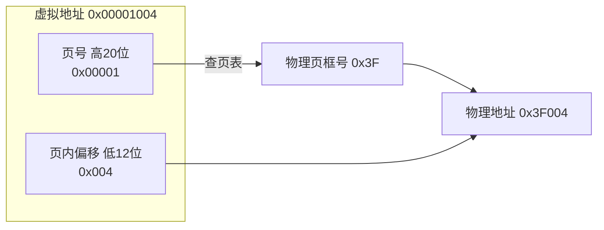
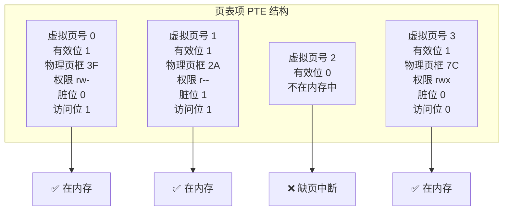
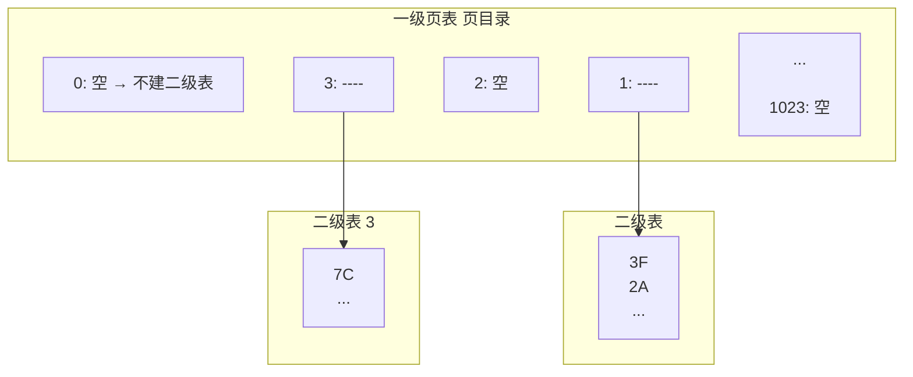

# 地址翻译从虚拟到物理
## 地址翻译——从虚拟到物理的全过程

### 用"教室座位表"理解整件事

```text
一个班级有50个学生，但学校实际座位排布不是按学号的。

老师（CPU）喊："3号同学，回答问题！"

班长（MMU）翻座位表（页表）→ 3号 → 实际坐在第5排第2列

班长告诉老师："3号在第5排第2列"

整个过程3号同学自己都不知道自己被"翻译"了——对3号来说，

他就是3号。对老师来说，喊"3号"就行，不用关心他坐哪。
```

拆开看每一步：

```text
程序里写：int *p = malloc(100);

printf("%p", p);  // 打印 0x7fff... → 这是虚拟地址，不是物理地址！

CPU执行指令：load 0x1000  ← CPU说"我要读虚拟地址0x1000的数据"

       ↓

    MMU 翻页表：虚拟页号→物理页框号

       ↓

   物理地址 0x3F000  ← 内存条实际收到的地址

内存条这辈子都不知道什么叫"虚拟地址"——它只认物理地址。

翻译这件事只发生在CPU内部，对运行的程序完全透明——

程序从头到尾都觉得自己在用"真实的物理地址"。
```

### 一个虚拟地址，切成两半看

```text
虚拟地址 = 页号 + 页内偏移

假设32位系统，页大小4KB（=4096字节=2^12）
```

> 翻译三步：① 取高20位 → 页号=1 ② 翻页表 → 页号1 → 物理页框号=0x3F ③ 拼起来 → 物理地址 = 0x3F004。偏移量从头到尾不变——变的只是"页号"和"框号"之间的对应关系。

**类比**：
```text

你去电影院：票上写 "3号厅 5排 4座"

3号厅 → 翻导览图 → 实际在2楼东侧

5排 4座 → 不变，进了厅里找就行

你手里的"3号厅"是虚拟的编号，实际那间房可能是"201室"。

但"5排4座"到了哪个厅都一样——不需要翻译，直接数过去。

```
### 页表里存了什么——不只是"翻译结果"

> 🔴 **一句话讲清**：每个进程有自己独立的页表。CPU里有一个叫PTBR（页表基址寄存器）的寄存器，存着当前进程页表在物理内存中的起始地址。进程切换时OS只做一件事——把PTBR指向新进程的页表。从此所有地址翻译自动切到新进程的视角。

### 多级页表——"这本书的目录为什么只有几页"
```text

先看一级大表的问题：

  32位系统，4KB一页 → 总共2^20=1,048,576页（约100万条）

  每条4字节 → 页表本身4MB。每个进程都占4MB → 100个进程=400MB！

  而且绝大多数页表项其实是空的（进程没用那么多地址空间）→ 纯纯浪费。

  64位更夸张——页表条目多到一页表根本放不下，必须分级。

解法：多级页表——只给"真正用到的区域"建表

  一级表（总目录）：不是每个条目都存"答案"，而是标记"下面有没有东西"

    标记为空 → 不需要二级表 → 省了整个二级表的内存

    标记有 → 指向一个二级表 → 二级表里才真正存物理框号

  书目录类比——100章的书，你只看第1章和第100章：

    传统单级 = 把100章的详细目录全印出来 → 100页目录

    多级     = 只印总目录（1页）+ 第1章详细目录（1页）+ 第100章详细目录（1页）

            = 3页目录 → 省了97页纸！

```


    进程实际只用到了虚拟地址空间里低地址（代码/数据）和高地址（栈）两端，

    中间巨大的空白区域→一级表全标空→不建二级表→内存省下来了。

> **一句话讲清**："多级页表的核心——把稀疏的大表按需拆成树。进程虚拟地址空间大部分其实是空的，多级结构让空的地方不占页表空间。代价是多了一步查表——但TLB缓住了99%的翻译，多查一次几乎不发生。"

### TLB——"为什么翻译这么快"
```text

每次访问内存都要先翻页表：

  翻页表 = 一次额外的内存访问 = 几十到上百个CPU时钟周期

  如果每取一条指令、每读一个数据都要多访问一次内存 → 系统慢到没法用。

解法：把最常翻的那几条翻译结果，抄在CPU内部的一张"便签纸"上。

这张便签纸就是 TLB（Translation Lookaside Buffer）。

  工作方式：

    CPU要访问地址 → 先看便签TLB

      → 便签上有（命中）     → 直接拿到物理地址 → 快（1个时钟周期）

      → 便签上没有（未命中） → 翻页表大册子（内存里）→ 翻到后抄在便签上 → 下次就快了

类比——外卖小哥送餐：

  没有TLB：每接一单都得翻整张城市地图找地址

  有TLB：兜里揣张小本子，记最近10个客户的地址

    接单 → 翻小本子 → 有！直接出发                    ← 命中

    接单 → 翻小本子 → 没有 → 翻大地图 → 记小本子上 → 出发 ← 未命中

TLB通常才几十到几百条，但命中率能到99%以上。

为什么？局部性原理——程序短时间内反复访问同一片地址区域。

查过一次的页，后面连续命中，不用再翻大册子。

```

---

## 速记卡（面试闪卡）

**Q1：一句话讲清「地址翻译从虚拟到物理」到底是什么？**
A：拆开看每一步：
翻译三步：① 取高20位 → 页号=1 ② 翻页表 → 页号1 → 物理页框号=0x3F ③ 拼起来 → 物理地址 = 0x3F004。偏移量从头到尾不变——变的只是"页号"和"框号"之间的对应关系。
**类比**：
🔴 **一句话讲清**：每个进程有自己独立的页表。CPU里有一个叫PTBR（页表基址寄存器）的寄存器，存着当前进程页表在物理内存中的起始地址。

**Q2：地址翻译——从虚拟到物理的全过程 —— 怎么理解？**
A：拆开看每一步：
翻译三步：① 取高20位 → 页号=1 ② 翻页表 → 页号1 → 物理页框号=0x3F ③ 拼起来 → 物理地址 = 0x3F004。偏移量从头到尾不变——变的只是"页号"和"框号"之间的对应关系。
**类比**：
🔴 **一句话讲清**：每个进程有自己独立的页表。CPU里有一个叫PTBR（页表基址寄存器）的寄存器，存着当前进程页表在物理内存中的起始地址。进程切换时OS只做一件事——把PTBR指向新进程的页表。

**Q3：核心速记主线有哪些？**
A：抓住这几根：地址翻译——从虚拟到物理的全过程。


## 相关链接

- 📋 目录：[[00-操作系统]]

- 📚 学习清单：[[八股文学习清单]]

- 🔗 [[08-页面置换算法|08 页面置换算法]]
- 🔗 [[09-分页与分段与段页式|09 分页与分段与段页式]]
- 🔗 [[10-缺页中断|10 缺页中断]]
- 🔗 [[语言与框架/Python/八股/00-Python|Python八股文]]
- 🔗 [[语言与框架/TypeScript-React/八股/00-React-TS-JS|React-TS-JS八股文]]
- 🔗 [[语言与框架/MySQL/八股/00-MySQL|MySQL八股文]]

