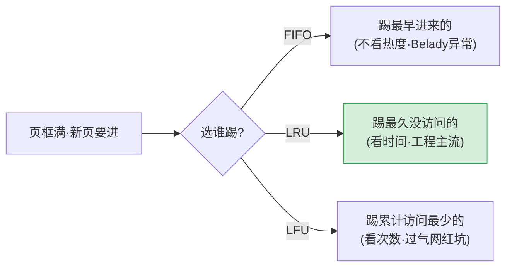

# 页面置换算法
## 页面置换算法——桌上满了我踢谁走？

> 物理内存是稀缺资源。当所有页框被占满、又有新页要进来，OS必须选一页踢到磁盘。**选谁踢就是页面置换算法。踢对了→下次访问大概率还在内存里。踢错了→刚踢出去又要调回来→白做两次磁盘I/O。**

### 先统一："缺页率"怎么算

```text
假设程序访问了20次内存，其中3次触发缺页中断：

  缺页率 = 缺页次数 / 总访问次数 = 3/20 = 15%

  缺页率越低 → 命中率越高 → 磁盘I/O越少 → 程序跑得越快。

下面所有算法用同一组数据对比——一样的访问序列，一样的3个页框：

  访问序列：1, 2, 3, 4, 1, 2, 5, 1, 2, 3, 4, 5

  页框数：3个
```

### FIFO（先进先出）——简单到蠢

```text
策略：谁来得最早踢谁。维护一个排队队列，先进先出。

图书馆规则：不管你是谁，不管你来多少次——在馆里呆得最久的那个先出去。

演示：

  访问1: 缺页！排队=[1]

  访问2: 缺页！排队=[1,2]

  访问3: 缺页！排队=[1,2,3]

  访问4: 缺页！踢1（最老的）。排队=[2,3,4]

  访问1: 缺页！踢2。排队=[3,4,1]        ← 1刚被踢出去又要回来！

  访问2: 缺页！踢3。排队=[4,1,2]        ← 2也刚被踢又要回来！

  访问5: 缺页！踢4。排队=[1,2,5]

  访问1: 命中 ✅

  访问2: 命中 ✅

  访问3: 缺页！踢1。排队=[2,5,3]        ← 又是1！

  访问4: 缺页！踢2。排队=[5,3,4]

  访问5: 命中 ✅

  缺页=9次，缺页率=9/12=75%

❌ 致命缺陷——Belady异常：

  你直觉：给更多页框 → 缺页更少。对吧？

  FIFO说：不一定！有时给4个页框比给3个页框缺页还多！

  为什么？FIFO的淘汰和"这个页热不热"完全无关。一个被频繁访问的热页，

  可能会因为"它来得最早"被无情踢走 → 踢走后马上又需要 → 缺页 → 再换进来。

  页框越多，FIFO越有机会犯这个错误。

  类比：图书馆座位多了，管理员按"先来后到"赶人更勤快了——

        把正在自习的常客赶走，把座位空给第一次来的新面孔。

        常客刚被赶走转身就回来——浪费管理员两次出力气。

✅ 唯一优点：实现简单得出奇——就是一个队列，O(1)。

❌ 缺点：Belady异常 + 不看访问热度 + 实际系统没人用。
```

### LFU（最不经常使用）——"谁被翻牌次数最少"

```text
策略：踢"从出生到现在，被访问次数最少"的页。

和LRU的区别：
  LRU问："你上次来图书馆是啥时候？"（看时间）
  LFU问："你一共来过图书馆多少次？"（看次数）

实现：每个页配一个计数器，每次被访问就+1。淘汰时选计数器最小的。
```

##### ❌ LFU的致命缺陷——"过气网红赖着不走"

场景：
- 程序启动 → 初始化代码疯狂跑 → 页A被访问了10000次
- 初始化结束 → 接下来是业务逻辑 → 页B才是当前热点，才被访问了20次
- 现在内存满要淘汰：
  - LFU：页A=10000次 vs 页B=20次 → 踢页B！
  - 但页A再也不需要了！页B才是现在的核心！

LFU没有"衰减"——曾经是大明星，这辈子都是大明星。哪怕已经过气十年，它的"历史点击数"还是碾压新人。

> **类比——餐厅排队优先级：** 按"这辈子来过多少次"排——老爷爷年轻时天天来，现在一周才来一次。新顾客刚搬来，一周来五次，但总共才来过15次。按LFU逻辑：老爷爷优先（总次数碾压）→ 新顾客排队去吧。但真正该优先的是谁？

##### 改进的 LFU 变种

1. **定期衰减：** 每隔一段时间，所有计数器除以2。→ 远古的热度自然衰减，新晋热点有机会出头。但"隔多久"是个新问题——太频繁浪费CPU，太稀罕等于没衰减
2. **窗口LFU：** 只统计最近N秒的访问次数。→ 融合LRU和LFU的思想，更复杂但更合理

##### LRU vs LFU——什么时候选哪个

> **类比——图书馆决定让谁进阅览室：**
> - LRU = 上次来图书馆距今多久 → 刚来的留，半年前来过的请走 → 适合"热点轮换"场景
> - LFU = 这辈子来过多少次 → 总次数少的请走 → 适合"长期稳定热点"场景

**工程事实：** LRU用得远比LFU多。LFU实现更复杂、计数器占内存、过气网红问题要额外机制处理。Redis默认淘汰策略是LRU。MySQL Buffer Pool也是LRU变种。

## 速记卡（面试闪卡）

- **Q：页面置换算法解决什么？** A：页框满时选谁踢到磁盘；踢错→刚踢又调回→白做两次磁盘 I/O。
- **Q：FIFO 致命缺陷？** A：Belady 异常——页框越多缺页可能反而越多（淘汰与热度无关，按先来先踢）。
- **Q：LRU vs LFU 区别？** A：LRU 看「上次访问时间」（最近最少用），LFU 看「累计访问次数」（最不常用）。
- **Q：LRU 工程地位？** A：用得最多；Redis 默认淘汰=LRU，MySQL Buffer Pool 也是 LRU 变种。LFU 有「过气网红」问题（历史计数不衰减，靠定期衰减/窗口 LFU 缓解）。
- **口诀**：FIFO 先来先踢（有 Belady 异常）｜LRU 踢最久没用的｜LFU 踢累计最少的（易过气网红赖着）。



## 相关链接

- 📋 目录：[[00-操作系统]]

- 📚 学习清单：[[八股文学习清单]]

- 🔗 [[07-地址翻译从虚拟到物理|07 地址翻译从虚拟到物理]]
- 🔗 [[10-缺页中断|10 缺页中断]]
- 🔗 [[11-抖动与局部性原理|11 抖动与局部性原理]]
- 🔗 [[语言与框架/Python/八股/00-Python|Python八股文]]
- 🔗 [[语言与框架/TypeScript-React/八股/00-React-TS-JS|React-TS-JS八股文]]
- 🔗 [[语言与框架/MySQL/八股/00-MySQL|MySQL八股文]]

