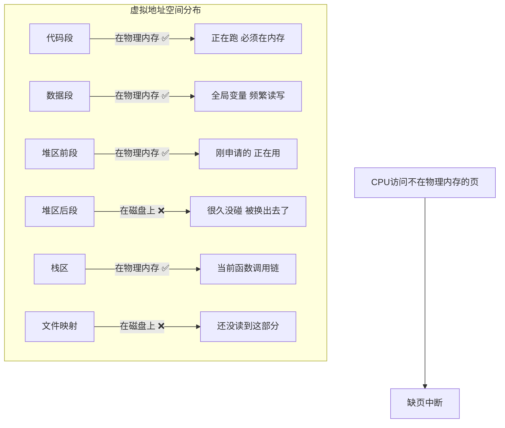
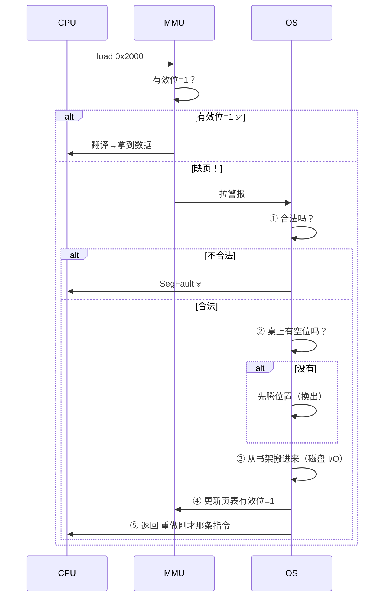

---

title: "缺页中断"

created: "2026-07-20"

tags:

  - 八股文

  - 操作系统

source: "每日笔记"

---

# 缺页中断

## 缺页中断——程序说"我要这个"，OS说"等一下我去拿"
### 先理解：程序的页面"散落"在几个地方



### 缺页中断六步——类比"写作业发现书不在桌上"

```text

你在写作业（CPU在跑程序）：

  做到第3题，需要翻一下《数据结构》课本第47页

  低头一看——桌上没有这本书！

第1步：发现书不在

  CPU（你）对MMU（眼睛）说"我要0x2000这个地址的数据"

  MMU翻页表："嗯……0x2000？这页不在桌面上啊！（有效位=0）"

  → 触发信号：停下！缺页了！

第2步：判断——你要的东西合法吗？

  OS（你妈）过来看："你要找什么？"

  合法情况①：书之前在你桌上，刚才东西太多被收到书架上了

  合法情况②：书在书架上，你从来没拿下来过

  合法情况③：你刚说要买这本书但还没买——现在去买

  非法情况：你说"我要一本《母猪的产后护理》"→ 你家根本没有这本书

           → 段错误（SegFault），程序被kill 💀

  在OS里，合法性靠查VMA（虚拟内存区域）判断——

  你的每个段（代码段、堆区、栈区、mmap区）都有注册范围，

  不在任何范围内就是非法访问。

第3步：桌上找空位

  桌上还有空位吗？

    有 → 腾一个出来

     没有 → 先把某本不用的书放回书架（页面置换）

第4步：去书架拿书

  来源分两种：

    来源A：之前放在桌上的，后来收到书架上 → 从交换区（swap）读回

    来源B：映射的文件，从来没用过 → 从原始文件读（文件系统I/O）

  这一步最慢——书架在另一个房间（磁盘I/O，毫秒级）。

第5步：更新记录

  在页表里登记：虚拟页0x2000 → 物理框新分配的框号

  有效位从0改成1

第6步：重新做刚才那道题

  你重新低头做刚才的第3题——这次书在桌上了，顺利翻到第47页

```

### 一张图串起来



> 🔴 **一句话讲清**："缺页中断是虚拟内存的心脏——CPU访问的页不在物理内存时，MMU拉响中断，OS从磁盘搬进来，更新页表，CPU重新执行刚才那条指令。整个过程程序无感知。一次缺页的代价是一次磁盘I/O，几毫秒——所以频繁缺页就是系统假忙（抖动）。"

### 缺页中断和普通中断不一样——三个关键差异

| 维度 | 普通I/O中断 | 缺页中断 |
| :--- | :--- | :--- |
| **什么时候来** | 异步——外部设备随时敲门 | 同步——CPU正执行指令时自己撞上的 |
| **处理完回到哪** | 中断前那条的**下一条** | 中断前**那条指令本身**，重新执行 |
| **谁能触发** | 用户态代码 | 用户态和**内核态**代码都可能 |

> ⚠️ 第2条是最容易漏答的点——缺页中断处理完后不是"接着往下走"，而是**把刚才那条没跑完的指令从头再来一遍**。上次发现地址无效没跑成，这次页已经到位了，重跑就能正常跑通。

---

## 速记卡（面试闪卡）

**Q1：一句话讲清「缺页中断」到底是什么？**

A：缺页中断是虚拟内存的心脏：CPU 访问的页不在物理内存时，OS 从磁盘搬进来、更新页表，再重跑那条指令，程序无感知。

**Q2：一、缺页六步（write→page fault→load） —— 怎么理解？**

A：像写作业发现课本不在桌上：①MMU 查页表有效位=0→拉中断；②OS 查 VMA 判合法性，非法就 SegFault 杀进程；③桌上有空位吗，没有先换出；④从 swap 或文件读入（最慢，磁盘 I/O 毫秒级）；⑤更新页表有效位=1；⑥重做刚才那条指令。

**Q3：二、它和普通中断不一样（synchronous fault） —— 怎么理解？**

A：三个关键差异：普通中断异步、缺页同步（CPU 执行指令时自己撞上）；普通中断处理完回「下一条」，缺页回「那条指令本身重跑」——这是最易漏的点；普通中断只能用户态触发，缺页用户态和内核态都可能。重跑是因为上次地址无效没跑成，这次页到位了。

**Q4：三、代价与抖动（thrashing） —— 怎么理解？**

A：一次缺页代价是一次磁盘 I/O（几毫秒），比内存访问慢几万倍。如果频繁缺页、OS 忙着换页没空干正事，就叫「抖动（thrashing）」——系统假忙实则卡死。缓解靠局部性原理（尽量访问邻近页）和合理分配内存减少换页。

**Q5：四、关联与速记（TLB/置换/抖动） —— 怎么理解？**

A：缺页中断连着一串八股：地址翻译（MMU 虚拟→物理）、页面置换算法（决定换哪本「书」出去）、局部性原理与抖动。面试常问「缺页后回到哪条指令」「和普通中断区别」「为什么程序无感知」——抓住「同步、重跑原指令、无感知」三点即可。

**Q6：核心速记主线有哪些？**

- 概念：访问的页不在物理内存→MMU 中断，OS 搬页

- 流程：查表→判合法→找空位→磁盘读入→更页表→重跑指令

- 差异：同步触发、回到原指令重跑（非下一条）

- 代价：一次磁盘 I/O 毫秒级；频繁→抖动假忙

- 关联：地址翻译、页面置换、局部性原理

**口诀**

A：缺页中断心肝脑，

页表无效拉警报；

搬入磁盘更位后，

重跑原指无烦恼。

## 相关链接

- 📋 目录：[[00-操作系统]]

- 📚 学习清单：[[八股文学习路线图]]

- 🔗 [[07-地址翻译从虚拟到物理|07 地址翻译从虚拟到物理]]

- 🔗 [[08-页面置换算法|08 页面置换算法]]

- 🔗 [[11-抖动与局部性原理|11 抖动与局部性原理]]

- 🔗 [[语言与框架/Python/八股/00-Python|Python八股文]]

- 🔗 [[语言与框架/TypeScript-React/八股/00-React-TS-JS|React-TS-JS八股文]]

- 🔗 [[语言与框架/MySQL/八股/00-MySQL|MySQL八股文]]

