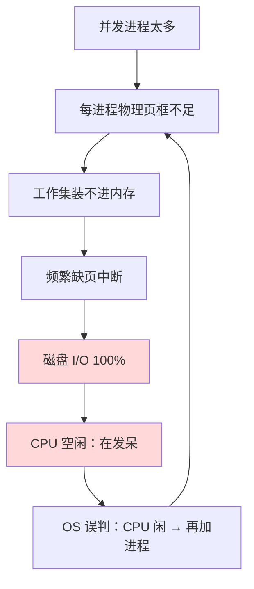

---

title: "抖动与局部性原理"

created: "2026-07-20"

tags:

  - 八股文

  - 操作系统

source: "每日笔记"

---

# 抖动与局部性原理

## 抖动——CPU在"假忙"
### 什么情况

正常系统：CPU跑代码（计算、处理数据）→ 在干活

抖动系统：CPU等磁盘（等页面换进换出）→ 在发呆

**为什么会这样？**

- 并发进程太多了 → 每个进程分到的物理页框太少

- 每个进程的"工作集"（正在用的那批页）装不进物理内存

- 每个进程都在疯狂缺页

- 磁盘忙到100%（一直在换页）

- CPU反而空闲了（都在等磁盘读取完成）

- OS看了一眼："哟，CPU好闲，再加个进程"

- 更加缺页……死循环

> **生活类比——桌子太小，你一直在换书：**

> 你有一张小桌子，放两本书就满了。

> 你写作业需要来回翻5本书。

>

> 正常（如果桌子够大）：5本书全摊在桌上 → 哪本需要就低头看哪本 → 90%时间在写作业

>

> 抖动（桌子太小）：桌上只能放2本 → 需要第3本 → 把第1本放回书架 → 从书架拿第3本 → 写几行需要第1本 → 把第2本放回去 → 从书架拿第1本 …… 一直在换书，根本没时间写作业。翻来覆去，90%时间在换书而不是在写作业

CPU利用率低 + 磁盘100%忙碌 = 抖动的最明显征兆。

### 检测和解决

**检测：** 看一眼系统监控——CPU利用率突然降了但磁盘I/O飙到最高 → 八九不离十是抖动

**三条路：**

1. **加物理内存**——桌子变大，不用老换书了。根本解法。

2. **减少并发进程**——少几个人同时抢桌子。限流。

3. **换更好的置换算法**——效果有限。根因是内存不够，不是算法笨。（像桌子太小——再怎么会收拾的人也不可能凭空变出空间来）

> **一句话讲清**："抖动的原因是分配给进程的物理页框数小于其工作集大小，导致频繁缺页。CPU利用率下降+磁盘利用率飙升是典型节律。解决方案：加内存是根本，减并发是应急，换算法只能辅助。"

---

## 一图流（Mermaid）

> 正反馈死循环：页框越少 → 缺页越多 → 磁盘越忙 → CPU 越闲 → OS 越想加进程 → 页框更少。

## 速记卡（面试闪卡）

**Q1：什么是抖动（Thrashing）？**

A：并发进程过多，分给每个进程的物理页框数小于其"工作集"，导致频繁缺页，磁盘忙着换页、CPU 反而空闲，系统吞吐量暴跌。本质是"CPU 在假忙"。

**Q2：最明显的两个征兆是什么？**

A：CPU 利用率骤降 + 磁盘 I/O 飙到 100%。两者同时出现，八九不离十是抖动。

**Q3：为什么是个死循环？**

A：OS 看到 CPU 闲，误以为还能塞更多进程，于是加进程 → 页框更不够 → 更缺页 → 磁盘更忙 → CPU 更闲，正反馈螺旋。

**Q4：三条解决路分别是什么定位？**

A：① 加物理内存——根本解法（桌子变大）；② 减少并发进程——应急限流；③ 换更好的置换算法——只能辅助，根因是内存不够不是算法笨。

**Q5：它和"局部性原理"什么关系？**

A：程序访问集中在局部（时间局部性 + 空间局部性），所以"工作集"可预测。只要物理页框 ≥ 工作集就不抖；局部性差 → 工作集大 → 更容易抖。

**口诀**：页框小于工作集，频繁换页 CPU 闲；加内存是根，减并发是急，换算法没戏。

## 相关链接

- 📋 目录：[[00-操作系统]]

- 📚 学习清单：[[八股文学习路线图]]

- 🔗 [[08-页面置换算法|08 页面置换算法]]

- 🔗 [[10-缺页中断|10 缺页中断]]

- 🔗 [[12-malloc底层brk与mmap|12 malloc底层brk与mmap]]

- 🔗 [[语言与框架/Python/八股/00-Python|Python八股文]]

- 🔗 [[语言与框架/TypeScript-React/八股/00-React-TS-JS|React-TS-JS八股文]]

- 🔗 [[语言与框架/MySQL/八股/00-MySQL|MySQL八股文]]

