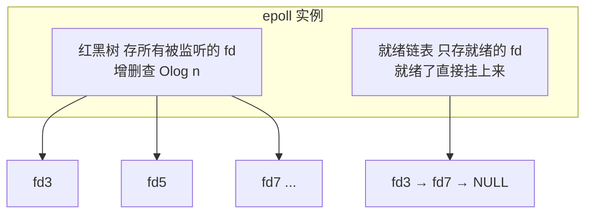
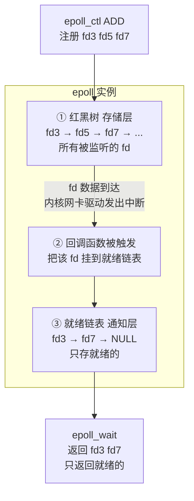

---

title: "epoll 详解"

created: "2026-07-21"

tags:

  - 八股文

  - 操作系统

source: "每日笔记"

---

# epoll 详解

## epoll——Linux 的终极大招
### epoll 怎么解决 select/poll 的三大痛点

```text

问题回顾：

  select/poll 的疼——三个"全部"

    ① 全部 fd 每次都要传给内核（数据拷贝）

    ② 内核每次都要扫描全部 fd（O(n) 遍历）

    ③ 返回后要遍历全部 fd 找谁就绪（O(n) 遍历）

epoll 怎么解决？——三个字：拆开发

  select/poll：监视 + 等待 + 返回 → 全绑在一起，一次函数调用搞定

  epoll：      监视 → 红黑树存着（只传一次）

               等待 + 返回 → 就绪链表（只返回就绪的，不返回全量）

类比——三个前台的工作方式：

  select/poll 前台：

    每次有人来问："帮我看看这批 10000 个快递都到了没？"

    前台从头到尾看一遍 10000 个快递："有 3 个到了，都在哪我不知道，你自己找吧。"

    下次又来问："帮我看看这 10000 个快递到了没？"（重新给单子）

    前台又从头到尾看一遍……

  epoll 前台：

    第一天你给前台一份"长期关注名单"（红黑树户口本）→ 只给一次。

    每到一个快递，前台在便签纸上记一笔"XXX 快递到了"（就绪链表）。

    你问："谁的快递到了？"

    前台看一眼便签纸："张三、李四、王五的到了。" → 你直接去拿。

    便签纸上的处理完 → 划掉 → 新到的继续往上写。

    不重传名单、不扫全部、直接告诉你是谁——O(1)。

```

### epoll 的三个核心函数——记一辈子

epoll 就三个函数，各管一摊：

##### ① epoll_create(size) —— "请一个前台"

在内核里创建一个 epoll 实例，返回一个 epoll 的文件描述符（epfd）。

内核同时分配两个核心数据结构：

- **红黑树** —— 存所有要监视的 fd（"户口本"）

- **就绪链表** —— 存就绪的 fd（"便签纸"）



##### ② epoll_ctl(epfd, op, fd, event) —— "前台，帮我盯/不盯/改关注点"

向 epoll 实例里增/删/改一个要监视的 fd。

op 三种操作：

- `EPOLL_CTL_ADD` → 把 fd 加入红黑树，并注册一个"回调函数" ← 关键！

- `EPOLL_CTL_DEL` → 把 fd 从红黑树里删掉

- `EPOLL_CTL_MOD` → 修改 fd 的监听事件（原来只监听读，改成同时监听读写）

**回调函数是什么？**

当这个 fd 就绪时（比如有数据到了），内核会自动调用这个回调函数。

回调函数做的事：把该 fd 挂到"就绪链表"上。

这就解释了为什么 epoll 能 O(1) 返回就绪事件——不是 epoll_wait 时去扫描，而是 fd 就绪的瞬间就记录好了。

> **类比：** 不是前台每隔 5 分钟去扫一遍所有快递到没到——而是快递员到的时候主动在前台的"已到登记本"上签个字。前台只需要看登记本——上面写的就是所有已到的快递。

##### ③ epoll_wait(epfd, events, maxevents, timeout) —— "谁好了？告诉我"

等待事件发生。有事件就绪时，内核直接从"就绪链表"里取出 fd 返回。

返回的 events 数组里只包含就绪的 fd——不需要遍历全部！如果有 10000 个连接，只有 3 个就绪 → 只返回 3 个 → O(1) 效率。

**参数含义：**

- `epfd` → 哪个 epoll 实例

- `events` → 内核把就绪事件写到这个数组里（输出参数）

- `maxevents` → 最多返回多少个就绪事件

- `timeout` → 超时时间（毫秒）。-1 = 永远等，0 = 不等待直接返回

### epoll 的红黑树 + 就绪链表 + 回调——三件套原理图

epoll 工作的三件套（理解这个图就理解了 epoll 的一切）：



**完整的流程——从注册到取出：**

1. `epoll_create()` → 创建红黑树 + 就绪链表

2. `epoll_ctl(ADD, fd3, 关心"可读"事件)` → fd3 加入红黑树 → 注册回调：当 fd3 的接收缓冲区有数据到达时 → 触发回调 → 把 fd3 挂到就绪链表

3. `epoll_ctl(ADD, fd5, 关心"可读"事件)` → fd5 加入红黑树 + 注册回调

4. ... 等待 ...

5. fd3 上有数据到达！→ 网卡中断 → 内核协议栈处理 → 触发 fd3 的回调 → fd3 挂到就绪链表

6. fd7 上有数据到达！→ 同样流程 → fd7 挂到就绪链表

7. 你的程序调用 `epoll_wait()` → 内核直接返回就绪链表里的：fd3, fd7

8. 你处理 fd3 的数据 → fd3 从就绪链表移除 → 但 fd3 还在红黑树里 → 继续被监视

### 为什么 epoll 是 O(1) 的？——和 select O(n) 的本质区别

select / poll 做的是："把所有 fd 翻一遍，看谁有数据"

epoll 做的是："fd 有数据时写个便条，epoll_wait 直接看便条"

> 好比图书馆查"谁借了书没还"：

> - select：管理员把所有借书记录逐条查一遍 → O(n)

> - epoll：每个人还书的时候签个字，管理员看签到本就知道了 → O(1) 取结果

核心差异不是算法复杂度——是"谁主动"的问题：

- select 是内核被动 → 你问了才扫

- epoll 是内核主动 → 有了就记下来等你取

但这个 O(1) 只是"取就绪事件"这一步——epoll_wait。注册 fd（epoll_ctl ADD）是 O(log n)，因为要操作红黑树。触发回调是 O(1)——直接挂链表。

### epoll 两种触发模式——LT 和 ET
##### LT（Level Trigger，水平触发）——默认模式

规则：只要接收缓冲区里还有数据没读完 → epoll_wait 就会一直通知你。

```text

fd3 收到了 1KB 数据：

  epoll_wait() → "fd3 有数据！"

  你只读了 512 字节，还有 512 字节没读

  epoll_wait() → "fd3 还有数据！！"

  你又读了 256 字节，还有 256 字节没读

  epoll_wait() → "fd3 还有数据！！！"

  你终于读完了 → 读空了 → epoll_wait 不再通知

```

> **类比：** 快递到了前台一直催你——"拿不拿？拿不拿？拿不拿？"直到你拿走为止。

##### ET（Edge Trigger，边缘触发）——高性能模式

规则：只在"缓冲区从空变非空"的那一瞬间通知一次。之后不管了。

```text

fd3 收到了 1KB 数据（缓冲区从空 → 有数据，就这一次触发）：

  epoll_wait() → "fd3 有数据！"

  你只读了 512 字节 → 剩下 512 字节还在缓冲区

  epoll_wait() → 不通知了！（因为缓冲区没有发生"从空到非空"的变化）

  你把那 512 字节忘在缓冲区里 → 永远读不到 → 数据丢了

```

→ ET 模式要求你一次性把数据读干净！

> **类比：** 快递到了前台只发一条微信——"快递到了"。你不去拿就不管了。下一条快递到了才再发一条。

##### ET 模式为什么更高效？——话术

| 模式 | 行为 | 分析 |
| :--- | :--- | :--- |
| **LT** | 同一个事件可能触发多次 | epoll_wait 反复返回同一个 fd，系统调用次数增多 |
| **ET** | 一个事件只触发一次 | epoll_wait 返回次数更少，但必须每次读到 EAGAIN（读空为止），配合非阻塞 IO 使用 |

##### ET 模式下的正确读法——必须用非阻塞 IO + 循环读到空

ET 模式必须和非阻塞 IO 配合——否则会死锁！

为什么？因为如果 socket 是阻塞的，你循环读 → 读空了还继续读 → recv 阻塞 → 永远卡在那。

**ET + 非阻塞的正确读法：**

```python

while True:

    data = recv(fd, NONBLOCKING)   # 非阻塞读

    if data == EAGAIN:             # 读空了！

        break                      # 停止

    handle(data)                   # 处理读到的数据

```

每次 ET 通知你 → 一次性读到 EAGAIN → 处理完所有数据 → 等下次触发。

##### LT vs ET 对比

| 维度 | LT（默认） | ET（高性能） |
| :--- | :--- | :--- |
| 触发 | 只要缓冲区有数据就通知 | 只在"空→非空"瞬间触发一次 |
| 读数据 | 可以分多次读 | 必须一次性读到空 |
| 漏读 | 不会丢数据 | 数据可能被遗忘 |
| 系统调用 | 可能更多 | 更少（更高效） |
| 阻塞IO | 可以用 | ❌ 必须非阻塞！ |
| 使用场景 | Redis, Nginx 默认LT | Nginx 部分场景, 高性能服务 |

### select / poll / epoll 终极对比表——直接甩

| 维度 | select | poll | epoll |
| :--- | :--- | :--- | :--- |
| 数据结构 | fd_set (bitmap) | pollfd 数组 | 红黑树 + 就绪链表 |
| fd 上限 | 1024（默认） | 无上限 | 无上限 |
| 怎么注册 | 每次 select 传参 | 每次 poll 传参 | epoll_ctl 一次注册，永久有效 |
| 内核找就绪 | 每次 O(n) 全量扫描 | 每次 O(n) 全量扫描 | fd 就绪时回调自动挂链表，无需主动扫描 |
| 返回什么 | 只告诉你"有几个"不说是谁 | 只告诉你"有几个"不说是谁 | 直接告诉你"是谁"（只返回就绪的 fd）|
| 定位就绪 | O(n) 遍历全部 fd | O(n) 遍历全部 fd | O(1) 从链表直接取 |
| 数据拷贝 | 每次 select 都要用户→内核拷贝参数 | 每次 poll 都要用户→内核拷贝参数 | fd 注册一次，以后不用重复拷贝 |
| 适用场景 | 少量 fd（<1024） | 少量 fd | 海量 fd（C10K/C100K） |
| 一句话 | 全量扫描式轮询 | 去掉了 1024 上限的 select | 事件驱动式回调，Linux 下不二选择 |

---

## 速记卡（面试闪卡）

**Q1：一句话讲清「epoll详解」到底是什么？**

A：epoll 是 Linux 下用回调驱动、高效处理海量连接的 IO 多路复用。

**Q2：epoll 怎么解决 select/poll 的三大痛点 —— 怎么理解？**

A：select/poll 每次把一万份快递单全递给前台重扫一遍；epoll 只把「长期关注名单」交一次，用红黑树（Red-Black Tree）存着，快递到了前台自动记便签（就绪链表 Ready List）——拆开发，O(1) 取结果。

**Q3：epoll 的三个核心函数 —— 怎么理解？**

A：三个函数各管一摊：epoll_create 请前台、epoll_ctl 增删改关注点并注册回调（Callback）、epoll_wait 问谁就绪。回调函数（Callback Function）在 fd 就绪瞬间自动挂链表，根本不用你扫。

**Q4：为什么 epoll 是 O(1) 的 —— 怎么理解？**

A：select 是内核被动等你问了才扫；epoll 是内核主动，fd 一就绪就写便条（事件驱动 Event-Driven），epoll_wait 直接看便条——核心区别在「谁主动」，不是算法快慢。

**Q5：epoll 两种触发模式——LT 和 ET —— 怎么理解？**

A：水平触发（Level Trigger）像前台一直催「拿不拿」直到你拿光；边缘触发（Edge Trigger）只发一条微信，必须配非阻塞 IO 一次性读到空（EAGAIN），否则数据丢失。

**Q6：核心速记主线有哪些？**

- 红黑树存监听 fd

- 就绪链表回调挂接

- epoll_wait 只取就绪

- ET 须非阻塞读干净

**口诀**

A：epoll 立个好前岗，

红黑树记关注名。

就绪便签回调响，

ET 读净莫留藏。

## 相关链接

- 📋 目录：[[00-操作系统]]

- 📚 学习清单：[[八股文学习路线图]]

- 🔗 [[13-IO模型四种|13 IO模型四种]]

- 🔗 [[14-IO多路复用select_poll_epoll|14 IO多路复用select_poll_epoll]]

- 🔗 [[16-阻塞与非阻塞与多路复用|16 阻塞与非阻塞与多路复用]]

- 🔗 [[语言与框架/Python/八股/00-Python|Python八股文]]

- 🔗 [[语言与框架/TypeScript-React/八股/00-React-TS-JS|React-TS-JS八股文]]

- 🔗 [[语言与框架/MySQL/八股/00-MySQL|MySQL八股文]]

