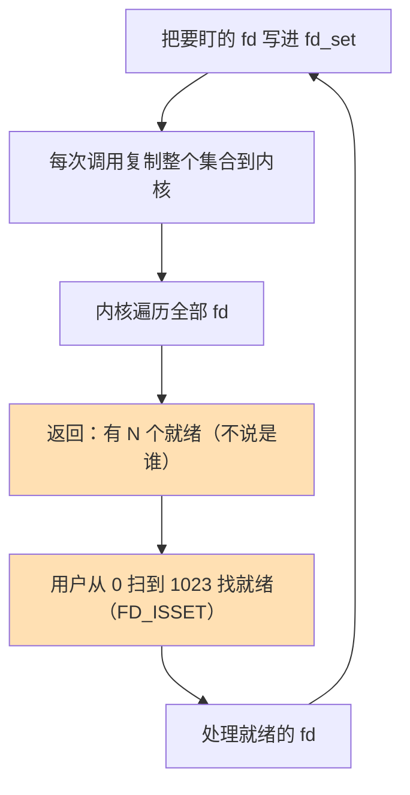

---

title: "select最老的前台"

created: "2026-07-20"

tags:

  - 八股文

  - 操作系统

source: "每日笔记"

---

# select最老的前台

## select——最老的"前台"，能用但不聪明
### select 怎么工作

select 是 Linux 最早提供的 IO 多路复用函数。它的工作方式是：

1. 你把所有要盯的 fd（文件描述符）写在一个集合里

2. 调用 select——内核开始帮你盯

3. select 返回——告诉你"有几个 fd 就绪了"

4. 你遍历整个集合，挨个问："是你好了吗？是你好了吗？"

##### 用"签到表"比喻

你是老师（线程），全班 500 个学生（500 个 fd）。每节课你想知道"谁举手了"。

**select 方法：**

1. 你把全班 500 人的名字抄在一张纸上（fd_set）

2. 把纸交给班长（内核），说"帮我看看谁举手了"

3. 班长扫完全班 500 人 → 告诉你"有 3 个人举手了"

4. 你把纸拿回来，从第 1 个人到第 500 个人，挨个问："是你举手吗？""是你举手吗？"...（遍历整个集合）

5. 找到第 47, 128, 399 号举手了 → 处理他们

6. 下次上课 → 回到第 ① 步，重新抄一份名单（fd_set 每次都要重新填！）

**关键缺陷：**

- 每次都要把 500 人的名单从你手上抄给班长（数据从用户空间复制到内核空间）

- 班长每次要扫 500 人（内核遍历整个 fd_set）

- 班长只告诉你"有 3 个人举手了"但不说是谁——你还要挨个问（O(n)）

- 名单最多写 1024 个人（select 默认上限 FD_SETSIZE）

### select 的三个致命缺陷

**缺陷①：fd 数量上限 1024（FD_SETSIZE）**

select 用 fd_set 存文件描述符，它是一个固定大小的 bitmap，默认 1024 位。你的服务器如果要同时处理 10000 个连接 → select 直接不行。

为什么是 1024？→ 不是 Linux 内核的限制，是 C 语言宏定义写死了。可以修改内核重新编译——但改完还是 bitmap，大 bitmap 遍历效率照样低。

**缺陷②：每次调用都要把整个 fd_set 从用户空间复制到内核空间**

select 的参数是 fd_set，这个数据在用户空间（你的程序里）。内核要监视 fd，需要把这整个集合复制到内核空间。

10000 个 fd 的 fd_set ≈ 1.25KB，看起来不大？但这是每次 select 调用都要复制一次！高并发服务器每秒可能调用 select 成千上万次 → 拷贝开销可观。

**缺陷③：返回后你需要遍历整个 fd_set 找"是谁就绪了"**

select 返回只说"有 N 个 fd 就绪了"，但不告诉你具体是哪几个。你得从 fd 0 扫到 fd 1023，用 FD_ISSET 逐个检查。即使只有 1 个 fd 就绪，你也要扫完整个集合 → O(n)。n 越大越浪费。

### select 的代码演示——看一次就知道它为什么"笨"

```python

"""

select 模式演示（Python 封装了底层 select 调用）

注意 Python 的 select.select() 帮我们做了很多脏活，

但底层原理就是上面说的那些。

"""

import select

import socket

server = socket.socket()

server.bind(('0.0.0.0', 8080))

server.listen(1000)

server.setblocking(False)  # 设为非阻塞模式

# 要监视的集合

inputs = [server]   # 当前正在被 select 盯着的 fd 列表

outputs = []        # 等着写数据的 fd 列表

while True:

    # 🔴 select 的核心调用：

    #   readable  = 哪些 fd 可以读了（有数据到了 / 有新连接）

    #   writable  = 哪些 fd 可以写了（缓冲区有空位）

    #   (最后一个参数是超时时间)

    readable, writable, _ = select.select(inputs, outputs, inputs)

    # ⚠️ 返回后——你得自己遍历所有可读的 fd

    for fd in readable:

        if fd == server:

            # 这是服务端 socket——有新的客户端连接

            client, addr = fd.accept()

            client.setblocking(False)

            inputs.append(client)  # 把新客户端也加入监视列表

        else:

            # 这是客户端 socket——有数据到了

            data = fd.recv(1024)

            if data:

                # 处理数据

                handle(data)

                # 准备回复——把 fd 加入 writable 列表

                outputs.append(fd)

            else:

                # 对方关闭了连接

                inputs.remove(fd)

                if fd in outputs:

                    outputs.remove(fd)

                fd.close()

    for fd in writable:

        # fd 可以写数据了

        fd.send(b"ok")

        outputs.remove(fd)

```

---

## 一图流（Mermaid）



> 三大痛点都画出来了：复制全量、内核全扫、用户再全扫。即便只有 1 个 fd 就绪，也要把整张表走一遍。

## 速记卡（面试闪卡）

**Q1：select 是干什么的？**

A：最早的 IO 多路复用函数。一个线程把多个 fd 交给内核盯着，内核告诉你"有 N 个就绪了"，让你不用一个连接开一个线程。

**Q2：它的三个致命缺陷是哪三个？**

A：① fd 数量上限 1024（FD_SETSIZE，C 宏写死）；② 每次调用都要把整个 fd_set 从用户空间复制到内核空间；③ 返回后只给数量不给具体，你得 O(n) 遍历整个集合找就绪。

**Q3：为什么返回后必须遍历？**

A：内核只报"有几个就绪"，不告诉你"哪几个就绪"。你只能用 FD_ISSET 从 fd 0 挨个问到 fd 1023，哪怕实际只有 1 个就绪也要扫完。

**Q4：fd_set 是什么？**

A：一个固定大小的 bitmap（默认 1024 位），每次 select 调用都要重新把要监视的 fd 填进去，不能复用上次的。

**Q5：poll / epoll 怎么治这仨毛病？**

A：poll 用动态数组去掉 1024 上限；epoll 用红黑树 + 就绪链表，注册一次、内核只返回就绪的 fd，免复制免全扫（详见 14 / 15 篇）。

**口诀**：select 三宗罪——上限 1024、每次全拷贝、就绪还得遍历。

## 相关链接

- 📋 目录：[[00-操作系统]]

- 📚 学习清单：[[八股文学习路线图]]

- 🔗 [[14-IO多路复用select_poll_epoll|14 IO多路复用select_poll_epoll]]

- 🔗 [[epoll详解|epoll详解]]

- 🔗 [[poll详解|poll详解]]

- 🔗 [[语言与框架/Python/八股/00-Python|Python八股文]]

- 🔗 [[语言与框架/TypeScript-React/八股/00-React-TS-JS|React-TS-JS八股文]]

- 🔗 [[语言与框架/MySQL/八股/00-MySQL|MySQL八股文]]

