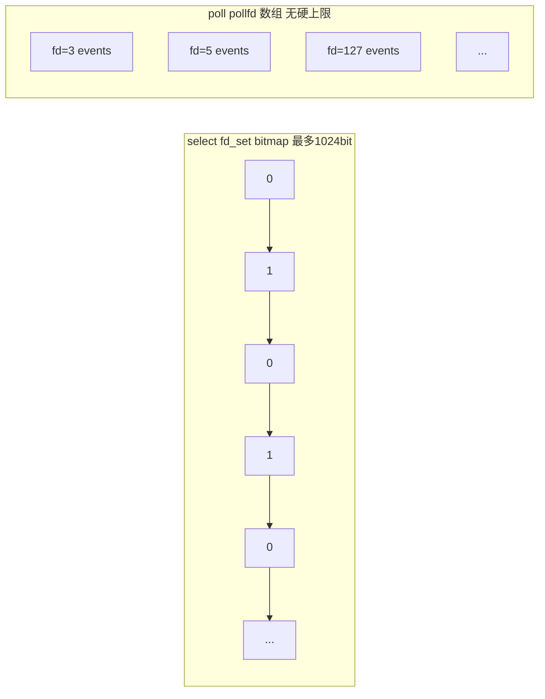

---

title: "18-poll详解"

created: "2026-07-21"

tags:

  - 八股文

  - 操作系统

source: "每日笔记"

---

# 18-poll详解

## poll——去掉 1024 上限，但本质没变
### poll 做了什么改进

poll 和 select 几乎一样，只改了一个东西——换了个数据结构。

- **select：** 用 fd_set（固定大小的 bitmap，最大 1024）

- **poll：** 用 pollfd 结构体数组（链表式，没上限）

**改进细节：**

1. 没了 1024 上限——用多少设多少

2. pollfd 结构里 events（输入：我关心什么事件）和 revents（输出：实际发生了什么事件）分开了——不用像 select 那样每次重新填整个集合

### poll 没有改进什么——还是要遍历

poll 的两个"没变"，让它依然不适合大并发场景：

1. 每次调用 poll——内核还是要把整个 pollfd 数组遍历一遍（O(n)）。10000 个连接 → 每次 poll 内核扫 10000 个 → 只有 3 个就绪 → 白扫 9997 个

2. poll 返回后——你还是得遍历整个 pollfd 数组，挨个检查 revents（O(n)）。内核只告诉你"整个数组里有些事情发生了"，不说具体是谁 → 你还是得从头到尾扫一遍

select 和 poll 的本质是一样的——都是"轮询式"的：每次都把所有 fd 交给内核 → 内核全扫一遍 → 返回 → 你再全扫一遍。活跃的 fd 越少，浪费的比例越大。

### select vs poll 速记

| | select | poll |

| :--- | :--- | :--- |

| 数据结构 | fd_set (bitmap) | pollfd 数组 |

| fd 上限 | 1024（默认） | 无上限 |

| 内核扫描方式 | O(n) 遍历 | O(n) 遍历 |

| 返回后定位就绪 fd | O(n) 遍历，用 FD_ISSET | O(n) 遍历，检查 revents |

| 每次需要重传 | 是（fd_set 被修改） | 不需要（events 和 revents 分离） |

| 现状 | 基本被淘汰 | 少量遗留系统在用 |

---

## 速记卡（面试闪卡）

**Q1：一句话讲清「18-poll详解」到底是什么？**

A：poll 是 Linux IO 多路复用机制，用 pollfd 数组取代 select 的 bitmap，去掉 1024 上限但仍需遍历。

**Q2：poll——去掉 1024 上限，但本质没变 —— 怎么理解？**

A：像把固定座位换成排号条：select 用固定 1024 位的 bitmap，poll 改用 pollfd 结构体数组，想设多少设多少；还把关心事件 events 与结果 revents 分开，不用每次重填。poll（轮询）。

**Q3：poll 改了什么数据结构 —— 怎么理解？**

A：像换容器不换算法：pollfd 数组无硬上限，events 输入与 revents 输出分离，不再像 select 那样每次调用都被内核改写整个集合，使用更省心。pollfd（轮询文件描述符结构）。

**Q4：poll 为什么仍然要遍历 —— 怎么理解？**

A：像门卫仍挨个查：每次调用内核要把整个数组扫一遍（O(n)），返回后你也得遍历整个数组查 revents 找就绪 fd。活跃 fd 越少，白扫比例越大，本质还是轮询。O(n) Traversal（线性遍历）。

**Q5：select 与 poll 怎么选 —— 怎么理解？**

A：像两代同款工具：两者都 O(n) 遍历、都适合低并发；select 基本被淘汰，poll 靠无上限和分离字段在少量遗留系统留用，大并发请直接上 epoll。select vs poll（选择对比）。

**Q6：核心速记主线有哪些？**

- 改进：pollfd 数组去掉 1024 上限，events/revents 分离

- 没变：每次仍 O(n) 遍历整个数组，返回还要再扫

- 对比：select 用 bitmap 被淘汰，poll 仅少量遗留

- 选型：大并发请用 epoll，poll 本质仍是轮询

**口诀**

A：poll 去上限换数组，位图扔了改结构

events revents 分离，不必每次重填凑

内核用户两遍扫，O n 遍历老样守

万连白扫几千度，大并发还看 epoll

## 相关链接

- 📋 目录：[[00-操作系统]]

- 📚 学习清单：[[八股文学习路线图]]

- 🔗 [[14-IO多路复用select_poll_epoll|14 IO多路复用select_poll_epoll]]

- 🔗 [[15-epoll详解|15 epoll详解]]

- 🔗 [[17-select详解|17 select详解]]

- 🔗 [[语言与框架/Python/八股/00-Python|Python八股文]]

- 🔗 [[语言与框架/TypeScript-React/八股/00-React-TS-JS|React-TS-JS八股文]]

- 🔗 [[语言与框架/MySQL/八股/00-MySQL|MySQL八股文]]

