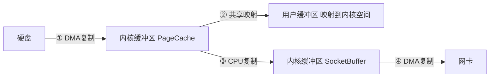
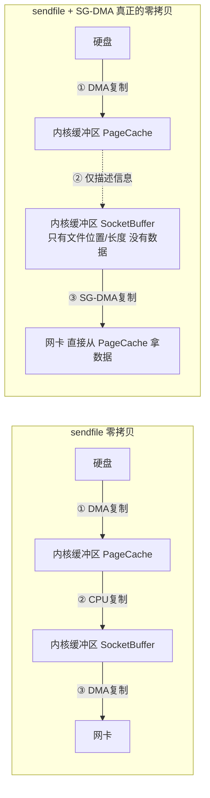

---

title: "零拷贝：sendfile / mmap / splice"

created: "2026-07-21"

tags:

  - 八股文

  - 操作系统

source: "每日笔记"

---

# 零拷贝：sendfile / mmap / splice

> **一句话**：传统 IO 要把数据从硬盘读到用户空间再写到网卡，中间来回复制 4 次。零拷贝就是让数据"抄近道"，不经过用户空间，直接从硬盘到网卡——省掉了复制和上下文切换。

---

## 一、先看问题：传统 IO 有多慢
### 先搞懂 DMA 是啥

DMA = Direct Memory Access（直接内存访问）

**没有 DMA 时（PIO 模式）：**

硬盘有数据 → CPU 亲自去读 → CPU 搬到内存 → 搬 1GB，CPU 傻坐 1GB 的时间 → CPU 是搬运工，不是干活的

**有 DMA 时：**

CPU 告诉 DMA 控制器："帮我把硬盘数据搬到内存地址 X" → CPU 转身去算东西 → DMA 控制器自己搬，搬完通知 CPU

DMA = 专门的硬件搬运工。CPU = 只算不算搬。

所以 DMA 复制"不算钱"——不占 CPU 时间，才叫零拷贝。

### 传统 IO 路径（4 次复制）

场景：一个 Web 服务器要发一个文件给客户端。

你写的代码看起来就两步：

```c

read(file, buf)     // 把文件读到内存

write(sock, buf)    // 把内存的数据发到网卡

```

但实际上操作系统帮你走了 4 步：


具体每一步：

① 硬盘 → 内核缓冲区（DMA 复制）

硬盘自己把数据搬进内存，不需要 CPU 参与。快。

② 内核缓冲区 → 用户缓冲区（CPU 复制）

read 系统调用，CPU 把内核空间的数据拷到用户空间的 buf。慢。

③ 用户缓冲区 → 内核 Socket 缓冲区（CPU 复制）

write 系统调用，CPU 把用户空间的 buf 拷回内核空间的 socket 缓冲区。慢。

④ Socket 缓冲区 → 网卡（DMA 复制）

网卡自己把数据搬走，不需要 CPU。快。

**代价 1：2 次 CPU 复制（②和③）**

如果文件 1GB → CPU 搬了 2GB 的数据（一次从内核到用户，一次从用户回内核）。这些 CPU 本可以用来做业务逻辑的。

**代价 2：4 次上下文切换**

read → 用户态进内核态 → 回到用户态；write → 用户态进内核态 → 回到用户态。每次切换有几十纳秒到几微秒的开销。

**代价 3：用户缓冲区完全多余**

用户程序又不修改数据——只是"读出来，发出去"。数据在用户空间走了一圈，啥也没干，白搬。

> **生活类比：** 传统 IO = 你要把一批货从 A 仓库送到 B 仓库

> A仓库 → 你自己开车去提货（DMA），你自己开车把货运回你家（CPU 复制），你从家再开车运到 B 仓库（CPU 复制），B仓库自己把货搬进去（DMA）

> 问题：货根本不需要经过你家——直接让 A 仓库送到 B 仓库多好？

---

## 二、mmap——减少一次复制
## 三、sendfile——真正的零拷贝
## 四、splice——更通用的零拷贝
### 怎么做的

传统 IO：

```text

read(file, buf)          // 硬盘 → 内核 → 用户

write(sock, buf)         // 用户 → 内核 → 网卡

```

mmap 版本：

```text

buf = mmap(file)          // 把文件映射到用户空间（不复制）

write(sock, buf)          // 内核 → 网卡（直接拿）

```



关键：mmap 不是复制数据——是"映射"

- **传统 read：** 内核缓冲区的数据 → CPU 拷一份到用户缓冲区。现在有两个副本：内核一份、用户一份

- **mmap：** 用户缓冲区和内核缓冲区共用同一块物理内存。用户程序可以直接读 PageCache 里的数据。不需要"拷一份给你"——你直接看我的

但 write 的时候还是要把数据从 PageCache 拷到 SocketBuffer。所以从 4 次复制变成了 3 次。

### mmap 的代价

减少了 1 次 CPU 复制（省掉了②）

但是没有解决"用户态→内核态"的 CPU 复制问题。write 的时候还是要把数据从内核的 PageCache 拷到 SocketBuffer。

还有隐形成本：

- 映射大文件时占用虚拟地址空间

- 页表维护开销

- 如果文件被截断/修改，映射区域要处理

---

### 怎么做的

```c

sendfile(sock, file, offset, count)

```

→ 一步完成"从文件读 → 发到网卡"，不经过用户空间，全程在内核里搞定。



**第 1 层：普通 sendfile（还是 1 次 CPU 复制）**

```c

sendfile(sock, file, ...)

```

1. 硬盘 → PageCache（DMA，不用 CPU）

2. PageCache → SocketBuffer（CPU 复制！还是有）

3. SocketBuffer → 网卡（DMA，不用 CPU）

省掉了传统 IO 的"用户空间的两次进出"。但内核内部还是复制了一次 → 3 次复制，不是真正的 0 CPU 复制

**第 2 层：sendfile + SG-DMA（真正的零拷贝）**

如果网卡支持 SG-DMA（Scatter-Gather DMA）：

```c

sendfile(sock, file, ...)

```

1. 硬盘 → PageCache（DMA）

2. PageCache 的描述信息 → SocketBuffer（只写了"数据在哪、多长"，不是数据本身，几乎没有开销）

3. SG-DMA 直接把 PageCache 里的数据拉到网卡（网卡自己按描述信息去 PageCache 里拿数据）

CPU 全程不需要碰数据！→ 2 次 DMA（硬件做的）+ 0 次 CPU 复制 → 这才是真正的零拷贝

### sendfile 的限制

1. **只适用于"从文件描述符到 socket"**——不能从 socket 到 socket，也不能从 pipe 到文件。不像一个通用搬运工——只能走固定路线

2. **用户程序不能修改数据**——数据根本没经过用户空间，你想加密、压缩都不行。如果需要修改内容→必须用传统 IO 读出来改

3. **大文件下 PageCache 可能被污染**——数据进 PageCache → 占内存 → 可能把热数据挤出去。Nginx 对小文件用 sendfile，大文件用直接 IO（绕过 PageCache）

---

### 怎么做的

splice 是 sendfile 的升级版——不限于"文件→socket"

```c

splice(fd_in, offset, fd_out, len, flags)

```

- 在两个文件描述符之间搬数据

- 不用经过用户空间

- 甚至不用经过用户空间的缓冲区

和 sendfile 的区别：

- sendfile：从文件到 socket，特化路线

- splice：任意两个 fd 之间都可以（socket 到 socket、pipe 到 文件……）

但 splice 要求至少一端是 pipe（管道）。所以常用模式是：文件 → pipe → socket


实际上 splice 比 sendfile 多了一步管道中转。但它让零拷贝不再局限于"文件→socket"，可以用于更复杂的场景：代理服务器、日志转发等

---

## 五、一张表对比

| | 传统 read+write | mmap+write | sendfile | sendfile+SG-DMA | splice |
| -- | ---------------- | ----------- | --------- | ---------------- | -------- |
| **CPU 复制次数** | 2 次 | 1 次 | 1 次 | **0 次** | 0 次（用 pipe） |
| **DMA 复制次数** | 2 次 | 2 次 | 2 次 | 2 次 | 2 次 |
| **上下文切换** | 4 次（read+write）| 4 次 | **2 次**（一次 syscall）| 2 次 | 2 次 |
| **用户空间参与** | ✅ 数据进过用户buf | ✅ 映射但没复制 | ❌ 不经过 | ❌ 不经过 | ❌ 不经过 |
| **能不能改数据** | ✅ 能改 | ✅ 能改 | ❌ 不能 | ❌ 不能 | ❌ 不能 |
| **适用范围** | 通用 | 文件读写 | 文件→socket | 文件→socket | 任意两个 fd |
| **硬件要求** | 无 | 无 | 无 | 需要 SG-DMA 网卡 | 无 |

### 上下文切换次数怎么来的

每次 syscall = 进出内核各一次 = 2 次切换：

- read → 用户态→内核态→用户态 = 2 次

- write → 用户态→内核态→用户态 = 2 次

- rw 组合 = 4 次

- sendfile → 用户态→内核态→用户态 = 2 次

因为"读+发"在内核里一次搞定，不需要切回用户态再调一次

### 零拷贝到底省了什么

DMA 复制（硬盘↔内存、内存↔网卡）是硬件做的，不消耗 CPU。

零拷贝省的是 CPU 亲自复制的那几趟：

- 传统 IO：CPU 搬 2 次（内核→用户、用户→内核）

- sendfile：CPU 搬 1 次或 0 次

- sendfile+SG-DMA：CPU 搬 0 次

> **重点：** 真正的零拷贝 = 0 次 CPU 复制。不一定是 0 次总复制——DMA 复制（硬件做的不算）。所以 sendfile + SG-DMA 才是真正的零拷贝，普通 sendfile 只能叫"少拷贝"

---

## 六、实际项目里谁在用
### Nginx

```nginx

sendfile on;

```

Nginx 发静态文件：

- 如果文件小（< 特定阈值）→ sendfile

- 如果文件大 → 直接 IO + sendfile（绕过 PageCache）

- 如果用户需要压缩 → 走普通 IO（因为得先读出来压缩再发）

默认开启 sendfile，能处理大部分静态资源请求

### Kafka

Kafka 为什么快？零拷贝是核心原因之一。

Producer 发消息 → Broker 存到文件 → Consumer 拉消息

Consumer 拉消息时：

- 传统做法：文件 → PageCache → 用户buf → SocketBuffer → 网卡

- Kafka：sendfile 直接从 PageCache → 网卡

几个毫秒级别的延迟就是这么省出来的

### 其他

- RocketMQ：也用了 sendfile，和 Kafka 一样

- Netty：Java 里通过 FileChannel.transferTo 调用底层 sendfile

- Tomcat：sendfile 发送静态文件

所以零拷贝不是"理论知识点"——Kafka/Nginx 能那么快，零拷贝是核心贡献者。

---

## 七、一句话讲清
### Q1：什么是零拷贝？

> 零拷贝就是让数据不经过用户空间，直接从硬盘（或内核缓冲区）送到网卡（或另一端 fd），全程内核内部完成。避免了传统 read+write 的两次 CPU 复制和四次上下文切换。

### Q2：零拷贝有几种实现方式？

| 方式 | 原理 | 适用 |
| ------ | ------ | ------ |
| mmap + write | 内存映射省掉一次用户态复制 | 需要读+修改的场景 |
| sendfile | 文件→socket，一次 syscall 搞定 | 静态文件传输（最常用） |
| sendfile + SG-DMA | 真正的 0 CPU 复制 | 高性能文件服务器 |
| splice | 任意两个 fd 之间的管道传输 | 代理服务器、日志转发 |

### Q3：mmap 和 sendfile 的区别？

> mmap 把文件映射到用户空间，省掉了从内核到用户的数据复制，但 write 时还要从内核 PageCache 拷到 SocketBuffer。sendfile 直接在内核里完成文件到 socket，不经过用户空间，更彻底。而且 mmap 要占用用户空间的虚拟地址。

### Q4：sendfile 有缺点吗？

> ① 只能文件→socket，不能任意两个 fd（splice 可以）。② 没法修改数据——想压缩、加密得用传统 IO。③ 大文件用 sendfile 可能导致 PageCache 被脏数据挤占。④ 真正的零拷贝需要硬件支持（SG-DMA）。

### Q5：零拷贝在 Kafka/Nginx 里怎么用的？

> Nginx：sendfile 发静态文件，默认开启

>

> Kafka：Consumer 拉消息时用 sendfile → 消息直接从 PageCache 到网卡 → 这是 Kafka 能跑到百万级 TPS 的原因之一

### Q6：普通 sendfile 算零拷贝吗？

> 严格说不算——普通 sendfile 还有 1 次 CPU 复制（PageCache → SocketBuffer）。但加上 SG-DMA 的支持就做到了真正的零拷贝（0 次 CPU 复制）。说"sendfile 实现了零拷贝"也不算错，大多数语境下说的就是这种。

---

**总结**：零拷贝的核心思想是**避免数据在用户空间和内核空间之间来回倒腾**。mmap 省一次，sendfile 省到极致。Kafka 和 Nginx 之所以快，零拷贝是关键技术之一。

## 速记卡（面试闪卡）

**Q1：一句话讲清「零拷贝：sendfile / mmap / splice」到底是什么？**

A：零拷贝让数据不经过用户空间，直接从内核缓冲区送到网卡，省掉 CPU 复制和上下文切换。

**Q2：一、先看问题：传统 IO 有多慢 —— 怎么理解？**

A：像货不经过你家：传统 read+write 要 4 次复制、4 次上下文切换，数据在用户空间白走一圈。靠 DMA（Direct Memory Access，直接内存访问）硬件搬运不算 CPU 开销。

**Q3：二、mmap——减少一次复制 —— 怎么理解？**

A：像两家共用一个仓库：mmap（Memory Mapping，内存映射）让用户缓冲区和内核缓冲区共用同一块物理内存，省掉一次内核到用户的 CPU 复制，但 write 时还要拷到 SocketBuffer。

**Q4：三、sendfile——真正的零拷贝 —— 怎么理解？**

A：像一条专用传送带：sendfile 一步完成"文件到 socket"，全程在内核里。普通 sendfile 还有 1 次 CPU 复制；加 SG-DMA（Scatter-Gather DMA）后 CPU 复制为 0，才是真正零拷贝。

**Q5：四、splice——更通用的零拷贝 —— 怎么理解？**

A：像万能水管：splice 是 sendfile 升级版，可在任意两个文件描述符（File Descriptor）间搬数据，不限于文件到 socket，但至少一端得是 pipe（管道）。

**Q6：核心速记主线有哪些？**

- 传统 IO 有 2 次 CPU 复制加 4 次上下文切换，用户缓冲区纯属多余

- mmap 用内存映射省 1 次复制，但仍要 PageCache 到 SocketBuffer 的复制

- sendfile 一次 syscall 在内核完成；加 SG-DMA 做到 0 次 CPU 复制才是真正零拷贝

- splice 比 sendfile 更通用（任意 fd 间），Nginx 与 Kafka 靠零拷贝实现高吞吐

**口诀**

A：传统 IO 来回搬，CPU 复制四次烦

mmap 共内存省一趟，sendfile 内核一步完

SG-DMA 零复制，真零拷贝才叫欢

splice 万能水管转，Nginx Kafka 跑得欢

## 相关链接

- 📋 目录：[[00-操作系统]]

- 📚 学习清单：[[八股文学习路线图]]

- 🔗 [[13-IO模型四种|13 IO模型四种]]

- 🔗 [[epoll详解|epoll详解]]

- 🔗 [[16-阻塞与非阻塞与多路复用|16 阻塞与非阻塞与多路复用]]

- 🔗 [[语言与框架/Python/八股/00-Python|Python八股文]]

- 🔗 [[语言与框架/TypeScript-React/八股/00-React-TS-JS|React-TS-JS八股文]]

- 🔗 [[语言与框架/MySQL/八股/00-MySQL|MySQL八股文]]

