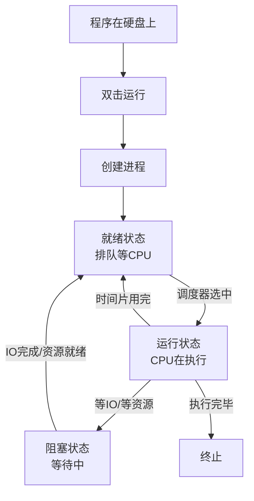
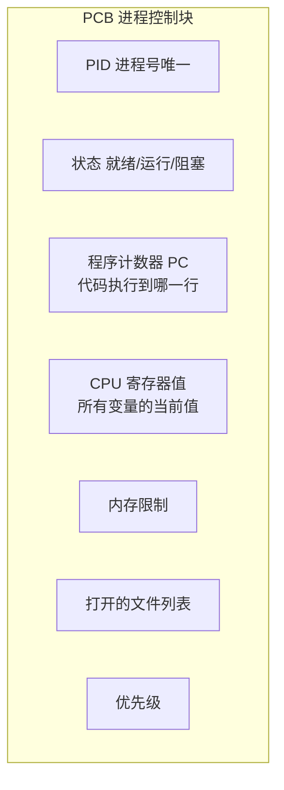
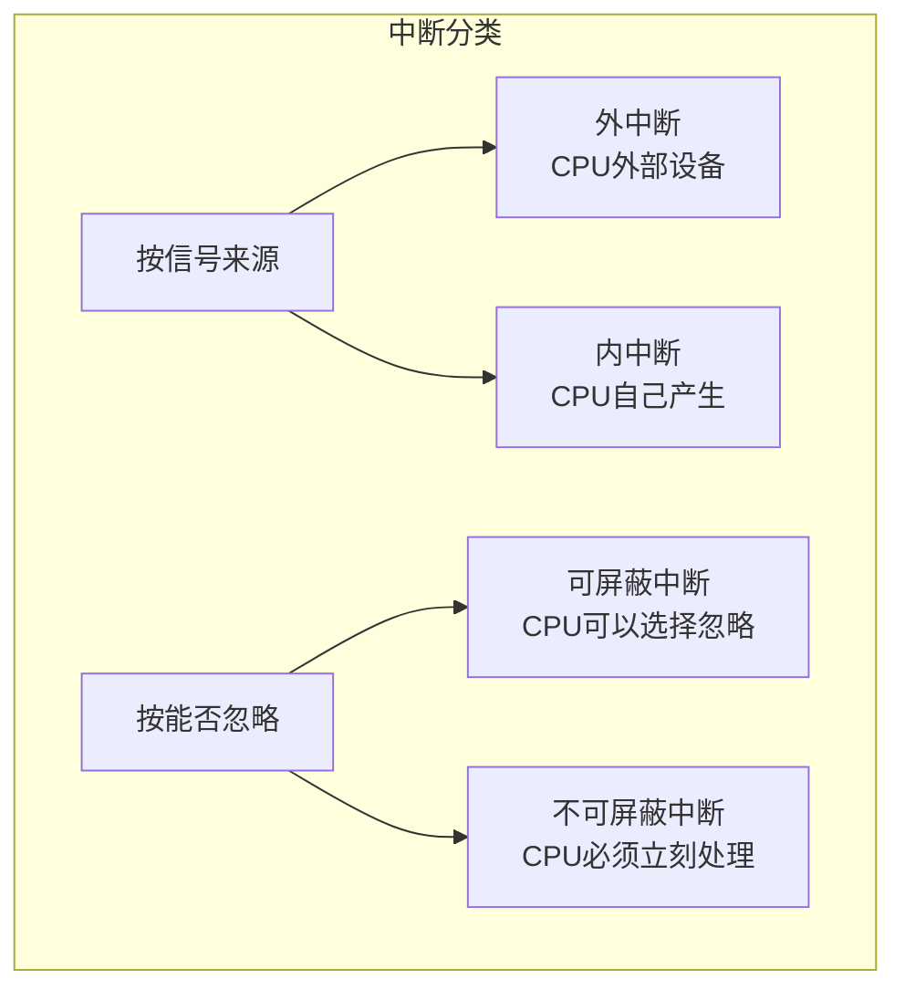
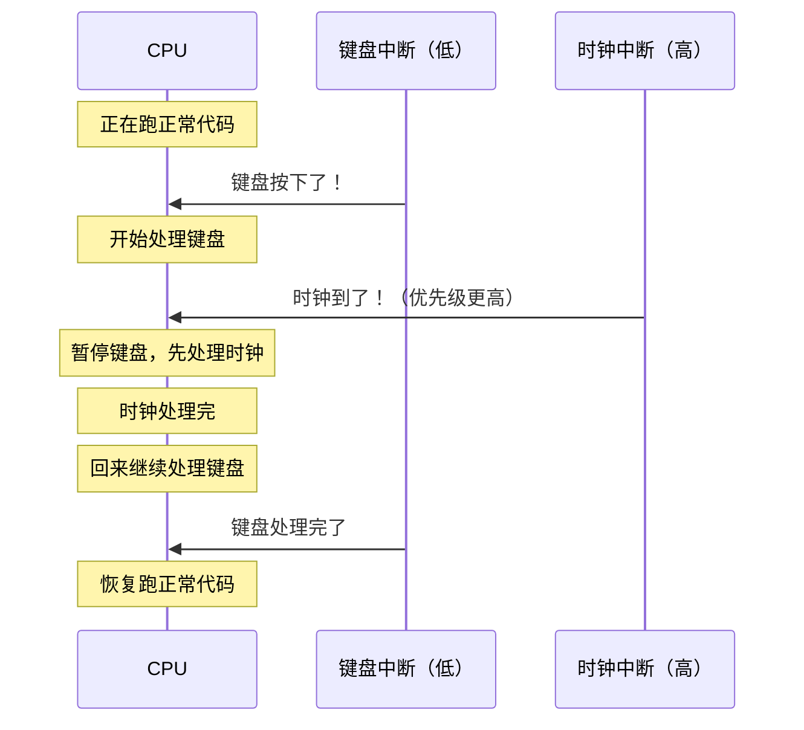
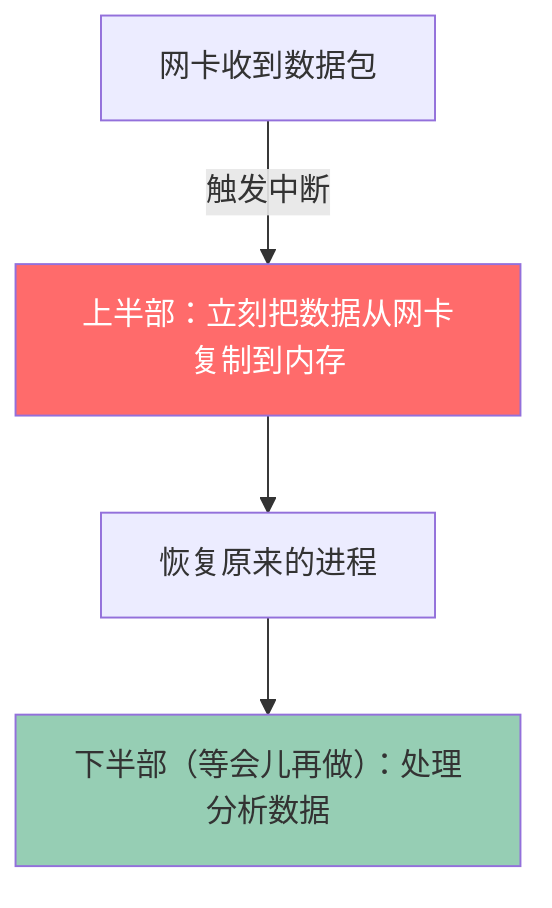
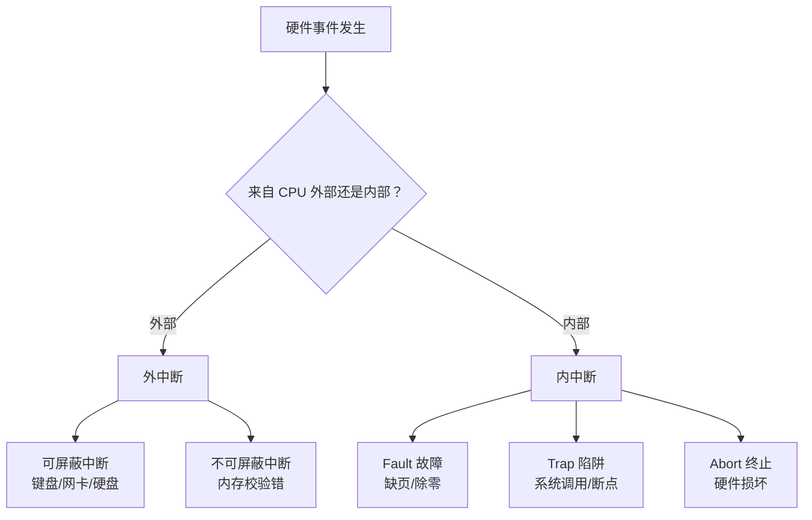

---

title: "操作系统基础：CPU调度流程 / 中断 / 系统调用 / 上下文切换"

created: "2026-07-20"

tags:

  - 八股文

  - 操作系统

source: "每日笔记"

---

# 操作系统基础：CPU调度流程 / 中断 / 系统调用 / 上下文切换

> **一句话**：操作系统是个"大管家"，管 CPU 给谁用、管内存怎么分、管设备怎么访问、管文件怎么存。这一篇先把 CPU 相关的底层机制讲清楚。

## 一、CPU 调度全流程——从进程产生到执行结束
### 整体流程



### 每个步骤详细说
#### 步骤 1：程序变成进程

```text

程序 = 硬盘上的 .exe 文件（死的）

进程 = 跑起来的程序（活的）

Chrome.exe 在硬盘里躺了几年，你双击它那一刻：

  ① 操作系统把代码从硬盘加载到内存

  ② 分配 PCB（进程控制块）——进程的"身份证"

  ③ 分配内存空间、栈、堆

  ④ 把进程扔进就绪队列

  → 进程诞生了，开始等 CPU

```

**PCB（Process Control Block）——进程的身份证**



就像你入职时公司给你建的人事档案——你是谁、在做什么、有什么权限，全记在里面。

#### 步骤 2：调度器选谁上 CPU

```text

就绪队列里好几个进程排队等着用 CPU：

[Chrome] [VS Code] [微信] [音乐]

调度器（Dispatcher）根据调度算法选一个：

  FCFS → 先来的先上

  RR   → 每人轮流，一人一个时间片

  MLFQ → 优先级高的先上

被选中的 → 从就绪变成运行

```

#### 步骤 3：上下文切换——换人的瞬间

```text

正在跑 Chrome（进程A） → 时间片到了 → 换 VS Code（进程B）

切换时发生的事：

  ① 把进程A的"现场"全部记住——寄存器里现在有什么值？

     程序跑到哪一行了？→ 存到 PCB_A

  ② 把进程B的"现场"从 PCB_B 里恢复——上次跑哪了？

  ③ 开始跑进程B

这个过程叫 上下文切换（Context Switch）

```

```text

类比：你在写作业，你妈叫你吃饭，吃完再回来写

  你在写数学第 10 题（正在跑进程A）

  → 你妈喊"吃饭了！"（中断）

  → 你把笔放好，记住写到第 10 题的第 3 小问了（保存上下文）

  → 去吃饭（切到进程B）

  → 吃完回来，看一眼：哦第 10 题第 3 小问，继续写（恢复上下文）

  如果你吃到一半忘了写到哪了，就得重新想——那就是切换成本。

```

```text

上下文切换很贵：

  每次切换要保存/加载一堆寄存器

  还要刷新 TLB（地址映射缓存）

  大概 1-10 微秒

看起来很短？但切换频繁就累加很多。

类比：你写 5 分钟作业就去吃口饭再回来写——永远进入不了状态。

        写 1 小时再吃饭——效率高。

        这就是时间片不能太小的原因。

```

#### 步骤 4：三种状态切换

```text

① 就绪 → 运行：排到队了，上 CPU

② 运行 → 就绪：时间片到了/被更高优先级的抢了，下去重新排队

③ 运行 → 阻塞：等硬盘读数据/等网络/等用户打字——先睡一觉

④ 阻塞 → 就绪：等的东西好了，回来排队

⑤ 运行 → 终止：执行完了，再见

```

```text

类比：去政务大厅办事

就绪 = 取了号，在座位上等着叫号

运行 = 正在窗口办业务

阻塞 = 材料不齐，回去补材料（不在大厅里等了）

        补好了回来重新取号 → 就绪

终止 = 办完了，走人

```

### 中断的分类全景图

```mermaid

mindmap

  root((中断))

    外中断（来自CPU外部）

      可屏蔽中断：键盘、网卡、硬盘、时钟

      不可屏蔽中断：内存校验错、断电

    内中断（CPU自己产生的异常）

      故障 Fault：缺页、除零、段错误

      陷阱 Trap：系统调用、断点

      终止 Abort：内存坏了，救不了

```

**最大的分法就两个维度：**



### 键盘中断——最直观的例子，一步步看

你按了一个 'A' 键，CPU 那边发生了什么：

```text

① 你按下 'A'

② 键盘控制器检测到：有人按了！

③ 键盘控制器发一个电信号给"中断控制器"

④ 中断控制器转发给 CPU

⑤ CPU 执行完当前正在执行的那条指令（不能半截停）

⑥ CPU 发现：哦，有中断

⑦ CPU 赶紧把当前进程的所有信息存起来（寄存器、PC）

⑧ CPU 查"中断向量表"——找到键盘中断该调哪个函数

⑨ CPU 跳过去执行键盘处理函数

⑩ 函数从键盘读扫描码，转成 'A'，放进输入缓冲区

⑪ 处理完了

⑫ CPU 恢复之前存起来的进程信息

⑬ 继续跑原来的代码——好像什么都没发生过

```

```text

对你的程序来说：它根本不知道这期间被中断过。

对你自己来说：你按了 A，屏幕上出现了 A，感觉就是一瞬间。

对 CPU 来说：它干了十几个步骤。

```

**类比：你正在写作业，你妈喊你吃饭**

```text

你正在算一道数学题（CPU 跑进程）

你妈喊："吃饭了！"（中断）

你停下笔，记住算到哪一步了（保存上下文）

你放下笔去吃饭（处理中断）

吃完回来，看刚才记的位置，继续算（恢复上下文）

从数学题的角度——它不知道你被叫去吃饭了，它只"感觉"你一直在算。

```

### 内中断（异常 Exception）——CPU 自己搞出来的

外中断是"外部设备来找 CPU"，内中断是"CPU 自己跑着跑着出了问题"。

#### 三种内中断

| 类型 | 啥时候发生 | 还能救吗 | 例子 |

| ------ | ----------- | --------- | ------ |

| **故障（Fault）** | 指令执行到一半 | ✅ 修好了重试这条指令 | 缺页异常、除零 |

| **陷阱（Trap）** | 指令执行完了 | ✅ 继续下一条 | 系统调用、断点 |

| **终止（Abort）** | 严重错误 | ❌ 没救了 | 内存物理损坏 |

#### Trap（陷阱）——"我故意的，你帮我干件事"

和 Fault 的核心区别：

```text

Fault：重新执行当前指令（"刚才那条没跑成，你再跑一次"）

Trap：继续执行下一条指令（"刚才那条跑完了，跑下一条"）

```

**最经典的例子：系统调用**

```text

你的程序调 read() → 想从文件读数据

但你的程序在用户态——不能直接访问硬盘。

必须通过系统调用，让操作系统帮它读。

流程：

① 程序把"我想 read"的指令和参数放到寄存器

② 执行一条特殊的指令：syscall

③ 这条指令触发 Trap → CPU 切换到内核态

④ 操作系统拿到控制权 → 根据参数找到内核里的 read 函数

⑤ 内核真的去硬盘上读了数据

⑥ 数据读回来了

⑦ CPU 切回用户态

⑧ 你的程序继续执行 read 后面的下一行代码

```

```text

为什么叫"陷阱"（Trap）？

  你故意跳进去的——目的是让 OS 帮你办事，办完再出来。

类比：

  你在办公室写报告（用户态）

  → 需要盖章（需要 OS 帮忙）

  → 你走进领导办公室（Trap 进内核态）

  → 领导帮你盖章（内核执行）

  → 你回自己工位（返回用户态）

  → 继续写报告（执行下一条指令）

```

**第二个例子：调试器的断点**

```text

你在 IDE 里给某行代码设了个断点。

编译器在这行代码前偷偷插了一条 int 3 指令。

程序跑到这里：

→ 执行到 int 3 → 触发 Trap

→ 调试器（比如 VS Code 的 debugger）拿到控制权

→ 程序停住了，你可以看变量、单步执行

→ 你点"继续" → 调试器恢复程序 → 执行下一行

```

### 中断优先级——多个中断同时来了怎么办？

```text

想象一下：

CPU 正在处理网卡中断（收到数据包）

这时候键盘被按下了

接着时钟中断也到了

三个中断一起来 → CPU 先处理谁？

```

**中断有优先级，高的先处理。**

```text

大致优先级（从高到低）：

最高：不可屏蔽中断（内存坏了）—— 致命问题

  ↑   硬件故障（断电）

  ↑   时钟中断 —— 时间管理，关系到调度

  ↑   硬盘中断 —— IO 完成

最低：键盘/鼠标 —— 慢速设备，最不着急

```

**高优先级可以打断低优先级的处理过程，反过来不行。**

```text

CPU 在处理键盘中断 → 时钟中断来了（优先级更高）

  → CPU 暂停键盘处理 → 处理时钟 → 回来继续处理键盘

CPU 在处理时钟中断 → 键盘中断来了（优先级更低）

  → CPU 说："键盘你先等着，我处理完时钟再说"

```

这叫 **中断嵌套**——高优先级中断可以插队。



```text

类比：你在接一个不太重要的电话（键盘中断）

      → 突然另一个重要电话打进来了（时钟中断，高优先级）

      → 你对第一个说"稍等" → 接第二个 → 讲完 → 继续第一个

```

### 中断处理函数的规矩——为什么不能在里面干太多活

中断处理函数（也叫 ISR，Interrupt Service Routine）有几个硬性规定：

#### 规矩 1：必须尽快结束

```text

中断处理期间，其他中断可能被关掉了——你处理得太慢，其他设备就得不到响应。

就像你接了一个重要电话，然后跟对方聊了半小时——这半小时里别人打不进来。

```

#### 规矩 2：不能阻塞、不能睡大觉

```text

你在中断处理函数里调 sleep()？你在想啥呢？

中断上下文不属于任何进程，你阻塞了没人能救你。

```

#### 规矩 3：急事急办，不急的事等会儿办

```text

所以中断处理被拆成两半：

上半部（Top Half）：

  立刻要做的事，不能等。

  比如：从网卡里把收到的数据包复制到内存缓冲区。

  为啥？因为网卡的缓冲区很小，你不赶紧取走，下一个包来就把上一个覆盖了。

  类比：外卖到了 → 你赶紧去门口把外卖拿进来放桌上。

        不能让人家在门口一直等着。

下半部（Bottom Half）：

  不那么急的事，等会儿再做。

  比如：处理刚才收到的那堆数据包——是 HTTP 请求还是视频流？

  类比：外卖放桌上了 → 你先把这集电视剧看完 → 再看外卖。

        反正外卖已经在桌上了，跑不掉。

```



Linux 里的下半部机制：

```text

下半部的实现方式：

  SoftIRQ（软中断） → 比如网卡数据处理

  Tasklet → 类似 SoftIRQ，但更简单

  Work Queue → 可以阻塞，最慢

```

### 中断全过程——从按键到显示，完整串一遍

从你按键盘上的 'A' 到屏幕上出现 'A'，经过的所有步骤：

```text

① 你按了 'A'

② 键盘控制器检测到按键

③ 键盘控制器发中断信号到中断控制器

④ 中断控制器判断优先级（键盘的优先级低）

⑤ 中断控制器把信号转发给 CPU

⑥ CPU 执行完当前这条指令（保证不半截停）

⑦ CPU 检查到：有中断来了

⑧ CPU 保存当前进程的上下文（寄存器、PC 全部存起来）

⑨ CPU 暂时关中断（防止处理键盘时又被其他中断打断）

⑩ CPU 查中断向量表：键盘中断号对应的处理函数在哪？

⑪ CPU 跳到键盘处理函数

⑫ 处理函数从键盘端口读扫描码，转成 ASCII 码 'A'

⑬ 把 'A' 放到系统的输入缓冲区

⑭ 处理完了，CPU 开中断（允许其他中断了）

⑮ 恢复之前保存的进程上下文

⑯ 继续跑原来的代码——它完全不知道刚才被中断过

⑰ 调度器下次运行时，发现"键盘有输入了"

⑱ 把 'A' 交给当前的前台程序（比如记事本）

⑲ 记事本收到 'A' → 显示到屏幕上

```

从你按 'A' 到看到它，十几个步骤，大约几毫秒。

### 中断总结



## 二、用户态 vs 内核态——为什么要有权限分级
### 为什么不能所有代码都在"最高权限"下跑？

```text

一个 Windows 的经典问题：

  程序 A 写 bug 了 → 乱写内存 → 把操作系统自己的数据覆盖了

  → 整个系统蓝屏

如果所有代码都是最高权限 → 任何一个程序出 bug 都能搞崩整个系统。

```

Intel CPU 设计了 4 个特权级：

```text

Ring 0（内核态）：操作系统内核 —— 什么都能干

Ring 1、2：设备驱动（一般不用）

Ring 3（用户态）：你的程序 —— 限制最多

```

```text

类比：

内核态 = 公司 CEO —— 什么都能看、什么都能批

用户态 = 普通员工 —— 只能看自己该看的

好处：

  一个员工搞砸了 → 开掉他就完了

  CEO 搞砸了 → 公司可能完了

所以：大部分代码在用户态跑，只有 OS 核心在内核态。

        一个程序崩了 → 只杀它一个，不影响其他人。

```

### 三种方式从用户态进入内核态

| 方式 | 怎么触发的 | 谁发起的 | 类比 |

| ------ | ----------- | --------- | ------ |

| **系统调用** | 主动请求 OS 帮忙 | 程序自己 | 你举手问老师问题 |

| **异常** | 程序执行出错了 | CPU 自己 | 你走路踩到坑摔了 |

| **外中断** | 硬件有通知 | 设备 | 门铃响了 |

### 切换成本

```text

用户态 → 内核态 → 用户态

  ① 保存用户态寄存器

  ② 切换栈（用户栈 → 内核栈）

  ③ 检查权限

  ④ 执行内核代码

  ⑤ 恢复用户态寄存器

  ⑥ 切回用户栈

大约 50-100ns —— 比普通函数调用慢 10 倍以上

```

## 三、一张表串起所有概念

| 概念 | 一句话 | 谁触发的 | 影响谁 | 开销 |

| ------ | -------- | --------- | -------- | ------ |

| **中断**（狭义=外中断） | 设备说"有事了" | 硬件 | 当前进程 | 小 |

| **异常** | CPU 执行指令出问题了 | CPU | 当前进程 | 小 |

| **系统调用** | 程序求 OS 帮忙 | 程序 | 当前进程 | 中（50-100ns） |

| **上下文切换** | 换一个进程跑 | 调度器 | 整个系统 | 大（1-10μs） |

## 四、记忆口诀

```text

调度流程一条线：就绪→运行→阻塞→就绪

中断是设备找CPU，异常是CPU踩坑了

时钟中断是心跳，没它没人换

系统调用求OS，用户切内核

上下文切换最贵，换进程要全记住

时间片不能太小，都去切换没人干活

```

---

**总结**：调度流程是执行实体（线程/进程）的一生，中断是 OS 的消息机制，系统调用是程序找 OS 办事的通道，上下文切换是调度的代价。中断里面的时钟中断是分时系统的根基——没有它就没有现代操作系统。

## 速记卡（面试闪卡）

**Q1：一句话讲清「操作系统基础：CPU调度流程 / 中断 / 系统调用 / 上下文切换」到底是什么？**

A：这篇梳理 CPU 调度全流程、中断分类、系统调用与上下文切换，是理解操作系统底层机制的核心八股。

**Q2：一、CPU 调度全流程——从进程产生到执行结束 —— 怎么理解？**

A：进程一生：程序→创建 PCB（进程身份证）→就绪排队→调度器选中运行→时间片到/等 IO 阻塞→再就绪。Context Switch（上下文切换）换人时把寄存器、PC 存进 PCB 再恢复，约 1-10μs，频繁切换很贵。

**Q3：二、用户态 vs 内核态——为什么要有权限分级 —— 怎么理解？**

A：Intel 分 Ring0（内核态，啥都能干）和 Ring3（用户态，限制多），像 CEO 与普通员工。三种进内核方式：系统调用（主动求 OS）、异常（CPU 踩坑）、外中断（门铃响）。切换开销 50-100ns，比函数调用慢十倍。

**Q4：三、一张表串起所有概念 —— 怎么理解？**

A：中断=设备找 CPU（硬件触发，开销小）；异常=CPU 执行出错（开销小）；系统调用=程序求 OS 帮忙（中，50-100ns）；上下文切换=换进程跑（大，1-10μs）。时钟中断是分时系统的心跳，没它没人换人。

**Q5：四、记忆口诀 —— 怎么理解？**

A：口诀：调度一条线“就绪→运行→阻塞→就绪”；中断是设备找 CPU、异常是 CPU 踩坑；时钟中断是心跳；系统调用求 OS 切内核；上下文切换最贵，时间片不能太小否则都去切换没人干活。

**Q6：核心速记主线有哪些？**

- 调度流程：就绪→运行→阻塞，PCB 存现场

- 用户态/内核态分级，三方式进内核

- 中断（设备）/异常（CPU）/系统调用（程序）区分

- 上下文切换最贵，时钟中断是分时根基

**口诀**

A：调度一线就绪运行阻，

中断设备异常踩坑；

系统调用求 OS 帮，

切换最贵片勿小。

## 相关链接

- 📋 目录：[[00-操作系统]]

- 📚 学习清单：[[八股文学习路线图]]

- 🔗 [[21-用户态与内核态|21 用户态与内核态]]

- 🔗 [[22-用户态进入内核态三种方式|22 用户态进入内核态三种方式]]

- 🔗 [[23-eBPF概念与应用|23 eBPF概念与应用]]

- 🔗 [[语言与框架/Python/八股/00-Python|Python八股文]]

- 🔗 [[语言与框架/TypeScript-React/八股/00-React-TS-JS|React-TS-JS八股文]]

- 🔗 [[语言与框架/MySQL/八股/00-MySQL|MySQL八股文]]

