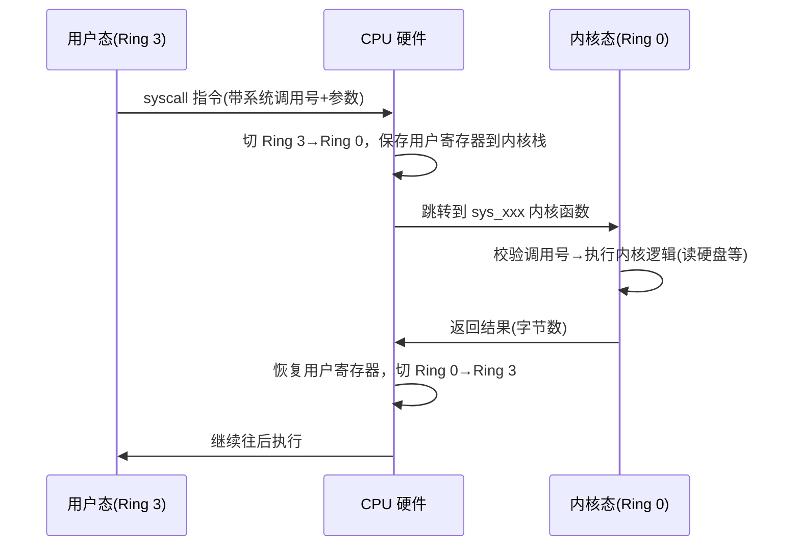

---

title: "用户态 vs 内核态 + 切换方式"

created: "2026-07-20"

tags:

  - 八股文

  - 操作系统

source: "每日笔记"

---

# 用户态 vs 内核态 + 切换方式

> **一句话**：用户态被圈养（不能碰硬件、不能碰别人内存），内核态什么都能干。程序大部分时间在用户态，需要干正事时通过系统调用/异常/外中断切进内核态。

## 一、两种态的对比

| 维度 | 用户态（Ring 3） | 内核态（Ring 0） |
| ------ | ----------------- | ----------------- |
| **能执行特权指令吗** | ❌ 不能 | ✅ 能 |
| **能直接访问硬件吗** | ❌ 不能（要通过系统调用） | ✅ 能 |
| **能访问其他进程内存吗** | ❌ 不能 | ✅ 能 |
| **能开关中断吗** | ❌ 不能 | ✅ 能 |
| **能访问内核空间吗** | ❌ 不能（会段错误） | ✅ 能 |
| **崩溃了影响谁** | 只影响自己 | 整个系统崩 |
| **运行在哪里** | 应用程序 | 操作系统内核 |

### 什么是"特权指令"

```text

有些指令只能在 Ring 0 执行，在 Ring 3 执行会触发异常：

① 开关中断指令（cli / sti）

  你在用户态把中断关了 → 时钟中断进不来 → 调度器没法换人 → 系统卡死

② 修改页表的指令

  你在用户态改页表 → 可以访问任何内存 → 安全防线被突破

③ IO 指令（in / out）

  你在用户态直接读写硬盘 → 想删啥删啥

```

**这些指令在用户态执行 → CPU 拒绝 → 触发异常 → 杀死你的程序。**

## 二、切换时具体发生了什么
### 系统调用的完整切换流程

```text

以 read() 为例：

用户态：

  ① 你的代码调 read(fd, buf, 1024)

  ② 库函数（glibc）把 read 的系统调用号放进寄存器

  ③ 把参数放进其他寄存器

  ④ 执行 syscall 指令

切换瞬间（硬件自动完成）：

  ⑤ CPU 从 Ring 3 切换到 Ring 0

  ⑥ 保存用户态的寄存器到内核栈

  ⑦ 切换到内核栈（用户栈 → 内核栈）

  ⑧ 检查系统调用号是否合法

内核态：

  ⑨ 找到内核里的 sys_read 函数

  ⑩ 检查文件描述符是否合法

  ⑪ 去硬盘上读数据

  ⑫ 把数据复制到用户提供的 buf 里

  ⑬ 返回读取的字节数

切回用户态：

  ⑭ 从内核栈恢复用户态寄存器

  ⑮ CPU 从 Ring 0 切回 Ring 3

  ⑯ 你的程序继续执行 read 后面的代码

```

### 切换开销

```text

一次用户态 ↔ 内核态切换的开销：

① 保存用户态寄存器（约 50-100 个字节）

② 切换栈指针（用户栈 → 内核栈）

③ 检查权限（判断系统调用号是否合法）

④ 执行内核代码

⑤ 恢复用户态寄存器

⑥ 切换回用户栈

约 50-100 纳秒。

比普通函数调用慢 10-100 倍。

```

```text

这也是为什么：

  频繁的系统调用（比如每次读写一个字节）很慢

  所以需要用缓冲区——攒一批再一次性系统调用

```

## 三、记忆口诀

```text

用户态被圈养，不能碰硬件

内核态啥都干，崩了就蓝屏

系统调用主动进，异常被动踩坑

外中断是设备找，三种通道进内核

切换成本不便宜，保存恢复加换栈

批量操作省一省，少切几次快不少

```

---

**总结**：用户态和内核态是 CPU 的权限分级机制。程序大部分时间在用户态，干三件事时必须进内核——主动请求服务（系统调用）、执行出问题（异常）、设备找上门（外中断）。切换有开销，所以少切为妙。

## 一图流（Mermaid）



> 切换的"换级别 + 存寄存器 + 换栈"由 CPU 硬件自动完成；"查调用号 + 干正事"由内核软件完成。异常、外中断走的是同一条 Ring 切换通道，只是触发源不同。

## 速记卡（面试闪卡）

**Q1：用户态和内核态核心区别是什么？**

A：用户态（Ring 3）被圈养——不能碰硬件、不能执行特权指令、不能访问内核空间与他人内存；内核态（Ring 0）什么都能干，但一旦崩溃影响整个系统。

**Q2：什么叫"特权指令"？举几个例子。**

A：只能在 Ring 0 执行的指令，用户态执行会触发异常被杀。典型：cli/sti 开关中断、修改页表、in/out 做 IO。用户态关中断会让调度器失效、系统卡死。

**Q3：进入内核态有哪三种通道？**

A：① 系统调用——程序主动请求服务（如 read）；② 异常——执行出错被动踩坑（如除零、缺页）；③ 外中断——设备找上门（如网卡来数据、时钟到）。

**Q4：一次切换的开销大概多少？**

A：要保存/恢复约 50–100 个寄存器、切换用户栈↔内核栈，约 50–100 纳秒，比普通函数调用慢 10–100 倍。所以频繁系统调用很亏。

**Q5：为什么要用缓冲区、批量读写？**

A：每字节一次系统调用 = 不停切态，开销炸裂。攒一批（如 fread 缓冲、write 缓冲）一次性系统调用，能把切换次数摊薄，显著提速。

**Q6：切换到底是谁做的？**

A：Ring 级别切换 + 寄存器保存/恢复由 CPU 硬件自动完成；内核只负责查调用号合法性、执行真正的内核逻辑。

**口诀**：用户态被圈养，内核态啥都干；系统调用主动进、异常被动踩坑、外中断设备喊；切换不便宜，批量省一省。

## 相关链接

- 📋 目录：[[00-操作系统]]

- 📚 学习清单：[[八股文学习路线图]]

- 🔗 [[20-操作系统基础CPU调度流程中断系统调用上下文切换|20 操作系统基础]]

- 🔗 [[22-用户态进入内核态三种方式|22 用户态进入内核态三种方式]]

- 🔗 [[24-操作系统分类批处理分时实时分布式|24 操作系统分类]]

- 🔗 [[语言与框架/Python/八股/00-Python|Python八股文]]

- 🔗 [[语言与框架/TypeScript-React/八股/00-React-TS-JS|React-TS-JS八股文]]

- 🔗 [[语言与框架/MySQL/八股/00-MySQL|MySQL八股文]]

