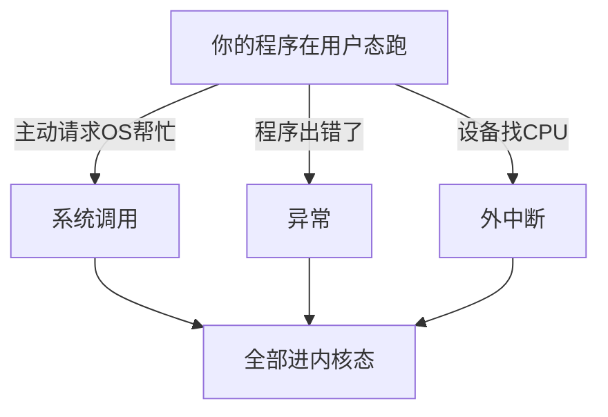
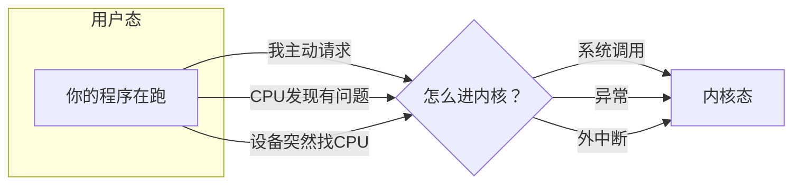

---

title: "用户态进入内核态三种方式：系统调用 / 异常 / 外中断"

created: "2026-07-21"

tags:

  - 八股文

  - 操作系统

source: "每日笔记"

---

# 用户态进入内核态三种方式：系统调用 / 异常 / 外中断

> **一句话**：程序大部分时间在用户态（被圈着），想干"特权事"或出事时，就得进内核态。进去的通道就三个。

---

## 一、先回忆：用户态和内核态是啥

Intel CPU 把权限分成 4 级（Ring 0 ~ Ring 3），但实际只用两级：

```text

Ring 0（内核态） → 操作系统内核在这

  什么都能干：碰硬件、改别人的内存、开关中断……

Ring 3（用户态） → 你的程序在这

  被圈养：不能碰硬件、不能碰别人内存、想干正事得求 OS

为什么这么设计？

  一个程序写崩了 → 只杀它自己 → 不影响整个系统

  如果所有代码都在内核态 → 一个 bug 直接蓝屏

```

```text

类比：

内核态 = 公司 CEO —— 什么都能批、什么都能看

用户态 = 普通员工 —— 只能用自己的办公桌

```

---

## 二、三种通道的完整对比



| 方式 | 谁发起的 | 主动还是被动 | 类比 | 例子 |
| ------ | --------- | ------------- | ------ | ------ |
| **系统调用** | 程序自己 | **主动** | 你举手问老师问题 | `open()`, `read()`, `fork()` |
| **异常** | CPU 执行指令时触发 | **被动** | 你走路踩到坑了 | 除零、缺页、段错误 |
| **外中断** | 外部硬件设备 | **被动** | 门铃响了 | 键盘、网卡、时钟 |

---

## 三、逐个讲清楚
### 1. 系统调用（主动进入）
### 2. 异常（被动进入）
### 3. 外中断（被动进入）
#### 场景

```text

你的程序想读文件：

  data = open("test.txt")

但你不能直接碰硬盘（没权限）。

所以：你主动"举手"，请操作系统帮你读。

```

#### 流程

```text

你的程序（用户态）：

  f = open("test.txt")

  ① 准备好参数（文件名、模式）

  ② 执行 syscall 指令（x86-64）或 int 0x80（x86）

  ③ 这条指令触发 CPU 切换到内核态

  ④ 操作系统拿到控制权

操作系统（内核态）：

  ⑤ 检查你的权限

  ⑥ 去硬盘上找 test.txt

  ⑦ 返回文件描述符

  ⑧ 切回用户态

你的程序继续跑：

  ⑨ f = 3（拿到了文件描述符）

```

#### 生活类比

```text

你在工位写报告（用户态）

需要一份机密数据（不能自己去档案室）：

  → 你填一张申请表（准备参数）

  → 走进领导办公室（syscall 指令）

  → 领导审批、让人去档案室取（内核执行）

  → 把资料给你（返回结果）

  → 你回工位继续写报告（回到用户态）

```

#### 特点

```text

✅ 主动的——程序自己想进去

✅ 可预测的——我知道我调了 open() 就会进内核

✅ 安全的——程序明确请求，OS 检查权限再执行

```

---

#### 场景

```text

程序执行指令时，CPU 发现"这事不对劲"。

三种异常：

  Fault（故障）：出了小问题，修好了重试这条指令

    → 缺页异常（数据不在内存里，去硬盘加载）

    → 除零错误（没法修，程序崩）

  Trap（陷阱）：故意触发，请 OS 帮忙

    → 系统调用底层就是 Trap

  Abort（终止）：出大事了，没救了

    → 内存物理损坏

```

**这里重点讲 Fault，因为 Trap 和系统调用本质是一回事，Abort 很少见。**

#### 【重点】缺页异常——最常见的 Fault

```text

你的程序：

  data = arr[10000]    ← 想读这个地址的数据

CPU 执行时：

  查页表 → 这个地址不在物理内存里！

  → 触发 Fault

  → 暂停当前指令

操作系统接手（进内核态）：

  → 去硬盘上把 arr[10000] 附近的数据加载到物理内存

  → 更新页表

CPU 重新执行那条指令：

  → 这次查页表 → 数据在内存里了

  → 读取成功！

你的程序完全不知道发生了缺页。

```

```text

类比：刷卡进门

你刷卡 → 门不开（Fault）

保安过来帮你开门（内核处理）

你再刷一次（重新执行指令）→ 门开了

你第一次刷卡时"门不开"不是错误——保安帮你开了就行。

```

#### 【了解】除零错误——救不了的 Fault

```text

CPU 执行：result = a / 0

→ 除零了 → 触发 Fault

→ 操作系统检查：这程序注册了除零处理函数吗？

→ 没有 → 发 SIGFPE 信号 → 程序崩溃

和缺页的区别：

  缺页可以修（去硬盘加载数据），除零没法修。

```

#### 特点

```text

❌ 被动的——程序不是故意的，CPU 发现有问题

❌ 不可预测的——程序不知道自己会除零

✅ 对程序透明（缺页）——程序完全不知道发生过异常

```

---

#### 场景

```text

CPU 正在专心跑你的代码。

突然：

  键盘被按下了

  或网卡收到数据了

  或时钟芯片发信号了

来自 CPU 外部设备的通知——"有事了！"

```

#### 流程

```text

你的程序正在跑（用户态）

① 网卡收到一个数据包

② 网卡发中断信号给中断控制器

③ 中断控制器转发给 CPU

④ CPU 执行完当前指令

⑤ 检查到有中断

⑥ 保存当前程序上下文

⑦ CPU 切换到内核态

操作系统（内核态）：

  ⑧ 查中断向量表

  ⑨ 跳去网卡中断处理函数

  ⑩ 把数据从网卡复制到内存缓冲区

  ⑪ 切回用户态

⑫ 你的程序继续跑——完全不知道发生过中断

```

#### 生活类比

```text

你在写作业（用户态）

门铃响了（外中断）：

  → 放下笔

  → 记住写到哪了

  → 去开门拿快递

  → 回来继续写

你的作业"不知道"你离开过。

```

#### 特点

```text

❌ 被动的——CPU 不知道啥时候会来

❌ 不可预测的——你不可能预判键盘啥时候被按

✅ 异步的——跟当前执行的代码完全无关

```

---

## 四、三者的根本区别



| 维度 | 系统调用 | 异常 | 外中断 |
| ------ | --------- | ------ | -------- |
| **谁发起的** | 程序自己 | CPU 执行指令时 | 外部硬件 |
| **主动/被动** | ✅ 主动 | ❌ 被动 | ❌ 被动 |
| **同步/异步** | 同步 | 同步（与指令同步） | **异步** |
| **能预测吗** | ✅ 程序知道 | ❌ 不知道 | ❌ 不知道 |
| **例子** | open, read, fork | 缺页、除零 | 键盘、网卡、时钟 |

**最核心的一个区分维度：同步 vs 异步**

```text

同步（系统调用、异常）：

  "执行这条指令 → 进内核 → 回来 → 继续执行下一条"

  跟代码执行是串行的，可以预测顺序

异步（外中断）：

  "CPU 正在算 1+1，网卡突然来了中断"

  跟代码执行无关，任何时候都可能发生

```

---

## 五、一句话讲清
### Q：用户态怎么进入内核态？有几种方式？

> 三种。系统调用是程序主动请求 OS 服务（如 read、fork），异常是指令执行时出问题被动触发（如缺页、除零），外中断是硬件设备通知 CPU（如键盘、网卡）。系统调用是主动的、同步的；异常是被动的、同步的；外中断是被动的、异步的。

### Q：系统调用和中断是什么关系？

> 系统调用底层通过 Trap 异常实现，而 Trap 是内中断的一种。所以"系统调用进内核"本质上就是"触发异常进内核"。外中断和设备相关，系统和设备之间通信的机制。

### Q：缺页异常是错误吗？

> 不是错误，是虚拟内存的正常机制。程序访问的地址不在物理内存里时触发缺页，OS 从硬盘加载数据后再重新执行那条指令。程序完全感知不到。

---

## 记忆口诀

```text

系统调用主动求——open read 找 OS

异常是被CPU坑——缺页除零踩到坑

外中断是设备找——键盘网卡门铃响

主动被动分三种，同步异步看来源

```

---

**总结**：系统调用是"我想进去"，异常是"我被迫进去"，外中断是"外面有人找我"。三种方式都是进内核的合法通道。

## 速记卡（面试闪卡）

**Q1：一句话讲清「用户态进入内核态三种方式」到底是什么？**

A：程序大多在用户态（Ring 3，被圈养不能随意碰硬件），想干特权事或出事时就进内核态（Ring 0）。合法通道只有三个：系统调用、异常、外中断。

**Q2：用户态与内核态 —— 怎么理解？**

A：像 CEO（内核态什么都能批）和普通员工（用户态只能用自己办公桌）。CPU 实际只用两级权限，目的是隔离——一个程序写崩只杀自己，若全在内核态一个 bug 就蓝屏。

**Q3：系统调用（主动）—— 怎么理解？**

A：程序主动请求 OS 帮忙，如 open、read、fork——像举手问老师问题。流程：准备参数 → 执行 syscall 指令切到内核 → OS 检查权限并执行 → 返回结果 → 切回用户态。它是可预测、同步的。

**Q4：异常（被动）—— 怎么理解？**

A：CPU 执行指令出错被动触发——缺页（Fault，可修：去硬盘加载数据后重执行那条指令，程序完全无感）、除零（救不了就崩）。Trap（陷阱）本质就是系统调用的底层实现。

**Q5：外中断（被动异步）—— 怎么理解？**

A：外部硬件通知 CPU，如键盘、网卡、时钟——像写作业门铃响了。流程：保存上下文 → 切内核 → 查中断向量表 → 处理函数 → 切回。它异步、与当前代码无关、不可预测。

**Q6：核心速记主线有哪些？**

A：题目、用户/内核态权限、系统调用（主动同步）、异常（被动同步）、外中断（被动异步）、核心区分维度是同步 vs 异步。

**口诀**

A：用户进内核三通道：调用主动异常被动；

外中断是设备找，同步异步看来源；

Ring3 圈养 Ring0 全，权限隔离保平安。

## 相关链接

- 📋 目录：[[00-操作系统]]

- 📚 学习清单：[[八股文学习路线图]]

- 🔗 [[20-操作系统基础CPU调度流程中断系统调用上下文切换|20 操作系统基础]]

- 🔗 [[21-用户态与内核态|21 用户态与内核态]]

- 🔗 [[23-eBPF概念与应用|23 eBPF概念与应用]]

- 🔗 [[语言与框架/Python/八股/00-Python|Python八股文]]

- 🔗 [[语言与框架/TypeScript-React/八股/00-React-TS-JS|React-TS-JS八股文]]

- 🔗 [[语言与框架/MySQL/八股/00-MySQL|MySQL八股文]]

