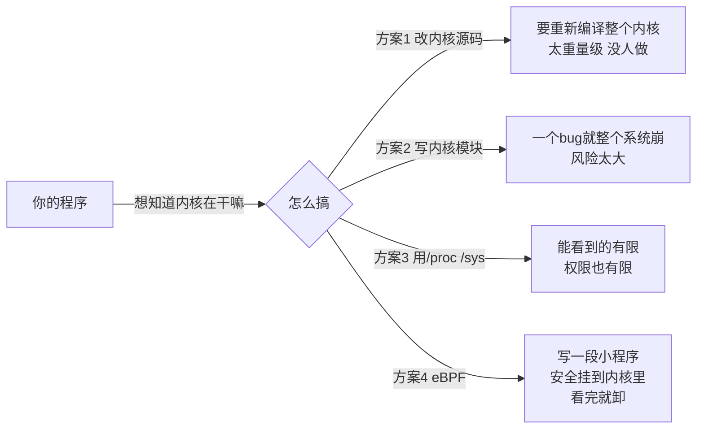
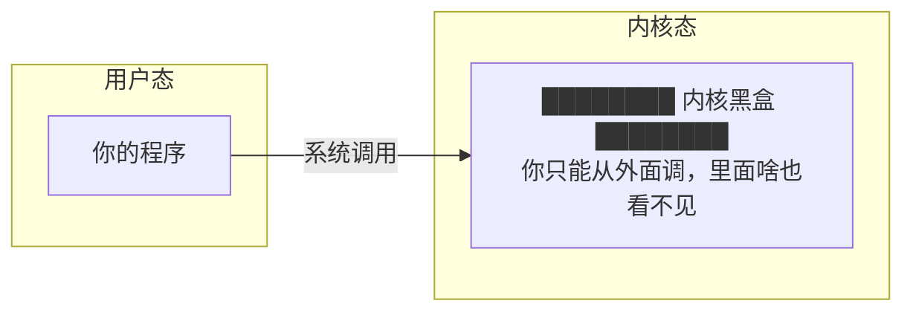
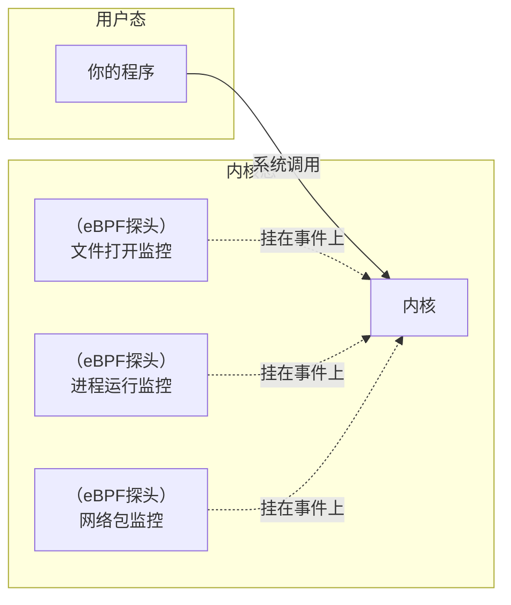
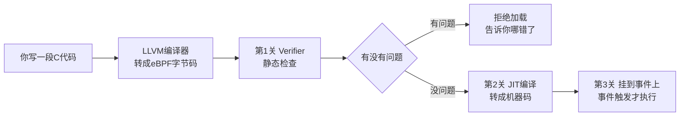
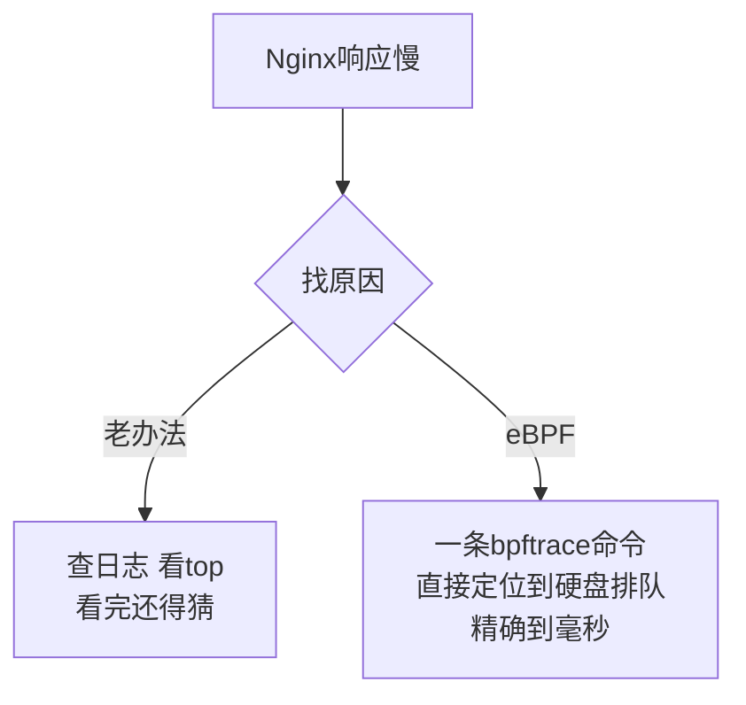

---

title: "eBPF 概念与应用"

created: "2026-07-21"

tags:

  - 八股文

  - 操作系统

source: "每日笔记"

---

# eBPF 概念与应用

## 一句话先记

> **你住的小区（Linux 内核）本来不让随便改。eBPF 就是——物业给你开了一个安全窗口，你可以往里伸一个监控摄像头，看保安在干嘛、还可以临时帮他干点活。安全得很，伸进去的探头是经过安检的，不会把小区搞炸。**

---

## 三个问题搞明白 eBPF
### Q1：为什么需要 eBPF？

你写程序跑在用户态，想知道内核里发生了什么。

**关键**：内核模块写崩了 → 服务器重启。eBPF 写崩了 → **根本加载不进去**，因为有个安检机（Verifier）先查一轮，有问题的代码直接拦住。

### Q2：eBPF 到底干了什么？

eBPF 不是说炸了重做内核——它是**在现有内核上打洞**，让你能挂钩子。

以前内核是个黑盒子：

挂了 eBPF 之后：

### Q3：eBPF 是怎么保证安全的？

eBPF 有一套完整的**安检流程**，你的代码必须过三关才能进内核：

**Verifier（安检机）具体查什么**：

- **不能有死循环**：要么没循环，要么有限次

- **不能访问非法内存**：指针用之前必须判空，数组不能越界

- **不能泄露内核地址**：不能把内核里的地址往外传

- **不能调任意内核函数**：只能调它批准的那几个 Helper 函数

类比：**机场安检**。你的行李（eBPF 程序）过安检机（Verifier），发现管制刀具（危险代码）直接扣下，根本不会让你带上飞机（进内核）。

---

## eBPF 的三大实战场景
### 场景 1：可观测性——给内核装摄像头

**你能看到以前看不到的东西**：

| 以前（没有 eBPF） | 现在（有 eBPF） |
| --- | --- |
| Nginx 慢了，查日志看 top，猜 | 直接看到"打开文件花了 200ms，因为硬盘在排队" |
| 想知道哪个函数最耗 CPU，用 perf 采样，大概知道 | 精确的火焰图，每一帧都能看到 |
| 想看某个 syscall 的调用频率，写内核模块 | 一行 bpftrace 搞定 |

**常用工具**：

- **bcc**：写 Python 脚本，里面嵌 C 代码的 eBPF 程序

- **bpftrace**：一行命令，awk 风格，比如 `bpftrace -e 'kprobe:do_sys_open { printf("%s\n", str(arg1)) }'`

### 场景 2：网络——快到飞起的包处理

**XDP（eXpress Data Path）**：

- 网卡收到包 → 在进内核协议栈**之前** → 交给 eBPF 处理

- 可以：直接丢掉（DDoS 防护）、转发（负载均衡）、放行（正常处理）

- 性能极高，因为路径最短

**Cilium（Kubernetes 网络方案）**：

- 用 eBPF 代替了 kube-proxy，做 Service 负载均衡

- 网络策略也在 eBPF 里执行，比 iptables 快 10 倍以上

- 被认为是未来 Kubernetes 网络的标配

### 场景 3：安全——运行时监控

**Falco（CNCF 项目）**：

- 用 eBPF 监控每个系统调用

- 发现异常行为就告警

- 比如："有人在容器里打开了 shell"、"某个进程突然读了 /etc/shadow"

---

## 核心
### eBPF vs 内核模块

| | 内核模块 | eBPF |
| --- | --- | --- |
| 安全性 | 写崩了就崩了 | 安检机（Verifier）先查一通 |
| 门槛 | 高，要懂内核 API | 相对低，有封装工具 |
| 性能 | 原生内核性能 | 接近原生（JIT 后） |
| 范围 | 想干嘛干嘛 | 受限，只能干允许的事 |

### 一句话总结

> **eBPF = 给内核装了一个"安全插件口"——你可以往里插小程序，安全可控，看到以前看不到的内核里的一切。**

提 eBPF，就说三件事：

1. **安全**：Verifier 检查，危险代码进不来

2. **可观测性**：以前看不到的内核细节，现在能看到

3. **网络革命**：XDP + Cilium 用 eBPF 重新定义了 Linux 网络

## 速记卡（面试闪卡）

**Q1：一句话讲清「eBPF 概念与应用」到底是什么？**

A：eBPF 是 Linux 内核的安全插件口：往内核里挂一段小程序，就能看以前看不到的内核活动、还不怕把系统搞崩。

**Q2：eBPF 为什么安全 —— 怎么理解？**

A：像机场安检：你写的 eBPF 程序（字节码）过 Verifier 安检机，有死循环、越界访问、泄露内核地址直接扣下，根本进不了内核。内核模块写崩要重启，eBPF 写崩压根加载不进去。

**Q3：eBPF 能挂在哪 —— 怎么理解？**

A：像给内核黑盒装摄像头：以前你只能从外面调系统调用，里面啥也看不见；现在能在文件打开、进程运行、网络收包等事件上挂探钩（probe），内核一发生这事就触发你的小程序。

**Q4：eBPF 实战三大场景 —— 怎么理解？**

A：像三把瑞士军刀：①可观测性——bpftrace 一行命令精确定位硬盘排队毫秒级；②网络——XDP（eXpress Data Path 快速数据路径）在进协议栈前就丢包/转发，Cilium 用它做 K8s 负载均衡比 iptables 快 10 倍；③安全——Falco 监控 syscall 异常就告警。

**Q5：eBPF vs 内核模块 —— 怎么理解？**

A：像正规改装 vs 野蛮焊接：内核模块想干嘛干嘛，写崩全系统重启；eBPF 受限但安全，Verifier 先验、JIT 编译成机器码再挂事件，性能接近原生。门槛更低，有 bcc/bpftrace 封装好工具。

**Q6：核心速记主线有哪些？**

- 安全：Verifier 静态检查，危险代码进不了内核

- 可观测：在内核事件挂探钩，看到以前看不到的细节

- 网络：XDP + Cilium 重新定义 Linux 网络，快 10 倍

- 受限但稳：只能调批准的 Helper 函数，性能接近原生

**口诀**

A：内核开窗口，eBPF 探钩；

安检 Verifier，崩了也别愁。

可见可观测，网络快如流；

受限却安稳，模块靠边走。

## 相关链接

- 📋 目录：[[00-操作系统]]

- 📚 学习清单：[[八股文学习路线图]]

- 🔗 [[20-操作系统基础CPU调度流程中断系统调用上下文切换|20 操作系统基础]]

- 🔗 [[22-用户态进入内核态三种方式|22 用户态进入内核态三种方式]]

- 🔗 [[24-操作系统分类批处理分时实时分布式|24 操作系统分类]]

- 🔗 [[语言与框架/Python/八股/00-Python|Python八股文]]

- 🔗 [[语言与框架/TypeScript-React/八股/00-React-TS-JS|React-TS-JS八股文]]

- 🔗 [[语言与框架/MySQL/八股/00-MySQL|MySQL八股文]]

