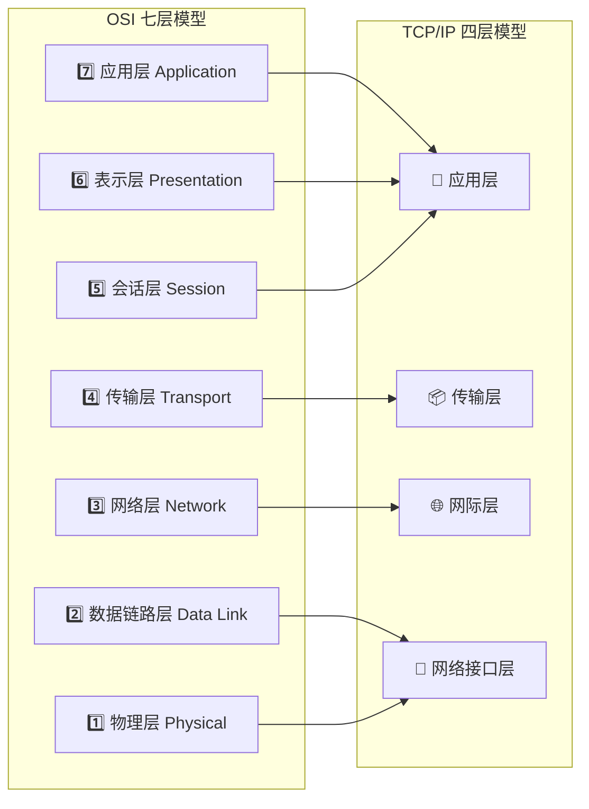
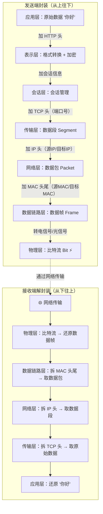

---

title: "OSI七层与TCP/IP四层模型"

created: "2025-07-12"

tags:

  - 八股文

  - 计算机网络

---

# OSI七层与TCP/IP四层模型

## 一、基础分层模型（必考入门题）
### 1. OSI七层（理论）& TCP/IP四层（实际互联网）
#### 层级对应速记

| TCP/IP四层  |       对应OSI层        | 作用            | 典型协议              |

| :-------: | :-----------------: | :------------ | :---------------- |

|  **应用层**  | 应用层+表示层+会话层 (7+6+5) | 给程序用，用户直接交互   | HTTP、DNS、FTP、SMTP |

|  **传输层**  |       传输层 (4)       | 进程间通信，端口区分程序  | TCP、UDP           |

|  **网际层**  |       网络层 (3)       | 跨网段寻址，IP地址、路由 | IP、ICMP、ARP       |

| **网络接口层** |   数据链路层+物理层 (2+1)   | 本地局域网传输，MAC地址 | 以太网、WiFi          |

#### OSI 七层 ↔ TCP/IP 四层映射图

> **记忆口诀**：应表会传网链物（从上往下），对应英文 All People Seem To Need Data Processing。

#### OSI 七层逐层详解

> 从第 7 层（最接近用户）到第 1 层（最接近硬件），逐层往下看。

**第 7 层 — 应用层（Application）**

> 直接给用户和应用程序提供网络服务。你平时接触的所有网络操作都在这一层。

| 协议 | 干什么 | 通俗理解 |

| :--- | :--- | :--- |

| HTTP/HTTPS | 网页浏览 | 你打开浏览器看淘宝，用的就是 HTTP |

| DNS | 域名解析 | 把 `www.baidu.com` 翻译成 IP 地址 |

| SMTP/POP3/IMAP | 收发邮件 | 发邮件用 SMTP，收邮件用 POP3/IMAP |

| FTP | 文件传输 | 上传下载文件 |

| SSH | 远程登录 | 远程连接服务器 |

**第 6 层 — 表示层（Presentation）**

> 负责数据格式转换、加密解密、压缩解压缩。把应用层的数据翻译成网络能传输的格式。

| 功能 | 通俗理解 |

| :--- | :--- |

| 数据格式转换 | 你发的 JSON → 网络传输的二进制字节流 |

| 加密解密 | HTTPS 的 TLS 加密就在这一层工作 |

| 压缩解压缩 | gzip 压缩网页，传输更快 |

**第 5 层 — 会话层（Session）**

> 管理通信双方的"会话"——建立连接、维持连接、断开连接。

| 功能 | 通俗理解 |

| :--- | :--- |

| 建立会话 | 你登录网站，服务器给你分配一个 sessionId |

| 维持会话 | 保持登录状态，不用每次都重新登录 |

| 断开会话 | 你点退出登录，或者会话超时自动断开 |

**通俗比喻**：会话层像电话通话——拨号建立连接（建立会话）、保持通话中（维持会话）、挂电话（断开会话）。

**第 4 层 — 传输层（Transport）**

> 负责端到端的可靠传输。靠**端口号**区分同一台机器上的不同程序。

| 协议 | 特点 | 通俗理解 |

| :--- | :--- | :--- |

| TCP | 可靠、有序、有重传 | 寄快递——有签收确认，丢了会重发，保证送到 |

| UDP | 不可靠、无序、速度快 | 寄明信片——扔出去就不管了，丢了就丢了 |

**端口号**：一台服务器上可能同时跑着 Web 服务（80）、数据库（3306）、Redis（6379），端口号就是区分它们的"门牌号"。范围 0~65535，其中 0~1023 是系统保留端口。

**第 3 层 — 网络层（Network）**

> 负责跨网络寻址和路由选择。靠 **IP 地址**找到目标机器在哪。

| 协议 | 干什么 | 通俗理解 |

| :--- | :--- | :--- |

| IP | 寻址和路由 | 给每台机器分配一个"门牌号"（IP 地址），路由器根据 IP 选择路径 |

| ICMP | 网络诊断 | `ping` 命令用的就是 ICMP，检测目标机器是否可达 |

| ARP | 地址解析 | 把 IP 地址翻译成 MAC 地址（知道门牌号了，还得知道具体是谁） |

**第 2 层 — 数据链路层（Data Link）**

> 负责同一网段内（局域网）的设备之间传输数据。靠 **MAC 地址**识别设备。

| 概念 | 通俗理解 |

| :--- | :--- |

| MAC 地址 | 网卡的物理地址，出厂时写死的，类似身份证号 |

| 以太网帧 | 这一层传输的数据单位叫"帧"（Frame） |

| 交换机 | 工作在这一层，根据 MAC 地址转发数据 |

**第 1 层 — 物理层（Physical）**

> 负责实际的物理信号传输——电信号、光信号、无线电波。

| 介质 | 通俗理解 |

| :--- | :--- |

| 网线 | 电信号传输（双绞线） |

| 光纤 | 光信号传输（速度快、距离远） |

| WiFi | 无线电波传输 |

### 2. 数据封装与解封装

> 发送时从第 7 层逐层往下包装，接收时从第 1 层逐层往上拆开。每经过一层，都会加上该层的"头"（Header）。

**通俗比喻**：像寄快递——你写好信（应用层）→ 装进信封写地址（传输层）→ 装进快递盒写收件人（网络层）→ 贴上快递单（数据链路层）→ 快递车运走（物理层）。对方收到后反过来逐层拆。

#### 每层的数据单位（PDU）

| 层 | 数据单位 | 英文 | 通俗理解 |

| :--- | :--- | :--- | :--- |

| 应用层 | 数据 | Data | 你写的那封信 |

| 传输层 | 数据段 | Segment | 信装进信封 |

| 网络层 | 数据包 | Packet | 信封装进快递盒 |

| 数据链路层 | 数据帧 | Frame | 快递盒贴上快递单 |

| 物理层 | 比特流 | Bit | 快递车上的货物 |

### 3. 通俗理解（快速记忆版）

- **应用层**：你用微信发消息，微信程序用的就是应用层协议

- **传输层**：消息从你手机上的微信进程，传到对方手机上的微信进程，靠端口号区分

- **网际层**：你在上海，对方在北京，靠IP地址找到对方的手机

- **网络接口层**：消息从你手机通过WiFi传到路由器，靠MAC地址识别设备

---

## 二、延伸追问
### Q1：为什么分两层模型？实际用哪个？

> OSI 是国际标准化组织（ISO）提出的**理论模型**，先有模型后有协议，分 7 层每层职责清晰但工程冗余；TCP/IP 是互联网**实际落地标准**，先有协议后有模型，合并了表示层和会话层到应用层，工程上只用这个。实际开发中我们用的是 TCP/IP 模型，但实践中 OSI 七层一定要能背出来。

### Q2：路由器工作在哪一层？交换机呢？

> **路由器**工作在**网络层**（第 3 层），根据 IP 地址进行路由转发，连接不同网段。

> **交换机**工作在**数据链路层**（第 2 层），根据 MAC 地址转发数据帧，连接同一网段内的设备。

> 补充：集线器（Hub）工作在物理层，只是广播信号，不识别任何地址。

### Q3：为什么 TCP/IP 只有 4 层而 OSI 有 7 层？

> TCP/IP 把 OSI 上三层（应用、表示、会话）合并为应用层——因为在实际工程中，这三层都由应用程序自己处理，没必要拆开。同样，下两层（数据链路层、物理层）合并为网络接口层，因为硬件层面通常一起实现。OSI 分得更细是为了理论清晰，TCP/IP 合并是为了工程实用。

### Q4：ARP 协议工作在哪一层？

> ARP（Address Resolution Protocol）工作在**网络层**（也有说法归入数据链路层，因为它操作 MAC 地址）。作用是将 IP 地址解析为 MAC 地址——你知道了目标的 IP，还需要知道它的 MAC 地址才能在局域网内把数据帧送到。这是一个容易被追问的"边界协议"。

### Q5：每层加了什么头？数据变大了吗？

> 每经过一层都会加上该层的头部（Header），所以数据是**越来越大**的。例如：原始 100 字节的数据，经过 TCP 加 20 字节头 → 120 字节，经过 IP 加 20 字节头 → 140 字节，经过 MAC 加 18 字节头尾 → 158 字节。这些头包含了各层需要的控制信息（端口号、IP 地址、MAC 地址等）。

---

## 速记卡（面试闪卡）

**Q1：一句话讲清「OSI七层与TCP/IP四层模型」到底是什么？**

A：OSI 七层是理论模型（应表会传网链物），TCP/IP 四层是实际标准——合并上下三层为应用层、下两层为网络接口层。

**Q2：分层对应（four layers） —— 怎么理解？**

A：类比：TCP/IP 四层——应用层（HTTP/DNS/FTP，给用户用）、传输层（TCP/UDP，靠端口号区分进程）、网际层（IP/ICMP/ARP，靠 IP 跨网段寻址路由）、网络接口层（以太网/WiFi，靠 MAC 本地传输）。口诀：应表会传网链物。（Map to OSI）

**Q3：封装与解封装（encapsulation） —— 怎么理解？**

A：类比：发送时从上往下逐层加头：数据→段（Segment）→包（Packet）→帧（Frame）→比特流（Bit），像寄快递层层打包；接收时从下往上逐层拆。每加一层头数据就变大一点。（Onion wrapping）

**Q4：路由器与交换机（L3 vs L2） —— 怎么理解？**

A：类比：路由器工作在网络层（第3层），按 IP 地址路由、连接不同网段；交换机工作在数据链路层（第2层），按 MAC 地址转发、连同一网段；集线器在物理层只是广播。ARP 是边界协议，在网络层把 IP 解析成 MAC。（Who routes）

**Q5：为何分两层模型（why two models） —— 怎么理解？**

A：类比：OSI 先有模型后有协议，分层清晰但工程冗余；TCP/IP 先有协议后有模型，合并上下层只为工程实用。每层加的头部承载各层控制信息（端口、IP、MAC）——这就是为什么数据越传越大。（Theory vs practice）

**Q6：核心速记主线有哪些？**

- 四层对应、封装解封装、路由器/交换机位置、ARP 边界、为何分两层模型

- 应用层给用户、传输层端口、网际层 IP、网络接口层 MAC

- 数据单位：Data→Segment→Packet→Frame→Bit

- 路由器 L3 按 IP，交换机 L2 按 MAC，集线器 L1 广播

- OSI 七层要能背，开发用 TCP/IP 四层

**口诀**

A：OSI 七层排成队，应表会传网链物；

TCP/IP 四层并一路，应用传输网际路；

端口 IP 与 MAC，封装解封层层护；

理论七层背得住，实际开发四层渡。

## 相关链接

- 📋 目录：[[00-计算机网络]]

- 📚 学习清单：[[八股文学习路线图]]

- 🔗 [[02-TCP三次握手|TCP三次握手与四次挥手]] — 传输层 TCP 连接建立与断开

- 🔗 [[04-TCP与UDP区别|TCP与UDP区别]] — 传输层两大协议对比

- 🔗 [[13-HTTPS加密流程|HTTPS加密流程]] — 表示层 TLS 加密实际应用

- 🔗 [[34-DNS解析过程|DNS解析过程]] — 应用层域名解析

