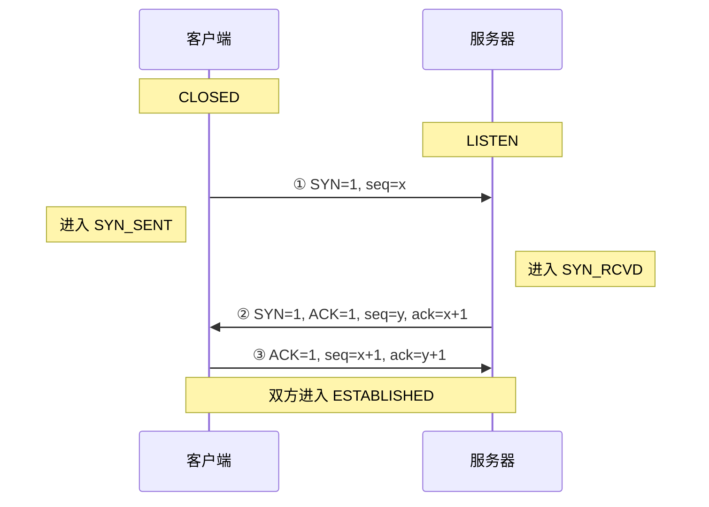
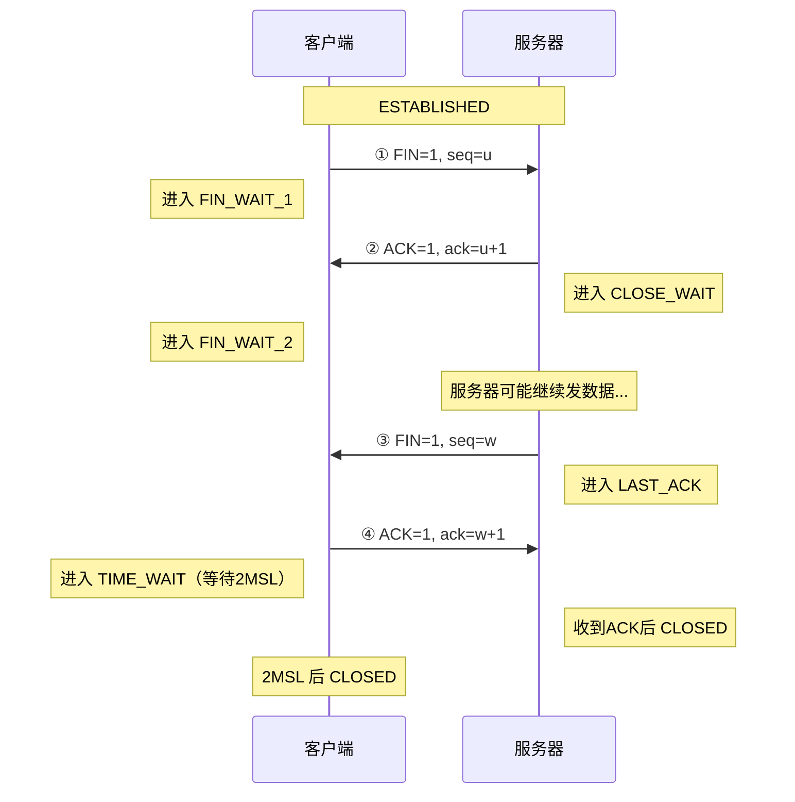

# TCP三次握手与四次挥手
## 一、TCP 三次握手（建立连接）

### 1.1 为什么需要三次握手？

**核心目的**：确认双方的**发送能力**和**接收能力**都正常。

**通俗比喻**：
> 你在电话里约朋友吃饭：
> - 你："听得到吗？"（第一次握手 — 你确认自己能说话）
> - 朋友："听到了，你能听到我说话吗？"（第二次握手 — 朋友确认自己能说能听，你也确认自己能听）
> - 你："听到了，那我们开始聊吧"（第三次握手 — 你确认朋友也能听，双方都OK）

### 1.2 三次握手详细过程

#### 状态变化详解

|   阶段   |      客户端状态      |      服务器状态      | 说明                 |
| :----: | :-------------: | :-------------: | :----------------- |
|   初始   |     CLOSED      |     LISTEN      | 服务器监听端口，等待连接       |
| 第一次握手后 |    SYN_SENT     |     LISTEN      | 客户端发送SYN，等待回复      |
| 第二次握手后 |    SYN_SENT     |  **SYN_RCVD**   | 服务器收到SYN，回复SYN+ACK |
| 第三次握手后 | **ESTABLISHED** | **ESTABLISHED** | 双方确认连接建立           |

#### 报文字段解析

|   字段    | 含义           | 第一次 | 第二次 | 第三次 |
| :-----: | :----------- | :-: | :-: | :-: |
| **SYN** | 同步序列号，建立连接用  |  1  |  1  |  0  |
| **ACK** | 确认号有效        |  0  |  1  |  1  |
| **seq** | 序列号（随机生成）    |  x  |  y  | x+1 |
| **ack** | 确认号（期望下一个字节） |  无  | x+1 | y+1 |

### 1.3 追问：为什么需要三次？两次行不行？

**参考答案**：
> 不行。两次握手的问题：如果客户端发的第一个SYN在网络中**延迟到达**，客户端超时重发第二个SYN并完成通信、断开连接后，那个迟到的旧SYN才到达服务器。服务器以为是新连接，发出确认并建立连接，但客户端根本不知道，服务器就一直等待 — **资源浪费**。

**深层原因**：
1. **防止历史连接**：三次握手让客户端能在第三步确认"这是我要的连接"，如果收到的是过期SYN的回复，客户端可以发送RST拒绝
2. **同步双方初始序列号**：TCP是可靠传输，需要序列号来排序、去重、重传，三次握手确保双方都知道对方的初始序列号

### 1.4 追问：三次握手可以携带数据吗？

**答案**：
- **第一次握手**：不能携带数据（SYN报文）
- **第二次握手**：不能携带数据（SYN报文）
- **第三次握手**：**可以携带数据**（ACK报文，连接已建立）

**原因**：前两次握手时连接还未建立，如果允许携带数据，攻击者可以发送大量SYN报文携带数据，消耗服务器资源。第三次握手时客户端已确认连接有效，可以安全传输。

### 1.5 追问：如果第三次握手丢失了怎么办？

**答案**：
- 服务器收不到ACK，会**重发SYN+ACK**（默认重试5次，间隔1s, 2s, 4s, 8s, 16s）
- 超过重试次数后，服务器关闭连接
- 客户端此时已进入ESTABLISHED状态，发数据时会收到服务器的RST（连接重置）

---

## 二、TCP 四次挥手（关闭连接）

### 2.1 为什么需要四次挥手？

**核心目的**：TCP是**全双工**（双方可以同时收发数据），关闭连接时双方需要**各自独立关闭**自己那半条通道。

**通俗比喻**：
> 两个人打电话：
> - A："我说完了"（第一次挥手）
> - B："好的，我知道你说完了"（第二次挥手）— 此时B可能还有话要说
> - B："我也说完了"（第三次挥手）
> - A："好，挂了"（第四次挥手）

### 2.2 四次挥手详细过程

#### 状态变化详解

|   阶段   |     客户端状态      |     服务器状态      | 说明         |
| :----: | :------------: | :------------: | :--------- |
|   初始   |  ESTABLISHED   |  ESTABLISHED   | 双方正常通信     |
| 第一次挥手后 | **FIN_WAIT_1** |  ESTABLISHED   | 客户端不再发数据   |
| 第二次挥手后 | **FIN_WAIT_2** | **CLOSE_WAIT** | 服务器确认收到FIN |
| 第三次挥手后 |   FIN_WAIT_2   |  **LAST_ACK**  | 服务器也不再发数据  |
| 第四次挥手后 | **TIME_WAIT**  |     CLOSED     | 客户端等待2MSL  |
| 2MSL后  |     CLOSED     |     CLOSED     | 双方完全关闭     |

### 2.3 追问：为什么客户端要等 2MSL 才关闭？

**MSL** = Maximum Segment Lifetime（最大报文生存时间），Linux默认60秒。

**等2MSL的两个原因**：

1. **确保最后的ACK能到达服务器**
   - 如果服务器没收到ACK，会重发FIN
   - 客户端需要在这段时间内能收到并重新确认
   - 2MSL = 1个MSL（ACK到达服务器） + 1个MSL（服务器重发FIN到达客户端）

2. **确保本次连接的所有报文都从网络中消失**
   - 防止旧连接的延迟报文影响新连接
   - 如果立即建立新连接，旧连接的延迟报文可能被新连接误收

### 2.4 追问：为什么是四次而不是三次？

**答案**：
> TCP是全双工，每个方向需要单独关闭。
> - 第一次挥手：客户端告诉服务器"我不再发数据了"
> - 第二次挥手：服务器确认"我知道你不发了"（但服务器可能还有数据要发）
> - 第三次挥手：服务器告诉客户端"我也不发了"
> - 第四次挥手：客户端确认"我知道你也不发了"

**特殊情况**：如果服务器收到FIN后没有数据要发，可以把第二、三次合并为一次（FIN+ACK），变成"三次挥手"。但这不是标准流程。

### 2.5 追问：TIME_WAIT 状态过多怎么办？

**问题**：高并发场景下，大量TIME_WAIT占用端口资源。

**解决方案**：

| 方案         | 说明                                          | 风险        |
| :--------- | :------------------------------------------ | :-------- |
| **调整内核参数** | `net.ipv4.tcp_tw_reuse = 1` 允许复用TIME_WAIT连接 | 可能收到旧报文   |
| **减小MSL**  | 缩短等待时间                                      | 可能导致连接不可靠 |
| **使用长连接**  | 减少连接建立/关闭次数                                 | 需要维护连接池   |
| **负载均衡**   | 分散到多个服务器                                    | 增加架构复杂度   |

---

## 速记卡（面试闪卡）

**Q1：一句话讲清「TCP三次握手与四次挥手」到底是什么？**
A：**核心目的**：确认双方的**发送能力**和**接收能力**都正常。
**通俗比喻**：
你在电话里约朋友吃饭：
你："听得到吗？"（第一次握手 — 你确认自己能说话）
朋友："听到了，你能听到我说话吗？"（第二次握手 — 朋友确认自己能说能听，你也确认自己能听）
你："听到了，那我们开始聊吧"（第三次握手 — 你确认朋友也能听，双方都OK）

**Q2：一、TCP 三次握手（建立连接） —— 怎么理解？**
A：**核心目的**：确认双方的**发送能力**和**接收能力**都正常。
**通俗比喻**：
你在电话里约朋友吃饭：
你："听得到吗？"（第一次握手 — 你确认自己能说话）
朋友："听到了，你能听到我说话吗？"（第二次握手 — 朋友确认自己能说能听，你也确认自己能听）
你："听到了，那我们开始聊吧"（第三次握手 — 你确认朋友也能听，双方都OK）

**Q3：二、TCP 四次挥手（关闭连接） —— 怎么理解？**
A：**核心目的**：TCP是**全双工**（双方可以同时收发数据），关闭连接时双方需要**各自独立关闭**自己那半条通道。
**通俗比喻**：
两个人打电话：
A："我说完了"（第一次挥手）
B："好的，我知道你说完了"（第二次挥手）— 此时B可能还有话要说
B："我也说完了"（第三次挥手）
A："好，挂了"（第四次挥手）
|   阶段   |     客户端状态      |     服务器状态      | 说明         |

**Q4：核心速记主线有哪些？**
A：抓住这几根：一、TCP 三次握手（建立连接）、二、TCP 四次挥手（关闭连接）。

## 相关链接

- 📋 目录：[[00-计算机网络]]
- 📚 学习清单：[[八股文学习清单]]
- 🔗 [[13-IO模型四种|IO模型]] — TCP连接涉及阻塞/非阻塞IO
- 🔗 [[14-IO多路复用select_poll_epoll|IO多路复用]] — TCP服务器用IO多路复用管理连接
- 🔗 [[03-TCP可靠性与拥塞控制|TCP可靠性与拥塞控制]] — 握手建立的连接如何保证可靠传输

