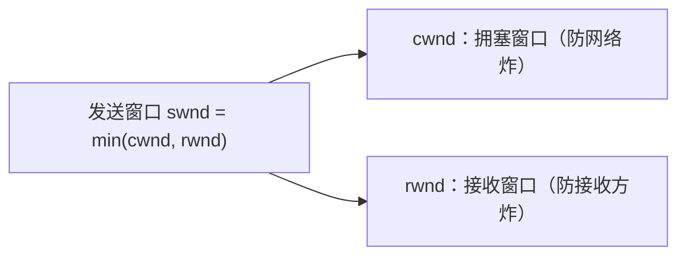
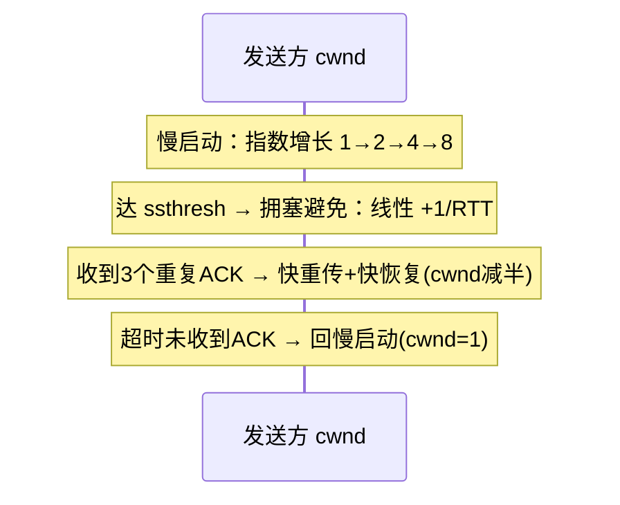

---

title: "TCP 可靠性与拥塞控制"

created: "2026-07-20"

tags:

  - 八股文

  - 计算机网络

---

# TCP 可靠性与拥塞控制

## 一句话总结

> **TCP 可靠 = 四大机制兜住"不丢不乱不撑爆"（确认应答 / 超时重传 / 滑动窗口 / 流量控制）；拥塞控制 = 别一股脑灌爆网络（慢启动 / 拥塞避免 / 快重传 / 快恢复）。**

---

## 一、TCP 为什么可靠？四大机制

TCP 是**面向连接、可靠**的传输层协议。可靠性不是靠"发完就完"，而是靠四个机制共同兜底：

### 1.1 确认应答（ACK, Acknowledgement）

- 接收方每收到数据，就回一个 **ACK**，告诉发送方"我收到第 N 字节之前的所有数据了"。

- 发送方只有收到 ACK，才认为数据成功送达；没收到就认为丢了，要重发。

> 像什么？你寄快递，收件人签收（ACK）了你才放心；一直没签收，你就怀疑快递丢了。

### 1.2 超时重传（Retransmission）

- 发送方发完数据会启动一个**超时计时器（RTO, Retransmission Timeout）**。

- 超过 RTO 还没收到 ACK → 认为丢包 → **重传**。

- 这也是 TCP 估算 RTT（Round-Trip Time，往返时延）的方式。

### 1.3 滑动窗口（Sliding Window）

- 如果"发一个等一个 ACK"太慢，TCP 用**滑动窗口**实现**批量发送**：窗口内可以连续发多个包，不用逐个等。

- 窗口向右"滑动" = 老的包被确认、新的包被允许发送。

- 窗口大小由**接收方能力（流量控制）**和**网络拥堵程度（拥塞控制）**共同决定。

### 1.4 流量控制（Flow Control）

- 目的：**别把接收方撑爆**。接收方通过 `Window Size` 告诉发送方"我还能收多少"。

- 发送方实际发送量受 `min(拥塞窗口 cwnd, 接收窗口 rwnd)` 限制。

- 实现：TCP 头里的 **窗口字段**，接收方动态调整，发送方据此限制发送速率。

---

## 二、拥塞控制：别把网络搞炸了

流量控制管的是"接收方"，拥塞控制管的是"整条网络"。**拥塞（Congestion）** = 网络里路由器/链路过载，缓冲区满 → 丢包、延迟飙升。

核心变量：**拥塞窗口 cwnd（Congestion Window）**——发送方根据网络反馈动态调整，代表"在不拥塞前提下我敢发多少"。

### 2.1 四大算法（以经典 Reno 为例）

| 算法 | 触发时机 | cwnd 变化 | 白话 |

| :--- | :--- | :--- | :--- |

| **慢启动 Slow Start** | 连接刚建立 / 超时重传后 | 每收 1 ACK +1 MSS，**指数增长** | 先小口试探，快速探带宽 |

| **拥塞避免 Congestion Avoidance** | cwnd ≥ ssthresh（慢启动阈值） | 每 RTT +1 MSS，**线性增长** | 接近容量了，悠着点 |

| **快重传 Fast Retransmit** | 收到 **3 个重复 ACK**（DupACK） | 不等超时，**立即重传**丢的包 | 只丢一个？赶紧补，别等 |

| **快恢复 Fast Recovery** | 快重传之后（Reno 新增） | cwnd = ssthresh + 3，之后线性恢复 | 网络没那么糟，别回解放前 |

### 2.2 两种丢包，两种反应（必考）

- **轻度拥塞（收到 3 个重复 ACK）**：说明只是中间丢了一个包，后面还到 → **快重传 + 快恢复**，cwnd 减半，不归零。

- **严重拥塞（RTO 超时）**：说明可能整段网络不行了 → **ssthresh = cwnd/2，cwnd 重置为 1**，重新慢启动（"一夜回到解放前"）。

> Tahoe vs Reno：Tahoe 没有快恢复，丢包就 cwnd 归 1；Reno 加了快恢复，性能更好，是事实标准。

---

## 三、流量控制 vs 拥塞控制（高频对比）

| 维度 | 流量控制 Flow Control | 拥塞控制 Congestion Control |

| :--- | :--- | :--- |

| 保护对象 | 接收方（别撑爆它的缓冲区） | 网络（别压垮路由器/链路） |

| 控制依据 | 接收窗口 rwnd（接收方给） | 拥塞窗口 cwnd（发送方自己估） |

| 机制 | 滑动窗口 + 窗口字段 | 慢启动 / 拥塞避免 / 快重传 / 快恢复 |

| 关系 | 发送窗口 = min(cwnd, rwnd) | 两者共同限制发送速率 |

---

## 速记卡（面试闪卡）

**Q1：一句话讲清「TCP 可靠性与拥塞控制」到底是什么？**

A：TCP 靠四大机制保可靠，靠拥塞控制防把网络灌爆。

**Q2：1. TCP 为什么可靠 —— 四大机制 —— 怎么理解？**

A：可靠像寄快递：收件人签收 ACK 你才放心（确认应答）；超时没签就重发（超时重传）；一次发一摞不用等（滑动窗口）；再按收件人胃口限流（流量控制）。英文 ACK / RTO / Sliding Window。

**Q3：2. 拥塞控制 —— 别灌爆网络 —— 怎么理解？**

A：拥塞控制管整条网络，核心是拥塞窗口 cwnd：慢启动指数试探、拥塞避免线性加、收到 3 个重复 ACK 快重传+快恢复、超时就回慢启动。像往水管里慢慢加水。英文 cwnd / ssthresh。

**Q4：3. 两种丢包两种反应 —— 怎么理解？**

A：轻度拥塞（3 个重复 ACK）= 只丢一个包，快重传+快恢复，cwnd 减半不归零；严重拥塞（RTO 超时）= 网络可能全崩，ssthresh 减半、cwnd 重置为 1 重来，一夜回到解放前。英文 Fast Recovery。

**Q5：4. 流量控制 vs 拥塞控制 —— 怎么理解？**

A：流量控制护接收方（按 rwnd 别撑爆它的缓冲），拥塞控制护网络（按 cwnd 别压垮路由器）；发送窗口 = min(cwnd, rwnd)，两者一起限速。英文 Flow Control vs Congestion Control。

**Q6：核心速记主线有哪些？**

- 可靠性四机制：ACK、超时重传、滑动窗口、流量控制

- 拥塞四算法：慢启动、拥塞避免、快重传、快恢复

- 变量：cwnd 防网络炸，rwnd 防接收方炸

- 两种丢包：3 重复 ACK（减半）/ RTO 超时（归 1）

- 发送窗口 = min(cwnd, rwnd)

**口诀**

A：TCP 可靠靠四术，

拥塞控制防炸渠；

快恢复后窗口束，

超时归一再起步。

## 相关链接

- 📋 目录：[[00-计算机网络]]

- 📚 学习清单：[[八股文学习路线图]]

- 🔗 [[02-TCP三次握手|TCP 三次握手与四次挥手]] — 可靠性建立在连接之上

- 🔗 [[04-TCP与UDP区别|TCP vs UDP]] — 为什么 UDP 不可靠但快

- 🔗 [[05-TIME_WAIT与粘包拆包|TIME_WAIT 与粘包拆包]] — 本篇的延伸坑点

