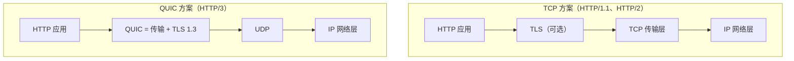

---

title: "TCP与UDP区别"

created: "2025-07-12"

tags:

  - 八股文

  - 计算机网络

---

# TCP与UDP区别

## TCP vs UDP vs QUIC（高频对比题）
### 核心区别

|  维度  | TCP          | UDP          | QUIC          |

| :--: | :----------- | :----------- | :------------ |

| 连接方式 | 面向连接（三次握手）   | 无连接，直接发      | 基于 UDP，1-RTT 握手（含 TLS） |

| 可靠性  | 可靠，有确认、重传、排序 | 不可靠，发了就不管    | 可靠，per-stream ACK + 重传   |

| 传输方式 | 面向字节流        | 面向报文（独立包）    | 面向 stream（多路复用） |

| 头部大小 | 20 字节起步       | 8 字节          | UDP 之上，自带加密头 |

| 流量控制 | 有（滑动窗口）      | 无            | 有（per-stream） |

| 拥塞控制 | 有（慢启动、拥塞避免）  | 无            | 有（可插拔，支持 BBR） |

| 队头阻塞 | 有（整个连接阻塞）     | 无（无序交付）      | 无（per-stream 独立） |

| 加密   | 无（需额外 TLS）    | 无            | 内置 TLS 1.3    |

| 一对多  | 一对一          | 支持一对多、多对多    | 支持多路复用       |

| 实现位置 | 内核态          | 内核态          | 用户态（库）       |

### 通俗理解

- **TCP** 像**打电话**：先拨号建立连接，说话有确认（"嗯"），挂电话要挥手告别

- **UDP** 像**寄明信片**：写好地址直接扔邮筒，不管对方收没收到，速度快但不保证

- **QUIC** 像**升级版快递系统**：基于明信片（UDP）但加了签收确认、加密信封、独立包裹追踪——每个包裹（stream）丢了不影响其他包裹

### 协议栈位置对比

> **关键区别**：QUIC 把传输层和加密层合并到一起，跑在 UDP 之上。这意味着 QUIC 不需要修改操作系统内核——任何应用都可以通过更新库来获得新功能。

### 典型应用场景

| TCP        | UDP          | QUIC           |

| :--------- | :----------- | :------------- |

| 网页浏览（HTTP/1.1、HTTP/2） | DNS 查询      | HTTP/3 网页浏览   |

| 文件传输（FTP）  | 视频直播、语音通话    | YouTube、Cloudflare |

| 邮件（SMTP）   | 在线游戏         | 移动 App（连接迁移）  |

| 登录、支付等关键操作 | DHCP（动态IP分配） | gRPC over QUIC |

---

## 延伸追问
### Q1：为什么视频直播用 UDP 不用 TCP？

> 视频直播对**实时性**要求极高，丢一两帧画面可以接受（花屏一下），但如果用 TCP，丢包后会**重传 + 等待**，导致画面卡顿延迟，体验更差。UDP 丢了就丢了，继续播新的帧。

>

> **本质原因——队头阻塞（Head-of-Line Blocking, HOLB）**：TCP 严格按序交付，如果第 5 个包丢了，第 6、7、8 包即使已到达接收端缓冲区，应用层也拿不到，必须等第 5 包重传到达。对文件下载这是优点（不能乱序），对实时音视频这就是灾难。

### Q2：QUIC 是什么？为什么 HTTP/3 要用 QUIC 替代 TCP？

> QUIC（Quick UDP Internet Connections）是 Google 设计、IETF 标准化的传输协议，运行在 UDP 之上，集成了 TLS 1.3 加密、多路复用、拥塞控制。HTTP/3 强制使用 QUIC 的三个核心理由：

>

> 1. **消除队头阻塞**：HTTP/2 虽然支持多路复用，但底层是 TCP，一个流丢包会阻塞所有流。QUIC 每个 stream 独立 ACK 和重传，一个流丢包不影响其他流。

> 2. **连接建立更快**：TCP 三次握手（1 RTT）+ TLS 握手（1-2 RTT）= 2-3 RTT。QUIC 把传输握手和 TLS 握手合并，首次连接 1 RTT，重连 0-RTT（首个包就带数据）。

> 3. **连接迁移**：TCP 用四元组（源IP、源端口、目标IP、目标端口）标识连接，手机切 WiFi→4G 时 IP 变了连接就断了。QUIC 用 Connection ID 标识连接，IP 变了连接不断。

### Q3：QUIC 为什么跑在 UDP 上面？不能直接跑在 IP 上面吗？

> 理论上可以，但实际不行：

> 1. **内核修改成本极高**：如果 QUIC 直接跑在 IP 之上（新协议号），需要修改操作系统内核网络栈，而 Linux 内核迭代周期长，推广极慢。

> 2. **中间设备兼容性**：路由器、防火墙只认识 TCP/UDP，遇到未知协议号会直接丢弃。跑在 UDP 上可以穿透现有网络设备。

> 3. **用户态实现**：跑在 UDP 上意味着 QUIC 可以在用户态（应用层）实现，不需要内核权限，任何应用通过更新库就能获得新功能，迭代速度快。

### Q4：QUIC 的 0-RTT 有什么风险？

> 0-RTT（零往返时间）指重连时客户端在第一个包就携带应用数据，省去握手等待。但存在**重放攻击（Replay Attack）**风险：攻击者可以截获 0-RTT 数据包并重放给服务器。

>

> **防御原则**：0-RTT 只用于**幂等请求**（如 GET），不用于状态变更操作（如支付、写入）。非幂等请求必须等待完整握手完成。

### Q5：UDP 真的比 TCP 快吗？

> **不一定**。裸 UDP 的 8 字节头部确实比 TCP 的 20 字节小，但如果应用层在 UDP 上自己实现可靠性（如 QUIC、KCP），加上 ACK、重传、拥塞控制后，实际开销可能接近甚至超过 TCP。

>

> 正确的对比不是"谁更快"，而是"**谁的失败行为匹配你的场景**"：支付请求需要 TCP 的严格可靠，DNS 查询需要 UDP 的低延迟，HTTP/3 需要 QUIC 的无队头阻塞 + 快速连接。

---

## 速记卡（面试闪卡）

**Q1：一句话讲清「TCP与UDP区别」到底是什么？**

A：TCP与UDP是两种传输层协议：TCP 面向连接可靠，UDP 无连接快但不可靠，QUIC 在 UDP 上补可靠性。

**Q2：一、核心区别：打电话 vs 明信片 —— 怎么理解？**

A：TCP 像打电话：先三次握手建连接，每句都等人"嗯"确认，半句没听清就让你重说。UDP 像寄明信片：写好地址直接丢邮筒，8 字节头部极小，丢没丢它一概不管。选型不比谁"快"，比的是"谁的失败行为贴合你的场景"。

**Q3：二、为什么实时场景爱用 UDP —— 怎么理解？**

A：关键在于"队头阻塞（HOLB）"。TCP 严格按序交付：第 5 个包丢了，第 6、7、8 个哪怕已到缓冲区，应用层也得干等重传——对文件下载是优点，对直播游戏是灾难。UDP 不保证顺序，丢了就丢继续播下一帧，宁可花屏也不卡顿。

**Q4：三、QUIC 凭什么被 HTTP/3 选中 —— 怎么理解？**

A：QUIC 跑在 UDP 之上，集成了 TLS 1.3：① 消除队头阻塞——每个 stream 独立 ACK 和重传，一个流丢包不拖累其他；② 建连快——TCP 握手+TLS 要 2~3 RTT，QUIC 合并后首次 1 RTT、重连 0-RTT；③ 连接迁移——用 Connection ID 标识，手机切 WiFi IP 变了连接不断。它跑在用户态，不用改内核。

**Q5：四、UDP 真的比 TCP 快吗 —— 怎么理解？**

A：未必。裸 UDP 头部小，但一旦你在上面自己补可靠性（如 QUIC、KCP 加 ACK、重传、拥塞控制），开销能接近甚至超过 TCP。正确问法是"谁的失败行为匹配场景"：支付要 TCP 严格可靠，DNS 要 UDP 低延迟，HTTP/3 要 QUIC 无阻塞+快连接。

**Q6：核心速记主线有哪些？**

- TCP 打电话、UDP 扔明信、QUIC 加密快递

- 可靠性靠确认+重传+排序（TCP）或无（UDP）

- HOLB 是 TCP 实时场景的死穴

- QUIC 三杀：无 HOLB / 0-RTT / 连接迁移

- 选型看失败行为匹配，不是绝对速度

**口诀**

A：TCP 打电话，UDP 扔明信，

QUIC 加密快递，丢包不连累旁人。

握手重传排好队，实时最怕等，

选型不看谁更快，失败行为对口味。

## 相关链接

- 📋 目录：[[00-计算机网络]]

- 📚 学习清单：[[八股文学习路线图]]

- 🔗 [[02-TCP三次握手|TCP三次握手与四次挥手]] — TCP 连接建立与断开

- 🔗 [[03-TCP可靠性与拥塞控制|TCP可靠性与拥塞控制]] — TCP 可靠性四大机制

- 🔗 HTTP版本演进1.0到3.0 — HTTP/3 基于 QUIC

- 🔗 [[15-HTTP2多路复用|HTTP/2多路复用]] — HTTP/2 队头阻塞问题

